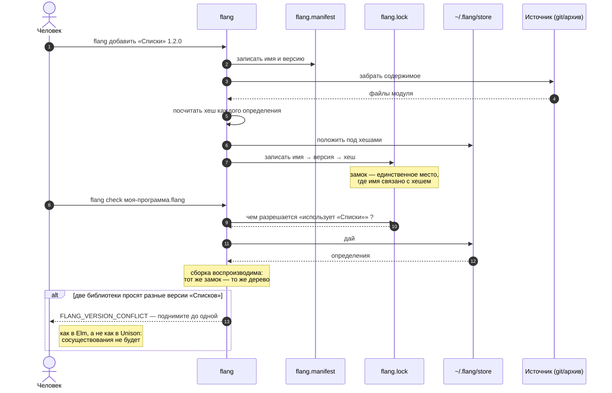

# ADR-0001. Хеш содержимого внутри, имена и версии снаружи

**Состояние:** предложено, ждёт решения владельца
**Дата:** 17 августа 2026
**Основание:** [`docs/modulnost-i-pakety.md`](../modulnost-i-pakety.md), 1058 строк. Unison поставлен и измерен, а не пересказан.

---

## Задача

У flang нет распространения кода. Библиотека подключается **относительным путём по файловой системе**, хешей содержимого в сборке нет, воспроизводимой сборки нет, поставить чужой модуль нечем.

Отдельно и важнее: **доказательство стоит на три порядка дороже теста**, а кешировать его сегодня не по чему.

## Что в языке есть сегодня

| | как устроено | следствие |
|---|---|---|
| импорт | **слияние объявлений в одно плоское пространство имён** | совпадение имён → `FLANG_DUPLICATE_NAME` |
| путь | только относительный по файловой системе | нет ни хранилища, ни индекса |
| связывание | **в двух экземплярах** — эталон и близнец на flang | всякая правка делается дважды |
| хеши | в сборке нет | но идея в репозитории уже живёт |
| теоремы | через импорт **не переезжают** | лемма не может стоять у библиотечной функции |

## Решение

**Взять из идеи Unison ровно половину: хеш содержимого как идентичность внутри, имена и версии как интерфейс снаружи. Базу данных вместо файлов не делать.**

### Почему половину, а не целиком

**Половина, которую берём, — самая ценная, и стоит дёшево.** Хеш нормализованного определения даёт ключ, по которому кешируется проверка тотальности и доказательство теоремы. Unison кеширует по хешу результаты тестов — приятно, но терпимо и без этого. flang кеширует **доказательства**. Это единственный довод в пользу адресации по содержимому, который для flang сильнее, чем для Unison.

**Половина, которую брать нельзя, — та, ради которой Unison всё затевал.** Главный его выигрыш — «конфликта версий не существует». В flang он **недостижим при любой схеме адресации**: импорт сливает объявления в плоское пространство имён, две версии одного модуля не слинкуются, как их ни адресуй. Чтобы ужились — нужны квалифицированные имена, а это правка парсера, связывания и **восьми печатников** (14 287 строк), каждый из которых печатает в одно плоское пространство целевого языка.

## Три шага, из них обязателен один

| шаг | что | цена | что даёт |
|---|---|---|---|
| **1** | хеш нормализованного определения (`digest`) | ~250 строк JS + ~350 на flang + ~400 тестов, **~1 неделя** | кеш проверки и доказательств; устойчивый ключ; фундамент для 2 и 3 |
| **2** | манифест + замок с хешами + хранилище `~/.flang/store` | ~600 JS + ~250 flang + ~500 тестов, **~2 недели** | распространение кода, воспроизводимая сборка |
| 3 | публичный индекс имён и версий | не сейчас | нужен, когда появится третья сторона |

Шаг 1 **не меняет ни синтаксиса, ни раскладки файлов, ни одного байта печати**. Шаг 2 добавляет одно слово в шапку модуля и один файл в корень проекта.

---

## Шаг 1: как это работает

```mermaid
sequenceDiagram
    autonumber
    actor Ч as Человек
    participant CLI as flang check
    participant Св as Связывание
    participant Х as digest
    participant К as Кеш ~/.flang/cache
    participant Я as Ядро доказательства

    Ч->>CLI: flang check --proof lists.flang
    CLI->>Св: связать программу
    Св-->>CLI: плоское дерево объявлений

    loop для каждой функции
        CLI->>Х: нормализовать и посчитать хеш
        Note over Х: имена параметров стёрты,<br/>поверхность приведена к одной,<br/>порядок объявлений нормализован
        Х-->>CLI: #a3f9…

        CLI->>К: есть ли вердикт для #a3f9… ?
        alt хеш найден
            К-->>CLI: тотальна; теорема доказана, 4 шага
            Note right of К: ядро не звалось вовсе
        else хеша нет
            К-->>CLI: нет
            CLI->>Я: проверить тотальность и доказательство
            Я-->>CLI: вердикт
            CLI->>К: положить вердикт под #a3f9…
        end
    end

    CLI-->>Ч: ведомость
```

**Что здесь существенно.** Кеш ключуется хешем **нормализованного** определения, а не текста. Переименовал параметр — хеш тот же, доказательство не пересчитывается. Изменил тело — хеш другой, ядро зовётся.

**И место, где довод ломается.** Поверхностей у языка **четыре** — русская, английская, эсперанто, китайская. Один и тот же алгоритм, записанный русскими и китайскими словами, обязан давать **один** хеш, иначе экосистема расколется на четыре несовместимые. Нормализация обязана снимать поверхность. Это самая тонкая часть шага 1, и её надо проверять подделкой: две записи одного алгоритма на разных поверхностях → один хеш.

---

## Шаг 2: как ставится библиотека



**Хеши в тексте программы не появляются.** Человек продолжает писать `использует «Списки»`. Хеши живут в замке и в хранилище.

---

## От чего отказываемся, называя прямо

- **От «имя функции есть её хеш» в исходнике.** Читаемость важнее.
- **От двух версий одной библиотеки в одной программе.** Ромб решается подъёмом до одной версии, как в Elm. Это следствие того, что импорт сливает имена, и менять это сейчас дороже, чем жить с ограничением.
- **От переименования без диффа.** В Unison переименование не меняет хешей и не порождает изменений в коде. У нас останется правкой текста, которую видно в `git diff`. Взамен продолжают работать `git blame`, ревью в GitHub и все сторожевые тесты репозитория, которые сверяют **байты**, — а их много, и они и есть гарантия качества.

## Почему не полный Unison

Полная модель — не схема именования, а **вторая инфраструктура**: база данных вместо файлов, менеджер кодовой базы вместо редактора, собственный хостинг (Unison Share появился именно потому, что git не подошёл), собственная история ревью (задача открыта с 2019 года). Оценка снизу — **15–25 тысяч строк** и постоянное сопровождение второго инструментария.

При этом главный выигрыш в flang недостижим, а побочный — кеш по хешу — берётся шагом 1 за неделю. Соотношение не сходится ни при каком порядке величин.

---

## Что решить владельцу

1. **Брать ли шаг 1 сейчас.** Он оправдан не пакетами, а кешом доказательств, и полезен сам по себе.
2. **Согласны ли на подъём до одной версии** вместо сосуществования. Это необратимо влияет на то, как будет выглядеть экосистема.
3. **Когда шаг 2.** Он нужен, когда появится второй пользователь языка, и раньше не нужен.
4. **Нормализация поверхностей** — это часть шага 1 или отдельная работа? Она самая тонкая и может оказаться дороже остального шага.
