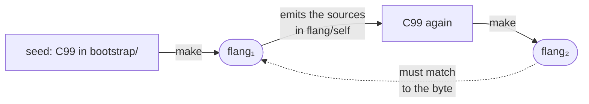

[Back to the README](../../README.md) · [Documentation index](../README.md)

# The bootstrap circle: the compiler builds itself

This page shows where the `flang` command comes from when the compiler is
written in flang itself, and how it is checked that the built compiler
understands the language the same way its sources do. By the end you can rebuild
the compiler from scratch with nothing but `cc` and `make`, run that check
yourself and read its answer — today it refuses, and the reason is below.

## The problem

The flang compiler is written in flang. To build it you need a flang compiler.
The circle is closed — and it is broken in exactly one way: the tree carries a
**committed seed**, the same compiler emitted into C99 in advance.



One `make` turns the seed into a working compiler, and nothing else is needed for
that: no Node, no network, no other flang compiler. The compiler then emits
itself from the flang sources, a second binary is built from that emission, and
**the second must equal the first**.

If they match, the built compiler understands the language exactly as the
sources it was built from do. If they do not, they have diverged — and what
diverged is shown by file and by byte.

## Today the circle is open, and here is where

The check refuses, and it refuses loudly. On this tree
`sh scripts/raskrutka.sh --check` never reaches the file comparison: the compiler
built from the seed **refuses to emit today's sources** — 29 diagnostics, the
first `FLANG_PARSE`, then `FLANG_UNKNOWN_NAME` on the names `«Вызвать»`, `«Знач»`,
`«Итог прогона»`, `«Готовая программа»`, and one `FLANG_NOT_TOTAL`.

```
flang emit: печать отменена — программа не проходит проверку, замечаний 29.
```

It reads unambiguously: **the seed has fallen behind the sources.** Names and
forms have appeared in the sources that the compiler in the seed does not know —
and until the seed is re-emitted, the circle does not close: there is a first
binary but no second one.

This is not a broken build — `make -C bootstrap` works, and the `flang` it
produces checks and emits ordinary programs. What is open is the circle itself:
the step where the compiler proves it understands itself.

## How to run it

```bash
make -C bootstrap -j8             # build the compiler from the seed
sh scripts/raskrutka.sh --check   # compare the seed with what the sources emit
```

The second command re-emits seven files and compares them with the committed
ones. A divergence is reported by file, byte and line, not by the word
"mismatch".

The emission limits matter and are not decoration: `--max-steps 200000000
--max-depth 20000`. Those numbers are stamped into the emitted byte
(`#define FL_MAX_STEPS`), which means they take part in the equality. Rebuilt
from memory with different limits, it diverges silently — that is exactly how one
of the earlier releases drifted.

Why the limit is that large is stated as a number, not as "just in case".
Emission runs the same checks as `check`, and on today's tree linking the sources
consumes 23 726 585 steps, typechecking 3 919 602, the termination analysis
222 863, and the proof kernel 56 355 645. The previous limit of 40 000 000 would
have collapsed even without the kernel: linking alone takes more than half.

## There is no second opinion about the language any more

This is the main caveat on the page, and it must not be skipped.

There used to be two implementations: one in JavaScript, which served as the
definition of behaviour, and one in flang itself. Comparing them caught what no
set of checks catches: **a disagreement between two independent readings of one
rule**. The JavaScript implementation is no longer in the tree.

What stands in its place: the previous implementation's answers are frozen in
tables (`flang/test/fixtures/`). Comparing against them catches a **regression** —
today's compiler disagreeing with a recorded answer — and nothing beyond that. A
disagreement between two independent implementations is not caught: there is
nothing to compare against.

The bootstrap circle never depended on the second implementation and does not
now: the compiler emits itself. What has it open today is a different reason —
the seed has fallen behind — not the removal.

## What the circle does not check

**The compiler does not check its own sources.** `flang check` on
`flang/self/bootstrap/compiler.flang` runs into the step limit and answers
`FLANG_RECURSION_LIMIT`. It can emit itself, but it cannot yet judge itself with
the same checks it applies to other programs.

**Rebuilding needs the tree, not the seed directory.** Emission reads the C
runtime sources from disk (`flang/src/emit/c/`), and there are no copies of them
in `bootstrap/`. The `bootstrap/` directory alone is not enough for the circle.

## Where a release comes from

The C in a release archive is emitted from these same sources by this same
circle. That is why installing from the archive, installing through Homebrew and
building from a clone give one and the same binary — not "roughly the same one".
