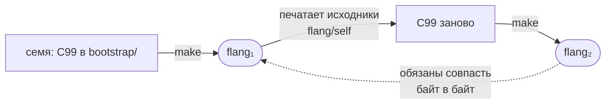

[К README](../../README.ru.md) · [Указатель документации](../README.md)

# Круг раскрутки: компилятор собирает сам себя

Отсюда вы узнаете, откуда берётся команда `flang`, если компилятор написан на
самом flang, и как проверяется, что собранный компилятор понимает язык так же,
как исходники. К концу страницы вы сможете пересобрать компилятор с нуля, имея
только `cc` и `make`, и своими глазами увидеть, что круг замкнулся.

## Задача

Компилятор flang написан на flang. Чтобы его собрать, нужен компилятор flang.
Круг замкнут — и разрывается он ровно одним способом: в дереве лежит
**закоммиченное семя**, тот же компилятор, заранее напечатанный в C99.



Из семени одним `make` собирается двоичный компилятор — и больше для сборки
ничего не нужно: ни Node, ни интернета, ни другого компилятора flang. Дальше
собранный компилятор печатает сам себя из исходников на flang, из этой печати
собирается второй двоичный, и **второй обязан совпасть с первым**.

Совпали — значит, собранный компилятор понимает язык так же, как исходники, из
которых он собран. Не совпали — значит, разошлись, и что именно разошлось, видно
файлом и байтом.

## Как это прогнать

```bash
make -C bootstrap -j8        # собрать компилятор из семени
sh scripts/raskrutka.sh --check   # сверить семя с тем, что печатают исходники
```

Вторая команда печатает семь файлов заново и сравнивает их с закоммиченными.
Расхождение она называет файлом, байтом и строкой, а не словом «не совпало».

Пределы печати важны, и они не украшение: `--max-steps 200000000
--max-depth 20000`. Эти числа впечатываются прямо в напечатанный байт
(`#define FL_MAX_STEPS`), то есть участвуют в совпадении. Собранный по памяти, с
другими пределами, разойдётся молча — ровно так уехал один из прошлых выпусков.

Почему предел такой большой, сказано числом, а не «на всякий случай». Печать
зовёт те же проверки, что `check`, и на сегодняшнем дереве связывание исходников
съедает 23 726 585 шагов, проверка типов 3 919 602, проверка завершаемости
222 863, а ядро доказательств 56 355 645. Прежний предел в 40 000 000 обвалился
бы и без ядра: одно связывание берёт больше половины.

## Второго мнения о языке больше нет

Это главная оговорка страницы, и её нельзя пропустить.

Реализаций было две: одна на JavaScript, служившая определением поведения, и
вторая — на самом flang. Сверка между ними ловила то, что не ловит никакой набор
проверок: **расхождение двух независимых прочтений одного правила**. Реализации
на JavaScript в дереве больше нет.

Что осталось вместо неё: ответы прежней реализации заморожены таблицами
(`flang/test/fixtures/`). Сверка с ними ловит **регресс** — сегодняшний
компилятор разошёлся с записанным ответом, — и ничего сверх того. Расхождение
двух независимых реализаций не ловится: сличать не с чем.

Круг раскрутки при этом остался и работает без второй реализации: печатает
компилятор теперь он сам, а не она.

## Что круг не проверяет

**Компилятор не проверяет собственные исходники.** `flang check` на
`flang/self/bootstrap/compiler.flang` упирается в предел шагов и отвечает
`FLANG_RECURSION_LIMIT`. То есть печатать себя он умеет, а судить себя теми же
проверками, какими судит чужие программы, — пока нет.

**Пересборке нужно дерево, а не каталог семени.** Печать читает исходники
рантайма C с диска (`flang/src/emit/c/`), и копий их в `bootstrap/` нет.
Отдельно взятого каталога `bootstrap/` для круга недостаточно.

## Откуда берётся выпуск

C в архиве выпуска напечатан из этих же исходников тем же кругом. Поэтому
установка из архива, установка через Homebrew и сборка из клона дают один и тот
же двоичный файл — а не «примерно такой же».
