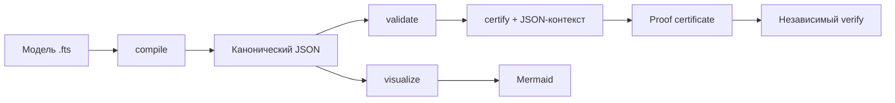

# Как работает FTS

FTS - это один язык с расширением `.fts`, одна каноническая JSON-модель и один проверяющий движок. Пользователю не нужно поддерживать второй синтаксис или знать внутреннее устройство приложения.

## Рабочий цикл



1. Человек, программа или агент создаёт `model.fts`.
2. `compile` переводит текст в канонический `FtsDocument`.
3. `validate` проверяет имена, структуры, поля, функторы и ссылки между ними.
4. `certify` строит типизированную цепочку вывода. Если передан JSON-контекст, значения witness проверяются по пути.
5. `verify` независимо повторяет вывод и сравнивает канонические SHA-256 digest'ы документа, контекста, свидетельств и сертификата.
6. `visualize` строит Mermaid-представление категории и доказательства.

## Минимальный пример

```fts
category ClassicalLogic {
  structure Individual {
    name: string
    isHuman: Human
    isMortal: Mortal
  }

  functor humanImpliesMortal: Human -> Mortal

  proposition compose {
    functors: ["humanImpliesMortal"]
    witness Individual.isHuman {
      value true
      path ["individuals", { name: "Socrates" }, "isHuman"]
    }
  }
}
```

Контекст:

```json
{
  "individuals": [{ "name": "Socrates", "isHuman": true }]
}
```

Запуск:

```bash
fts check examples/socrates.fts
fts certify examples/socrates.fts \
  --context examples/socrates.context.json \
  --pretty > proof.json
fts verify examples/socrates.fts \
  --context examples/socrates.context.json \
  --certificate proof.json
```

Итоговый тип - `Mortal`. В сертификате отдельно указаны:

- проверенное свидетельство `Individual.isHuman : Human`;
- применённый функтор `humanImpliesMortal : Human -> Mortal`;
- закон функтора как явная предпосылка;
- digest документа, контекста, evidence и всего сертификата.

## `symbolic` и `verified`

Сертификат без достаточного контекста имеет статус `symbolic`. Он показывает корректную форму вывода, но не утверждает, что внешний факт проверен.

Статус `verified` означает:

- каждый witness разрешён в переданном JSON-контексте;
- фактическое значение совпало с ожидаемым;
- домен каждого функтора совпал с типом предыдущего шага;
- сертификат воспроизводимо пересчитан verifier'ом.

Это доказательство относительно объявленных законов-функторов. FTS не объявляет истинным внешний закон только потому, что он записан строкой: такие законы всегда перечисляются в `assumptions`.

## Как писать утилиты

Утилита должна читать `FtsDocument`, а не внутренние токены парсера. Поэтому formatter, LSP, генератор кода, анализатор графа, редактор или доменный адаптер используют один стабильный контракт.

```ts
import { compile, certify, verifyCertificate } from "@digitable/fts"

const document = compile(source)
const certificate = certify(document, context)
const verification = verifyCertificate(document, certificate, context)
```

## Как работают агенты

`fts-mcp` публикует read-only инструменты компиляции, проверки, сертификации, независимой верификации и визуализации. Агент не получает доступ к файловой системе через FTS: source, context и certificate передаются как явные JSON-аргументы.

Правильный агентный сценарий:

1. сгенерировать `.fts`;
2. вызвать `fts_check`;
3. вызвать `fts_certify` с evidence context;
4. принять результат только после `fts_verify` со статусом `verified`;
5. сохранить source, context digest и certificate как единый аудируемый пакет.
