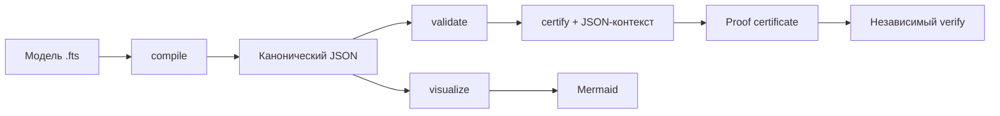

# Как работает FTS

FTS - это один язык с расширением `.fts`, одна каноническая JSON-модель и один проверяющий движок. Пользователю не нужно поддерживать второй синтаксис или знать внутреннее устройство приложения.

## Рабочий цикл



1. Человек, программа или агент создаёт `model.fts`.
2. `compile` переводит текст в канонический `FtsDocument`.
3. `validate` проверяет имена, объекты, поля, морфизмы и ссылки между ними.
4. `certify` строит типизированную цепочку вывода. Если передан JSON-контекст, значения witness проверяются по пути.
5. `verify` независимо повторяет вывод и сравнивает канонические SHA-256 digest'ы документа, контекста, свидетельств и сертификата.
6. `visualize` строит Mermaid-представление категории и доказательства.

## Минимальный пример

```fts
категория «Исполнение заказа»

  объект Заказ
    номер является строкой
    «готов к отгрузке» является состоянием «Готов к отгрузке»

  морфизм «Готовый заказ можно отгрузить»
    если «Готов к отгрузке»
    то «Отгрузить заказ разрешено»

  теорема «Заказ ЗК-7781 можно отгрузить»
    дано Заказ имеет «готов к отгрузке» равное да
    в данных заказы найти где номер равен «ЗК-7781»
    по морфизму «Готовый заказ можно отгрузить»
    следовательно «Отгрузить заказ разрешено»
```

Контекст:

```json
{
  "заказы": [{ "номер": "ЗК-7781", "готов к отгрузке": true }]
}
```

Запуск:

```bash
fts check examples/real-world/order-shipment.fts
fts certify examples/real-world/order-shipment.fts \
  --context examples/real-world/order-shipment.context.json \
  --pretty > proof.json
fts verify examples/real-world/order-shipment.fts \
  --context examples/real-world/order-shipment.context.json \
  --certificate proof.json
```

Итоговый тип - `«Отгрузить заказ разрешено»`. В сертификате отдельно указаны:

- проверенное свидетельство `Заказ.«готов к отгрузке» : «Готов к отгрузке»`;
- применённый морфизм `«Готовый заказ можно отгрузить»`;
- закон морфизма как явная предпосылка;
- digest документа, контекста, evidence и всего сертификата.

## `symbolic` и `verified`

Сертификат без достаточного контекста имеет статус `symbolic`. Он показывает корректную форму вывода, но не утверждает, что внешний факт проверен.

Статус `verified` означает:

- каждый witness разрешён в переданном JSON-контексте;
- фактическое значение совпало с ожидаемым;
- домен каждого морфизма совпал с типом предыдущего шага;
- сертификат воспроизводимо пересчитан verifier'ом.

Это доказательство относительно объявленных законов морфизмов. FTS не объявляет истинным внешний закон только потому, что он записан строкой: такие законы всегда перечисляются в `assumptions`.

## Как писать утилиты

Исполняемая утилита компилируется в типизированный раздел `utilities` канонического `FtsDocument`. Interpreter и генератор читают один и тот же раздел, поэтому семантика примеров не зависит от TypeScript-шаблона.

```ts
import { compile, executeUtility, generateTypeScript, testUtilities } from "@digitable-lol/fts"

const document = compile(source)
const tests = testUtilities(document)
const result = executeUtility(document, "Рассчитать скидку", input)
const generated = generateTypeScript(document)
```

Formatter, LSP и сторонний генератор также должны читать `FtsDocument`, а не внутренние токены parser.

## Как работают агенты

`fts-mcp` публикует read-only инструменты компиляции, запуска примеров, генерации кода, сертификации, независимой верификации и визуализации. Агент не получает доступ к файловой системе через FTS: source, context и certificate передаются как явные JSON-аргументы.

Правильный агентный сценарий:

1. сгенерировать `.fts`;
2. вызвать `fts_check`;
3. для исполняемой утилиты вызвать `fts_test`, затем `fts_generate`;
4. для доказательного решения вызвать `fts_certify` с evidence context;
5. принять доказательный результат только после `fts_verify` со статусом `verified`;
6. сохранить source, context digest и certificate как единый аудируемый пакет.
