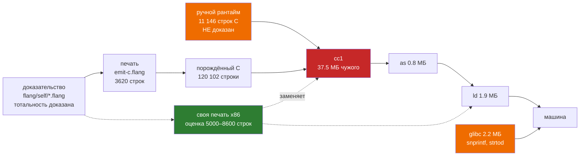

# Печать прямо в машинный код x86-64: замер основания, а не обзор ассемблера

**Вопрос.** Что даёт flang своя печать в x86-64, и чего она стоит.

**Ответ. Выигрыш есть ровно один — сборка вчетверо-всемеро короче, — а главный
довод, «`cc` уходит из доверенного основания», при замере оказался наполовину
ложным: уходит `cc1`, а `libc`, `as` и `ld` остаются, и остаются они не по
недосмотру, а потому что кратчайшая запись числа в flang делается вызовом
`snprintf` из glibc.** Скорость исполнения при этом теряется, и потеря измерена:
**1.20× на работе компилятора и 2.30× на арифметике**, если наивный генератор
выйдет на качество `cc -O0`.

Замер сделан на ветке `work/native-x86-backend` от `5b68cbf`, машина —
Ubuntu, `cc (Ubuntu 15.2.0-16ubuntu1) 15.2.0`, `GNU ld 2.46`, `glibc 2.43`.

Заметка [`svoy-generator-mashinnogo-koda`](zettel/our-own-machine-code-generator.md)
давала на этот вопрос ответ «примерно месяц» с честной пометкой *«по памяти, не
замер»*. Здесь те же величины сняты прогонами в дереве; две из них заметку
поправляют (§4, §9).

---

## 1. Что стоит между доказательством и машиной сегодня

Путь от доказанной тотальности до исполняемого файла проходит через **пять
чужих программ**. Список снят `strace -e trace=execve` на настоящей сборке, а
не выписан по памяти:

| программа | байт | уйдёт со своей печатью? |
|---|---:|---|
| `/usr/bin/x86_64-linux-gnu-gcc-15` (водитель) | 1 305 304 | да |
| `/usr/libexec/gcc/x86_64-linux-gnu/15/cc1` | **37 475 472** | **да** |
| `/usr/bin/x86_64-linux-gnu-as` | 826 608 | только если печатать ELF, а не текст ассемблера |
| `/usr/libexec/gcc/x86_64-linux-gnu/15/collect2` | 479 104 | нет |
| `/usr/bin/x86_64-linux-gnu-ld.bfd` | 1 890 472 | **нет** |
| **итого** | **41 976 960** | |

Плюс то, что остаётся во время работы (`ldd bootstrap/flang_cli`):
`libc.so.6` — 2 186 512 байт, `libm.so.6` — 1 198 376, `ld-linux-x86-64.so.2` —
254 864.

**Сколько чужого кода читается на сборке.** Порождённый C втягивает **97 чужих
заголовков, 17 100 строк** (`cc -M` по всем четырём файлам точки раскрутки), и
зовёт **54 чужих символа** (`nm -u` минус наши `fl_*` и `kompilyator_flang_*`):
`malloc`, `memcpy`, `snprintf`, `strtod`, `pthread_create`, `getrlimit` и
соседи.

Строк исходника самих `cc1`, `ld` и glibc в дереве нет и померить их здесь
нечем; **оценка** по публичным величинам — миллионы строк на каждый из трёх, и
эта оценка на порядки больше всего, что мы когда-либо напишем сами.

**А вот что померить можно и что важнее.** Свой ручной C, который стоит между
доказательством и машиной и который **своя печать не убирает**:

| файл | строк |
|---|---:|
| `flang/src/emit/c/flang_repl.c` | 5 786 |
| `flang/src/emit/c/flang_runtime.c` | 3 222 |
| `flang/src/emit/c/flang_conc.c` | 3 193 |
| `flang/src/emit/c/flang_cli.c` | 1 062 |
| `flang/src/emit/c/flang_runtime.h` | 837 |
| `flang/src/emit/c/flang_conc.h` | 350 |
| **итого** | **11 146** |

Эти 11 146 строк написаны руками, на C, и не доказаны ничем. Своя печать в x86
их не трогает: она заменяет **порождённый** код, а рантайм остаётся тем же
файлом на C, который по-прежнему собирает `cc`.



Красное уходит, оранжевое остаётся. **Уходит 37 475 472 байта из 41 976 960 —
89.3 % чужой сборочной цепочки по размеру.** Остаётся `ld` (связывание отдаём
системному линкеру, иначе цена растёт на порядок) и остаётся glibc — и вот
почему остаётся именно она, а не «ну там мелочи»: §7.

---

## 2. Сколько из 51 секунды занимает `cc`

Сначала поправка к постановке: **в дереве не 51 секунда и не `-flto`.**

`bootstrap/Makefile` содержит `CFLAGS ?= -std=c99 -Wall -Wextra -Werror
-pedantic -O2` — **без `-flto`**. Флаг `-flto` в дереве существует только как
*измеренная, но не принятая* правка в две строки (она описана в
`docs/zamer-skorosti.md`: даёт 1.03–1.60×, удваивает время сборки). Чистая
сборка на этой машине:

```
make -C bootstrap -j1   →  44.13 с (42.62 с пользовательского времени)
```

Разложение по шагам, каждый запущен отдельно тем же набором флагов:

| шаг | секунд | доля |
|---|---:|---:|
| `cc -c kompilyator_flang.c` (120 102 строки, 6 279 070 байт) | **40.55** | 91.9 % |
| `cc -c flang_repl.c` | 1.42 | 3.2 % |
| `cc -c flang_runtime.c` | 0.83 | 1.9 % |
| `cc -c flang_cli.c` | 0.20 | 0.5 % |
| `cc -o flang_cli` (связывание) | 0.07 | 0.2 % |
| `ar rcs` | 0.06 | 0.1 % |
| остаток — сам `make` | ≈1.00 | 2.3 % |
| **`cc` итого** | **43.07** | **97.6 %** |

**Ответ: 43.1 секунды из 44.1. Девяносто восемь процентов сборки — это `cc`, и
92 % всей сборки — один вызов `cc` на один порождённый файл.**

Куда эти 40 секунд уходят внутри `cc` — тоже измерено, тем же файлом при
одинаковых прочих флагах (`-w`, чтобы диагностика не мешала):

| ключ | секунд | объектник, байт |
|---|---:|---:|
| `-E` (только препроцессор) | **0.26** | — |
| `-O0` | **10.83** | 7 673 248 |
| `-O1` | 31.26 | 6 153 968 |
| `-O2` | **48.07** | 6 279 792 |

Читается так: разбор C стоит четверть секунды, а всё остальное — внутренняя
кухня gcc. **Оптимизатор берёт 37 секунд из 48.**

**Для сравнения — сколько стоит наша собственная печать того же компилятора:**

```
node scripts/bootstrap-c.mjs --check
связано функций: 2037, типов: 194
точка раскрутки bootstrap/ совпадает с печатью: 7 файлов, 7897188 байт
1.99
```

**1.99 секунды на печать 7.9 МБ C — против 43.07 секунды на превращение того же
C в машинный код. Разница 21.6×.**

Отсюда честная оценка выигрыша в сборке. Своя печать в x86 делает работу,
сопоставимую по природе с печатью в C — обход того же дерева, вывод байтов
вместо текста, — плюс кодирование инструкций и запись ELF. **Оценка: 4–8
секунд** (наша печать в C идёт 1.99 с; кодирование инструкций и релокации
кладу в 2–4 раза дороже вывода текста).

Полная сборка после этого складывается так: 4–8 секунд своей печати **плюс
2.45 секунды измеренных** — `cc` на 11 тысячах строк рантайма, который никуда
не делся (§4). **Итого оценка 6.5–10.5 секунды вместо измеренных 44.1, то есть
вчетверо-всемеро короче. Это единственное место, где своя печать выигрывает
уверенно и много.**

---

## 3. Скорость исполнения: свой будет хуже, и вот насколько

Наивный генератор не делает того, что делает `-O2`. Ближайшая измеримая планка
для него — `cc -O0`. Собрал точку раскрутки дважды, тем же кодом, и погонял:

| нагрузка | `-O0` | `-O2` | `-O2` быстрее в |
|---|---:|---:|---:|
| `check flang/stdlib/lists.flang`, 10 прогонов | 3.89 с | 3.23 с | **1.20×** |
| рекурсивный счёт «Сумма до» от 900, 3000 запросов | 0.46 с | 0.20 с | **2.30×** |
| размер бинарника | 5 726 944 | 4 356 160 | 1.31× меньше |

Выходы `-O0` и `-O2` на счётной нагрузке совпали **побайтово** (`cmp`) — на
этой программе разницы в семантике оптимизатор не внёс.

**Это заметно лучше, чем ожидала заметка в базе знаний («в 3–10 раз
медленнее»).** Причину видно в одной функции. Печать `н умножить на 2`:

```c
fl_status stupen_1_udvoit(fl_ctx *ctx, fl_value n, fl_value *result, fl_error *error) {
  fl_value fl_t1 = fl_nothing();
  FL_TRY(fl_mul(ctx, n, fl_number(2.0), &fl_t1, error));
  *result = fl_t1;
  return FL_OK;
}
```

во что превращается:

| ключ | инструкций в `stupen_1_udvoit` |
|---|---:|
| `-O0` | **65** |
| `-O1` | 48 |
| `-O2` | **44** |

Сорок четыре инструкции на одно умножение. Не потому что gcc плох, а потому что
**`sizeof(fl_value) = 32 байта`** (померено включением `flang_runtime.h`), в
регистр значение не лезет, и половина кода — `movdqa`/`movups` парами по 16
байт, гоняющие значение через стек по соглашению SysV, плюс два внешних вызова
`fl_number` и `fl_mul`, которые `-O2` без `-flto` встроить не может.

**Вывод для владельца прямой: десятилетия работы над `-O2` на нашем коде
выкупают 1.2–2.3×, а не десять раз, потому что форма кода задана 32-байтовым
значением, а не качеством распределения регистров.** Но 1.2–2.3× — это потеря, а
не выигрыш, и обратно её не вернуть ничем, кроме собственного оптимизатора, то
есть годами работы.

---

## 4. Чего это стоит — по частям, строками

Опора: печатники, которые уже есть. `flang/self/emit-c.flang` — **4008 строк**
на flang против **2015 строк** того же бэкенда на JS (`flang/src/emit/c.mjs`):
коэффициент перевода **1.80×**, и он взят из дерева, а не из головы.

Все числа ниже — **оценка**, но каждая привязана к измеренной величине.

| часть | на что опирается оценка | строк на flang |
|---|---|---:|
| **Выбор инструкций** — тот же обход AST, что у `emit-c.flang`, но на выходе байты | `emit-c.flang` = 3620 строк; узлов языка столько же | **3000–4500** |
| **Кодировщик инструкций** — мнемоника + операнды → REX/ModRM/SIB/immediate | измерено: в готовом бинарнике **122 разных мнемоники**, но 30 из них покрывают **99.3 %** инструкций, 15 — 94.4 % | **800–1500** |
| **Раскладка регистров** | измерено: `fl_value` = 32 байта, в регистр не лезет; всё живёт в стековых слотах, регистры нужны только под адреса и скаляры | **150–400** |
| **Соглашение о вызовах** | измерено: у всех **2544** функций точки раскрутки ровно одна форма — `fl_status f(fl_ctx*, fl_value…, fl_value*, fl_error*)` | **200–400** |
| **Размещение данных** — UTF-8-литералы, таблицы входных типов, таблицы вариантов | видно в порождённом `stupen_1_entry_types` и соседях | **300–600** |
| **Объектный файл ELF** | измерено: `readelf -r` даёт **три** вида релокаций на весь компилятор — `R_X86_64_PLT32` (51 027), `R_X86_64_PC32` (31 101), `R_X86_64_64` (11 839); секций в `.o` нужно ≈8 | **600–1200** |
| **Связывание** | отдаём системному `ld` | **0** |
| **Сверка поведением** (§8) | опора: `scripts/wasm-sverka.mjs` = 257 строк, `flang/test/corpus-grid.mjs` = 269 | **300–600** |
| **ИТОГО** | | **5 350 – 9 200** |

Это сходится с прежней оценкой заметки («5 000–10 000 строк, наивный») — но
теперь сходится не по памяти.

**Чего в этой таблице нет и что решает исход.** Рантайм. Минимальная программа
на flang (одна функция `н умножить на 2`) печатается так:

| файл | строк |
|---|---:|
| `stupen_1.c` — **сама программа** | **67** |
| `stupen_1.h` | 51 |
| `flang_runtime.c` + `flang_runtime.h` + `flang_cli.c` — **неизменный рантайм** | **4 695** |
| **всего напечатано** | **4 813** |

**Своего в напечатанной программе 118 строк из 4 813 — 2.5 %; остальные 97.5 %
это рантайм, который своя печать в x86 не заменяет.** На большой программе доля
переворачивается — в точке раскрутки порождённого кода **702 126 инструкций**
против **24 941** от ручного рантайма (96.5 % против 3.4 %), — но 3.4 %
никуда не деваются, и это ровно тот код, который зовёт `malloc`, `snprintf` и
`pthread_create`.

Значит **своя печать даёт три позиции, а не одну**, и цена у них разная:

1. печатать x86 для программы, рантайм оставить на C — **5 350–9 200 строк**,
   `cc` остаётся, но зовётся один раз и на 11 тысяч строк вместо 120 тысяч;
2. то же плюс переписать рантайм — **+11 146 строк** ручной работы, причём
   упирается это в §7;
3. переписать рантайм на самом flang — отдельный проект, здесь не оценивается.

---

## 5. Три вещи, которые flang делает **проще** обычного

### 5.1. Замыканий нет — и это не слова, это ноль

Дефункционализация (`flang/src/defunc.mjs`, 888 строк, приём Рейнольдса 1972)
снимает высший порядок **до печати**: на выходе программа снова
первопорядковая, `fnref` и `apply` в ней не остаётся, применение превращается в
`разбор` по варианту-тегу.

Что это даёт генератору кода — померено на готовом бинарнике:

| объектник | инструкций | косвенных `call` |
|---|---:|---:|
| `kompilyator_flang.o` (**весь порождённый код**) | 702 126 | **0** |
| `flang_runtime.o` (ручной C) | 8 515 | 2 |
| `flang_cli.o` (ручной C) | 1 756 | 0 |
| `flang_repl.o` (ручной C) | 14 670 | 0 |

**Ноль косвенных вызовов на 702 126 инструкций порождённого кода. Косвенных
переходов (`jmp *`) тоже ноль.** Две штуки во всём дереве — это батут
`fl_trampoline` в ручном рантайме, где указатель на функцию заведён нарочно.

Практически это значит: **у каждого `call` цель известна на печати**, релокация
всегда `R_X86_64_PLT32` с именем, таблиц виртуальных методов нет, анализа
указателей нет, и весь класс «а куда мы прыгнули» из генератора исчезает.
Обычному компилятору такое не достаётся никогда.

### 5.2. Всё тотально — стек считается, а не гадается

Тотальные функции завершаются доказанно, а не по надежде. Из этого следует,
чего в порождённом коде **нет**: раскрутки стека, обработчиков исключений,
таблиц `.eh_frame` для распространения ошибки, `longjmp`. Отказ — это
возвращаемое `fl_status`, обычное целое в `%eax`; в коде выше это `testl %eax,
%eax; jne`. Кадры стека получаются плоские и постоянного размера.

### 5.3. Одна форма вызова на всю программу

2544 функции точки раскрутки — одна сигнатура: контекст, значения-аргументы,
указатель на результат, указатель на ошибку. Генератору не нужно
классифицировать типы по классам SysV (INTEGER/SSE/MEMORY) — **все значения
одного размера, 32 байта, и все идут через память**. Пролог и эпилог пишутся
один раз.

---

## 6. Три вещи, которые flang делает **тяжелее**

### 6.1. Числа — IEEE-754, и печать разойдётся именно здесь

Это самое опасное место, и оно не гипотетическое: **flang уже ловил себя на
нём.** `docs/zamer/13-chyotnoe.flang` — запись случая, когда «Чётное» от −4
дала `НЕТ`, потому что `-4 остаток от 2` в IEEE-754 равно `-0`, а равенство
скаляров считает `Object.is`, для которого `-0` и `0` различны. И шапка
`flang/stdlib/numbers.flang` перечисляет ещё: `0 делить на 0` проходит
типизацию и даёт NaN, `NaN не меньше 0` ложно всегда.

**Почему это бьёт именно по своей печати.** Смотрим `fl_number_text`
(`flang/src/emit/c/flang_runtime.c:1626`) — функцию, которая печатает число по
правилам ECMAScript `Number::toString`, потому что *«совпадение с
интерпретатором обязано быть посимвольным»*:

```c
for (precision = 1; precision < 17; precision += 1) {
  snprintf(probe, sizeof probe, "%.*e", precision - 1, value);
  if (strtod(probe, NULL) == value) {
    break;
  }
}
```

Кратчайшая запись double ищется **перебором точностей через `snprintf` и
`strtod` из glibc**. Это самая тонкая часть перевода двоичного в десятичное, и
мы её не пишем — мы её **занимаем у glibc**.

Отсюда три следствия, и все три против своей печати:

- **glibc из основания не уходит.** Пока `fl_number_text` устроен так, машинный
  код обязан звать `snprintf` и `strtod`. Довод «`cc` уходит из доверенного
  основания» верен для `cc1` и неверен для libc;
- **если писать своё** — это Ryū или Grisu, отдельная задача с собственным
  доказательством, и любая ошибка в ней **расходится с семью остальными целями
  печати сразу**, потому что все они печатают числа правилами ECMAScript;
- **сама арифметика.** `-0`, NaN, `Infinity`, порядок округления — своя печать
  обязана выдавать те же биты, что `mulsd`/`divsd` дают сегодня. Ошибка здесь
  не падает и не диагностируется: она даёт другое число.

**Называю опасность прямо: числа — единственное место, где своя печать может
молча разойтись с эталоном, и она разойдётся, если писать перевод в десятичное
самостоятельно.**

### 6.2. Процессы и планировщик — 2049 строк, и это самая тяжёлая часть

`flang/src/emit/c/flang_conc.c` — 3193 строк кооперативного однопоточного
планировщика (плюс `flang/src/conc.mjs`, 1768 строк на стороне эталона). Печать
сообщает `«параллелизм»: «нет»`, и по замеру WebAssembly он не зовёт ничего,
кроме `math.h`/`stdint.h`/`stdio.h`/`string.h` — то есть переносится хорошо.

Но своей печати он достаётся целиком: переключение процессов — это сохранение и
восстановление состояния счёта, а в машинном коде это либо явные кадры
продолжений, либо своя работа со стеком. **В варианте «рантайм остаётся на C»
эта часть не пишется вовсе — и это сильный довод в пользу такого варианта.**

### 6.3. Уходит `-Werror`, а это был бесплатный сторож

Сегодня порождённый C собирается под `-std=c99 -Wall -Wextra -Werror
-pedantic`. Померено: `cc -Wall -Wextra -pedantic -Q --help=warnings` даёт
**194 включённых предупреждения** (из 486 существующих ключей), и `-Werror`
делает каждое из них ошибкой сборки.

Это значит, что сегодня **194 проверки чужого компилятора стоят сторожем над
нашим бэкендом бесплатно**: несовпадение типов, неинициализированная
переменная, потерянное возвращаемое значение, выход за границу массива в
константном индексе. Свой генератор x86 всего этого лишается разом. Взамен —
ничего: байты не проверяет никто.

Побочно то же касается диагностики. Одна функция точки раскрутки,
`kompilyator_flang_call`, занимает **309 386 байт** — это цепочка `strcmp` по
2037 именам. `cc` такое переваривает; свой генератор обязан не сложиться на
функции такого размера, и это надо проверять, а не предполагать.

---

## 7. Ступени и свидетели

Каждая ступень — со своей проверкой. Свидетель обязан быть исполняемым, а не
описательным.

| # | ступень | свидетель | оценка строк |
|---|---|---|---:|
| **1** | одна арифметическая функция без вызовов, всё в стековых слотах, ELF `.o` с одной секцией `.text`, слинковано с готовым рантаймом | `stupen_1_udvoit` даёт тот же ответ, что `-O2`-сборка, на сетке из 20 чисел, включая `-0`, `NaN`, `1e21` | 800–1500 |
| **2** | вызовы: одна форма SysV, `R_X86_64_PLT32`, отказ через `%eax` | точка раскрутки `stupen_1_call`: 2 функции зовут друг друга, диагностика при неверной арности совпадает **дословно** | +400–700 |
| **3** | списки и память: `fl_arena_alloc`, `fl_list`, конструкторы записей | `flang/stdlib/lists.flang` целиком, сверка с интерпретатором на сетке корпуса | +700–1200 |
| **4** | суммы типов: `разбор`, `fl_variant_is`, `fl_variant_field` — и вместе с ними **дефункционализованные применения** | `flang/stdlib/optional.flang`, `result.flang`, `higher-order.flang` | +600–1000 |
| **5** | строки, UTF-8, и **числа в текст** | здесь ступени кончаются: см. §6.1 | +300 или +2000 |
| **6** | процессы и планировщик | `flang/test/emit-c-conc.test.mjs`: журнал доставок сверяется побайтово на сетке семян | +1500–3000 |

**Где ступени кончаются и начинается настоящая работа.** На ступени 5, и
граница проходит по одной функции — `fl_number_text`.

- Если рантайм остаётся на C, ступень 5 стоит **+300 строк** (просто зовём
  `fl_number_text` как внешний символ), и ступени 1–5 складываются в
  **2 800–4 700 строк** — это работа масштаба одного существующего печатника,
  и она подъёмна.
- Если рантайм переписывается, ступень 5 — это **свой Ryū**, а ступень 6 — свои
  продолжения, и общая цена уходит за 15 000 строк с обязательным собственным
  доказательством перевода двоичного в десятичное.

**Ступени 1–4 — это ступени. Ступень 5 в варианте «своё» и ступень 6 — это уже
не ступени, а два отдельных проекта.**

---

## 8. Чем это проверять

Метод дерева — [побайтовая сверка](zettel/byte-for-byte-comparison.md). Надо
разобраться, что именно в нём побайтово, потому что «для x86 сверять не с чем» —
верно наполовину.

**Что сверяется побайтово сегодня** (`flang/test/self-bootstrap.test.mjs`, 1754
строк): C, напечатанный эталоном на JS, C, напечатанный flang₁, и C,
напечатанный flang₂, — три текста обязаны совпасть знак в знак; и каталог
`bootstrap/` обязан совпасть с сегодняшней печатью, 7 файлов, 7 897 188 байт.

**Это сверка печати с печатью, а не с чужим эталоном** — и она для x86
сохраняется полностью. Неподвижная точка самоприменения работает с байтами ELF
ровно так же, как с текстом C: `x86 от эталона == x86 от flang₁ == x86 от
flang₂`. Терять её не приходится.

**Что действительно теряется — оракул правильности.** Сегодня у нас три:

| оракул | что ловит | остаётся для x86? |
|---|---|---|
| побайтовая сверка трёх печатей | расхождение реализаций компилятора | **да** |
| 194 предупреждения `cc` под `-Werror` | ошибки бэкенда в тексте C | **нет** |
| сверка поведения с интерпретатором на корпусе | расхождение семантики | **да, но это единственный** |

Корпус для третьего уже есть: `flang/test/corpus-grid.mjs` (269 строк) —
`flang/stdlib/*.flang` (13 файлов) плюс `flang/examples/leetcode/*.flang`
(82 файла); замер WebAssembly прогнал по нему **94 программы, 8799 точек**, и
сверял **всю строку ответа побайтово**, включая коды и тексты диагностик, а не
только значение.

**Ответ прямой: побайтовая сверка выхода программы у нас уже есть и для x86
работает без изменений. Чего нет — это второго независимого оракула.** Сегодня
`-Werror` ловит ошибку бэкенда *до* запуска и указывает на строку; для x86 та же
ошибка проявится как расхождение на одной из 8799 точек, без указания места, а
часть ошибок (неверный кадр стека, порча регистра, который на этой ветке не
читается) не проявится вовсе.

Цена нового класса сверки — **300–600 строк** оснастки по образцу
`scripts/wasm-sverka.mjs` (257 строк), и это не главная статья. Главная — то,
что расследование одного расхождения в машинном коде стоит на порядок дороже,
чем в тексте C. **Это в оценку из §4 не входит и войти числом не может.**

---

## 9. Что здесь поправляет базу знаний

| было в [`svoy-generator-mashinnogo-koda`](zettel/our-own-machine-code-generator.md) | стало по замеру |
|---|---|
| «код в 3–10 раз медленнее C» *(по памяти)* | **1.20× на работе компилятора, 2.30× на арифметике** (§3), если выйти на качество `cc -O0` |
| «5 000–10 000 строк, подъёмно» *(по памяти)* | **5 350–9 200 строк** с привязкой каждой части к измеренной величине (§4) — оценка подтвердилась |
| «на доказуемость не влияет ни на грамм» | **влияет, но меньше, чем кажется, и не туда**: уходит 89.3 % чужой цепочки по размеру (`cc1`), остаются `ld` и glibc, причём glibc остаётся **по существу**, а не по лени — §6.1 |
| «убирает зависимость от `cc`» | **не убирает.** 11 146 строк ручного рантайма на C остаются, и `cc` продолжает их собирать |

---

## 10. Стоит ли, по-моему

**Стоит — но не ради того, ради чего это обычно затевают, и не сейчас.**

**Что довод не выдержал.** «`cc` уходит из доверенного основания» — самый
честный на слух довод — при замере оказался наполовину ложным. Уходит `cc1`
(89.3 % чужой цепочки по размеру), остаются `as`, `ld` и glibc, и glibc
остаётся не случайно: кратчайшая запись числа делается через `snprintf` и
`strtod`. Плюс 11 146 строк нашего собственного недоказанного C никуда не
деваются. **Доказуемость от этой работы выигрывает мало.**

**Что довод выдержал.** Сборка. 43.1 секунды из 44.1 — это `cc`, и 92 % всей
сборки — один вызов на один файл. Наша собственная печать того же компилятора
идёт **1.99 секунды**. Своя печать в x86 — **оценка 3–8 секунд вместо 44**.
Для дерева, которое перепечатывает точку раскрутки **в том же коммите, что и
правку компилятора**, это меняет темп работы каждый день.

**Чем платим.** 1.2–2.3× скорости исполнения — измерено, не оценено. И потеря
194 бесплатных проверок `cc`, которую нечем заменить: остаётся один оракул
вместо трёх.

**Порядок, который я считаю правильным.**

1. Сделать **ступени 1–4** (2 500–4 400 строк) — печать программы в x86,
   рантайм остаётся на C и собирается `cc` **один раз**. Это уже даёт почти
   весь выигрыш в сборке: `cc` получает 11 тысяч строк рантайма вместо 120 тысяч
   строк компилятора — по разложению §2 это **2.45 секунды вместо 43.07**, а
   ушедшие 40.55 секунды заменяются работой своей печати (**оценка** 3–8 с).
2. `fl_number_text` **не трогать**. Звать как внешний символ. Всё, что связано
   с переводом двоичного в десятичное, оставить glibc до тех пор, пока у нас не
   появится своё **доказанное** решение — и до тех пор считать, что glibc в
   основании и это записано честно, а не забыто.
3. Планировщик не трогать вовсе. 2049 строк, которые уже переносятся куда
   угодно (замер WebAssembly), — последнее, что стоит переписывать в байтах.

**Чего делать не стоит:** гнаться за скоростью `-O2`. Это годы, и по §3 приз
там 1.2–2.3×, а не порядок. **Своя печать в x86 — это про время сборки и про
то, что 89 % чужой цепочки перестаёт быть нужной. Продавать её как «теперь всё
доказано до машины» будет неправдой, и замер это показывает числом.**

---

## 11. Как повторить

```sh
cd /srv/flang-rabota/gipoteza

# 1. Сколько из сборки — cc
make -C bootstrap clean && time make -C bootstrap -j1

# 2. Разложение по шагам
cd bootstrap
for f in flang_runtime kompilyator_flang flang_cli flang_repl; do
  /usr/bin/time -f "$f %e" cc -std=c99 -Wall -Wextra -Werror -pedantic -O2 -c -o $f.o $f.c
done

# 3. Куда уходит время внутри cc
for O in 0 1 2; do /usr/bin/time -f "-O$O %e" cc -std=c99 -w -O$O -c -o /tmp/k$O.o kompilyator_flang.c; done
/usr/bin/time -f "-E %e" cc -std=c99 -w -E -o /dev/null kompilyator_flang.c

# 4. Сколько стоит НАША печать того же компилятора
LC_ALL=C.UTF-8 /usr/bin/time -f "%e" node scripts/bootstrap-c.mjs --check

# 5. Чужие программы в пути от доказательства к машине
strace -f -e trace=execve -o /tmp/tr.txt cc -std=c99 -w -O2 -c -o /tmp/x.o flang_cli.c
grep -o 'execve("[^"]*"' /tmp/tr.txt | sort -u

# 6. Чужие заголовки и чужие символы
cc -std=c99 -w -M *.c | tr ' ' '\n' | grep '^/usr' | sort -u | xargs wc -l | tail -1
nm -u *.o | grep -oP '^\s+U \K\S+' | sed 's/@.*//' | sort -u | grep -v '^fl_\|^kompilyator_flang'

# 7. Ноль косвенных вызовов в порождённом коде
objdump -d kompilyator_flang.o | grep -c 'call.*\*'    # 0
objdump -d kompilyator_flang.o | grep -cP '^\s+[0-9a-f]+:'  # 702126

# 8. Мнемоники и релокации — сколько x86 на самом деле нужно
objdump -d flang_cli | grep -P '^\s+[0-9a-f]+:' \
  | awk '{for(i=1;i<=NF;i++) if($i !~ /^[0-9a-f][0-9a-f]$/ && $i !~ /:$/){print $i; break}}' \
  | sort | uniq -c | sort -rn | head -30
readelf -r kompilyator_flang.o | grep -oP 'R_X86_64_\w+' | sort | uniq -c

# 9. Сорок четыре инструкции на одно умножение
node flang/bin/flang.mjs emit МОДУЛЬ.flang --target c --out /tmp/s1
cc -std=c99 -w -O2 -I/tmp/s1 -S -o /tmp/s1.s /tmp/s1/*_1.c

# 10. Что покупает -O2: собрать точку раскрутки дважды и погонять
#     (см. §3; выходы обязаны совпасть побайтово)
```
