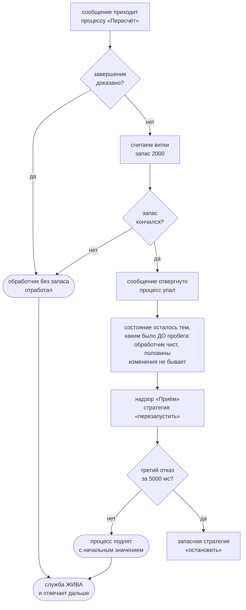

# Разборы настоящих случаев

Три случая из дерева, не выдуманные для страницы: восемьдесят две задачи
leetcode, служба-сокращатель ссылок и надзор над её процессами. Про каждый —
**что именно доказано** и чего доказательство стоит.

## Случай 1. Восемьдесят две задачи leetcode

`flang/examples/leetcode/` — 82 файла, 7 607 строк. Счёт по объявлениям:

| | |
| --- | --- |
| функций | 300 |
| из них тотальных | **298** |
| обычных | 2 |
| исполняемых примеров | 804 |
| постусловий (`обеспечивает`) | **2** |

Читать эту таблицу надо в обе стороны, и вторая сторона важнее.

**Что доказано.** 298 функций из 300 несут доказанное завершение. Это не
«тесты прошли»: компилятор отказался бы собрать файл, если бы не смог показать,
что рекурсия обрывается. Для задач вроде «поиск в повёрнутом отсортированном
массиве» или «ловушка для дождевой воды» это ровно то место, где живут вечные
циклы, — и оно закрыто до запуска.

**Чего не доказано, и это видно из той же таблицы.** Постусловий во всём корпусе
**два**, оба в задаче 13 «римские цифры в число»:

```
  обеспечивает «значение цифры неотрицательно» результат не меньше 0
  обеспечивает «значение цифры не больше тысячи» результат не больше 1000
```

То есть про 298 функций доказано, что они **останавливаются**, и почти ни про
одну — что она **считает правильно**. Правильность здесь несут 804 примера, а
пример — утверждение об одном входе. Разрыв между «доказано» и «правильно» — это
и есть спецификация, и корпус leetcode показывает его размер числом.

**Две обычные функции названы поимённо.** `«Шаг счастья»` и `«Счастливое»` из
задачи 202. Завершение у них есть — последовательность сумм квадратов цифр
попадает в цикл, — но доказать это спуском по структуре нельзя, и файл честно
пишет `функция`, а не `тотальная функция`. Две из трёхсот: цена признака
«тотальная» на настоящих задачах измерима, и она невелика.

## Случай 2. Служба-сокращатель ссылок

`flang/examples/web/shortener/` — **1 258 строк на flang** в пяти файлах плюс
106 строк хозяина на Node, который читает байты из связи и отдаёт байты обратно.
Между входом и выходом нет ни одной строки не на flang.

| Файл | Строк | Что там |
| --- | --- | --- |
| `service.flang` | 594 | исход, теоремы, маршрутизация, разбор и печать HTTP |
| `server.flang` | 229 | процессы, надзор, три прогона |
| `store.flang` | 155 | коды, адреса, счётчик переходов |
| `plan.flang` | 121 | тот же обслуживатель через файловый ввод-вывод |
| `handler-without-budget.flang` | 53 | улика: не собирается, и в этом смысл |

Прогон ведомости:

```bash
flang check flang/examples/web/shortener/service.flang --proof
```

```
функций 83: тотальных 83, обычных 0
обещание несёт: композиция 80, структура 2, постоянный шаг 1
утверждений 7: доказано 5 (из них индукцией 3), сетка 2, аксиом 0 (шагов в термах 30)
```

**Что здесь ценно.** Веб-служба, у которой **все 83 функции тотальны**, — это
служба, у которой ни один запрос не может увести обработчик в вечный цикл.
Не «мы не нашли такого запроса», а «такого запроса нет». Для разбора HTTP,
который принимает байты из сети, это самое дорогое свойство из возможных.

**Три доказательства индукцией** идут по типу «Исход» — перечислению из десяти
случаев. Доказано, что код ответа всегда из объявленного набора, что пояснение
кода непусто и что «успех исхода» и «успех кода» — одно и то же. Ошибка вида
«вернули 200 с текстом ошибки» здесь не проходит проверку типов, а не ловится
тестом.

**Два утверждения легли сеткой, а не доказательством,** и ведомость говорит это
дословно: «сетка 1 значение (примеры функции) … Это не доказательство — теоремы
при утверждении нет». Про «тело ответа не длиннее заявленного предела» известно
ровно то, что на написанных примерах нарушений не нашли.

Прогон примеров службы: `flang test …/server.flang` — **240 примеров, 240
прошло, 0 упало**. Три прогона процессов двоичный не гоняет вовсе; с ними
примеров 243, и столько же проходит у реализации-эталона.

## Случай 3. Надзор: что происходит, когда кончается запас витков

Это тот случай, где доказуемость и практика встречаются. Обработчик, завершение
которого доказано, запаса не требует. Обработчик, у которого не доказано, обязан
назвать запас — `обрабатывает «шаг пересчёта» с запасом 2000 витков`, — иначе
**проверка типов отвергает файл**. А процесс, который может отказать и над
которым нет надзора, отвергается тоже: `FLANG_UNCOVERED_FAILURE`.



Схема не пересказывает текст выше — она отвечает на вопрос, который текстом
задаётся плохо: **что остаётся от состояния и кто поднимает упавшего**. Три
прогона в `server.flang` проверяют ровно эти стрелки:

- `запас кончился у одного — служба жива и досчитала переход`: «Пересчёт»
  перезапущен **ровно один раз**, его состояние вернулось к нулю, а хранилище
  «Службы» цело — созданная до падения ссылка на месте, и переход по ней
  сосчитан;
- `злонамеренный вход не роняет службу и не будит надзор`: обрезанный запрос,
  две длины тела, заголовок сверх предела — **0 решений надзора**. Тотальный
  обработчик не падает ни на чём;
- `третье исчерпание запаса в окне уходит на запасную стратегию`: **семя от 1 до
  200** — две стратегии «перезапустить», одна «остановить» на всех двухстах
  чередованиях.

Сетка семян здесь не украшение: окно порога измеряется пробегами обработчика, и
сколько их успеет случиться между отказами — дело чередования, а не расчёта.

## Что дальше

- [Что доказано, а что проверено](overview.html) — ведомость по всему дереву
- [Зачем и как](proofs.html) — устройство ядра доказательств
- [Процессы и отказоустойчивость](spec-conc.html) — спецификация надзора
