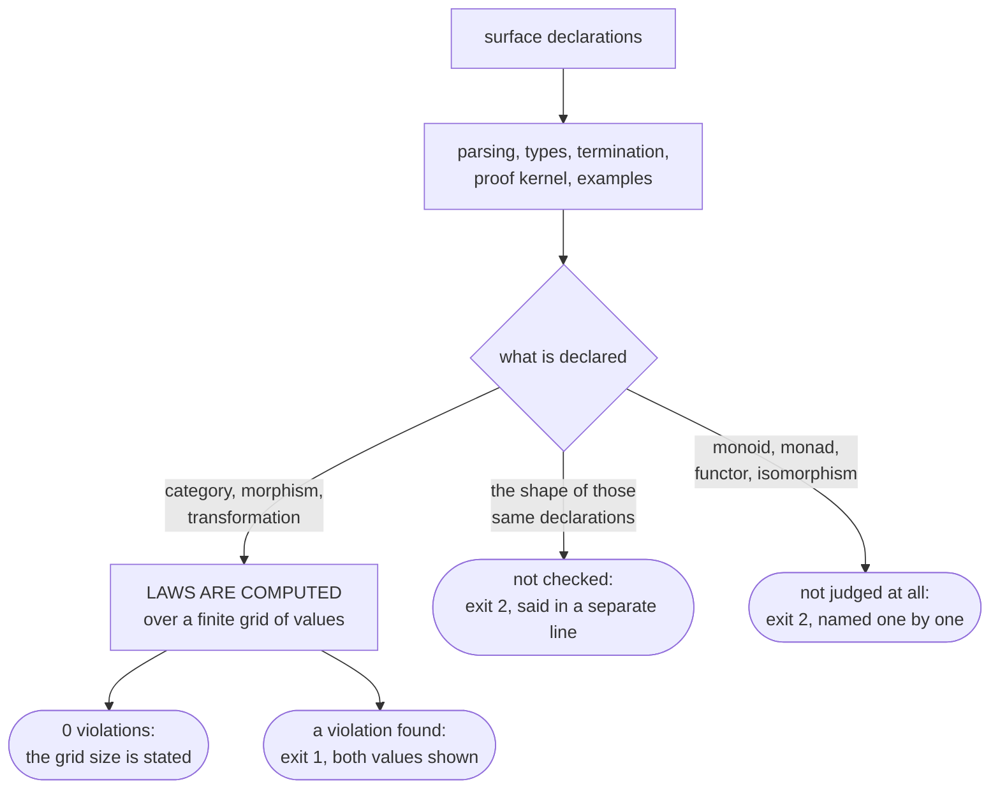

# The categorical surface

This page shows which words flang gives you beyond functions and types — object,
morphism, category, functor, transformation, monoid, monad — and what the
compiler does with them today. By the end you will be able to declare a category
over your own task, read the compiler's answer, and know exactly which part of
the promise is computed and which is not.

## Why this is here at all

An ordinary function says *what* it computes. A structure declaration says what
is **always true** about it — and thereby makes a claim you can hold it to.

Addition of numbers is not merely a function of two arguments: it is an
operation with an identity, it is associative, and every value has an inverse.
String concatenation is the same, minus the inverse — and promising one would be
a lie. Both facts are written in one form:

```flang
моноид «Сумма»
  носитель число
  операция «Сложить»
  единица 0
  обратный элемент «Обратить»

моноид «Склейка»
  носитель строка
  операция «Склеить»
  единица ""
```

There is deliberately no separate word for "group": a group is a monoid with an
inverse, and a second word would split two checks that must agree in everything
but a single law.

A monad is declared just as briefly — a type name and two functions:

```flang
монада «Возможно» от «А»
  возврат «Обернуть»
  соединение «Сплющить»
```

## A category: objects, arrows, and its own equality

A category is a set of objects, arrows between them, and a rule saying when two
arrows count as the same one. That last part is what makes anything checkable:
until it is said when two values are equal, "associativity of composition" means
nothing.

Here is a working excerpt from `flang/examples/cat/order-shipment.flang` — an
order, a shipment, an invoice:

```flang
морфизм «отгрузить» из «Заказ» в «Отгрузка»
  даёт «Отгрузить заказ»
  закон «номер отгрузки берётся из суммы заказа»
    пример «обычный заказ»
      дано заказ равно запись «Заказ» с сумма равным 500
      ожидается запись «Отгрузка» с номер равным 500

морфизм «выписать» из «Отгрузка» в «Накладная»
  даёт «Выписать накладную»
  закон «итог накладной равен номеру отгрузки»
    пример «обычная отгрузка»
      дано отгрузка равно запись «Отгрузка» с номер равным 500
      ожидается запись «Накладная» с итог равным 500

морфизм «оформить» это «выписать» после «отгрузить»

единица «Заказ»
единица «Отгрузка»
единица «Накладная»

категория «Отгрузки»
  морфизм «отгрузить»
  морфизм «выписать»
  морфизм «оформить»
  объект «Заказ» даёт «Заказы равны»
  объект «Отгрузка» даёт «Отгрузки равны»
  объект «Накладная» даёт «Накладные равны»
```

`даёт` on a morphism names the function that computes it. `даёт` on an object
names the function that says when two values of that object are the same one.
Equality of arrows follows from equality of values, and everything else follows
from that.

## What the compiler does with this today

Three different answers, and they must not be confused.



### The compiler COMPUTES the laws of a category — over a grid

Three things are computed: that the declared equality is an equivalence
(reflexive, symmetric, transitive), that composition respects it, and that
composition is associative. For a transformation, the commuting square is
computed. The values come from the examples attached to the arrows.

The report must state the size of the grid, and it does:

```
$ flang check flang/examples/cat/order-shipment.flang
категория «Отгрузки»: сетка 5 значений на 3 объектах, троек стрелок 7,
нарушений 0 — ПОСЧИТАНО НА СЕТКЕ, не доказано
```

**"Computed over a grid" is not "proved".** Five values are five values; a sixth
may break the law, and the count says nothing about that. The word "proved" is
deliberately not used here.

### A violation rejects the file and cancels emission

Replace the equality with a relation that is not one — say `не больше` instead of
`равен` — and the compiler refuses, showing the pair of values it caught it on:

```
$ flang check flang/test/fixtures/binary-rules/equality-not-symmetric.flang
категория «Отгрузки»: сетка 4 значений на 2 объектах, троек стрелок 0,
нарушений 1 — ПОСЧИТАНО НА СЕТКЕ, не доказано; оборвано: объявленное равенство
не эквивалентность
FLANG_EQUALITY_NOT_SYMMETRIC, строка 50: категория «Отгрузки»: равенство на
«Заказ» не симметрично: {"сумма":500} и {"сумма":0} — нет, а {"сумма":0} и
{"сумма":500} — да
$ echo $?
1
```

Emitting the same program is cancelled:

```
$ flang emit flang/test/fixtures/binary-rules/equality-not-symmetric.flang --target c --out ./out
flang emit: печать отменена — программа не проходит проверку, замечаний 1.
$ echo $?
1
```

There are zero files in `./out`. The same holds for a faked transformation
square: `FLANG_TRANSFORM_NOT_NATURAL`, with both paths and their values in the
message — on `{"рубли":100}` one path gave `{"копейки":10100}` and the other
`{"копейки":11000}`.

### The compiler does NOT check the shape of the declarations

Closure of a category under composition, an identity on every object, the
endpoints of composed arrows agreeing, the kind of the declared equality, the
shape of a transformation — none of that is checked by anything today. The
compiler says so in a separate line and answers with exit code 2 rather than
going green in silence:

```
УСТРОЙСТВО этих объявлений бинарник не судит вовсе — categories, morphisms:
замкнутость категории под композицией, единицы, сходимость концов у композиций,
вид объявленного равенства и устройство преобразования. ЗАКОН посчитан на сетке,
устройство не сверялось, и первое второго не заменяет
```

The difference matters. A category with no declared equality builds — and its
laws simply are not computed:

```
$ flang check flang/test/fixtures/binary-rules/category-not-closed.flang
категория «Продажи»: НЕ СЧИТАЛАСЬ — своего равенства не объявлено: равенство
стрелок не выразимо, ассоциативность не считана
$ echo $?
2
```

### Monoid, monad, functor and isomorphism are not judged at all

Their rules are neither computed over a grid nor checked by comparing
declarations. The compiler names them one by one and answers with exit code 2:

```
$ flang check flang/examples/cat/monoid-and-monad.flang
проверено НЕ ВСЁ: в программе объявлено то, чего бинарник не судит вовсе —
monoids, monads.
$ echo $?
2
```

The examples still run, as in any program:

```
$ flang test flang/examples/cat/monoid-and-monad.flang
flang/examples/cat/monoid-and-monad.flang: примеров 20, прошло 20, не прошло 0
$ echo $?
0
```

Exit code 2 means "not checked all the way through". Reading it as "all good" is
wrong.

## What it comes to for you

| What you declared | What the compiler does with it |
| --- | --- |
| a category with a declared equality | computes three laws over a grid and states its size; a violation is a refusal and cancels emission |
| a transformation | computes the commuting square over a grid; a violation is a refusal |
| a category without an equality | the laws are not computed, and it says so in words |
| closure, identities, endpoints of composites | not checked; said in a separate line, exit code 2 |
| monoid, monad, functor, isomorphism | not judged at all; named one by one, exit code 2 |
| a law attached to an arrow | run as an example under `flang test` |

In one line: **everything can be declared; what is computed today are the laws of
a category and of a transformation, and they are computed over a finite grid.**

## The `в монаде` form

A chain of computations, any of which may fail, is written without binding each
step by hand. The compiler parses and expands the form; in the tree it stands in
`flang/examples/monad/order-total.flang`. That file does carry diagnostics
today, and they are not about the monad: `FLANG_TYPE_PARAM` inside the expanded
code — the type parameter `«Беда»` is determined neither by the arguments nor by
the expected type.

## Where the rest is written

The full surface contract is `flang/cat/SPEC.md`: the form of every declaration
down to the last case ending, the diagnostic code for every trouble, and a
by-name list of what the compiler does not check. Beside it are the pieces:
`HOF.md`, `POLY.md`, `MONAD.md`, `SETS.md`, `ZAKONY.md`.

It is a contract, not a tutorial, and on the site it sits behind the [for
contributors](contributing.html) door.

## Where to go next

- [What is proved and what is not](what-is-proved.html) — the same line drawn
  across the whole language at once.
- [Processes, supervision, distribution](processes.html) — the second surface,
  where the line falls differently.
- [How to keep learning the language](learning.html) — where this page sits on
  the road.
