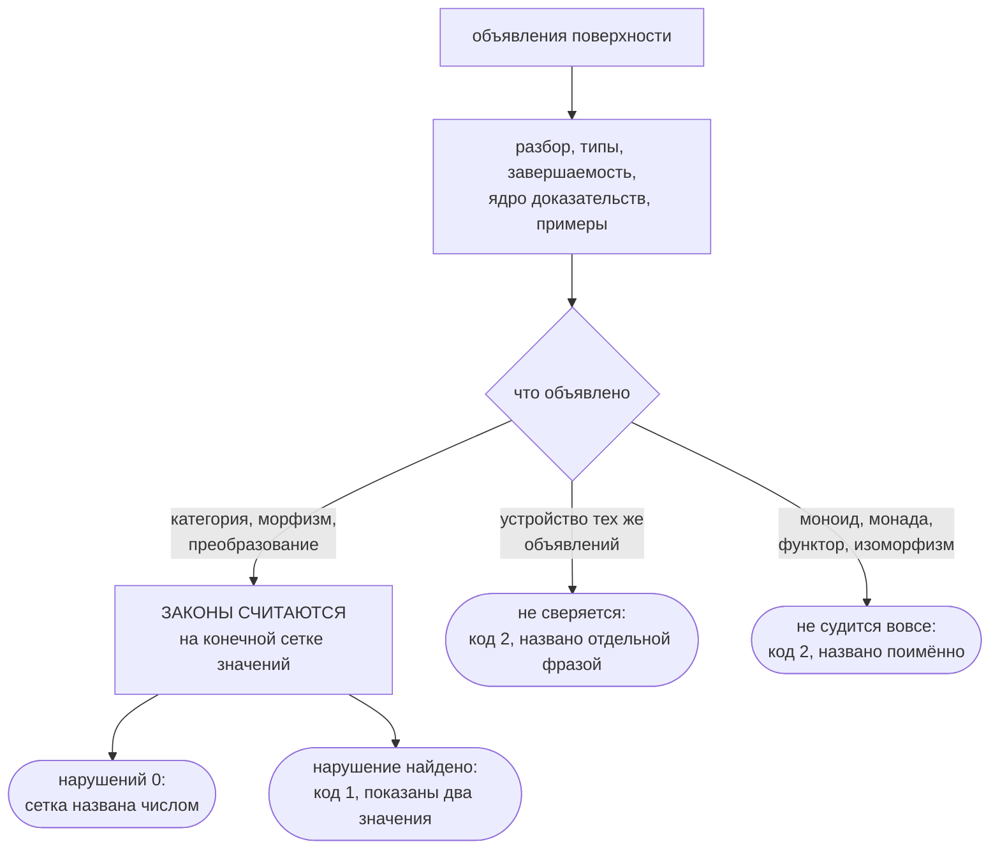

# Категорная поверхность

Отсюда вы узнаете, какие слова flang даёт сверх функций и типов — объект,
морфизм, категория, функтор, преобразование, моноид, монада — и что именно
компилятор с ними делает сегодня. К концу страницы вы сможете объявить категорию
на своей задаче, прочитать ответ компилятора и точно знать, какая часть
обещанного посчитана, а какая нет.

## Зачем это нужно

Обычная функция говорит, *что* она считает. Объявление структуры говорит, что
про неё **верно всегда** — и тем самым делает утверждение, за которое можно
спросить.

Сумма чисел — не просто функция двух аргументов: это операция, у которой есть
единица, которая ассоциативна и у которой каждое значение обратимо. Склейка
строк — то же самое, но обратимости у неё нет, и обещать её было бы враньём.
Оба факта записываются одной формой:

```flang
моноид «Сумма»
  носитель число
  операция «Сложить»
  единица 0
  обратный элемент «Обратить»

моноид «Склейка»
  носитель строка
  операция «Склеить»
  единица ""
```

Отдельного слова «группа» в языке нет намеренно: группа — это моноид, у которого
есть обращение, и второе слово развело бы две проверки, обязанные совпадать во
всём, кроме одного закона.

Монада объявляется так же коротко — именем типа и двумя функциями:

```flang
монада «Возможно» от «А»
  возврат «Обернуть»
  соединение «Сплющить»
```

## Категория: объекты, стрелки и своё равенство

Категория — это набор объектов, стрелок между ними и правило, по которому две
стрелки считаются одной и той же. Последнее и есть та часть, без которой
проверять нечего: пока не сказано, когда два значения равны, слова
«ассоциативность композиции» не значат ничего.

Вот работающий кусок из `flang/examples/cat/order-shipment.flang` — заказ,
отгрузка, накладная:

```flang
морфизм «отгрузить» из «Заказ» в «Отгрузка»
  даёт «Отгрузить заказ»
  закон «номер отгрузки берётся из суммы заказа»
    пример «обычный заказ»
      дано заказ равно запись «Заказ» с сумма равным 500
      ожидается запись «Отгрузка» с номер равным 500

морфизм «выписать» из «Отгрузка» в «Накладная»
  даёт «Выписать накладную»
  закон «итог накладной равен номеру отгрузки»
    пример «обычная отгрузка»
      дано отгрузка равно запись «Отгрузка» с номер равным 500
      ожидается запись «Накладная» с итог равным 500

морфизм «оформить» это «выписать» после «отгрузить»

единица «Заказ»
единица «Отгрузка»
единица «Накладная»

категория «Отгрузки»
  морфизм «отгрузить»
  морфизм «выписать»
  морфизм «оформить»
  объект «Заказ» даёт «Заказы равны»
  объект «Отгрузка» даёт «Отгрузки равны»
  объект «Накладная» даёт «Накладные равны»
```

`даёт` у морфизма называет функцию, которая его считает. `даёт` у объекта
называет функцию, которая говорит, когда два значения этого объекта — одно и то
же. Из равенства значений выводится равенство стрелок, а из него — всё
остальное.

## Что компилятор делает с этим сегодня

Три разных ответа, и путать их нельзя.



### Законы категории компилятор СЧИТАЕТ — на сетке

Считаются три вещи: что объявленное равенство есть эквивалентность
(рефлексивно, симметрично, транзитивно), что композиция это равенство уважает и
что композиция ассоциативна. У преобразования считается коммутативность
квадрата. Значения для счёта берутся из примеров при стрелках.

Отчёт обязан назвать размер сетки, и называет:

```
$ flang check flang/examples/cat/order-shipment.flang
категория «Отгрузки»: сетка 5 значений на 3 объектах, троек стрелок 7,
нарушений 0 — ПОСЧИТАНО НА СЕТКЕ, не доказано
```

**«Посчитано на сетке» — не «доказано».** Пять значений это пять значений;
шестое может нарушить закон, и об этом счёт не скажет ничего. Слово «доказано»
здесь не употребляется намеренно.

### Нарушение отвергает файл и отменяет печать

Подмените равенство отношением, равенством не являющимся, — скажем, «не больше»
вместо «равен», — и компилятор откажет, показав пару значений, на которой
поймал:

```
$ flang check flang/test/fixtures/binary-rules/equality-not-symmetric.flang
категория «Отгрузки»: сетка 4 значений на 2 объектах, троек стрелок 0,
нарушений 1 — ПОСЧИТАНО НА СЕТКЕ, не доказано; оборвано: объявленное равенство
не эквивалентность
FLANG_EQUALITY_NOT_SYMMETRIC, строка 50: категория «Отгрузки»: равенство на
«Заказ» не симметрично: {"сумма":500} и {"сумма":0} — нет, а {"сумма":0} и
{"сумма":500} — да
$ echo $?
1
```

Печать этой же программы отменяется:

```
$ flang emit flang/test/fixtures/binary-rules/equality-not-symmetric.flang --target c --out ./вывод
flang emit: печать отменена — программа не проходит проверку, замечаний 1.
$ echo $?
1
```

Файлов в `./вывод` — ноль. То же на подделке квадрата преобразования:
`FLANG_TRANSFORM_NOT_NATURAL`, и в сообщении оба пути со своими значениями — на
`{"рубли":100}` один путь дал `{"копейки":10100}`, а другой `{"копейки":11000}`.

### Устройство объявлений компилятор НЕ сверяет

Замкнутость категории под композицией, наличие единицы у каждого объекта,
сходимость концов у составленных стрелок, вид объявленного равенства, устройство
преобразования — этого не сверяет сегодня никто. Компилятор говорит об этом
отдельной фразой и отвечает кодом 2, а не зеленеет молча:

```
УСТРОЙСТВО этих объявлений бинарник не судит вовсе — categories, morphisms:
замкнутость категории под композицией, единицы, сходимость концов у композиций,
вид объявленного равенства и устройство преобразования. ЗАКОН посчитан на сетке,
устройство не сверялось, и первое второго не заменяет
```

Разница существенная. Категория без объявленного равенства соберётся — и её
законы просто не будут считаться:

```
$ flang check flang/test/fixtures/binary-rules/category-not-closed.flang
категория «Продажи»: НЕ СЧИТАЛАСЬ — своего равенства не объявлено: равенство
стрелок не выразимо, ассоциативность не считана
$ echo $?
2
```

### Моноид, монада, функтор, изоморфизм не судятся вовсе

Их правила компилятор не считает ни на сетке, ни сличением объявлений. Он
называет их поимённо и отвечает кодом 2:

```
$ flang check flang/examples/cat/monoid-and-monad.flang
проверено НЕ ВСЁ: в программе объявлено то, чего бинарник не судит вовсе —
monoids, monads.
$ echo $?
2
```

Примеры при этом прогоняются, как у любой программы:

```
$ flang test flang/examples/cat/monoid-and-monad.flang
flang/examples/cat/monoid-and-monad.flang: примеров 20, прошло 20, не прошло 0
$ echo $?
0
```

Код 2 значит «проверено не до конца». Читать его как «всё хорошо» нельзя.

## Чем это кончается для вас

| Что вы объявили | Что компилятор с этим делает |
| --- | --- |
| категория с объявленным равенством | считает три закона на сетке, размер сетки называет; нарушение — отказ и отмена печати |
| преобразование | считает коммутативность квадрата на сетке; нарушение — отказ |
| категория без равенства | законы не считаются, и он говорит об этом словами |
| замкнутость, единицы, концы композиций | не сверяет; называет отдельной фразой, код 2 |
| моноид, монада, функтор, изоморфизм | не судит вовсе; называет поимённо, код 2 |
| закон при стрелке | прогоняется как пример при `flang test` |

Короче одной строкой: **объявить можно всё; посчитаны сегодня законы категории и
преобразования, и посчитаны на конечной сетке.**

## Форма `в монаде`

Цепочка вычислений, каждое из которых может не удаться, пишется без ручного
связывания. Компилятор эту форму разбирает и разворачивает; в дереве она стоит в
`flang/examples/monad/order-total.flang`. Замечания на этом файле сегодня есть,
и они не про монаду: `FLANG_TYPE_PARAM` внутри развёрнутого кода — параметр типа
`«Беда»` не определяется ни по аргументам, ни по ожидаемому типу.

## Где написано остальное

Полный контракт поверхности — `flang/cat/SPEC.md`: форма каждого объявления до
последнего падежа, код диагностики на каждую беду и поимённый список того, чего
компилятор не проверяет. Рядом — разборы отдельных кусков: `HOF.md`, `POLY.md`,
`MONAD.md`, `SETS.md`, `ZAKONY.md`.

Это контракт, а не учебник, и на сайте он стоит за дверью [тем, кто делает
язык](contributing.html).

## Куда дальше

- [Что доказано, а что нет](what-is-proved.html) — та же граница, проведённая по
  всему языку сразу.
- [Процессы, надзор, распределённость](processes.html) — вторая поверхность, у
  которой граница проходит иначе.
- [Как учить язык дальше](learning.html) — место этой страницы в общей дороге.
