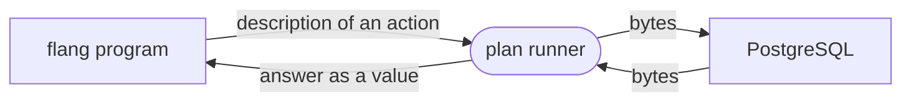

# Databases

Two drivers ship with the language: PostgreSQL over the wire, and SQLite as a
file — read, and now written into as well. Both are written in flang itself;
both are checked by examples with no database present.

## Who carries the bytes

A flang program opens no sockets and no files. It returns a **plan** — a
description of an action: "open a connection there", "send these bytes", "read
the answer". The description is carried out by whoever ran the plan.



That is why building messages and parsing answers stay ordinary total
functions, and why `flang check` needs no server.

## PostgreSQL: connect and query

| file | what is in it | lines | functions | examples |
| --- | --- | ---: | ---: | ---: |
| `flang/stdlib/wire.flang` | octets, network-order integers, NUL-terminated strings, cutting a stream | {{провод.строк}} | {{провод.функций}} | {{провод.примеров}} |
| `flang/stdlib/postgres.flang` | protocol version 3.0: client messages built, server answers parsed | {{база.строк}} | {{база.функций}} | {{база.примеров}} |
| `examples/db/postgres-plan.flang` | the whole five-step conversation | {{план.строк}} | | {{план.примеров}} |

A simple query is built like this — taken from the tree verbatim:

@@пример:simple-query@@

Checking and examples need no database:

```bash
$ flang check flang/stdlib/postgres.flang
$ flang test flang/stdlib/postgres.flang
```

The conversation itself does need a live server:

```bash
$ flang io examples/db/postgres-plan.flang | python3 -c \
    "import sys,json; print(json.load(sys.stdin)['result'])"
1 пуск: | | | in_hot_standby=off … server_version=17.10 server_encoding=UTF8
2 создание: INSERT 0 1| | |
3 вставка с параметрами: INSERT 0 1| | |
4 выборка: SELECT 2| | 1	Мир ; 2	dva|
5 отказ: | ERROR 42703 column "netakoykolonki" does not exist| |
```

Five steps: start-up with a cleartext password, create, insert with parameters
(`$1`, `$2`), select, and a deliberately wrong query answered with the server's
own code. Cyrillic travels in both directions. Without the pipe the command
prints one JSON object: `result` is the report above, `log` is every order and
every answer in full.

The plan connects to `127.0.0.1:55434` as user `flang`, database `postgres`.
Address, port, user and password stand in the plan as literals: a plan takes no
arguments, and a program does not see the environment. Change them by editing
the functions at the top of the plan.

### PostgreSQL: what works and what does not

| | |
| --- | --- |
| `trust` and cleartext password | works |
| `md5`, `scram-sha-256` | no: HMAC and PBKDF2 are not in the library. The plan keeps reading and waits |
| TLS | no. The conversation runs in the clear — for a database on the same machine |
| column types in `RowDescription` | only the number of columns is taken out. Pass the type number of a column yourself |
| a null value | not parsed: its length is minus one, and parsing asks for 4 294 967 295 octets |
| length of a message you send | the four octets of the length must all be below 128; a query is padded with spaces, 200 in reserve. A parameter value is at most 127 bytes |
| one parsing pass | at most 1000 messages |
| a corrupt stream | stops the parse with a distinct answer, not silently |

## SQLite: read and write a file

`flang/stdlib/sqlite.flang` reads an SQLite 3 database as a list of octets: the
file image comes in through one order, `Прочитать октеты из файла`. No server,
nothing on the wire.

Make a sample database with someone else's `sqlite3` and read it back:

```bash
$ python3 -c "import sqlite3,os; d='/srv/tmp/sqlite-obrazec'; os.makedirs(d,exist_ok=True); \
  c=sqlite3.connect(d+'/proba.db'); c.execute('create table люди(имя text, лет integer)'); \
  c.executemany('insert into люди values (?,?)',[('Аня',31),('Боря',44),('Вера',7)]); c.commit()"

$ flang io examples/db/sqlite-read.flang | python3 -c \
    "import sys,json; print(json.load(sys.stdin)['result'])"
магия SQLite: да
размер страницы: 4096
страниц: 2
октетов в файле: 8192
таблицы: люди
корень таблицы люди: 2
SQL: CREATE TABLE люди(имя text, лет integer)
строк: 3
1 | Аня | 31
2 | Боря | 44
3 | Вера | 7
```

The plan is `examples/db/sqlite-read.flang`; the path to the file and
the name of the table stand in it as two one-line functions — `«Откуда»` and
`«Какая таблица»`.

### SQLite: what works and what does not

| | |
| --- | --- |
| the header | magic, page size, number of pages |
| the schema page `sqlite_master` | table names, their root pages, their SQL |
| a table b-tree leaf | cell pointers, payload length, row number, the payload |
| internal b-tree pages (page kind 5) | read: a table larger than one page is walked level by level, root to leaves |
| cell overflow | read: a payload too big for one page is followed through its chain of overflow pages |
| a record | null, integers of all six widths, the 0 and 1 of serial types 8 and 9, text through UTF-8, binary |
| real numbers (serial type 7) | read whole, in variant «Дробное»; not written back — there is no inverse into sign, exponent and mantissa |
| building a file from scratch | `«Собрать база»` — a whole image, header through leaves, checked by reading its own output back |
| inserting a row into an existing file | `«База со строкой»` (`examples/db/sqlite-insert.flang`, checked against real `sqlite3`): into a ready leaf's free middle, file length unchanged, row number one past the last. A page split, an out-of-order insertion, a row needing an overflow page, an edit, a delete, a journal — every one of those is refused as empty, not a corrupt file |
| indexes (page kinds 2 and 10) | no: they are not table rows |

## Where to go next

- [Processes, supervision, distribution](processes.html) — who holds the
  connection while work is going on.
- [Embedding flang](embedding.html) — how the driver gets into a program in
  your language.
