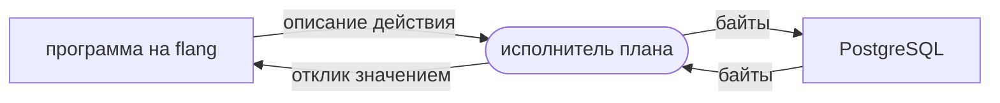

# Базы данных

Отсюда вы узнаете, как программа на flang разговаривает с PostgreSQL: чем
собирается запрос, кто носит байты, что уже написано в библиотеке и до какой
черты это доведено. К концу страницы вы сможете прочитать готовый разговор из
пяти шагов, дописать свой запрос и заранее знать, на чём он споткнётся.

## Кто с кем разговаривает

Программа на flang не открывает сокетов. У неё есть аргументы и результат — и
всё; ни файла, ни сети она не видит по устройству языка, и именно поэтому её
функции остаются тотальными и проверяются примерами без базы.

Разговор ведёт **план**. План — это функция, которая возвращает не действие, а
его *описание*: «открой соединение туда-то», «отправь эти байты», «прочитай
ответ». Описание исполняет тот, кто план запустил. Программа решает, исполнитель
делает.



Отсюда две вещи, которые стоит держать в голове с самого начала. Первая: весь
протокол — сборка сообщений и разбор ответов — это обычные тотальные функции, и
они проверены примерами, для которых базы не нужно. Вторая: всё, что зависит от
настоящего провода, проверяется только прогоном, и граница между этими
половинами проведена ниже явно.

## Что уже написано

Разговор с PostgreSQL живёт в двух файлах.

| файл | что там | строк | функций | примеров |
| --- | --- | ---: | ---: | ---: |
| `flang/stdlib/provod.flang` | общая половина: октет, целое в сетевом порядке, строка с нулём, резка потока | {{провод.строк}} | {{провод.функций}} | {{провод.примеров}} |
| `flang/stdlib/postgres.flang` | протокол версии 3.0: сборка сообщений клиента, разбор ответов сервера | {{база.строк}} | {{база.функций}} | {{база.примеров}} |
| `flang/examples/db/postgres-plan.flang` | разговор из пяти шагов целиком | {{план.строк}} | | {{план.примеров}} |

Все {{база.тотальных}} функции модуля — тотальные: завершение каждой доказано
компилятором, а не обещано.

Файлов в библиотеке два, а не один, и это ответ на вопрос «а как с другими
базами». В `provod.flang` — {{провод.функций}} функций, которые не знают ни про
PostgreSQL, ни про базы данных вообще: октет, целое в сетевом порядке, строка с
нулём на конце, резка потока на куски. Второй драйвер возьмёт их как есть.

В `postgres.flang` осталось {{база.функций}}. Из них про сам протокол
PostgreSQL — метки сообщений, номер версии, номера типов колонок — 39; остальные
13 про вид ОТВЕТА (строки, отказ, метка итога) и годятся любой базе, но вынуты
не будут, пока рядом не встанет второй драйвер: обобщать по одному примеру
дороже, чем подождать второго.

Пять шагов плана — это то, ради чего пишут драйвер: пуск и вход, создание
таблицы, вставка с параметрами (`$1`, `$2`), выборка, отказ на заведомо неверном
запросе. Каждый шаг кончается сообщением «готов», и по нему план узнаёт, что
ответ дочитан.

Так выглядит сборка простого запроса — взято из дерева, знак в знак:

@@пример:простой-запрос@@

## Как это прогнать

Проверка и примеры базы не требуют вовсе:

```bash
flang check flang/stdlib/postgres.flang
flang test flang/stdlib/postgres.flang
```

Сам разговор — отдельная команда, и ей нужна работающая база:

```bash
flang io flang/examples/db/postgres-plan.flang
```

План приходит на `127.0.0.1:55434`, пользователем `flang`, в базу `postgres`.
Адрес, порт, имя и пароль стоят в плане литералами: у плана нет аргументов, и
окружения программа не видит.

Так он отвечает на живом PostgreSQL 17.10 — прогон 21 августа 2026, код
возврата 0:

```
1 пуск:                  server_version=17.10, client_encoding=UTF8,
                         session_authorization=flang …
2 создание:              INSERT 0 1
3 вставка с параметрами: INSERT 0 1
4 выборка:               SELECT 2 — строки «1  Мир» и «2  dva»
5 отказ:                 ERROR 42703 column "netakoykolonki" does not exist
```

Пятый шаг здесь не менее важен четвёртого: отказ сервера приезжает разобранным —
код `42703` и текст, — а не обрывом соединения.

## Границы — названы поимённо

Ни одна из них не догадка: каждая следует из устройства и видна на прогоне.

**Вход только `trust` и пароль открытым текстом.** `md5` и `scram-sha-256`
требуют HMAC, а в библиотеке его нет: есть `sha256`, а `scram` просит сверх того
ещё и PBKDF2. Четыре сырых октета соли `md5` теперь доезжают целыми — на текстовой
трубе они не доезжали ни разу из пяти, — но считать подпись всё равно нечем.
Запрос, которого план не понимает, сегодня не отвергается: план продолжает
читать и ждёт.

**Шифрования нет.** Разговор идёт открытым текстом; TLS ни собрать, ни разобрать
нечем. Это годится для базы на той же машине и не годится больше ни для чего.

**Типов колонок у программы нет.** Описание строк (`RowDescription`) теперь
доезжает целым, но разбор берёт из него только число колонок. Следствие: номер
типа колонки называет тот, кто знает схему, — он передаётся аргументом. Типа
«Колонка» в модуле нет: заводить тип, которого никто не может построить, значит
обещать умение, которого нет. Выборка при этом идёт расширенным запросом по
другой причине — он единственный отправляет значения параметрами.

**Пустое значение (NULL) не разбирается.** Его длина — минус единица, то есть
4 294 967 295 октетов, и разбор просит столько и кончается.

**Длина сообщения ограничена.** Сообщение, которое шлёт программа, обязано иметь
длину, все четыре октета которой меньше 128; запрос при нужде досыпается
пробелами, запас — 200. Значение параметра — не длиннее 127 байтов. Разбор за
один заход берёт не больше 1000 сообщений.

**Порча узнаётся, а не проглатывается.** Элемент потока, не являющийся октетом,
останавливает разбор отдельным ответом, а не досчитывается по модулю.

## Разговор идёт по настоящему проводу

Протокол PostgreSQL начинается с нулевого октета: это старший байт
четырёхбайтовой длины первого сообщения. Поручение, возящее ТЕКСТ, на этом и
кончалось бы — текст обрывается на нулевом знаке, и записать удалось бы ноль
байтов.

Поэтому у соединения есть пара поручений, работающих не со знаками, а с
октетами: `Ответить октетами в соединение` и `Прочитать октеты из соединения`.
В отчёте прогона они видны прямо, и число записанных байтов в нём настоящее:

```json
{"поручение":{"variant":"Ответить октетами в соединение",
              "fields":{"соединение":1,
                        "октеты":[0,0,0,38,0,3,0,0,117,115,101,114,0,…]}},
 "отклик":{"variant":"Записано","fields":{"сколько":38}}}
```

Тридцать восемь октетов пакета пуска записаны, ответ прочитан теми же октетами.
Весь разговор — четырнадцать поручений, и каждое видно в отчёте целиком: что
ушло, что пришло, сколько байтов. Пароль при этом уходит открытым текстом — см.
границы выше.

Проверено и без базы: сборка каждого сообщения и разбор каждого ответа —
{{база.примеров}} примеров модуля и {{план.примеров}} примеров плана, которые
прогоняются при каждой проверке файла и работающего PostgreSQL не требуют.

## Куда дальше

- [Процессы, надзор, распределённость](processes.html) — вторая половина
  разговора с миром: кто держит соединение, пока идёт работа.
- [Что доказано, а что нет](what-is-proved.html) — где здесь доказательство, а
  где прогон.
- [Как учить язык дальше](learning.html) — место этой страницы в общей дороге.
