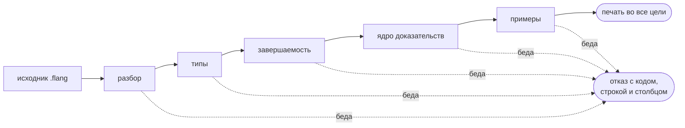

# Первая программа

Пять минут: написать функцию, проверить её, запустить, посмотреть отчёт о
доказательствах и напечатать программу в C. Нужен установленный `flang` —
[как его поставить](install.html).

## Написать

Положите в файл `hello.flang`:

```
модуль «Привет»

тотальная функция «Удвоить»
  принимает н: число
  возвращает число
  обеспечивает «удвоенное не меньше исходного» результат не меньше н
  пример «дважды два»
    дано н равно 2
    ожидается 4
  н плюс н
```

Пять частей, и каждая делает свою работу:

- `тотальная` — обещание, что функция завершается на любом входе. Компилятор его
  **проверяет** и откажется собирать файл, если доказать не сможет;
- `принимает` / `возвращает` — типы, проверяются до запуска;
- `обеспечивает` — постусловие: что верно про результат. Имя в ёлочках
  обязательно: по нему утверждение находят в отчёте о доказательствах;
- `пример` — исполняемый пример. Он часть программы, а не тест сбоку, и
  прогоняется при КАЖДОЙ проверке: не сошёлся — `check` отвечает `FLANG_EXAMPLE`
  и ненулевым кодом, и печатать такую программу компилятор отказывается;
- последняя строка — тело.

## Проверить

```bash
flang check hello.flang
```

```
модуль «Привет»: функций 1, из них с доказанным завершением 1; типов 0
hello.flang: проверено — разбор, типы, завершаемость, ядро и примеры; замечаний нет
```

Код возврата 0. Если бы завершение доказать не удалось, был бы код 1 и
замечание с кодом, строкой и столбцом.

За одним словом `check` стоит шесть работ подряд, и остановка на любой из них
означает, что печати не будет: непроверенное не печатается.



## Прогнать примеры

```bash
flang test hello.flang
```

```
hello.flang: примеров 1, прошло 1, не прошло 0
```

## Запустить

```bash
flang run hello.flang --function Удвоить --args '{"н": 21}'
```

```
42
```

Имя функции здесь **без ёлочек**: в объявлении они часть записи, в командной
строке — уже нет.

`--args` берёт JSON-объект: ключ — имя параметра, как оно написано в
`принимает`. Двоичный читает в нём **только плоский объект скаляров** — число,
строку, `true`, `false`, `null`. Список и запись он не разбирает; как их
передать — [Операции языка](operations.html), раздел про `--args`.

## Оболочка

Голая команда открывает оболочку — как `iex` у Elixir, как `python`:

```bash
flang
```

```
flang {{выпуск.версия}} — оболочка. «.помощь» — команды, «.выход» или Ctrl-D — конец.
Объявление заканчивается пустой строкой, выражение вычисляется сразу.
» 2 плюс 2
4
```

То же самое по имени — `flang repl`, и так же загружается файл в сессию:

```bash
flang repl hello.flang
```

```
объявлено: тотальная функция «Удвоить» — завершение доказано
загружено из hello.flang
```

Дальше вводятся выражения языка, и ответ печатается сразу:

```
«Удвоить» от 21
42
```

Выход — `.выход` или Ctrl-D. Здесь ёлочки нужны: это уже текст на языке, а не
аргумент команды.

Сценарий подаётся той же оболочкой, названной по имени: `flang repl < сценарий.flang`.
Приглашений тогда нет, диагностика уходит в поток ошибок, а ненулевой код
возврата означает, что диагностика была. Голая `flang` с конвейера ведёт себя
иначе — она ждёт запрос в JSON и отвечает
`{"ok":false,"code":"CLI","message":"ожидался объект запроса"}`.

## Что говорит отчёт о доказательствах

```bash
flang check hello.flang --proof
```

Ядро пробует **доказать** постусловие — показать, что оно верно на всех входах,
а не только на двойке из примера. Про эту программу оно отвечает так:

```
постусловие «удвоенное не меньше исходного» функции «Удвоить» —
сетка 1 значение (примеры функции): нарушений НЕ ИСКАЛИ — прогона примеров
не было, посчитано только их число. Это не доказательство — теоремы при
утверждении нет
```

Три слова этого отчёта не взаимозаменяемы:

| слово | что значит |
| --- | --- |
| доказано | верно обо **всех** входах |
| сетка N | посчитано на N значениях автора; **это не доказательство** |
| объявлено, не доказано | ядру не хватило правил; утверждение считается во время работы |

Как довести утверждение до «доказано» — в [учебнике](tutorial.html), глава про
теоремы.

## Напечатать в C

```bash
flang emit hello.flang --target c --out ./вывод
make -C ./вывод
```

Печать даёт **6 файлов**; `make` собирает их за 0,6 с тем же `cc`, без единого
предупреждения при `-Wall -Wextra -Werror -pedantic`. Каталог вывода `emit`
заводит сам, если его нет.

При печати двоичный сам предупреждает о своей границе: таблицы объявленных типов
у него нет, поэтому напечатанная программа аргументы объявленным типам не
сверяет. Сам `flang run` при этом сверяет: `Факториал` объявлен на типе `нат`, и
на −3 отвечает `FLANG_TYPE: … -3 вне нат` с кодом 1.

## Границы двоичного

Команд у двоичного десять — `check`, `test`, `run`, `emit`, `ast`, `facts`,
`io`, `lock`, `package`, `repl`, — и печатает он во все {{цели.изСловом}}.
Границы у него всё-таки есть, и хорошо в них то, что двоичный называет их сам,
а не молчит:

- **отчёт не ищет нарушений по примерам** — он пишет «нарушений НЕ ИСКАЛИ» там,
  где полный компилятор из репозитория пишет «нарушений не найдено (искали
  прогоном)»;
- **законов на сетке двоичный не считает** — моноид, монада, изоморфизм,
  категория, множества и пять объявленных свойств считаются вычислением, и этого
  слоя в нём нет. Программа с таким объявлением получает отказ с названным
  препятствием, а не зелёный отчёт с пустым разделом;
- **`--args` берёт только плоский объект скаляров** — `[…]` и `{…}` двоичный не
  разбирает вовсе и отвечает `flang run: «--args» разобрать не удалось — ждался
  плоский объект скаляров, вроде '{"н":10}'` с кодом 2. Компилятор из репозитория берёт
  список и запись обычным JSON; двоичному составное значение передают оболочкой
  (`flang repl`). Оба способа с прогонами — на странице
  [Операции языка](operations.html).

На разрешённых входах установленный файл и компилятор из репозитория отвечают
одинаково: `Факториал(12) =
479001600`, `Фибоначчи(20) = 6765`, `Палиндром("шалаш") = true`.

## Что дальше

- [Учебник](tutorial.html) — от первой функции до утверждения, доказанного ядром
- [Операции языка](operations.html) — что чем делается: списки, строки, числа
- [Доказательства: зачем и как](proofs.html) — три ответа ядра и ноль аксиом

### Печать в остальные цели

Печатается программа во все {{цели.изСловом}} целей одной и той же командой —
например, в Rust:

```bash
flang emit hello.flang --target rust --out ./вывод-rust
```

Ответ: «напечатано файлов 7, байт 128 859». Рядом с напечатанным лежат `Makefile`
и `Cargo.toml`: собирается это `cargo build`, и получившийся `flang_cli` зовёт
ту же функцию.

Печать говорит и о том, чего не сделала, — молчания здесь нет: примеры при
печати **не прогоняются** (их считает вычислитель на самом языке, и на самых
больших программах он не укладывается в предел шагов), а типы аргументов
напечатанной программы двоичный компилятор не проверяет. Первое лечится
командой `flang test`, второе — граница, названная в
[Известных ограничениях](limits.html).
