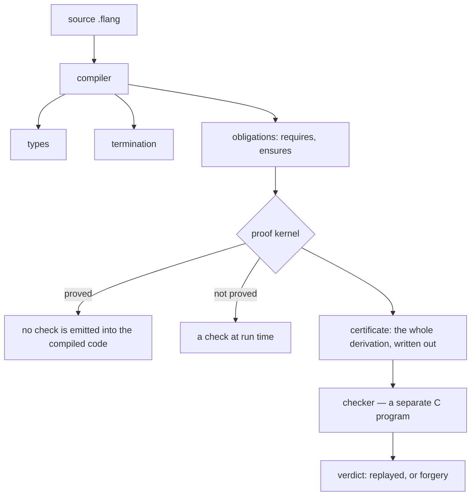
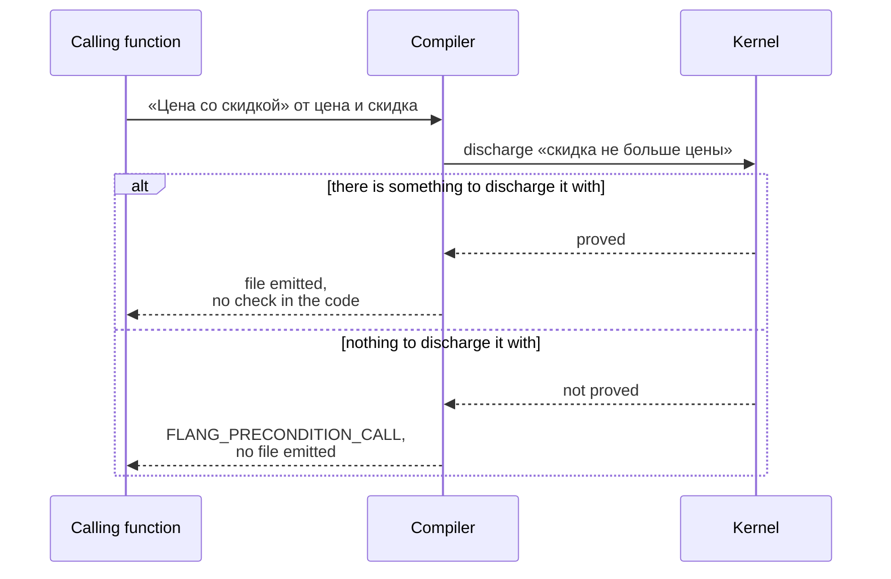

# How a proof actually works

The flang compiler discharges three promises before it will build a file:

| Promise | Keyword | What it means |
| --- | --- | --- |
| the function terminates on every input | `тотальная` (total) | there is no input it loops on |
| the call is legal | `требует` (requires) | checked **at the call site**, not inside the function |
| the result is what you said | `обеспечивает` (ensures) | a statement about **all** inputs, not about the examples you wrote |

Below is how each of the three is discharged, what stays in the compiled code,
and what disappears from it. Every output block was captured from actual runs of
`flang 0.7.20` (built from trunk, 19 September 2026); the command sits next to
the output, and any block reproduces in under a minute.

## Who checks what



The proof kernel is part of the compiler. The checker
(`flang/proof/чекер/сверщик.c`) is a **separate program** that does not take the
compiler's word for anything: it reads the certificate and replays every
inference step from scratch. That separation is why "proved" here means more
than "the compiler said so".

## 1. Termination

### Structural descent

The recursion walks a **part of the input value**, and the part is smaller than
the whole every time.

```flang
модуль «Спуск»

тотальная функция «Сумма списка»
  принимает ряд: список числа
  возвращает число
  разбор ряд
    случай пусто
      то 0
    случай голова первый и хвост остальные
      первый плюс («Сумма списка» от остальные)
```

The recursive call takes `остальные` — the tail of the destructured list. Lists
are finite, the chain of tails ends by itself, and there is nothing left to
prove:

```
$ flang check --proof spusk.flang
  «Сумма списка»  доказано структурой: аргумент 1 («ряд») на каждом витке
  становится частью себя; цепочка частей конечного дерева обрывается сама,
  сторожа нет
```

The last two words of that report are the point. When a proof does not close,
the compiler writes a check into the compiled program that catches the
difference at run time. Here there is nothing to catch: walking a finite tree
ends by itself, so no check goes into the code.

### Descending on a number: the type decides whether a check remains

The same shape, but the descent is on a number rather than on part of a value:

```flang
тотальная функция «Обратный отсчёт»
  принимает н: число
  возвращает число
  если н не больше 0
    то 0
    иначе 1 плюс («Обратный отсчёт» от (н минус 1))
```

```
$ flang check --proof bez-mery.flang
  «Обратный отсчёт»  доказано постоянным шагом: аргумент 1 («н») убывает на
  постоянный шаг и ограничен снизу; на IEEE-754 шаг не всегда меняет число,
  поэтому сторож, 1 место
  сторожей в рантайме: 1 место
```

The reason for the guard is stated outright: `число` is binary64, and above 2⁵³
subtracting one **does not change the number**. The descent stalls and the
function loops. The compiler knows this and emits a check.

Change one word — the parameter's type:

```flang
  принимает н: неотрицательное
```

```
$ flang check --proof tochnyy.flang
  «Обратный отсчёт»  доказано точным шагом: аргумент 1 («н») объявлен
  натуральным и убывает на 1; дно и потолок даёт тип, внутри потолка шаг точен
  — сторожа нет
  сторожей в рантайме: 0 мест
```

`неотрицательное` is the interval [0, 2⁵³−1]. Inside it the step is exact and
the bottom exists, so the descent is finite. The check left the compiled code.
**A declared type is cheaper than a run-time check — and that is measured, not
asserted.**

### A declared measure

When what shrinks is not an argument itself but something computed from the
arguments, you say so with `убывает` ("decreases"). From the standard library
(`flang/stdlib/bignum.flang:383`):

```flang
  убывает (длина первые) плюс (длина вторые)
```

The compiler checks two things: that the named expression is strictly smaller on
every turn, and that it has a floor. A decreasing quantity with a floor does not
decrease forever.

### When it does not prove

```flang
тотальная функция «До нуля»
  принимает н: число
  возвращает число
  если н равен 0
    то 0
    иначе «До нуля» от (н плюс 1)
```

```
$ flang check rastyot.flang; echo "exit $?"
FLANG_NOT_TOTAL … строка 8, столбец 11: тотальная функция «До нуля»:
рекурсивный вызов «До нуля» не убывает — аргумент 1 («н» add 1) увеличивает
параметр «н». Передавайте часть аргумента …
rastyot.flang: не проверено — замечаний 1
exit 1
```

The file is not built. Not a warning, not a lint — a refusal with exit code 1.

## 2. A precondition is discharged at the call site

```flang
тотальная функция «Цена со скидкой»
  принимает цена: неотрицательное, скидка: неотрицательное
  требует «скидка не больше цены» скидка не больше цена
  возвращает число
  цена минус скидка
```

Now a call with an argument that plainly violates it:

```flang
тотальная функция «Счёт»
  возвращает число
  «Цена со скидкой» от 100 и 150
```

```
$ flang check zakaz.flang; echo "exit $?"
FLANG_PRECONDITION_CALL … строка 16, столбец 3: вызов «Цена со скидкой» в
функции «Счёт» не снимает предусловие «скидка не больше цены»
zakaz.flang: не проверено — замечаний 1
exit 1
```



The difference from `assert` in Python or Java: an assert fires at a user's
machine, six months after release, on an input nobody expected. Here the call is
settled **in the compiler**, and it is the caller's job to discharge the
precondition — with its own `требует`, with a declared argument type, or with a
proved promise of whatever computed that argument. Ada/SPARK gives the same
discipline; the difference is that here it is in the language rather than in a
separate tool layered on top.

Exactly one run-time check survives, at the **boundary** where foreign data
enters the program. This is what C emission produces for that function:

```c
if (strcmp(name, "Цена со скидкой") == 0) {
  FL_TRY(fl_pre(ctx, fl_flag(args[1].as.number <= args[0].as.number),
                "скидка не больше цены", "Цена со скидкой", &fl_t1, error));
  if (!fl_t1) return fl_fail(ctx, error, "FLANG_PRECONDITION", ...);
```

That is call-by-name dispatch — entry from JSON, from the command line, from
another program. Inside the program itself there is no such check anywhere:
every internal call was settled by the compiler.

## 3. A postcondition: "proved" means "not in the compiled code"

Take the same function **without** `требует`, and with a promise:

```flang
тотальная функция «Цена со скидкой»
  принимает цена: неотрицательное, скидка: неотрицательное
  возвращает число
  обеспечивает «в минус не уходим» результат не меньше 0
  пример «Сто минус десять»
    дано цена равно 100
    дано скидка равно 10
    ожидается 90
  цена минус скидка
```

The promise is **false** — a discount can exceed the price. The kernel says so:

```
$ flang check --proof skidka.flang
  постусловие «в минус не уходим» … — сетка 1 значение (примеры функции):
  … Это не доказательство — теоремы при утверждении нет
  утверждений 1: доказано 0, сетка 1, объявлено, не доказано 0
```

Since 0.7.21 running that takes explicit consent:

```
$ flang run skidka.flang --function 'Цена со скидкой' --args '{"цена": 100, "скидка": 150}'
не доказано: утверждений 1: доказано 0, сетка 1, на веру 0 — запуск только по
явному согласию: --на-веру
exit 3
```

And in emitted C the promise becomes a check before the return:

```c
fl_status skidka_cena_so_skidkoy(fl_ctx *ctx, fl_value cena, fl_value skidka,
                                 fl_value *result, fl_error *error) {
  if (cena.tag != FL_NUMBER || skidka.tag != FL_NUMBER) FL_TRY(fl_not_numbers(...));
  const fl_value fl_t1 = fl_number(cena.as.number - skidka.as.number);
  /* постусловие «в минус не уходим» */
  bool fl_t2 = false;
  FL_TRY(fl_post(ctx, fl_flag(fl_t1.as.number >= 0.0), "в минус не уходим",
                 "Цена со скидкой", &fl_t2, error));
  if (!fl_t2) return fl_fail(ctx, error, "FLANG_PROPERTY", "%s",
      "нарушено свойство «в минус не уходим» функции «Цена со скидкой»");
  *result = fl_t1;
  return FL_OK;
}
```

Now add **one line** — the precondition:

```flang
  требует «скидка не больше цены» скидка не больше цена
```

```
$ flang check --proof skidka-trebuet.flang
  постусловие «в минус не уходим» … — доказано по объявленным типам аргументов:
  цель сведена правилом «неотрицательность по построению» — утверждение обо
  ВСЕХ входах, а не о написанных; теоремы при нём нет и не нужно
  утверждений 1: доказано 1 (из них без теоремы 1, объявленным типом 1), сетка 0
```

And the whole function, in emitted C:

```c
fl_status skidka_s_usloviem_cena_so_skidkoy(fl_ctx *ctx, fl_value cena, fl_value skidka,
                                            fl_value *result, fl_error *error) {
  if (cena.tag != FL_NUMBER || skidka.tag != FL_NUMBER) FL_TRY(fl_not_numbers(...));
  *result = fl_number(cena.as.number - skidka.as.number);
  return FL_OK;
}
```

No check. Not switched off by a flag — **there is nothing to emit**: the
statement is closed for all inputs, so there is nothing left to test at run time.

That is the practical difference from contracts in Eiffel, in Java's JML, or a
Python `assert`: there the contract is always in the code and always costs time.
Here a proved contract leaves the code and an unproved one stays — and the
report tells you out loud which of the two you have.

## 4. The grid: what it is, and what good it is if it is not a proof

A **grid** (`сетка`) is a statement checked over a finite set of values: the
values in `пример`, the values of a declared law. The report prints it as "сетка
N значений" and ends the line with "Это не доказательство" — "this is not a
proof" — deliberately.

What the grid buys you:

* **it catches a false promise on the inputs you did write.** A promise that
  breaks on its own example never reaches the kernel at all;
* **it keeps the boundary visible.** A statement on the grid is never counted as
  proved in any line of the report, and the verdict tallies the two separately;
* **it is cheap.** Running examples takes seconds; proving a module takes minutes.

What it does not buy you: anything about inputs that were not in the set.
Enumerating a finite set of values is a test written in a different place, not a
proof.

## 5. What it adds up to on a real module

The list module of the standard library, `flang/stdlib/lists.flang`:

```
$ flang check --proof flang/stdlib/lists.flang
  функций 38: тотальных 38, обычных 0
  обещание несёт: композиция 28, структура 8, точный шаг 1, постоянный шаг 1,
                  объявленная мера 0
  сторожей в рантайме: 1 место
  утверждений 66: доказано 42 (из них индукцией 5) (из них без теоремы 37),
                  сетка 24, объявлено, не доказано 0
```

Reading that:

* 38 functions, all 38 with proved termination: 28 simply have no recursion, 8
  by structural descent, one by exact step, one by constant step (the single
  guard in the module);
* 66 promises about results. **42 are closed for all inputs**, and 37 of those
  without a single written line of proof — the kernel discharged them from
  declared types and shapes. Five needed induction;
* 24 stayed on the grid.

The same module in emitted C:

```
$ flang emit flang/stdlib/lists.flang --target c --out /tmp/out
$ grep -c 'fl_post(' /tmp/out/lists.c
25
```

25 run-time checks = 24 unproved postconditions + 1 termination guard. **42
checks that in Python or Go you would either hand-write or simply not have are
absent from the compiled program — because they were proved.**

## 6. What this does not mean

* **`число` is binary64.** Proofs about it hold in IEEE-754 arithmetic, not in
  integer arithmetic. Where that matters, the type is written out:
  `неотрицательное`, `сотых`, `тысячных`.
* **The kernel does not accept every statement.** What it does accept, and which
  shapes it refuses: [what the kernel accepts](what-the-kernel-accepts.html) and
  [the kernel refused — whose bug is it](proof-refused.html).
* **The trusted base is not empty.** The C checker, the C compiler and the
  runtime are taken on trust. What covers what: [what is proved and what is
  not](what-is-proved.html).
* **A grid is not a proof,** and the verdict counts it as its own number.

## Reproducing this

```bash
flang check <file>                        # types, termination, kernel; exit 1 on refusal
flang check --proof <file>                # report: what carries each promise
flang check --proof --строго <file>       # the same, but the base must be judged too
flang check --proof --записать <file>     # certificate to a file, for the checker
flang emit <file> --target c --out <dir>  # see which checks survived
flang test <file>                         # run the examples
```

Why any of this exists at all: [proofs — why and how](proofs.html). The
proof report over the whole tree is published in Russian only, at
[overview.html](../overview.html).
