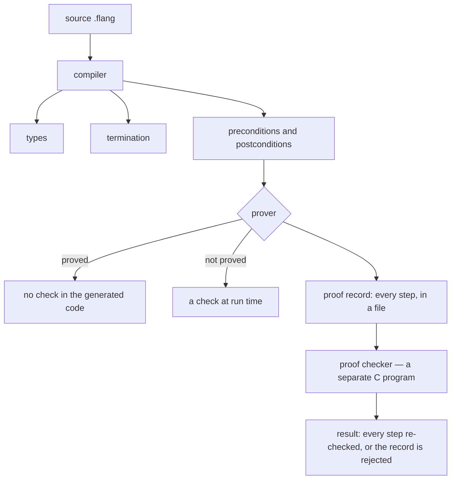
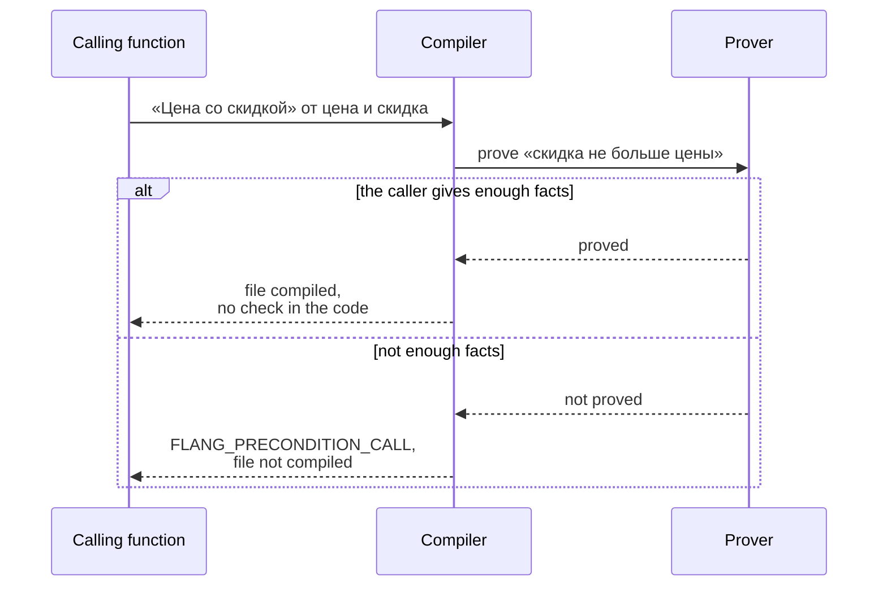

# How a proof works
<!-- замер: версия 0.7.23 · дерево 47f34686a · сверено 2026-10-01 -->

Before the flang compiler accepts a file, it checks three kinds of statements:

| You write | Usual term | What it means | Where it is checked |
| --- | --- | --- | --- |
| `тотальная` (total) | termination | the function stops on every input | in the function itself |
| `требует` (requires) | precondition | what must hold on input | **at every call site**, not inside the function |
| `обеспечивает` (ensures) | postcondition | what the function guarantees on output | for **all** inputs, not only for your examples |

This page shows, on small files, how each of the three is checked, what the
compiler prints, and how the generated code changes once something is proved.
Every output block comes from `flang {{выпуск.версия}}`; the command is next to
the output, and each block takes under a minute to reproduce. Long lines of
output are wrapped, and `…` marks a cut.

Words of the compiler output used below:

| The output says | What it means |
| --- | --- |
| «ядро» | the prover: the part of the compiler that proves postconditions |
| «доказано» | proved for all inputs |
| «сетка N» | checked only on N values (your examples), not proved |
| «объявлено, не доказано» | there is neither a proof nor an example |
| `сторож`, `сторожей в рантайме: N мест` | a check the compiler adds to the generated code; N places |
| «обещание» | one of the three statements above |

## Who checks what


```mermaid From source to result
flowchart TD
  A[source .flang] --> B[compiler]
  B --> C[types]
  B --> D[termination]
  B --> E[preconditions and postconditions]
  E --> F{prover}
  F -->|proved| G[no check in the generated code]
  F -->|not proved| H[a check at run time]
  F --> I[proof record: every step, in a file]
  I --> J[proof checker — a separate C program]
  J --> K[result: every step re-checked, or the record is rejected]
  class F glavnoe
  class G vyvod
  class H otkaz
```

The prover is part of the compiler. The proof checker
(`flang/proof/checker/checker.c`) is a **separate program** that does not trust
the compiler: it reads the proof record and re-checks every step from scratch.
So "proved" means that two independent programs agree, not only that the
compiler said so.

## 1. Termination

There are three ways to make the compiler prove that a recursive function
stops. Pick the first one that fits.

### Recurse on a part of the input

The recursive call gets a **part of the input value**: the tail of a list, a
field of a variant. A part is always smaller than the whole.

```flang
модуль «Спуск»

тотальная функция «Сумма списка»
  принимает ряд: список числа
  возвращает число
  разбор ряд
    случай пусто
      то 0
    случай голова первый и хвост остальные
      первый плюс («Сумма списка» от остальные)
```

The recursive call takes `остальные`, the tail of the list. Lists are finite, so
the chain of tails ends. The compiler proves this and adds no check to the
generated code (the report ends with `сторожа нет`, "no check"):

```
$ flang check --proof spusk.flang
  «Сумма списка»  доказано структурой: аргумент 1 («ряд») на каждом витке
  становится частью себя; цепочка частей конечного дерева обрывается сама,
  сторожа нет
```

### Recurse on a number: the type decides whether a check stays

The same shape, but the recursion counts a number down:

```flang
тотальная функция «Обратный отсчёт»
  принимает н: число
  возвращает число
  если н не больше 0
    то 0
    иначе 1 плюс («Обратный отсчёт» от (н минус 1))
```

```
$ flang check --proof bez-mery.flang
  «Обратный отсчёт»  доказано постоянным шагом: аргумент 1 («н») убывает на
  постоянный шаг и ограничен снизу; на IEEE-754 шаг не всегда меняет число,
  поэтому сторож, 1 место
  сторожей в рантайме: 1 место
```

The output says why a check is needed: `число` is a binary64 float, and above
2⁵³ subtracting one **does not change the number**. The recursion would never
reach zero, so the compiler adds a run-time check in one place.

Change one word, the type of the parameter:

```flang
  принимает н: неотрицательное
```

```
$ flang check --proof tochnyy.flang
  «Обратный отсчёт»  доказано точным шагом: аргумент 1 («н») объявлен
  натуральным и убывает на 1; дно и потолок даёт тип, внутри потолка шаг точен
  — сторожа нет
  сторожей в рантайме: 0 мест
```

`неотрицательное` (non-negative) is the range [0, 2⁵³−1]. Inside it subtracting
one is exact and there is a bottom, so the recursion ends. The run-time check is
gone. **If a number counts down, declare it `неотрицательное`: the check
disappears from the generated code.**

### Declare what decreases

When it is not an argument that gets smaller but something computed from the
arguments, write it in a `убывает` (decreases) line. From the standard library
(`flang/stdlib/bignum.flang:383`):

```flang
  убывает (длина первые) плюс (длина вторые)
```

The compiler checks that this expression gets strictly smaller on every
recursive call and that it has a lower bound.

### When the compiler cannot prove it

```flang
тотальная функция «До нуля»
  принимает н: число
  возвращает число
  если н равен 0
    то 0
    иначе «До нуля» от (н плюс 1)
```

```
$ flang check rastyot.flang; echo "exit $?"
модуль «Растёт»: функций 1, из них с доказанным завершением 0; типов 0
без доказанного завершения: «До нуля»
FLANG_NOT_TOTAL в файле rastyot.flang, строка 8, столбец 11: тотальная функция
«До нуля»: рекурсивный вызов «До нуля» не убывает — аргумент 1 («н» add 1)
увеличивает параметр «н». Передавайте часть аргумента …
rastyot.flang: не проверено — замечаний 1
exit 1
```

This is an error, not a warning: exit code 1, and the file is not compiled.
The message tells you what to do: pass a part of the argument (the tail from
`голова и хвост`, a field of a variant or a record). If the function really may
run forever, remove `тотальная` from it.

## 2. A precondition is checked at the call site

```flang
тотальная функция «Цена со скидкой»
  принимает цена: неотрицательное, скидка: неотрицательное
  требует «скидка не больше цены» скидка не больше цена
  возвращает число
  цена минус скидка
```

A call with arguments that break it:

```flang
тотальная функция «Счёт»
  возвращает число
  «Цена со скидкой» от 100 и 150
```

```
$ flang check zakaz.flang; echo "exit $?"
модуль «Заказ»: функций 2, из них с доказанным завершением 2; типов 0
FLANG_PRECONDITION_CALL в файле zakaz.flang, строка 11, столбец 3: вызов «Цена
со скидкой» в функции «Счёт» не снимает предусловие «скидка не больше цены»:
ограниченность точным потолком по построению не проходит: выражение случая
собрано не только из ограниченного сверху. … вызывающему здесь известно:
собственных «требует» — 0, объявленных типов у параметров — 0, доказанных
обещаний вызванных в доводе — 0; условие ветвления фактом ядру не является
(граница названа в шапке файла)
zakaz.flang: не проверено — замечаний 1
exit 1
```


```mermaid Who proves the precondition
sequenceDiagram
  participant C as Calling function
  participant K as Compiler
  participant Y as Prover
  C->>K: «Цена со скидкой» от цена и скидка
  K->>Y: prove «скидка не больше цены»
  alt the caller gives enough facts
    Y-->>K: proved
    K-->>C: file compiled,<br>no check in the code
  else not enough facts
    Y-->>K: not proved
    K-->>C: FLANG_PRECONDITION_CALL,<br>file not compiled
  end
```

The error lists the three things the prover can use at the call site, and
these are your three ways to fix it:

1. a `требует` of the calling function that gives the needed fact;
2. a declared type of the caller's parameter (`неотрицательное`, `сотых`, …);
3. a proved postcondition of the function that computed the argument.

Compare with `assert` in Python or Java: an assert fails on a user's machine on
an input nobody expected. Here a bad call is a compile error, as in Ada/SPARK,
but without a separate tool.

One run-time check stays: where data comes from outside the program. This is
the generated C for that function:

```c
if (strcmp(name, "Цена со скидкой") == 0) {
  FL_TRY(fl_pre(ctx, fl_flag(args[1].as.number <= args[0].as.number),
                "скидка не больше цены", "Цена со скидкой", &fl_t1, error));
  if (!fl_t1) return fl_fail(ctx, error, "FLANG_PRECONDITION", ...);
```

This is the entry by function name: a call from JSON, from the command line or
from another program. Calls inside the program have no such check: the
compiler has already checked each of them.

## 3. A postcondition: proved means removed from the generated code

The same function **without** `требует`, with a postcondition:

```flang
тотальная функция «Цена со скидкой»
  принимает цена: неотрицательное, скидка: неотрицательное
  возвращает число
  обеспечивает «в минус не уходим» результат не меньше 0
  пример «Сто минус десять»
    дано цена равно 100
    дано скидка равно 10
    ожидается 90
  цена минус скидка
```

The postcondition is **false**: a discount can be larger than the price. The
prover does not prove it, and the report says it is checked only on one
example:

```
$ flang check --proof skidka.flang
  постусловие «в минус не уходим» функции «Цена со скидкой» — сетка 1 значение
  (примеры функции): нарушений НЕ ИСКАЛИ — прогона примеров не было, посчитано
  только их число. Это не доказательство — теоремы при утверждении нет
  утверждений 1: доказано 0, сетка 1, объявлено, не доказано 0
```

`flang run` refuses to run a file with an unproved postcondition unless you add
`--trust` (Cyrillic `--на-веру`):

```
$ flang run skidka.flang --function 'Цена со скидкой' --args '{"цена": 100, "скидка": 150}'
не доказано: утверждений 1: доказано 0, сетка 1, на веру 0 — запуск только по
явному согласию: --на-веру
недоказанное — поимённо, словами отчёта о доказательствах:
  1. постусловие «в минус не уходим» функции «Цена со скидкой» — сетка 1 значение
  (примеры функции): нарушений НЕ ИСКАЛИ — прогона примеров не было, посчитано
  только их число. Это не доказательство — теоремы при утверждении нет
«сетка» закрывается так: написать при утверждении «теорема … утверждаем …
следовательно доказано» либо переписать его условие так, чтобы оно совпало с
ветвью тела, — тогда цель сводит правило «разбор цели по условию»
отчёт о доказательствах целиком, с правилами и у доказанных тоже: flang check
…/skidka.flang --proof
exit 3
```

In the generated C the unproved postcondition becomes a check before the
return:

```c
fl_status skidka_cena_so_skidkoy(fl_ctx *ctx, fl_value cena, fl_value skidka,
                                 fl_value *result, fl_error *error) {
  if (cena.tag != FL_NUMBER || skidka.tag != FL_NUMBER) FL_TRY(fl_not_numbers(...));
  const fl_value fl_t1 = fl_number(cena.as.number - skidka.as.number);
  /* постусловие «в минус не уходим» */
  bool fl_t2 = false;
  FL_TRY(fl_post(ctx, fl_flag(fl_t1.as.number >= 0.0), "в минус не уходим",
                 "Цена со скидкой", &fl_t2, error));
  if (!fl_t2) return fl_fail(ctx, error, "FLANG_PROPERTY", "%s",
      "нарушено свойство «в минус не уходим» функции «Цена со скидкой»");
  *result = fl_t1;
  return FL_OK;
}
```

Now add **one line**, the precondition:

```flang
  требует «скидка не больше цены» скидка не больше цена
```

```
$ flang check --proof skidka-trebuet.flang
  постусловие «в минус не уходим» … — доказано по объявленным типам аргументов:
  цель сведена правилом «неотрицательность по построению» — утверждение обо
  ВСЕХ входах, а не о написанных; теоремы при нём нет и не нужно
  утверждений 1: доказано 1 (из них без теоремы 1, объявленным типом 1), сетка 0
```

The postcondition is proved for all inputs, without a written proof. The whole
function in the generated C:

```c
fl_status skidka_s_usloviem_cena_so_skidkoy(fl_ctx *ctx, fl_value cena, fl_value skidka,
                                            fl_value *result, fl_error *error) {
  if (cena.tag != FL_NUMBER || skidka.tag != FL_NUMBER) FL_TRY(fl_not_numbers(...));
  *result = fl_number(cena.as.number - skidka.as.number);
  return FL_OK;
}
```

There is no check, and no flag turned it off: a proved postcondition holds for
every input, so there is nothing to check at run time.

This is the practical difference from contracts in Eiffel, JML in Java or
`assert` in Python: there a contract always stays in the code and always costs
time. In flang a proved contract leaves the code, an unproved one stays, and the
report tells you which one you have.

## 4. Checked only on examples

When the prover cannot prove a postcondition but the function has examples,
the report says «сетка N значений» (checked on N values) and ends the line with
«Это не доказательство» (this is not a proof).

What examples give you:

* **a false postcondition fails on your own example.** If an example breaks a
  postcondition, `flang check` stops with `FLANG_EXAMPLE` and
  `FLANG_PROPERTY` and names the example;
* **the report never counts them as proved.** "Proved" and "checked on
  examples" are separate numbers in every summary line;
* **they are cheap.** Running examples takes seconds; proving a module can take
  minutes.

What they do not give you: anything about inputs that are not in the examples.
They are unit tests, not a proof. To turn such a line into "proved", write a
`теорема` for it, or rewrite the condition so that it matches a branch of the
body — the `flang run` output above says the same.

## 5. A real module

The list module of the standard library, `flang/stdlib/lists.flang`:

```
$ flang check --proof flang/stdlib/lists.flang
  функций 38: тотальных 38, обычных 0
  обещание несёт: композиция 28, структура 8, точный шаг 1, постоянный шаг 1,
                  объявленная мера 0
  сторожей в рантайме: 1 место
  утверждений 66: доказано 42 (из них индукцией 5) (из них без теоремы 37),
                  сетка 24, объявлено, не доказано 0
```

How to read it:

* 38 functions, termination proved for all 38: 28 have no recursion, 8 recurse
  on a part of the input, one counts down a `неотрицательное` number, one counts
  down a plain number (the only run-time check in the module);
* 66 postconditions. **42 are proved for all inputs**, 37 of them without a
  written proof: the prover used the declared types and the shape of the code.
  Five needed induction;
* 24 are checked only on examples.

The same module in generated C:

```
$ flang emit flang/stdlib/lists.flang --target c --out /tmp/out
$ grep -c 'fl_post(' /tmp/out/lists.c
25
```

25 run-time checks = 24 unproved postconditions + 1 termination check. **The 42
proved postconditions are not in the generated code at all** — in Python or Go
you would either write these checks by hand or not have them.

## 6. Limits

* **`число` is a binary64 float.** Proofs about it hold in IEEE-754
  arithmetic, not in integer arithmetic. Where that matters, use a precise type:
  `неотрицательное`, `сотых` (hundredths), `тысячных` (thousandths).
* **The prover does not accept every postcondition.** Which forms it proves and
  which it refuses: [What the prover accepts](what-the-kernel-accepts.html) and
  [The prover refused: whose mistake is it](proof-refused.html).
* **You still trust something.** The C proof checker, the C compiler and the
  runtime are trusted without proof (the trusted base, TCB). What covers what:
  [What is proved and what is not](what-is-proved.html).
* **Checked on examples is not proved,** and every report counts it separately.

## Commands

| Command | What it does |
| --- | --- |
| `flang check <file>` | syntax, types, termination, preconditions at call sites, examples; exit 1 on an error |
| `flang check --proof <file>` | the proof report: how each function's termination and each postcondition is proved |
| `flang check --proof --strict <file>` | the same, but exit 0 only if there is at least one postcondition and all of them are proved; use it in CI |
| `flang check <file> --proof --record <record>` | also writes the proof record to `<record>` for the C proof checker |
| `flang emit <file> --target c --out <dir>` | generates C; see which checks stayed |
| `flang test <file>` | runs the examples |

Why this matters: [Proofs: why and how](proofs.html). The proof report over the
whole repository is in Russian only: [overview.html](../overview.html).
