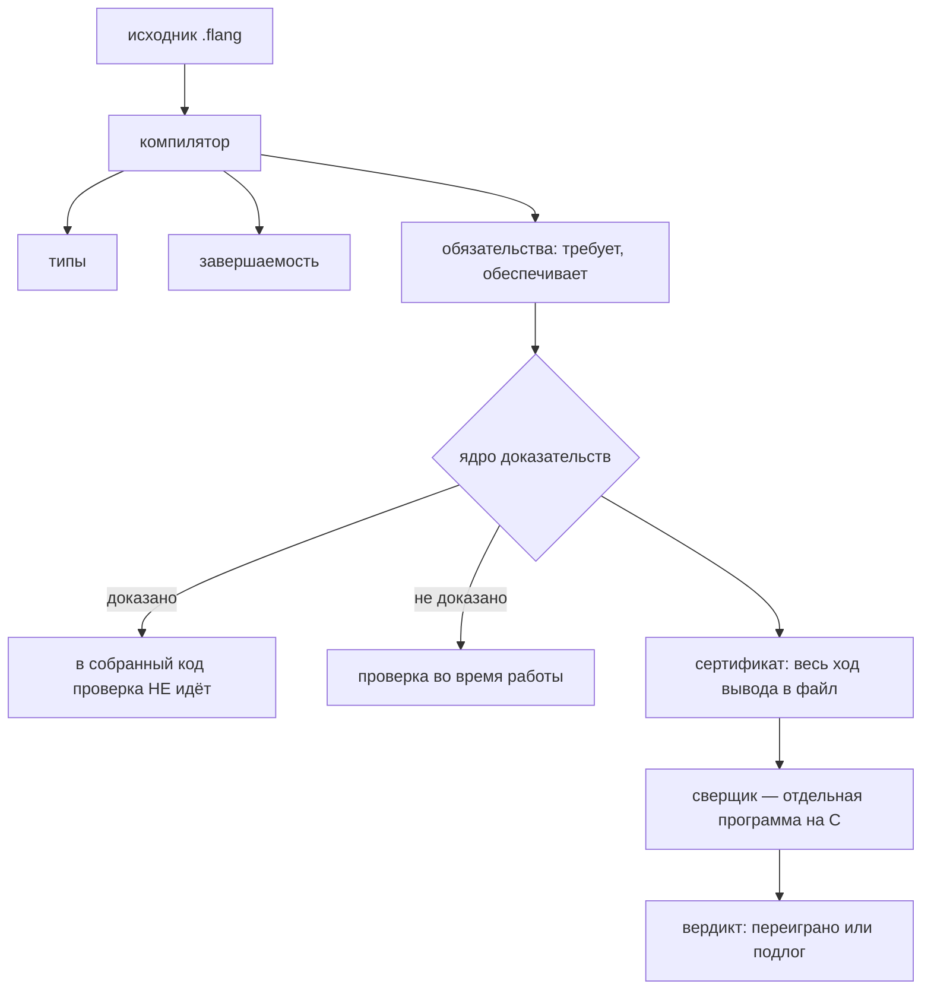
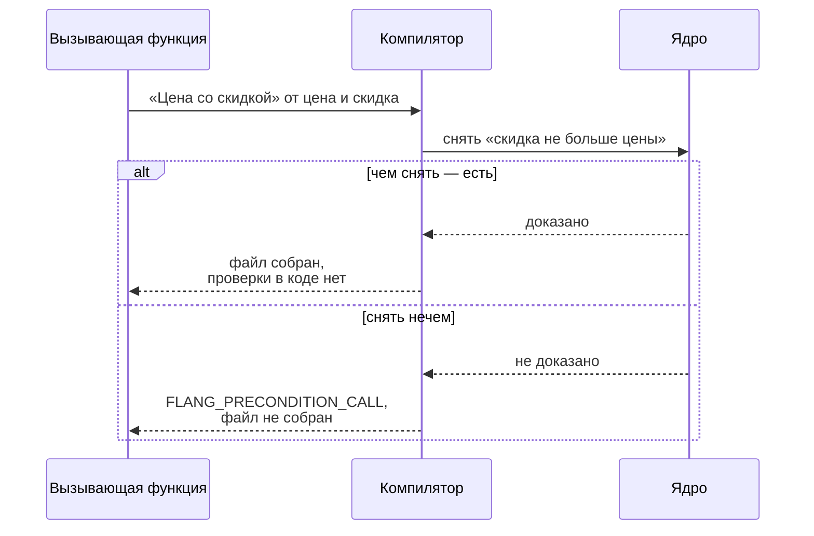

# Как это доказывается

Компилятор flang закрывает три обещания до того, как соберёт файл:

| Обещание | Слово в коде | Что значит |
| --- | --- | --- |
| функция завершится на любом входе | `тотальная` | нет входа, на котором она зациклится |
| вызов законен | `требует` | проверяется **в точке вызова**, а не внутри функции |
| результат таков, как сказано | `обеспечивает` | утверждение про **все** входы, а не про написанные примеры |

Ниже — как каждое из трёх доказывается, что остаётся в собранном коде, а что из
него исчезает. Всё, что напечатано в блоках вывода, снято прогонами `flang
0.7.20` (сборка из ствола 19 сентября 2026); команда стоит рядом с выводом,
любой блок повторяется за минуту.

## Кто что проверяет



Ядро доказательств — часть компилятора. Сверщик (`flang/proof/чекер/сверщик.c`)
— **отдельная программа**, которая не верит компилятору на слово: она берёт
сертификат и переигрывает каждый шаг вывода заново. Это разделение и есть
причина, по которой «доказано» здесь значит больше, чем «компилятор так сказал».

## 1. Завершаемость

### Структурный спуск

Рекурсия идёт по **части входного значения**, и часть каждый раз меньше целого.

```flang
модуль «Спуск»

тотальная функция «Сумма списка»
  принимает ряд: список числа
  возвращает число
  разбор ряд
    случай пусто
      то 0
    случай голова первый и хвост остальные
      первый плюс («Сумма списка» от остальные)
```

Аргумент рекурсивного вызова — `остальные`, хвост разобранного списка. Список
конечен, цепочка хвостов обрывается сама, доказывать нечего:

```
$ flang check --proof spusk.flang
  «Сумма списка»  доказано структурой: аргумент 1 («ряд») на каждом витке
  становится частью себя; цепочка частей конечного дерева обрывается сама,
  сторожа нет
```

Последние два слова отчёта — самые важные. Когда доказательство не сошлось до
конца, компилятор дописывает в собранную программу проверку, которая ловит
разницу уже во время работы. Здесь ловить нечего: обход конечного дерева
кончается сам, и проверки в коде не будет.

### Спуск по числу: тип решает, останется ли проверка

Та же функция, но спуск не по части значения, а по числу:

```flang
тотальная функция «Обратный отсчёт»
  принимает н: число
  возвращает число
  если н не больше 0
    то 0
    иначе 1 плюс («Обратный отсчёт» от (н минус 1))
```

```
$ flang check --proof bez-mery.flang
  «Обратный отсчёт»  доказано постоянным шагом: аргумент 1 («н») убывает на
  постоянный шаг и ограничен снизу; на IEEE-754 шаг не всегда меняет число,
  поэтому сторож, 1 место
  сторожей в рантайме: 1 место
```

Причина проверки названа прямо: `число` — это binary64, и при `н` больше 2⁵³
вычитание единицы **не меняет число**. Спуск встанет, функция зациклится.
Компилятор это знает и вставляет проверку.

Меняем одно слово — тип параметра:

```flang
  принимает н: неотрицательное
```

```
$ flang check --proof tochnyy.flang
  «Обратный отсчёт»  доказано точным шагом: аргумент 1 («н») объявлен
  натуральным и убывает на 1; дно и потолок даёт тип, внутри потолка шаг точен
  — сторожа нет
  сторожей в рантайме: 0 мест
```

Тип `неотрицательное` — это отрезок [0, 2⁵³−1]. Внутри него шаг точен, дно
есть, спуск конечен. Проверка из собранного кода ушла. **Объявленный тип
дешевле проверки во время работы — и это измеримо, а не на словах.**

### Объявленная мера

Когда убывает не сам аргумент, а что-то, посчитанное из аргументов, это
пишется строкой `убывает`. Пример из стандартной библиотеки
(`flang/stdlib/bignum.flang:383`):

```flang
  убывает (длина первые) плюс (длина вторые)
```

Компилятор проверяет две вещи: что названное выражение на каждом витке строго
меньше прежнего и что снизу у него есть дно. Убывающая величина с дном не
убывает вечно.

### Когда не доказал

```flang
тотальная функция «До нуля»
  принимает н: число
  возвращает число
  если н равен 0
    то 0
    иначе «До нуля» от (н плюс 1)
```

```
$ flang check rastyot.flang; echo "код $?"
FLANG_NOT_TOTAL в файле rastyot.flang, строка 8, столбец 11: тотальная функция
«До нуля»: рекурсивный вызов «До нуля» не убывает — аргумент 1 («н» add 1)
увеличивает параметр «н». Передавайте часть аргумента: хвост списка из образца
«голова и хвост», поле варианта из образца, поле записи или элемент коллекции
rastyot.flang: не проверено — замечаний 1
код 1
```

Файл не собран. Не предупреждение, не линтер — отказ с кодом 1.

## 2. Предусловие проверяется в точке вызова

```flang
тотальная функция «Цена со скидкой»
  принимает цена: неотрицательное, скидка: неотрицательное
  требует «скидка не больше цены» скидка не больше цена
  возвращает число
  цена минус скидка
```

Теперь вызов с заведомо негодным доводом:

```flang
тотальная функция «Счёт»
  возвращает число
  «Цена со скидкой» от 100 и 150
```

```
$ flang check zakaz.flang; echo "код $?"
FLANG_PRECONDITION_CALL в файле zakaz.flang, строка 16, столбец 3: вызов «Цена
со скидкой» в функции «Счёт» не снимает предусловие «скидка не больше цены»
zakaz.flang: не проверено — замечаний 1
код 1
```



Отличие от `assert` в Python или Java: `assert` срабатывает у пользователя,
через полгода после выкладки, на входе, которого никто не ждал. Здесь вызов
разбирается **в компиляторе**, и снять предусловие обязан тот, кто вызывает:
своим `требует`, объявленным типом довода или доказанным обещанием функции,
которая этот довод посчитала. Ту же дисциплину даёт SPARK у Ada; разница в том,
что здесь она в языке, а не в отдельном инструменте поверх него.

Проверка во время работы остаётся ровно в одном месте — на **границе**, где в
программу входят чужие данные. Вот что печатается в C на ту же функцию:

```c
if (strcmp(name, "Цена со скидкой") == 0) {
  FL_TRY(fl_pre(ctx, fl_flag(args[1].as.number <= args[0].as.number),
                "скидка не больше цены", "Цена со скидкой", &fl_t1, error));
  if (!fl_t1) return fl_fail(ctx, error, "FLANG_PRECONDITION", ...);
```

Это разбор вызова по имени — вход из JSON, из командной строки, из чужой
программы. Внутри самой программы такой проверки нет ни одной: там все вызовы
уже разобраны компилятором.

## 3. Постусловие: «доказано» значит «проверки в собранном коде нет»

Берём ту же функцию **без** `требует` и с обещанием:

```flang
тотальная функция «Цена со скидкой»
  принимает цена: неотрицательное, скидка: неотрицательное
  возвращает число
  обеспечивает «в минус не уходим» результат не меньше 0
  пример «Сто минус десять»
    дано цена равно 100
    дано скидка равно 10
    ожидается 90
  цена минус скидка
```

Обещание **ложно**: скидка бывает больше цены. Вот что говорит ядро:

```
$ flang check --proof skidka.flang
  постусловие «в минус не уходим» функции «Цена со скидкой» — сетка 1 значение
  (примеры функции): нарушений НЕ ИСКАЛИ — прогона примеров не было, посчитано
  только их число. Это не доказательство — теоремы при утверждении нет
  утверждений 1: доказано 0, сетка 1, объявлено, не доказано 0
```

Запустить такое с 0.7.21 нельзя без явного согласия:

```
$ flang run skidka.flang --function 'Цена со скидкой' --args '{"цена": 100, "скидка": 150}'
не доказано: утверждений 1: доказано 0, сетка 1, на веру 0 — запуск только по
явному согласию: --на-веру
код 3
```

А в напечатанном C обещание превращается в проверку перед возвратом:

```c
fl_status skidka_cena_so_skidkoy(fl_ctx *ctx, fl_value cena, fl_value skidka,
                                 fl_value *result, fl_error *error) {
  if (cena.tag != FL_NUMBER || skidka.tag != FL_NUMBER) FL_TRY(fl_not_numbers(...));
  const fl_value fl_t1 = fl_number(cena.as.number - skidka.as.number);
  /* постусловие «в минус не уходим» */
  bool fl_t2 = false;
  FL_TRY(fl_post(ctx, fl_flag(fl_t1.as.number >= 0.0), "в минус не уходим",
                 "Цена со скидкой", &fl_t2, error));
  if (!fl_t2) return fl_fail(ctx, error, "FLANG_PROPERTY", "%s",
      "нарушено свойство «в минус не уходим» функции «Цена со скидкой»");
  *result = fl_t1;
  return FL_OK;
}
```

Теперь добавляем **одну строку** — предусловие:

```flang
  требует «скидка не больше цены» скидка не больше цена
```

```
$ flang check --proof skidka-trebuet.flang
  постусловие «в минус не уходим» функции «Цена со скидкой» — доказано по
  объявленным типам аргументов: цель сведена правилом «неотрицательность по
  построению» — утверждение обо ВСЕХ входах, а не о написанных; теоремы при
  нём нет и не нужно
  утверждений 1: доказано 1 (из них без теоремы 1, объявленным типом 1), сетка 0
```

И та же функция в напечатанном C целиком:

```c
fl_status skidka_s_usloviem_cena_so_skidkoy(fl_ctx *ctx, fl_value cena, fl_value skidka,
                                            fl_value *result, fl_error *error) {
  if (cena.tag != FL_NUMBER || skidka.tag != FL_NUMBER) FL_TRY(fl_not_numbers(...));
  *result = fl_number(cena.as.number - skidka.as.number);
  return FL_OK;
}
```

Проверки нет. Не выключена ключом — **её не из чего печатать**: утверждение
закрыто про все входы, проверять во время работы нечего.

Это и есть практическая разница с контрактами в Eiffel, Java (`@ensures`) или
Python (`assert`): там контракт всегда стоит в коде и всегда стоит времени.
Здесь доказанный контракт из кода уходит, а недоказанный остаётся — и отчёт
говорит вслух, который из двух перед вами.

## 4. Сетка: что это и зачем она, если это не доказательство

**Сетка** — проверка утверждения на конечном наборе значений: значениях из
`пример`, значениях из объявленного закона. В отчёте она печатается словами
«сетка N значений» и заканчивается фразой «Это не доказательство» — намеренно.

Что сетка даёт:

* **ловит ложное обещание на тех входах, которые вы написали.** Обещание,
  которое ломается на собственном примере, до ядра не доходит вовсе;
* **держит границу видимой.** Утверждение на сетке не выдаётся за доказанное ни
  в одной строке отчёта, и вердикт считает их разными числами;
* **стоит дёшево.** Прогон примеров — секунды, доказательство модуля — минуты.

Чего сетка не даёт: ничего про входы, которых в наборе не было. Перебор
конечного набора значений — это тест, записанный в другом месте, а не
доказательство.

## 5. Сколько получается на настоящем модуле

Модуль списков стандартной библиотеки, `flang/stdlib/lists.flang`:

```
$ flang check --proof flang/stdlib/lists.flang
  функций 38: тотальных 38, обычных 0
  обещание несёт: композиция 28, структура 8, точный шаг 1, постоянный шаг 1,
                  объявленная мера 0
  сторожей в рантайме: 1 место
  утверждений 66: доказано 42 (из них индукцией 5) (из них без теоремы 37),
                  сетка 24, объявлено, не доказано 0
```

Читается так:

* 38 функций, у всех 38 завершение доказано. У 28 — просто потому, что рекурсии
  нет; у 8 — структурным спуском; одна по точному шагу, одна по постоянному
  (единственная проверка во время работы в модуле);
* 66 обещаний о результате. **42 закрыты про все входы**, из них 37 — без
  единой написанной строки доказательства: ядро свело их само по объявленным
  типам и формам. Пять потребовали индукции;
* 24 остались на сетке.

И то же самое в напечатанном C:

```
$ flang emit flang/stdlib/lists.flang --target c --out /tmp/out
$ grep -c 'fl_post(' /tmp/out/lists.c
25
```

25 проверок во время работы = 24 недоказанных постусловия + 1 проверка
завершаемости (та самая, из «постоянного шага»). **42 проверки, которые в Python или Go пришлось бы либо писать
руками, либо не иметь вовсе, в собранной программе отсутствуют — потому что
доказаны.**

## 6. Чего это не значит

* **`число` — это binary64.** Доказательства про него верны в арифметике
  IEEE-754, а не в арифметике целых. Где это важно, тип пишется явно:
  `неотрицательное`, `сотых`, `тысячных`.
* **Ядро берёт не всякое утверждение.** Что именно оно берёт и на какой форме
  отказывает — [Какие обещания ядро берёт](what-the-kernel-accepts.html) и
  [Ядро отказало: чья это ошибка](proof-refused.html).
* **Доверенная база не нулевая.** Ей верят на слово: сверщик на C, компилятор C,
  рантайм. Что из этого чем прикрыто — [Что доказано, а что
  нет](what-is-proved.html).
* **Сетка — не доказательство,** и вердикт считает её отдельным числом.

## Как повторить

```bash
flang check <файл>                       # типы, завершаемость, ядро; код 1 — отказ
flang check --proof <файл>               # отчёт: чем несётся каждое обещание
flang check --proof --строго <файл>      # то же, но опора обязана быть судимой
flang check --proof --записать <файл>    # сертификат в файл — для сверщика
flang emit <файл> --target c --out <кат> # посмотреть, какие проверки остались
flang test <файл>                        # прогон примеров
```

Разбор всего дерева языка — [Отчёт о доказательствах по
дереву](overview.html); зачем это вообще нужно — [Зачем и как](proofs.html).
