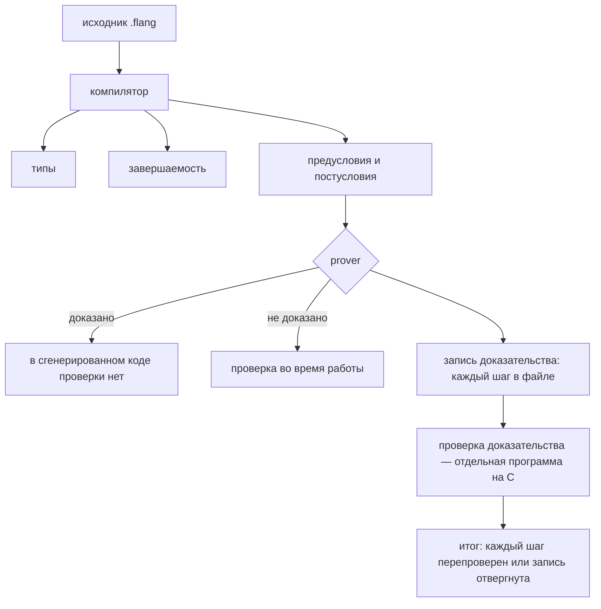
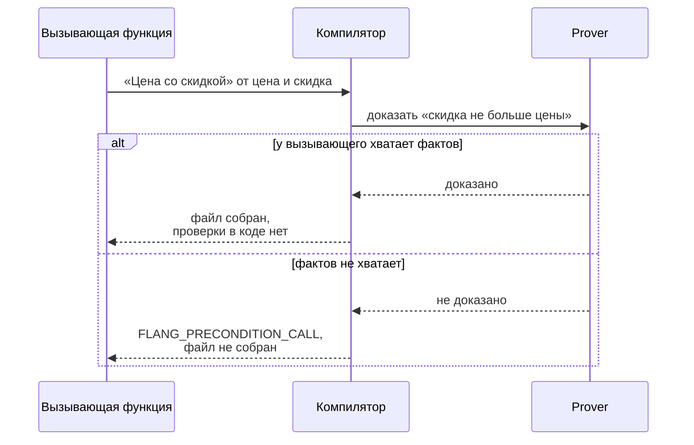

# Как это доказывается
<!-- замер: версия 0.7.24 · дерево 5604556ef · сверено 2026-10-04 -->

Прежде чем принять файл, компилятор flang проверяет три вида утверждений:

| Пишете | Привычный термин | Что это значит | Где проверяется |
| --- | --- | --- | --- |
| `тотальная` | termination | функция завершается на любом входе | в самой функции |
| `требует` | precondition | что должно быть верно на входе | **в каждой точке вызова**, а не внутри функции |
| `обеспечивает` | postcondition | что функция гарантирует на выходе | для **всех** входов, а не только для ваших примеров |

На этой странице на маленьких файлах показано, как проверяется каждое из трёх,
что печатает компилятор и как меняется сгенерированный код, когда что-то
доказано. Каждый блок вывода снят с `flang {{выпуск.версия}}`; команда стоит
рядом с выводом, любой блок повторяется меньше чем за минуту. Длинные строки
вывода перенесены, `…` отмечает пропуск.

Слова из вывода компилятора, которые встретятся ниже:

| В выводе написано | Что это значит |
| --- | --- |
| «ядро» | prover: часть компилятора, которая доказывает постусловия |
| «доказано» | доказано для всех входов |
| «сетка N» | проверено только на N значениях (ваших примерах), не доказано |
| «объявлено, не доказано» | нет ни доказательства, ни примеров |
| `сторож`, `сторожей в рантайме: N мест` | проверка, которую компилятор добавляет в сгенерированный код; N мест |
| «обещание» | одно из трёх утверждений из таблицы выше |

## Кто что проверяет


```mermaid Путь от исходника до итога
flowchart TD
  A[исходник .flang] --> B[компилятор]
  B --> C[типы]
  B --> D[завершаемость]
  B --> E[предусловия и постусловия]
  E --> F{prover}
  F -->|доказано| G[в сгенерированном коде проверки нет]
  F -->|не доказано| H[проверка во время работы]
  F --> I[запись доказательства: каждый шаг в файле]
  I --> J[проверка доказательства — отдельная программа на C]
  J --> K[итог: каждый шаг перепроверен или запись отвергнута]
  class F glavnoe
  class G vyvod
  class H otkaz
```

Prover — часть компилятора. Программа проверки доказательств
(`flang/proof/checker/checker.c`) — **отдельная программа**, которая компилятору
не верит: она читает запись доказательства и перепроверяет каждый шаг заново.
Поэтому «доказано» значит, что согласились две независимые программы, а не
только что так сказал компилятор.

## 1. Завершаемость

Заставить компилятор доказать, что рекурсивная функция останавливается, можно
тремя способами. Берите первый подходящий.

### Рекурсия по части входа

Рекурсивный вызов получает **часть входного значения**: хвост списка, поле
варианта. Часть всегда меньше целого.

```flang
модуль «Спуск»

тотальная функция «Сумма списка»
  принимает ряд: список числа
  возвращает число
  разбор ряд
    случай пусто
      то 0
    случай голова первый и хвост остальные
      первый плюс («Сумма списка» от остальные)
```

Рекурсивный вызов получает `остальные` — хвост списка. Списки конечны, поэтому
цепочка хвостов кончается. Компилятор это доказывает и проверки в
сгенерированный код не добавляет (отчёт кончается словами `сторожа нет` —
«проверки нет»):

```
$ flang check --proof spusk.flang
  «Сумма списка»  доказано структурой: аргумент 1 («ряд») на каждом витке
  становится частью себя; цепочка частей конечного дерева обрывается сама,
  сторожа нет
```

### Рекурсия по числу: останется ли проверка, решает тип

Та же форма, но рекурсия отсчитывает число вниз:

```flang
тотальная функция «Обратный отсчёт»
  принимает н: число
  возвращает число
  если н не больше 0
    то 0
    иначе 1 плюс («Обратный отсчёт» от (н минус 1))
```

```
$ flang check --proof bez-mery.flang
  «Обратный отсчёт»  доказано постоянным шагом: аргумент 1 («н») убывает на
  постоянный шаг и ограничен снизу; на IEEE-754 шаг не всегда меняет число,
  поэтому сторож, 1 место
  сторожей в рантайме: 1 место
```

Вывод говорит, зачем проверка: `число` — это float binary64, и выше 2⁵³
вычитание единицы **не меняет число**. Рекурсия никогда не дойдёт до нуля,
поэтому компилятор добавляет проверку во время работы в одном месте.

Меняем одно слово — тип параметра:

```flang
  принимает н: неотрицательное
```

```
$ flang check --proof tochnyy.flang
  «Обратный отсчёт»  доказано точным шагом: аргумент 1 («н») объявлен
  натуральным и убывает на 1; дно и потолок даёт тип, внутри потолка шаг точен
  — сторожа нет
  сторожей в рантайме: 0 мест
```

`неотрицательное` — это отрезок [0, 2⁵³−1]. Внутри него вычитание единицы
точное и есть нижняя граница, поэтому рекурсия кончается. Проверка ушла.
**Если число отсчитывается вниз, объявите его `неотрицательное`: проверка
исчезнет из сгенерированного кода.**

### Объявить, что убывает

Когда меньше становится не сам аргумент, а что-то, посчитанное из аргументов,
напишите это строкой `убывает`. Пример из стандартной библиотеки
(`flang/stdlib/bignum.flang:383`):

```flang
  убывает (длина первые) плюс (длина вторые)
```

Компилятор проверяет, что это выражение строго уменьшается на каждом
рекурсивном вызове и что у него есть нижняя граница.

### Когда компилятор не может доказать

```flang
тотальная функция «До нуля»
  принимает н: число
  возвращает число
  если н равен 0
    то 0
    иначе «До нуля» от (н плюс 1)
```

```
$ flang check rastyot.flang; echo "код $?"
модуль «Растёт»: функций 1, из них с доказанным завершением 0; типов 0
без доказанного завершения: «До нуля»
FLANG_NOT_TOTAL в файле rastyot.flang, строка 8, столбец 11: тотальная функция
«До нуля»: рекурсивный вызов «До нуля» не убывает — аргумент 1 («н» add 1)
увеличивает параметр «н». Передавайте часть аргумента: хвост списка из образца
«голова и хвост», поле варианта из образца, поле записи или элемент коллекции
rastyot.flang: не проверено — замечаний 1
код 1
```

Это ошибка, а не предупреждение: код возврата 1, файл не собран. Сообщение
говорит, что делать: передавать часть аргумента. Если функция действительно
может работать вечно, уберите у неё `тотальная`.

## 2. Предусловие проверяется в точке вызова

```flang
тотальная функция «Цена со скидкой»
  принимает цена: неотрицательное, скидка: неотрицательное
  требует «скидка не больше цены» скидка не больше цена
  возвращает число
  цена минус скидка
```

Вызов с аргументами, которые его нарушают:

```flang
тотальная функция «Счёт»
  возвращает число
  «Цена со скидкой» от 100 и 150
```

```
$ flang check zakaz.flang; echo "код $?"
модуль «Заказ»: функций 2, из них с доказанным завершением 2; типов 0
FLANG_PRECONDITION_CALL в файле zakaz.flang, строка 11, столбец 3: вызов «Цена
со скидкой» в функции «Счёт» не снимает предусловие «скидка не больше цены»:
ограниченность точным потолком по построению не проходит: выражение случая
собрано не только из ограниченного сверху. … вызывающему здесь известно:
собственных «требует» — 0, объявленных типов у параметров — 0, доказанных
обещаний вызванных в доводе — 0; условие ветвления фактом ядру не является
(граница названа в шапке файла)
zakaz.flang: не проверено — замечаний 1
код 1
```


```mermaid Кто доказывает предусловие
sequenceDiagram
  participant В as Вызывающая функция
  participant К as Компилятор
  participant Я as Prover
  В->>К: «Цена со скидкой» от цена и скидка
  К->>Я: доказать «скидка не больше цены»
  alt у вызывающего хватает фактов
    Я-->>К: доказано
    К-->>В: файл собран,<br>проверки в коде нет
  else фактов не хватает
    Я-->>К: не доказано
    К-->>В: FLANG_PRECONDITION_CALL,<br>файл не собран
  end
```

Ошибка перечисляет три источника фактов, которые prover может использовать в
точке вызова. Это и есть три способа её исправить:

1. `требует` вызывающей функции, которое даёт нужный факт;
2. объявленный тип параметра вызывающей функции (`неотрицательное`, `сотых`, …);
3. доказанное постусловие функции, которая посчитала аргумент.

Сравните с `assert` в Python или Java: assert падает у пользователя на входе,
которого никто не ждал. Здесь неверный вызов — ошибка компиляции, как в
Ada/SPARK, только без отдельного инструмента.

Одна проверка во время работы остаётся: там, где данные приходят снаружи
программы. Вот сгенерированный C для этой функции:

```c
if (strcmp(name, "Цена со скидкой") == 0) {
  FL_TRY(fl_pre(ctx, fl_flag(args[1].as.number <= args[0].as.number),
                "скидка не больше цены", "Цена со скидкой", &fl_t1, error));
  if (!fl_t1) return fl_fail(ctx, error, "FLANG_PRECONDITION", ...);
```

Это вход по имени функции: вызов из JSON, из командной строки или из другой
программы. У вызовов внутри программы такой проверки нет: каждый из них
компилятор уже проверил.

## 3. Постусловие: доказанное убирается из сгенерированного кода

Та же функция **без** `требует`, с постусловием:

```flang
тотальная функция «Цена со скидкой»
  принимает цена: неотрицательное, скидка: неотрицательное
  возвращает число
  обеспечивает «в минус не уходим» результат не меньше 0
  пример «Сто минус десять»
    дано цена равно 100
    дано скидка равно 10
    ожидается 90
  цена минус скидка
```

Постусловие **ложно**: скидка бывает больше цены. Prover его не доказывает, и
отчёт говорит, что оно проверено только на одном примере:

```
$ flang check --proof skidka.flang
  постусловие «в минус не уходим» функции «Цена со скидкой» — сетка 1 значение
  (примеры функции): нарушений НЕ ИСКАЛИ — прогона примеров не было, посчитано
  только их число. Это не доказательство — теоремы при утверждении нет
  утверждений 1: доказано 0, сетка 1, объявлено, не доказано 0
```

`flang run` отказывается запускать файл с недоказанным постусловием, пока вы не
добавите `--на-веру` (латиницей `--trust`):

```
$ flang run skidka.flang --function 'Цена со скидкой' --args '{"цена": 100, "скидка": 150}'
не доказано: утверждений 1: доказано 0, сетка 1, на веру 0 — запуск только по
явному согласию: --на-веру
недоказанное — поимённо, словами отчёта о доказательствах:
  1. постусловие «в минус не уходим» функции «Цена со скидкой» — сетка 1 значение
  (примеры функции): нарушений НЕ ИСКАЛИ — прогона примеров не было, посчитано
  только их число. Это не доказательство — теоремы при утверждении нет
«сетка» закрывается так: написать при утверждении «теорема … утверждаем …
следовательно доказано» либо переписать его условие так, чтобы оно совпало с
ветвью тела, — тогда цель сводит правило «разбор цели по условию»
отчёт о доказательствах целиком, с правилами и у доказанных тоже: flang check
…/skidka.flang --proof
код 3
```

В сгенерированном C недоказанное постусловие становится проверкой перед
возвратом:

```c
fl_status skidka_cena_so_skidkoy(fl_ctx *ctx, fl_value cena, fl_value skidka,
                                 fl_value *result, fl_error *error) {
  if (cena.tag != FL_NUMBER || skidka.tag != FL_NUMBER) FL_TRY(fl_not_numbers(...));
  const fl_value fl_t1 = fl_number(cena.as.number - skidka.as.number);
  /* постусловие «в минус не уходим» */
  bool fl_t2 = false;
  FL_TRY(fl_post(ctx, fl_flag(fl_t1.as.number >= 0.0), "в минус не уходим",
                 "Цена со скидкой", &fl_t2, error));
  if (!fl_t2) return fl_fail(ctx, error, "FLANG_PROPERTY", "%s",
      "нарушено свойство «в минус не уходим» функции «Цена со скидкой»");
  *result = fl_t1;
  return FL_OK;
}
```

Теперь добавляем **одну строку** — предусловие:

```flang
  требует «скидка не больше цены» скидка не больше цена
```

```
$ flang check --proof skidka-trebuet.flang
  постусловие «в минус не уходим» функции «Цена со скидкой» — доказано по
  объявленным типам аргументов: цель сведена правилом «неотрицательность по
  построению» — утверждение обо ВСЕХ входах, а не о написанных; теоремы при
  нём нет и не нужно
  утверждений 1: доказано 1 (из них без теоремы 1, объявленным типом 1), сетка 0
```

Постусловие доказано для всех входов, без написанного доказательства. Вся
функция в сгенерированном C:

```c
fl_status skidka_s_usloviem_cena_so_skidkoy(fl_ctx *ctx, fl_value cena, fl_value skidka,
                                            fl_value *result, fl_error *error) {
  if (cena.tag != FL_NUMBER || skidka.tag != FL_NUMBER) FL_TRY(fl_not_numbers(...));
  *result = fl_number(cena.as.number - skidka.as.number);
  return FL_OK;
}
```

Проверки нет, и никакой ключ её не выключал: доказанное постусловие верно на
любом входе, проверять во время работы нечего.

В этом практическая разница с контрактами в Eiffel, JML в Java или `assert` в
Python: там контракт всегда остаётся в коде и всегда стоит времени. Во flang
доказанный контракт уходит из кода, недоказанный остаётся, и отчёт говорит,
какой у вас.

## 4. Проверено только на примерах

Когда prover не может доказать постусловие, а у функции есть примеры, отчёт
пишет «сетка N значений» (проверено на N значениях) и кончает строку словами
«Это не доказательство».

Что дают примеры:

* **ложное постусловие падает на вашем же примере.** Если пример нарушает
  постусловие, `flang check` останавливается с `FLANG_EXAMPLE` и
  `FLANG_PROPERTY` и называет пример;
* **отчёт никогда не считает их доказанными.** «Доказано» и «проверено на
  примерах» — разные числа в каждой итоговой строке;
* **они дешёвые.** Прогон примеров — секунды, доказательство модуля — бывает,
  минуты.

Чего примеры не дают: ничего про входы, которых в примерах нет. Это unit-тесты,
а не доказательство. Чтобы такая строка стала «доказано», напишите к ней
`теорема` или перепишите условие так, чтобы оно совпало с веткой тела, — то же
самое говорит вывод `flang run` выше.

## 5. Настоящий модуль

Модуль списков стандартной библиотеки, `flang/stdlib/lists.flang`:

```
$ flang check --proof flang/stdlib/lists.flang
  функций 38: тотальных 38, обычных 0
  обещание несёт: композиция 28, структура 8, точный шаг 1, постоянный шаг 1,
                  объявленная мера 0
  сторожей в рантайме: 1 место
  утверждений 66: доказано 42 (из них индукцией 5) (из них без теоремы 37),
                  сетка 24, объявлено, не доказано 0
```

Как читать:

* 38 функций, завершение доказано у всех 38: у 28 рекурсии нет, 8 рекурсивны по
  части входа, одна отсчитывает вниз число типа `неотрицательное`, одна —
  обычное `число` (единственная проверка во время работы в модуле);
* 66 постусловий. **42 доказаны для всех входов**, 37 из них без написанного
  доказательства: prover обошёлся объявленными типами и формой кода. Пяти
  понадобилась индукция;
* 24 проверены только на примерах.

Тот же модуль в сгенерированном C:

```
$ flang emit flang/stdlib/lists.flang --target c --out /tmp/out
$ grep -c 'fl_post(' /tmp/out/lists.c
25
```

25 проверок во время работы = 24 недоказанных постусловия + 1 проверка
завершаемости. **42 доказанных постусловия в сгенерированном коде нет вовсе** —
в Python или Go эти проверки пришлось бы писать руками или обходиться без них.

## 6. Ограничения

* **`число` — это float binary64.** Доказательства про него верны в арифметике
  IEEE-754, а не в арифметике целых. Где это важно, берите точный тип:
  `неотрицательное`, `сотых`, `тысячных`.
* **Prover принимает не всякое постусловие.** Какие формы он доказывает и
  какие отвергает — [Какие обещания ядро берёт](what-the-kernel-accepts.html) и
  [Ядро отказало: чья это ошибка](proof-refused.html).
* **Чему-то всё равно приходится доверять.** Программе проверки доказательств
  на C, компилятору C и рантайму верят без доказательства (trusted base, TCB).
  Что чем прикрыто — [Что доказано, а что нет](what-is-proved.html).
* **Проверенное на примерах — не доказанное,** и каждый отчёт считает его
  отдельно.

## Команды

| Команда | Что делает |
| --- | --- |
| `flang check <файл>` | синтаксис, типы, завершаемость, предусловия в точках вызова, примеры; код 1 при ошибке |
| `flang check --proof <файл>` | отчёт о доказательствах: чем доказаны завершение каждой функции и каждое постусловие |
| `flang check --proof --strict <файл>` | то же, но код 0, только если постусловие есть хотя бы одно и все доказаны; для CI |
| `flang check <файл> --proof --record <запись>` | ещё и пишет запись доказательства в `<запись>` для проверки на C |
| `flang emit <файл> --target c --out <каталог>` | генерирует C; видно, какие проверки остались |
| `flang test <файл>` | прогоняет примеры |

Зачем всё это — [Зачем и как](proofs.html).
