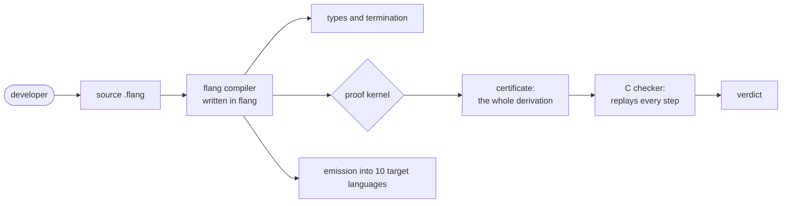

# flang — a language whose compiler proves properties of your program

flang is a pure functional language with strict static typing. Values are
immutable, there are no loops, and a program has no side effects: input and
output come back as data, and the host performs them.

One thing sets it apart: **promises about the program are checked by the
compiler, not by tests.** `total` in front of a function promises it terminates
on every input. `requires` is a condition the *caller* must discharge.
`ensures` is a claim about the result, closed over **all** inputs. If it cannot
be proved, the file is not emitted and the exit code is 1.

The proof is not taken on the compiler's word either: `flang check --proof
--записать` writes the whole derivation to a file, and a **separate C program**
(`flang/proof/чекер/сверщик.c`, the trusted base) replays every step from
scratch. The kernel has zero axioms, and that too is a run:
`flang io flang/scripts/kernel-forgeries.fscript --plan 'Аксиом ноль'` answers
with exit code 0.



The language is self-hosted: the flang compiler is written in flang and prints
itself. The standard library, the process scheduler, supervision and the link
between nodes are written in flang too — its own layer in place of OTP/BEAM. It
is written in words rather than symbols, and every keyword exists in both a
Russian and an English spelling.

## Five minutes

Put this in `hello.flang`:

```flang
module «Hello»

total function «Double»
  accepts n: number
  returns number
  n plus n
```

```bash
$ flang check hello.flang
модуль «Hello»: функций 1, из них с доказанным завершением 1; типов 0
hello.flang: проверено — разбор, типы, завершаемость, ядро и примеры; замечаний нет

$ flang run hello.flang --function Double --args '{"n": 21}'
42
```

(The compiler's own report is in Russian today.) What a refusal looks like, what
carries each promise, and what disappears from the compiled code once a promise
is proved: [how a proof actually works](how-proofs-work.html).

## Install

```bash
brew install digitable-lol/tap/flang
flang --version
```

The first line installs from the
[`homebrew-tap`](https://github.com/digitable-lol/homebrew-tap) repository; the
second answers `flang {{выпуск.версия}}`. The other paths — asdf, from source —
are on the [Install](install.html) page.

## What the language can do today

| What exists | Where the border is |
| --- | --- |
| **Termination**: `total` is checked by the compiler, not by a reviewer | the language has no loops and no mutable variables; if it cannot prove, it refuses the file |
| **Contracts**: `requires` is discharged at the call site, `ensures` is closed over all inputs | the kernel does not accept every shape; which ones it does is [listed](what-the-kernel-accepts.html) |
| **Emission into {{цели.поАнглийски}} target languages**: {{цели.список}} | sockets, clocks and the process table are not emitted |
| **[Processes and supervision](processes.html)**: scheduler, supervision and back pressure, all written in flang itself | the `процесс` and `надзор` declarations are not judged by the binary compiler |
| **[PostgreSQL](database.html) and SQLite**: the PostgreSQL protocol is built and parsed, an SQLite file is read, built from nothing, and written a row into | PostgreSQL takes `trust` and cleartext password only; SQLite writes only into a ready file's own free space, no page split, no journal |
| **HTTP**: requests and responses parsed and printed, headers, codes, addresses, percent encoding | there is no socket: the host carries the bytes |
| **Cryptography of our own**: SHA-256, HMAC, AES-128 in CTR and GCM, X25519, reading an X.509 certificate | TLS is not built: `https` is done by an external `curl` |

## What backs that up

`sh scripts/доказуемость.sh` on trunk, 19 September 2026 (commit `a5609e322`),
about three minutes:

```
ДОКАЗУЕМ                                                      (PROVABLE)
проверка 2 — доля проигрыванием не ниже 100 %? ДА (100.00 %: 650 из 650)
проверка 3 — набор проб пройден? ДА (проб на подлог 533, принято кодом 0 — 0;
                                     честных 245, отвергнуто 0)
```

All 650 obligations the kernel wrote into the certificate were replayed by the
checker itself; 533 forged proofs were rejected, 245 honest ones accepted.

**This is not "100 % of programs are proved".** The hundred per cent is the
share of places in the compiler's **own** proof records, and it says nothing
about the emitted code. There are four coverages in all, and the other three are
lower: inference rules formalised in Lean, an open list of known soundness
violations, and the translation check for C. `sh scripts/four-coverages.sh`
prints all four side by side with a date and a commit; what each one is *not* is
spelled out on [what is proved and what is not](what-is-proved.html).

Across the tree: {{корпус.тотальных}} functions out of {{корпус.функций}}
terminate provably, and of {{утверждения.высказано}} behaviour claims the kernel
has closed {{утверждения.доказано}}. Those four were measured on 23 August 2026
(commit `252606e8`) by a run of the compiler over the whole tree — it takes hours
and has not been re-measured since; the cheap numbers on this page (files, lines,
functions) are recomputed in nine seconds and checked on every push
(`sh scripts/guards/published-vs-tree.sh --числа`).

## How this differs from Coq and Lean

**Not in who writes the proof.** You can write one by hand here too: `теорема`
with the steps `дано`, `утверждаем`, `затем … по свойству «…»`, `индукция по …`
and `следовательно доказано` — a structured proof in the spirit of Isabelle's
Isar, not a script of tactics. There are **285** such theorems in the tree, **55**
of them in the standard library (`grep -rac '^\s*теорема ' flang
--include='*.flang'`, summed with `awk`, 19 September 2026).

The difference is **what is left for the hand to write.** The kernel closes a
claim on its own, and a written theorem is only needed for the remainder. The
report gives that as its own number: for `flang/stdlib/lists.flang`, "утверждений
66: доказано 42 … из них без теоремы 37" — 66 claims, 42 proved, 37 of them with
no theorem written. Coq and Lean have no such number: there every claim gets
either a term or a tactic.

The second difference is not in our favour: thirty years have accumulated tens of
thousands of ready lemmas there, while the library of proved statements here is
only being built up, and a program is more often *extracted* out of Coq and Lean
into another language than used to run a service.

## Next

- [How a proof actually works](how-proofs-work.html) — termination,
  preconditions and postconditions, on code and on captured output.
- [Your first program](getting-started.html) — the same five minutes in full,
  down to emitting the program into C.
- [Language reference](language.html) — how every form of the language is
  written.
- [Operations](operations.html) — what to call when you need a library function
  that already exists.
