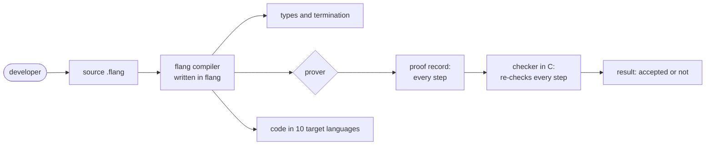

# flang — a language whose compiler proves properties of your program

flang is a pure functional language with static types. Values are immutable,
there are no loops, and functions have no side effects: a program that needs a
file, the network or the screen returns a command as data, and the runtime
executes it.

What sets it apart: **the compiler checks the contract of a function for all
inputs, not only for the inputs your tests happen to use.**

| You write | It means | The compiler does |
| --- | --- | --- |
| `total` (`тотальная`) before a function | the function always terminates | proves it; if it cannot, the file is rejected |
| `requires` (`требует`) | precondition: what must hold on input | checks it at every call site |
| `ensures` (`обеспечивает`) | postcondition: what the function guarantees on output | the **prover** proves it for every possible input |
| `example` (`пример`) | a unit test inside the function | runs it on every check |

The prover is the part of the compiler that proves postconditions; in the
compiler output it is called «ядро» (kernel). You do not have to trust it:
`flang check --proof --record <file>` writes the whole proof to a file, and a
separate program in C, `flang/proof/checker/checker.c`, re-checks every step
without using the compiler. The prover has no axioms; to check that yourself,
run `flang io flang/scripts/kernel-forgeries.fscript --plan 'Аксиом ноль' --trust`
— it answers with exit code 0.


```mermaid Who checks whom
flowchart LR
  R([developer]) --> S[source .flang]
  S --> K[flang compiler<br>written in flang]
  K --> T[types and termination]
  K --> Y{prover}
  Y --> C[proof record:<br>every step]
  C --> V[checker in C:<br>re-checks every step]
  V --> W[result: accepted or not]
  K --> P[code in 10 target languages]
  class Y glavnoe
  class W vyvod
```

The flang compiler is written in flang and compiles itself. The standard
library, the process scheduler and supervision (in place of Erlang/OTP) are
written in flang too. Keywords are words, not symbols, and every keyword has a
Russian and an English spelling.

## Five minutes

Put this in `hello.flang`:

```flang
module «Hello»

total function «Double»
  accepts n: number
  returns number
  n plus n
```

Check it, then run it:

```bash
$ flang check hello.flang
модуль «Hello»: функций 1, из них с доказанным завершением 1; типов 0
hello.flang: проверено — разбор, типы, завершаемость, ядро и примеры; замечаний нет

$ flang run hello.flang --function Double --args '{"n": 21}'
доказано: утверждений 0
42
```

The compiler prints its messages in Russian. `check` says: one function, its
termination is proved, no remarks. `run` first says how many postconditions
are proved (here there are none), then prints the value.

What a rejected proof looks like and what the compiler removes from the
generated code once a property is proved: [How a proof works](how-proofs-work.html).

## Install

```bash
brew install digitable-lol/tap/flang
flang --version
```

The first line installs from the
[`homebrew-tap`](https://github.com/digitable-lol/homebrew-tap) repository; the
second answers `flang {{выпуск.версия}}`. asdf and building from source are on
the [Install](install.html) page.

## What the language can do

| What you get | What it does not do |
| --- | --- |
| **Termination**: `total` is proved by the compiler | there are no loops and no mutable variables; if termination cannot be proved, the file is rejected |
| **Contracts**: `requires` is checked at the call site, `ensures` is proved for all inputs | the prover does not accept every way of writing a postcondition; the forms it accepts are [listed](what-the-kernel-accepts.html) |
| **Code generation into {{цели.поАнглийски}} target languages**: {{цели.список}} | sockets, clocks and the process table are not generated |
| **[Processes and supervision](processes.html)**: scheduler, supervisors, back pressure, all written in flang | the binary compiler parses `процесс` and `надзор` declarations but does not check them |
| **[PostgreSQL](database.html) and SQLite**: the PostgreSQL wire protocol is built and parsed; an SQLite file can be read, created from scratch and given a new row | PostgreSQL login supports only `trust` and a cleartext password; SQLite writes only into free space inside an existing file: no page split, no journal |
| **HTTP**: requests and responses are parsed and printed: headers, status codes, URLs, percent encoding | there are no sockets: the runtime sends and receives the bytes |
| **Cryptography written in flang**: SHA-256, HMAC, AES-128 and AES-256 in CBC, CTR and GCM, X25519, reading an X.509 certificate | there is no TLS: `https` goes through an external `curl` |

## How to check these claims

One command checks that the compiler's own proofs hold up:

```
bootstrap/flang io scripts/provability.fscript --plan Verdict --timeout 900000
```

It takes about a minute and ends like this:

```
ДОКАЗУЕМ

проверка 1 — калькулятор снят? ДА (ловушка: ∀-целей на слове ядра 3 из 3, видов обязательства переиграно 39 из 39 (храповик 38/3))
проверка 2 — доля проигрыванием не ниже 100 %? ДА (100.00 %: 650 из 650; недостижимых мест вынесено 27)
проверка 3 — набор проб пройден? ДА (набор подделок 36 из 36; проб на подлог 575, принято кодом 0 — 0; честных 274, отвергнуто 0)
проверка 4 — набор не ослаб? ДА (в манифесте 36 при храповике 36; числитель 187 при храповике 155; проб на подлог 575 при храповике 572)
```

How to read it: the C checker re-checked on its own all 650 steps of the proof
records the compiler writes; it rejected all 575 deliberately broken proofs and
accepted all 274 correct ones.

**This does not mean "100 % of programs are proved".** The 100 % is about the
proofs the compiler writes, not about the code it generates. Three other
measures are lower: how many inference rules are formalised in Lean, the list
of known soundness bugs, and how much of the translation into C is checked.
`bootstrap/flang io scripts/four-coverages.fscript --plan Measure --timeout 900000`
prints all four. What each of them does not cover is on
[What is proved and what is not](what-is-proved.html).

Across the repository, {{корпус.тотальных}} functions out of
{{корпус.функций}} have proved termination, and the prover has proved
{{утверждения.доказано}} of {{утверждения.высказано}} postconditions and other
properties. These four numbers come from a full run of the compiler over the
repository (`bootstrap/flang run-script numbers:build`, several hours), so they
can lag behind the code. The cheap numbers (files, lines, functions) are
recounted on every push by `sh scripts/guards/published-vs-tree.sh --числа`.

## How this differs from Coq and Lean

**You can write proofs by hand here too.** A `теорема` (theorem) is written in
steps: `дано` (given), `утверждаем` (we claim), `затем … по свойству «…»` (then …
by property …), `индукция по …` (induction on …), `следовательно доказано`
(hence proved). It reads like a proof in Isabelle's Isar, not like a script of
tactics. There are **288** such theorems in the repository, 55 of them in the
standard library (`grep -rac '^\s*теорема ' flang --include='*.flang'`, summed
with `awk`).

**The difference is how much you have to write.** The prover proves most
properties on its own, and you write a theorem only for the rest. The report
shows this as a separate number: for `flang/stdlib/lists.flang` it says
"утверждений 66: доказано 42 … из них без теоремы 37" — 66 properties, 42
proved, 37 of them without a written theorem. In Coq and Lean every property
needs a proof term or a tactic script.

**Where Coq and Lean are ahead:** they have tens of thousands of ready lemmas;
the library of proved properties in flang is small. On the other hand, Coq and
Lean programs are usually *extracted* into another language, while a flang
program is meant to be run as it is.

## Next

- [How a proof works](how-proofs-work.html) — termination, preconditions and
  postconditions, with real compiler output.
- [Your first program](getting-started.html) — the same five minutes in full,
  up to generating C.
- [Which construct to use when](which-construct.html) — what to write for a
  task: enum, Optional, Result, map, filter, reduce, file I/O.
- [Language reference](language.html) — the syntax of every construct.
- [Operations](operations.html) — functions of the standard library by task.
