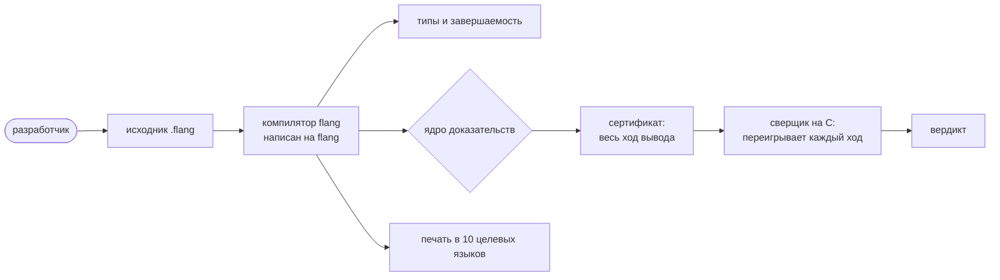

# flang — язык, в котором компилятор доказывает свойства программы

flang — чистый функциональный язык со строгой статической типизацией. Значений
менять нельзя, циклов нет, побочных действий у программы нет: ввод-вывод
возвращается данными, а исполняет его хозяин.

Отличает его от остальных одно: **обещания о программе проверяет компилятор, а
не тесты.** `тотальная` перед функцией — обещание, что она завершится на любом
входе. `требует` — условие, которое обязан снять тот, кто вызывает. `обеспечивает`
— утверждение о результате, закрытое про **все** входы. Не доказал — файл не
собран, код возврата 1.

Доказательство при этом компилятору на слово не берётся: `flang check --proof
--записать` кладёт весь ход вывода в файл, а **отдельная программа на C**
(`flang/proof/чекер/сверщик.c`, доверенная база) переигрывает каждый шаг заново.
Аксиом в ядре ноль, и это тоже прогон:
`flang io flang/scripts/kernel-forgeries.fscript --plan 'Аксиом ноль'` отвечает
кодом 0.



Язык самоприменим: компилятор flang написан на flang и печатает сам себя. На
flang же написаны стандартная библиотека, планировщик процессов, надзор и связь
между узлами — свой слой вместо OTP/BEAM. Записывается словами, а не значками;
ключевые слова есть в русской и английской раскладках.

## Пять минут

Положите в `privet.flang`:

```flang
модуль «Привет»

тотальная функция «Удвоить»
  принимает н: число
  возвращает число
  н плюс н
```

```bash
$ flang check privet.flang
модуль «Привет»: функций 1, из них с доказанным завершением 1; типов 0
privet.flang: проверено — разбор, типы, завершаемость, ядро и примеры; замечаний нет

$ flang run privet.flang --function Удвоить --args '{"н": 21}'
42
```

Как выглядит отказ, чем несётся каждое обещание и что из собранного кода
исчезает, когда обещание доказано, — на странице
[Как это доказывается](how-proofs-work.html).

## Установка

```bash
brew install digitable-lol/tap/flang
flang --version
```

Первая строка ставит из репозитория
[`homebrew-tap`](https://github.com/digitable-lol/homebrew-tap); вторая отвечает
`flang {{выпуск.версия}}`. Остальные пути — asdf, из исходников — на странице
[Установка](install.html).

## Что язык умеет сегодня

| Что есть | Где граница |
| --- | --- |
| **Завершаемость**: `тотальная` проверяется компилятором | циклов и изменяемых переменных в языке нет; не доказал — файл не собран |
| **Контракты**: `требует` снимается в точке вызова, `обеспечивает` закрывается про все входы | ядро берёт не всякую форму записи; какую берёт — [списком](what-the-kernel-accepts.html) |
| **Печать в {{цели.словом}} целевых языков**: {{цели.список}} | сокеты, часы и таблицу процессов компилятор не печатает |
| **[Процессы и надзор](processes.html)**: планировщик, надзор, обратное давление — всё написано на самом flang | объявления `процесс` и `надзор` двоичный компилятор не судит |
| **[PostgreSQL](database.html) и SQLite**: протокол PostgreSQL собран и разобран, файл SQLite читается, собирается с нуля и принимает запись строки | у PostgreSQL вход только `trust` и пароль открытым текстом; SQLite пишется только в свободное место готового файла, без деления страницы и без журнала |
| **HTTP**: разбор и печать запросов и ответов, заголовки, коды, адреса, процентное кодирование | сокета нет: байты приносит и уносит хозяин |
| **Своя криптография**: SHA-256, HMAC, AES-128 в режимах CTR и GCM, X25519, чтение сертификата X.509 | TLS не собран: `https` исполняет внешний `curl` |

## Чем это подтверждено

Прогон `sh scripts/доказуемость.sh` на стволе 19 сентября 2026 (коммит
`a5609e322`), около трёх минут:

```
ДОКАЗУЕМ
проверка 1 — калькулятор снят? ДА (∀-целей на слове ядра 3 из 3, видов обязательства переиграно 39 из 39)
проверка 2 — доля проигрыванием не ниже 100 %? ДА (100.00 %: 650 из 650; недостижимых мест вынесено 27)
проверка 3 — набор проб пройден? ДА (подделок 36 из 36; проб на подлог 533, принято кодом 0 — 0; честных 245, отвергнуто 0)
проверка 4 — набор не ослаб? ДА
```

Читается так: все 650 обязательств, которые ядро записало в сертификат,
сверщик переиграл сам; 533 подложных доказательства он отверг, 245 честных
принял.

**Это не «100 % программ доказаны».** Сто процентов здесь — доля мест в
СОБСТВЕННЫХ записях доказательства компилятора, и о напечатанном коде она не
говорит ничего. Покрытий всего четыре, и три остальных ниже: правила вывода,
формализованные в Lean; открытый список известных нарушений состоятельности;
сверка перевода в C. Все четыре печатает рядом, с датой и коммитом,
`sh scripts/four-coverages.sh`; чего не значит каждое — на странице
[Что доказано, а что нет](what-is-proved.html).

По дереву языка: {{корпус.тотальных}} функций из {{корпус.функций}} завершаются
доказанно, из {{утверждения.высказано}} утверждений о поведении ядро закрыло
{{утверждения.доказано}}. Эти четыре числа сняты 23 августа 2026 (коммит
`252606e8`) прогоном компилятора по всему дереву — он идёт часы, и с тех пор не
переснимался; дешёвые числа страницы (файлы, строки, функции) пересчитываются за
девять секунд и сверяются на каждый пуш
(`sh scripts/guards/published-vs-tree.sh --числа`).

## Чем это отличается от Coq и Lean

**Не тем, что здесь доказывает машина, а там человек.** Писать доказательство
руками можно и здесь: `теорема` с шагами `дано`, `утверждаем`, `затем … по
свойству «…»`, `индукция по …`, `следовательно доказано` — структурная запись в
духе Isar из Isabelle, а не скрипт из тактик. Таких
теорем в дереве языка **285**, из них **55** в стандартной библиотеке (`grep -rac '^\s*теорема ' flang
--include='*.flang'`, сумма по `awk`, 19 сентября 2026).

Разница в том, **что остаётся руке.** Ядро закрывает утверждение само, и
написанная теорема нужна только на остаток. В отчёте это отдельное число:
`flang/stdlib/lists.flang` — «утверждений 66: доказано 42 … из них без теоремы
37». В Coq и Lean такого числа нет: там на каждое утверждение пишут либо терм,
либо тактику.

Вторая разница не в нашу пользу: за тридцать лет там накоплены десятки тысяч
готовых лемм, а здесь библиотека доказанного только набирается, и программу из
Coq и Lean чаще *извлекают* в другой язык, чем пишут на ней службу.

## Дальше

- [Как это доказывается](how-proofs-work.html) — завершаемость, предусловия и
  постусловия на коде и на выводе прогонов.
- [Первая программа](getting-started.html) — те же пять минут подробно, до
  печати программы в C.
- [Справочник конструкций](language.html) — как пишется каждая форма языка.
- [Операции языка](operations.html) — что звать, когда нужна готовая функция
  библиотеки.
