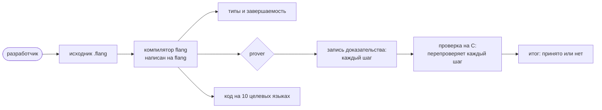

# flang — язык, в котором компилятор доказывает свойства программы

flang — чистый функциональный язык со статической типизацией. Значения
неизменяемы, циклов нет, у функций нет side effects: если программе нужен файл,
сеть или экран, она возвращает команду как данные, а выполняет её рантайм.

Чем он отличается: **контракт функции компилятор проверяет для всех входов, а
не только для тех, на которых случайно гоняются ваши тесты.**

| Пишете | Что это значит | Что делает компилятор |
| --- | --- | --- |
| `тотальная` перед функцией | функция всегда завершается | доказывает это; не смог — файл отвергнут |
| `требует` | precondition: что должно быть верно на входе | проверяет в каждой точке вызова |
| `обеспечивает` | postcondition: что функция гарантирует на выходе | **prover** доказывает для всех возможных входов |
| `пример` | unit-тест прямо в функции | прогоняет при каждой проверке |

Prover — часть компилятора, которая доказывает постусловия; в выводе
компилятора он называется «ядро». Верить ему на слово не нужно:
`flang check --proof --record <файл>` записывает доказательство целиком в файл,
а отдельная программа на C, `flang/proof/checker/checker.c`, перепроверяет
каждый шаг без компилятора. Аксиом у prover'а нет; проверить это самому —
`flang io flang/scripts/kernel-forgeries.fscript --plan 'Аксиом ноль' --trust`,
ответ — код возврата 0.


```mermaid Кто кого проверяет
flowchart LR
  R([разработчик]) --> S[исходник .flang]
  S --> K[компилятор flang<br>написан на flang]
  K --> T[типы и завершаемость]
  K --> Y{prover}
  Y --> C[запись доказательства:<br>каждый шаг]
  C --> V[проверка на C:<br>перепроверяет каждый шаг]
  V --> W[итог: принято или нет]
  K --> P[код на 10 целевых языках]
  class Y glavnoe
  class W vyvod
```

Компилятор flang написан на flang и компилирует сам себя. Стандартная
библиотека, планировщик процессов и супервизоры (замена Erlang/OTP) тоже
написаны на flang. Ключевые слова — слова, а не значки, и у каждого есть
русское и английское написание.

## Пять минут

Положите в `privet.flang`:

```flang
модуль «Привет»

тотальная функция «Удвоить»
  принимает н: число
  возвращает число
  н плюс н
```

Проверьте и запустите:

```bash
$ flang check privet.flang
модуль «Привет»: функций 1, из них с доказанным завершением 1; типов 0
privet.flang: проверено — разбор, типы, завершаемость, ядро и примеры; замечаний нет

$ flang run privet.flang --function Удвоить --args '{"н": 21}'
доказано: утверждений 0
42
```

`check` говорит: одна функция, её завершение доказано, замечаний нет. `run`
сначала сообщает, сколько постусловий доказано (здесь их нет), потом печатает
значение.

Как выглядит отказ в доказательстве и что компилятор убирает из
сгенерированного кода, когда свойство доказано, — на странице
[Как это доказывается](how-proofs-work.html).

## Установка

```bash
brew install digitable-lol/tap/flang
flang --version
```

Первая строка ставит из репозитория
[`homebrew-tap`](https://github.com/digitable-lol/homebrew-tap); вторая отвечает
`flang {{выпуск.версия}}`. asdf и сборка из исходников — на странице
[Установка](install.html).

## Что язык умеет

| Что есть | Чего нет |
| --- | --- |
| **Завершаемость**: `тотальная` доказывает компилятор | циклов и изменяемых переменных нет; не доказал завершение — файл отвергнут |
| **Контракты**: `требует` проверяется в точке вызова, `обеспечивает` доказывается для всех входов | prover принимает не всякую запись постусловия; какие принимает — [списком](what-the-kernel-accepts.html) |
| **Генерация кода на {{цели.словом}} целевых языков**: {{цели.список}} | сокеты, часы и таблица процессов не генерируются |
| **[Процессы и надзор](processes.html)**: планировщик, супервизоры, back pressure — всё на flang | объявления `процесс` и `надзор` двоичный компилятор разбирает, но не проверяет |
| **[PostgreSQL](database.html) и SQLite**: протокол PostgreSQL собирается и разбирается; файл SQLite читается, создаётся с нуля и принимает новую строку | вход в PostgreSQL — только `trust` и пароль открытым текстом; SQLite пишет только в свободное место существующего файла: без деления страницы и без журнала |
| **HTTP**: разбор и печать запросов и ответов — заголовки, коды ответа, адреса, процентное кодирование | сокетов нет: байты отправляет и принимает рантайм |
| **Криптография, написанная на flang**: SHA-256, HMAC, AES-128 и AES-256 в режимах CBC, CTR и GCM, X25519, чтение сертификата X.509 | TLS нет: `https` идёт через внешний `curl` |

## Как проверить эти слова

Одна команда проверяет, что собственные доказательства компилятора держатся:

```
bootstrap/flang io scripts/provability.fscript --plan Verdict --timeout 900000
```

Она идёт около минуты и заканчивается так:

```
ДОКАЗУЕМ

проверка 1 — калькулятор снят? ДА (ловушка: ∀-целей на слове ядра 3 из 3, видов обязательства переиграно 39 из 39 (храповик 38/3))
проверка 2 — доля проигрыванием не ниже 100 %? ДА (100.00 %: 650 из 650; недостижимых мест вынесено 27)
проверка 3 — набор проб пройден? ДА (набор подделок 36 из 36; проб на подлог 575, принято кодом 0 — 0; честных 274, отвергнуто 0)
проверка 4 — набор не ослаб? ДА (в манифесте 36 при храповике 36; числитель 187 при храповике 155; проб на подлог 575 при храповике 572)
```

Как читать: проверка на C сама перепроверила все 650 шагов в записях
доказательств, которые пишет компилятор; все 575 нарочно испорченных
доказательств она отвергла, все 274 правильных приняла.

**Это не значит «100 % программ доказаны».** Сто процентов — про доказательства,
которые пишет компилятор, а не про код, который он генерирует. Три другие меры
ниже: сколько правил вывода формализовано в Lean, список известных ошибок
состоятельности prover'а и какая часть перевода в C проверена. Все четыре
печатает `bootstrap/flang io scripts/four-coverages.fscript --plan Measure --timeout 900000`.
Чего не покрывает каждая — на странице [Что доказано, а что нет](what-is-proved.html).

По всему репозиторию у {{корпус.тотальных}} функций из {{корпус.функций}}
завершение доказано, а из {{утверждения.высказано}} постусловий и других
свойств prover доказал {{утверждения.доказано}}. Эти четыре числа дал полный
прогон компилятора по репозиторию (`bootstrap/flang run-script numbers:build`,
несколько часов), поэтому они могут отставать от кода. Дешёвые числа (файлы,
строки, функции) пересчитываются на каждый push командой
`sh scripts/guards/published-vs-tree.sh --числа`.

## Чем это отличается от Coq и Lean

**Доказательство руками можно писать и здесь.** `теорема` пишется по шагам:
`дано`, `утверждаем`, `затем … по свойству «…»`, `индукция по …`,
`следовательно доказано`. Это читается как доказательство на Isar из Isabelle, а
не как скрипт из тактик. Таких теорем в дереве языка **310**, из них **55** в
стандартной библиотеке (`grep -rac '^\s*теорема ' flang --include='*.flang'`,
сумма по `awk`).

**Разница в том, сколько приходится писать.** Большинство свойств prover
доказывает сам, а теорема пишется только на остаток. Отчёт показывает это
отдельным числом: для `flang/stdlib/lists.flang` — «утверждений 66: доказано 42
… из них без теоремы 37», то есть 66 свойств, 42 доказаны, 37 из них без
написанной теоремы. В Coq и Lean на каждое свойство пишут proof term или скрипт
из тактик.

**В чём Coq и Lean впереди:** у них десятки тысяч готовых лемм, а библиотека
доказанных свойств flang маленькая. Зато программу на Coq и Lean обычно
*извлекают* в другой язык, а программу на flang запускают как есть.

## Дальше

- [Как это доказывается](how-proofs-work.html) — завершаемость, предусловия и
  постусловия на настоящем выводе компилятора.
- [Первая программа](getting-started.html) — те же пять минут подробно, до
  генерации C.
- [Какую конструкцию когда брать](which-construct.html) — что писать под задачу:
  enum, Optional, Result, map, filter, reduce, работа с файлами.
- [Справочник конструкций](language.html) — синтаксис каждой конструкции.
- [Операции языка](operations.html) — функции стандартной библиотеки по задачам.
