# Map of the language constructs

Every word of the language is a node. A solid arrow means "the second is
written inside the first". A dashed arrow means "the first gives the second" or
"the first refers to the second". Which construct to take for which action is on
the page [Which construct to use when](which-construct.html).

## How to read it

| Node | What it means |
| --- | --- |
| a filled rectangle | a concept of the [glossary](../glossary.html); it stands on the map exactly once |
| a rounded rectangle | a construct that the glossary does not have |
| an oval marked "layer N" | a reference to a concept drawn in layer N |
| an oval without a mark | a label: what goes in or what comes out |

A filled rectangle carries two spellings: the Russian word and the English one.
Both are the same word of the language on two writing surfaces.

## Compared with the glossary

The glossary holds {{словарь.понятий}} concepts. The map holds 156 glossary
concepts, each of them once; there is no difference. Beyond the glossary the map
has 22 nodes: constructs that the [specification](../spec.html) has and the
glossary does not. There are 17 layers.

The glossary concepts are
counted with the command below. The nodes of the map are
counted from the text of the diagrams of this page: for a glossary concept the
number of the node is the number of its row in the glossary.

```bash
grep -c '^| `' docs/glossary.md
```

| Layer | What is in it | Glossary concepts | Nodes beyond the glossary |
| --- | --- | ---: | ---: |
| 1 | File and declarations | 14 | 0 |
| 2 | Own types: sum and record | 7 | 0 |
| 3 | Built-in types and values | 12 | 6 |
| 4 | Function | 11 | 0 |
| 5 | Body: match | 6 | 0 |
| 6 | Body: if, fold, let | 5 | 0 |
| 7 | Call and connectives | 8 | 0 |
| 8 | Arithmetic, comparison, logic | 15 | 0 |
| 9 | Forms over a list | 8 | 0 |
| 10 | Forms over a string | 14 | 0 |
| 11 | Proofs | 12 | 0 |
| 12 | Plans and orders | 3 | 12 |
| 13 | Processes and supervision | 5 | 4 |
| 14 | Category and morphisms | 13 | 0 |
| 15 | Functors | 7 | 0 |
| 16 | Monoid and monad | 10 | 0 |
| 17 | Legacy surface | 6 | 0 |
| | **total** | **156** | **22** |

The nodes beyond the glossary, by name:

| Layer | Nodes | Where they come from |
| --- | --- | --- |
| 3 | `неотрицательное` (also `нат`), `целое`, `вес` (also `стоимость`), `сотых`, `тысячных`, the function type | the [specification](../spec.html), section «Типы» |
| 12 | the sums «Продолжение» with four variants, «Отклик», six groups of orders | the [specification](../spec.html), section «Ввод-вывод» |
| 13 | the sum «Действие», three supervision strategies | the [process contract](../spec-conc.html) |

## 1. File and declarations

Glossary concepts in the diagram: 14. Nodes beyond the glossary: 0. References and labels: 1.

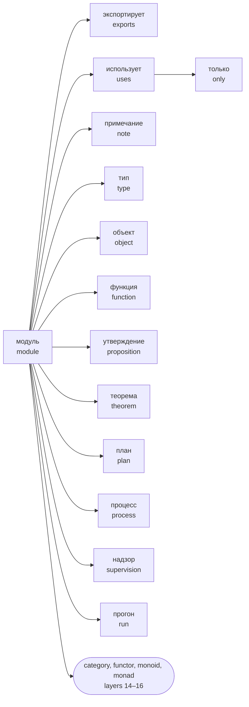

## 2. Own types: sum and record

Glossary concepts in the diagram: 7. Nodes beyond the glossary: 0. References and labels: 6.

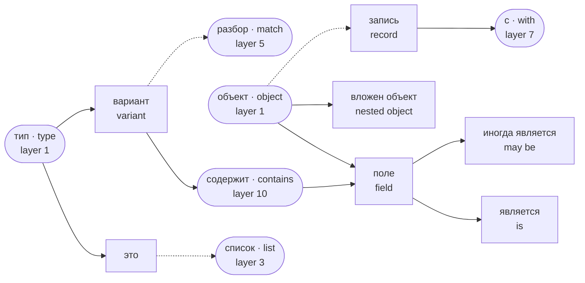

## 3. Built-in types and values

Glossary concepts in the diagram: 12. Nodes beyond the glossary: 6. References and labels: 1.

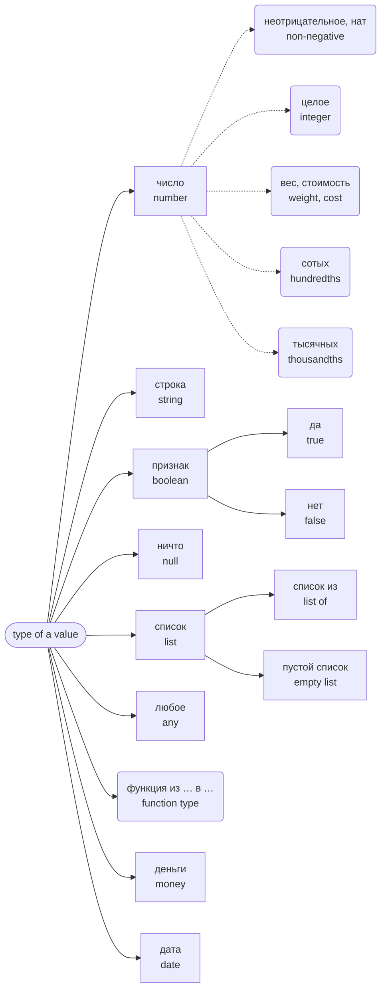

The types `неотрицательное`, `целое`, `вес`, `сотых`, `тысячных` and the function type are not in the glossary: the glossary is printed from the table of words, and these names are read in the position of a type. In the diagram they are nodes beyond the glossary.

## 4. Function

Glossary concepts in the diagram: 11. Nodes beyond the glossary: 0. References and labels: 2.

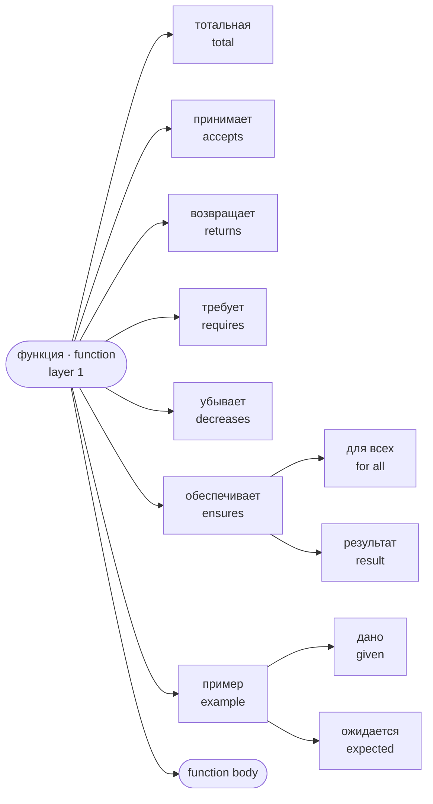

## 5. Body: match

Glossary concepts in the diagram: 6. Nodes beyond the glossary: 0. References and labels: 3.

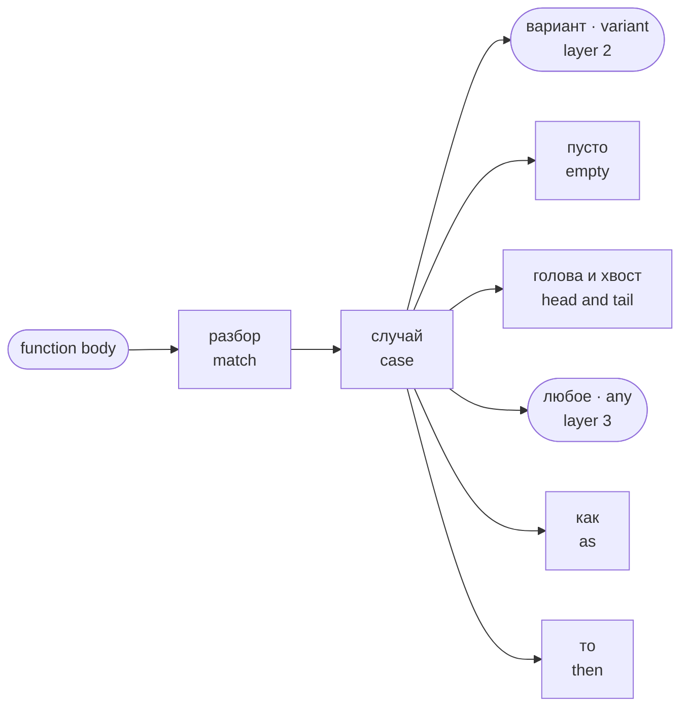

Induction in a proof attaches to this form. There are five patterns: a variant of a sum, `пусто`, `голова и хвост`, `любое`, and binding a field with the word `как`.

## 6. Body: if, fold, let

Glossary concepts in the diagram: 5. Nodes beyond the glossary: 0. References and labels: 4.

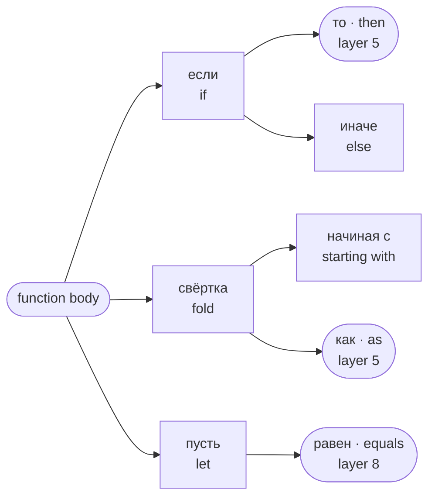

## 7. Call and connectives

Glossary concepts in the diagram: 8. Nodes beyond the glossary: 0. References and labels: 7.

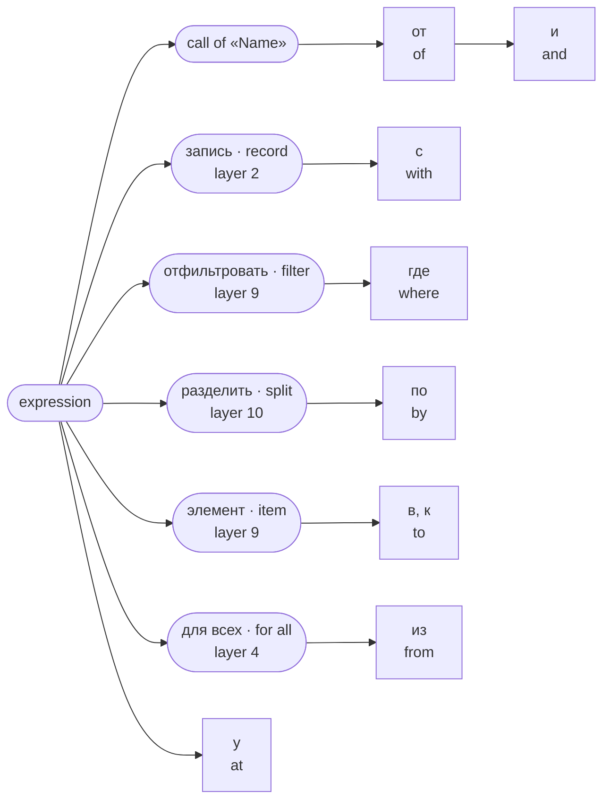

## 8. Arithmetic, comparison, logic

Glossary concepts in the diagram: 15. Nodes beyond the glossary: 0. References and labels: 6.

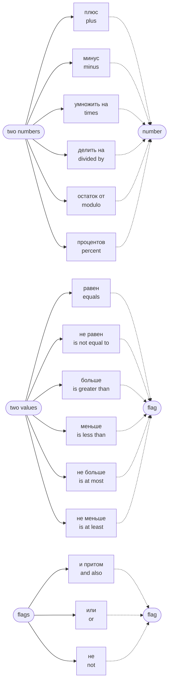

## 9. Forms over a list

Glossary concepts in the diagram: 8. Nodes beyond the glossary: 0. References and labels: 5.

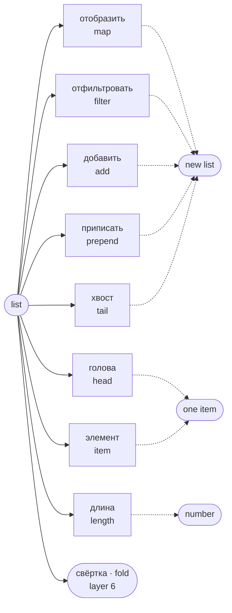

## 10. Forms over a string

Glossary concepts in the diagram: 14. Nodes beyond the glossary: 0. References and labels: 9.

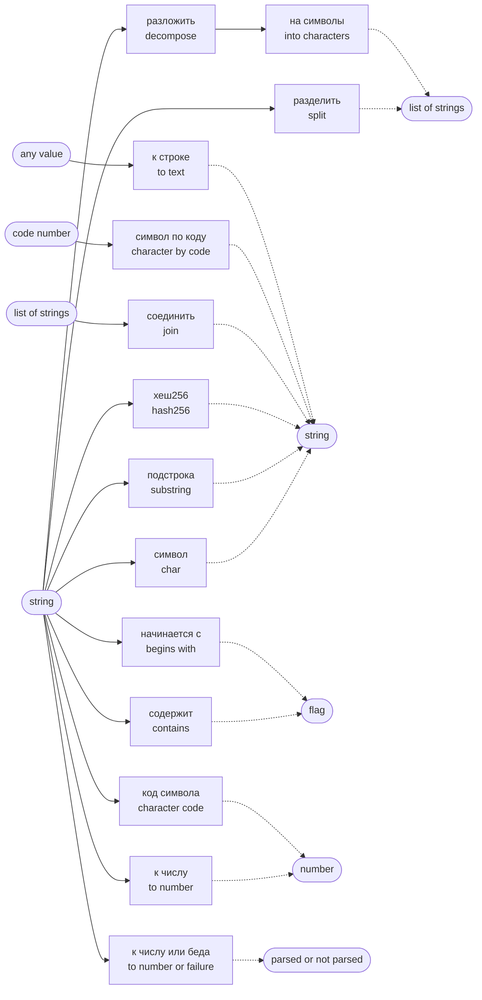

## 11. Proofs

Glossary concepts in the diagram: 12. Nodes beyond the glossary: 0. References and labels: 10.

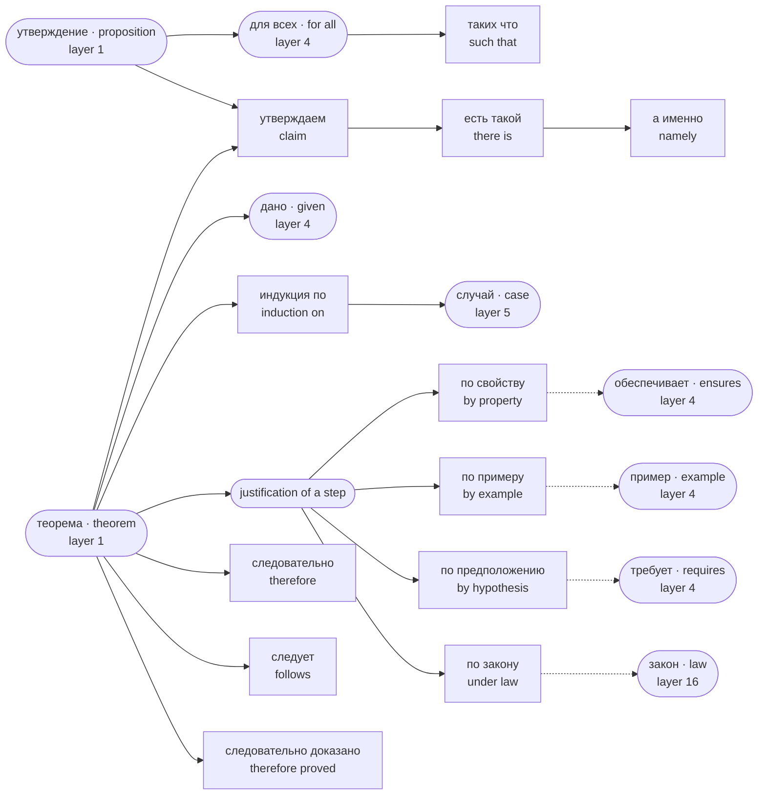

## 12. Plans and orders

Glossary concepts in the diagram: 3. Nodes beyond the glossary: 12. References and labels: 4.

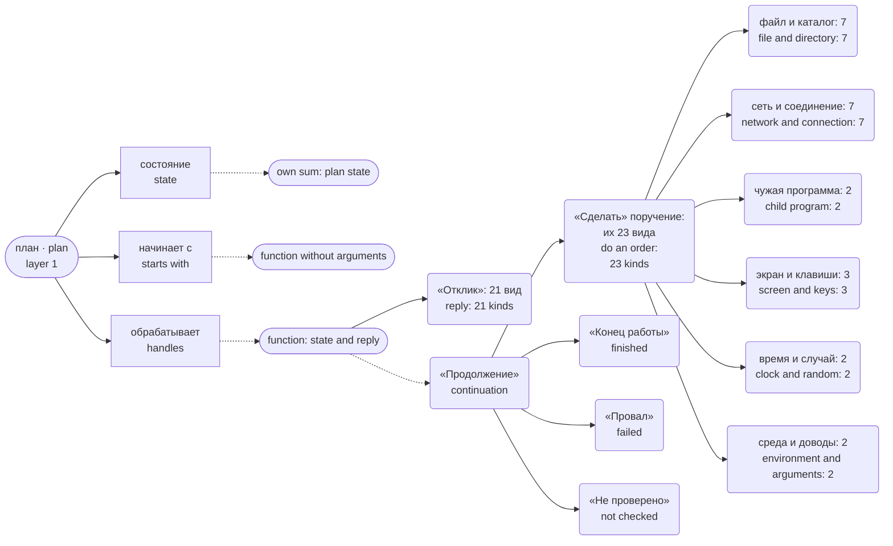

The names in guillemets are the input-output vocabulary: three sums that the compiler adds to a program with a plan. They are not in the glossary. The numbers of kinds come from `flang/self/parser.flang`, the functions «Варианты поручения», «Варианты отклика», «Варианты продолжения».

## 13. Processes and supervision

Glossary concepts in the diagram: 5. Nodes beyond the glossary: 4. References and labels: 9.

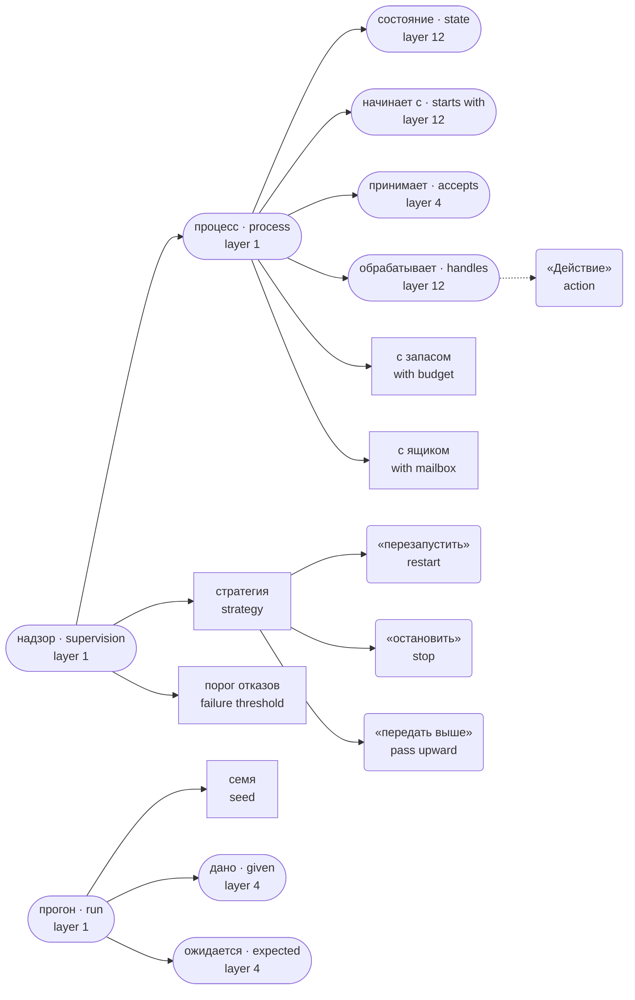

`flang check` on a program with processes answers with code 2: parsing, types, termination and examples pass, while the rules of the declarations themselves are not judged by the binary compiler, which says so in words.

## 14. Category and morphisms

Glossary concepts in the diagram: 13. Nodes beyond the glossary: 0. References and labels: 3.

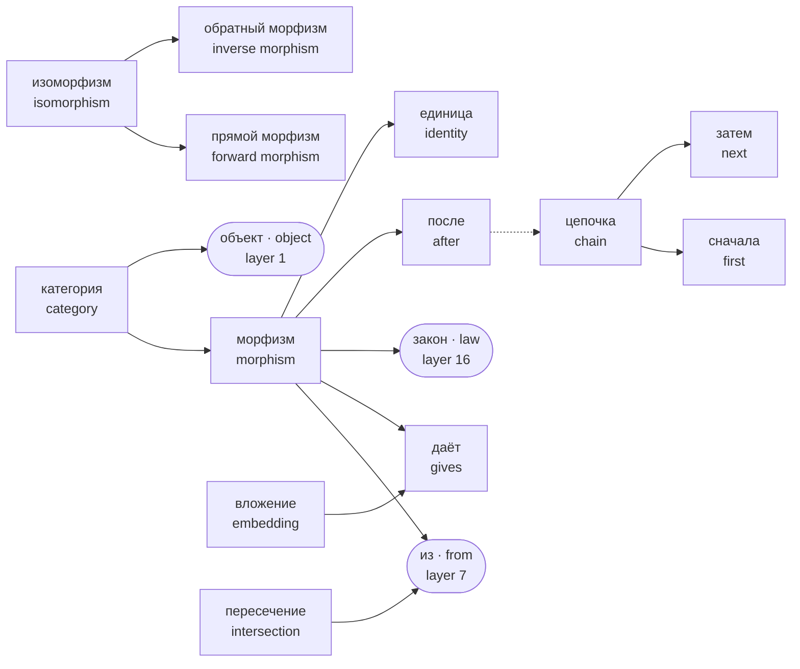

A program with these declarations also gets code 2 from `flang check`, for the same reason.

## 15. Functors

Glossary concepts in the diagram: 7. Nodes beyond the glossary: 0. References and labels: 0.

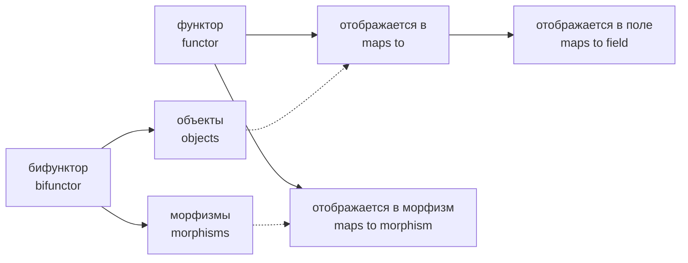

## 16. Monoid and monad

Glossary concepts in the diagram: 10. Nodes beyond the glossary: 0. References and labels: 2.

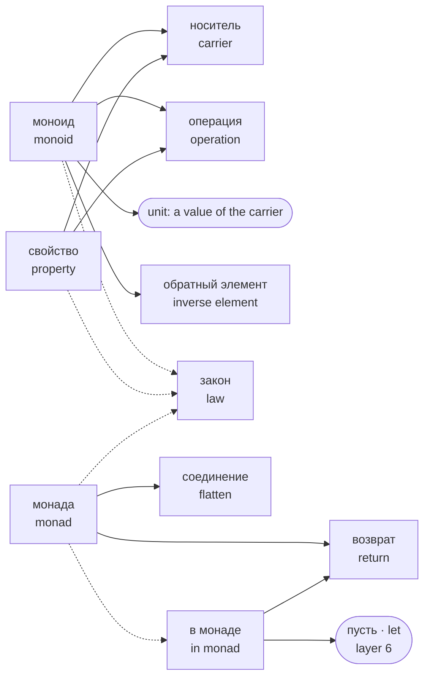

## 17. Legacy surface

Glossary concepts in the diagram: 6. Nodes beyond the glossary: 0. References and labels: 1.

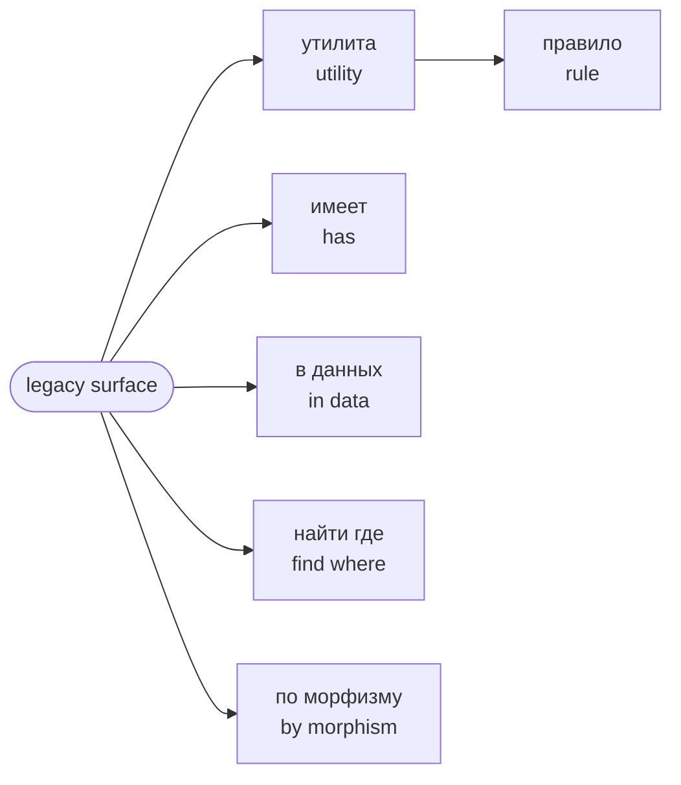

These words are parsed, but no program can be made of them today. They are not written in new code.

## Next

- [Which construct to use when](which-construct.html) — the choice by action, and examples
- [Language reference](language.html) — how every construct is written
- [Glossary](../glossary.html) — every word on four surfaces, in Russian
