# Карта конструкций языка

Каждое слово языка — узел. Сплошная стрелка значит «внутри первого пишется
второе». Пунктирная значит «первое даёт второе» или «первое ссылается на
второе». Какую конструкцию брать под какое действие — на странице
[Какую конструкцию когда брать](which-construct.html).

## Как читать

| Узел | Что значит |
| --- | --- |
| прямоугольник с заливкой | понятие [словаря языка](glossary.html); на карте стоит ровно один раз |
| скруглённый прямоугольник | конструкция, которой в словаре нет |
| овал с пометкой «слой N» | ссылка на понятие, нарисованное в слое N |
| овал без пометки | подпись: что подаётся на вход или получается на выходе |

## Сверка со словарём

В словаре {{словарь.понятий}} понятий. На карте понятий словаря 156, каждое
по одному разу; расхождения нет. Сверх словаря на карте 22 узла: это
конструкции, которые есть в [спецификации](spec.html), а в словаре их нет.
Слоёв 17.

Понятия словаря сосчитаны командой ниже. Узлы карты сосчитаны по тексту схем этой
страницы: у понятия словаря номер узла равен номеру его строки в словаре.

```bash
grep -c '^| `' docs/glossary.md
```

| Слой | Что в нём | Понятий словаря | Узлов сверх словаря |
| --- | --- | ---: | ---: |
| 1 | Файл и объявления | 14 | 0 |
| 2 | Свои типы: сумма и запись | 7 | 0 |
| 3 | Готовые типы и значения | 12 | 6 |
| 4 | Функция | 11 | 0 |
| 5 | Тело: разбор | 6 | 0 |
| 6 | Тело: если, свёртка, пусть | 5 | 0 |
| 7 | Вызов и связки | 8 | 0 |
| 8 | Арифметика, сравнения, логика | 15 | 0 |
| 9 | Формы над списком | 8 | 0 |
| 10 | Формы над строкой | 14 | 0 |
| 11 | Доказательства | 12 | 0 |
| 12 | Планы и поручения | 3 | 12 |
| 13 | Процессы и надзор | 5 | 4 |
| 14 | Категория и морфизмы | 13 | 0 |
| 15 | Функторы | 7 | 0 |
| 16 | Моноид и монада | 10 | 0 |
| 17 | Наследие прежней поверхности | 6 | 0 |
| | **всего** | **156** | **22** |

Узлы сверх словаря, поимённо:

| Слой | Узлы | Откуда взяты |
| --- | --- | --- |
| 3 | `неотрицательное` (оно же `нат`), `целое`, `вес` (оно же `стоимость`), `сотых`, `тысячных`, тип функции | [спецификация](spec.html), раздел «Типы» |
| 12 | суммы «Продолжение» с четырьмя вариантами, «Отклик», шесть групп поручений | [спецификация](spec.html), раздел «Ввод-вывод» |
| 13 | сумма «Действие», три стратегии надзора | [контракт процессов](spec-conc.html) |

## 1. Файл и объявления

Понятий словаря на схеме: 14. Узлов сверх словаря: 0. Ссылок и подписей: 1.

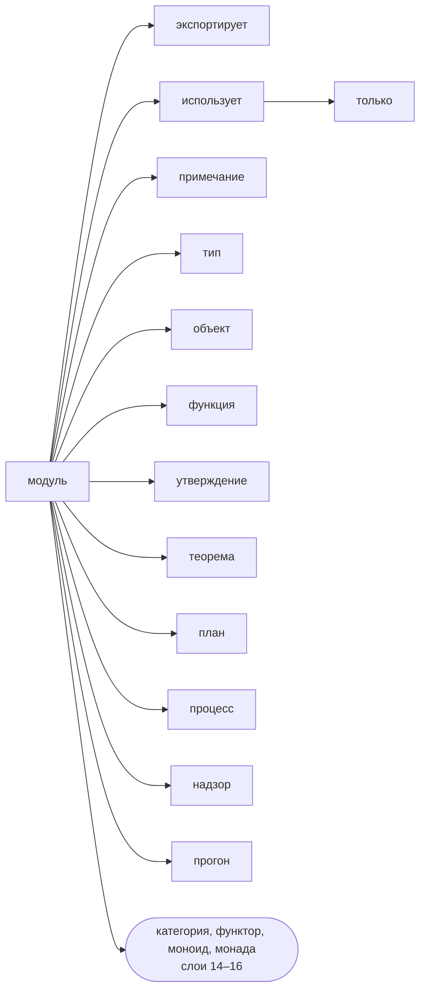
```mermaid Файл и объявления
flowchart LR
  c1[модуль]
  c2[экспортирует]
  c3[использует]
  c35[только]
  c11[примечание]
  c7[тип]
  c5[объект]
  c16[функция]
  c124[утверждение]
  c119[теорема]
  c156[план]
  c147[процесс]
  c151[надзор]
  c154[прогон]
  g_cat([категория, функтор, моноид, монада<br>слои 14–16])
  c1 --> c2
  c1 --> c3
  c3 --> c35
  c1 --> c11
  c1 --> c7
  c1 --> c5
  c1 --> c16
  c1 --> c124
  c1 --> c119
  c1 --> c156
  c1 --> c147
  c1 --> c151
  c1 --> c154
  c1 --> g_cat
  class c1,c2,c3,c35,c11,c7,c5,c16,c124,c119,c156,c147,c151,c154 vyvod
```

## 2. Свои типы: сумма и запись

Понятий словаря на схеме: 7. Узлов сверх словаря: 0. Ссылок и подписей: 6.

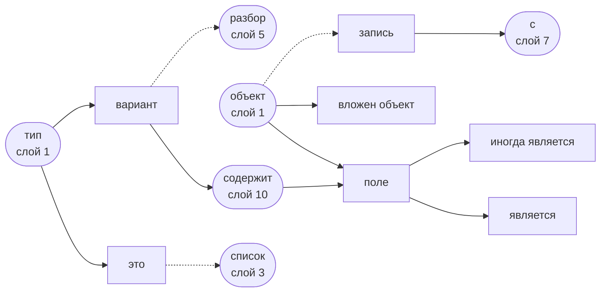
```mermaid Свои типы: сумма и запись
flowchart LR
  p7([тип<br>слой 1])
  c9[это]
  c8[вариант]
  p52([содержит<br>слой 10])
  c97[поле]
  p5([объект<br>слой 1])
  c10[вложен объект]
  c90[является]
  c91[иногда является]
  p65([список<br>слой 3])
  p26([разбор<br>слой 5])
  c6[запись]
  p33([с<br>слой 7])
  p7 --> c9
  p7 --> c8
  c8 --> p52
  p52 --> c97
  p5 --> c97
  p5 --> c10
  c97 --> c90
  c97 --> c91
  c9 -.-> p65
  c8 -.-> p26
  p5 -.-> c6
  c6 --> p33
  class c9,c8,c97,c10,c90,c91,c6 vyvod
```

## 3. Готовые типы и значения

Понятий словаря на схеме: 12. Узлов сверх словаря: 6. Ссылок и подписей: 1.

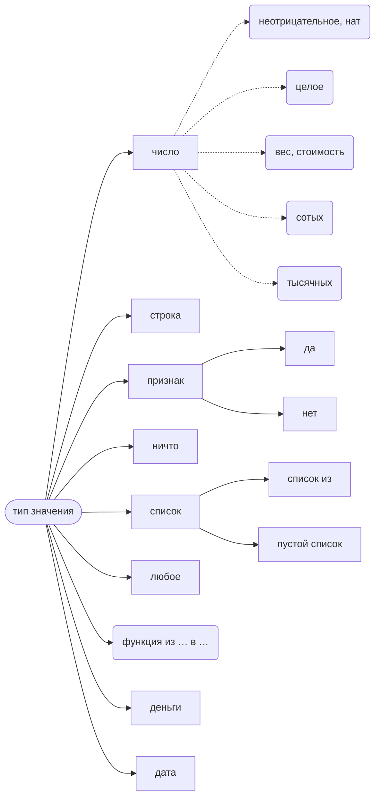
```mermaid Готовые типы и значения
flowchart LR
  g_types([тип значения])
  c84[число]
  c85[строка]
  c86[признак]
  c83[ничто]
  c65[список]
  c68[любое]
  s_fntype(функция из … в …)
  c87[деньги]
  c88[дата]
  s_nat(неотрицательное, нат)
  s_int(целое)
  s_weight(вес, стоимость)
  s_cent(сотых)
  s_mille(тысячных)
  c81[да]
  c82[нет]
  c64[список из]
  c63[пустой список]
  g_types --> c84
  g_types --> c85
  g_types --> c86
  g_types --> c83
  g_types --> c65
  g_types --> c68
  g_types --> s_fntype
  g_types --> c87
  g_types --> c88
  c84 -.-> s_nat
  c84 -.-> s_int
  c84 -.-> s_weight
  c84 -.-> s_cent
  c84 -.-> s_mille
  c86 --> c81
  c86 --> c82
  c65 --> c64
  c65 --> c63
  class c84,c85,c86,c83,c65,c68,c87,c88,c81,c82,c64,c63 vyvod
```

Типы `неотрицательное`, `целое`, `вес`, `сотых`, `тысячных` и запись типа функции в словарь не входят: словарь печатается из таблицы слов, а эти имена разбираются в позиции типа. На схеме они стоят узлами сверх словаря.

## 4. Функция

Понятий словаря на схеме: 11. Узлов сверх словаря: 0. Ссылок и подписей: 2.

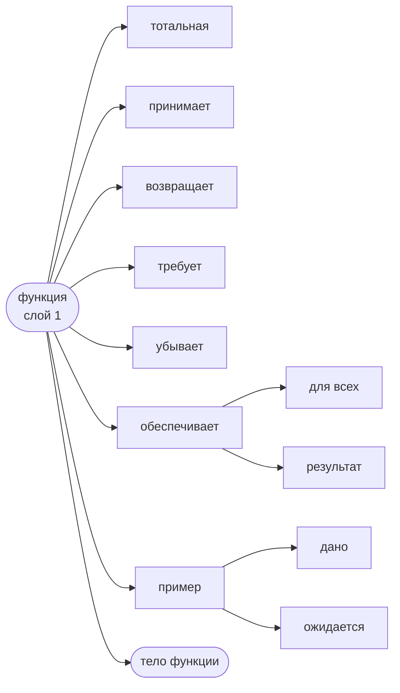
```mermaid Функция
flowchart LR
  p16([функция<br>слой 1])
  c15[тотальная]
  c17[принимает]
  c18[возвращает]
  c135[требует]
  c14[убывает]
  c136[обеспечивает]
  c19[пример]
  g_body([тело функции])
  c137[для всех]
  c95[результат]
  c20[дано]
  c21[ожидается]
  p16 --> c15
  p16 --> c17
  p16 --> c18
  p16 --> c135
  p16 --> c14
  p16 --> c136
  p16 --> c19
  p16 --> g_body
  c136 --> c137
  c136 --> c95
  c19 --> c20
  c19 --> c21
  class c15,c17,c18,c135,c14,c136,c19,c137,c95,c20,c21 vyvod
```

## 5. Тело: разбор

Понятий словаря на схеме: 6. Узлов сверх словаря: 0. Ссылок и подписей: 3.

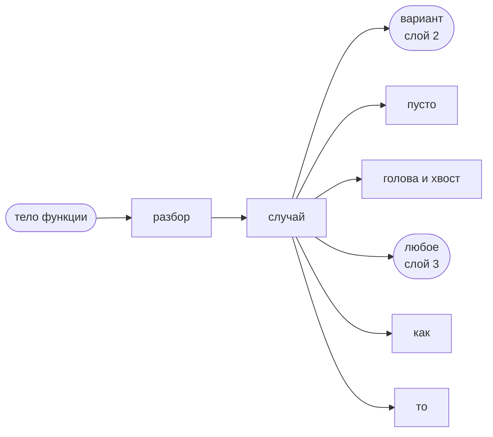
```mermaid Тело: разбор
flowchart LR
  g_body([тело функции])
  c26[разбор]
  c27[случай]
  p8([вариант<br>слой 2])
  c62[пусто]
  c61[голова и хвост]
  p68([любое<br>слой 3])
  c39[как]
  c24[то]
  g_body --> c26
  c26 --> c27
  c27 --> p8
  c27 --> c62
  c27 --> c61
  c27 --> p68
  c27 --> c39
  c27 --> c24
  class c26,c27,c62,c61,c39,c24 vyvod
```

Индукция в доказательстве цепляется к этой форме. Образцов пять: вариант суммы, `пусто`, `голова и хвост`, `любое` и связывание поля словом `как`.

## 6. Тело: если, свёртка, пусть

Понятий словаря на схеме: 5. Узлов сверх словаря: 0. Ссылок и подписей: 4.

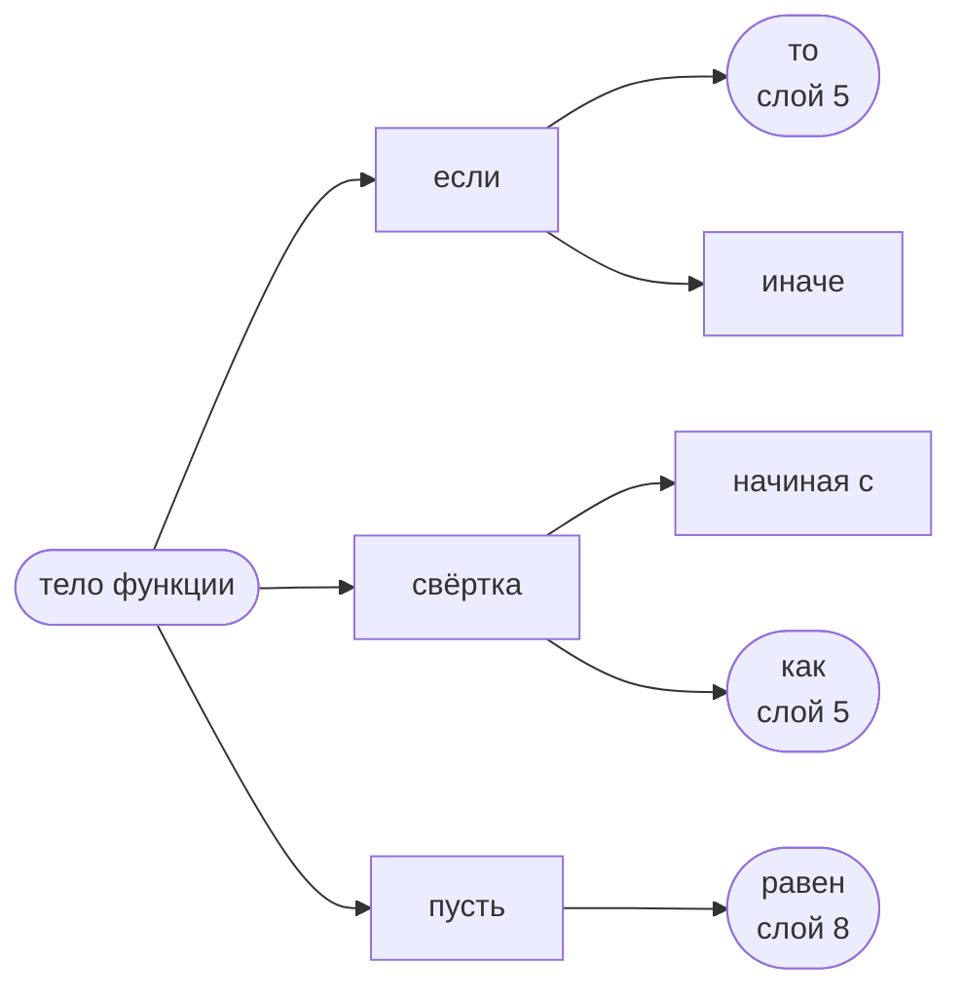
```mermaid Тело: если, свёртка, пусть
flowchart LR
  g_body2([тело функции])
  c23[если]
  c44[свёртка]
  c22[пусть]
  p24([то<br>слой 5])
  c25[иначе]
  c41[начиная с]
  p39([как<br>слой 5])
  p75([равен<br>слой 8])
  g_body2 --> c23
  g_body2 --> c44
  g_body2 --> c22
  c23 --> p24
  c23 --> c25
  c44 --> c41
  c44 --> p39
  c22 --> p75
  class c23,c44,c22,c25,c41 vyvod
```

## 7. Вызов и связки

Понятий словаря на схеме: 8. Узлов сверх словаря: 0. Ссылок и подписей: 7.

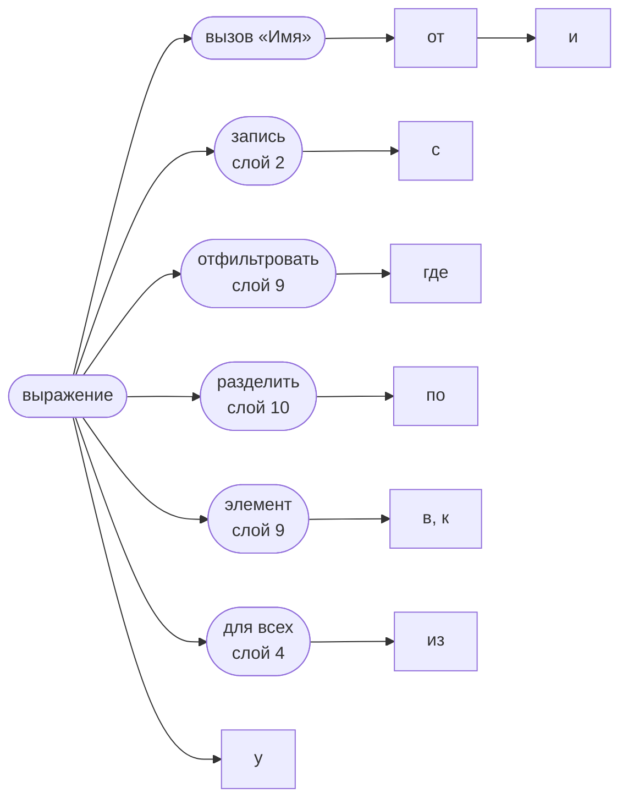
```mermaid Вызов и связки
flowchart LR
  g_expr([выражение])
  g_call([вызов «Имя»])
  c28[от]
  c29[и]
  p6([запись<br>слой 2])
  c33[с]
  p43([отфильтровать<br>слой 9])
  c40[где]
  p51([разделить<br>слой 10])
  c37[по]
  p60([элемент<br>слой 9])
  c36[в, к]
  p137([для всех<br>слой 4])
  c34[из]
  c38[у]
  g_expr --> g_call
  g_call --> c28
  c28 --> c29
  g_expr --> p6
  p6 --> c33
  g_expr --> p43
  p43 --> c40
  g_expr --> p51
  p51 --> c37
  g_expr --> p60
  p60 --> c36
  g_expr --> p137
  p137 --> c34
  g_expr --> c38
  class c28,c29,c33,c40,c37,c36,c34,c38 vyvod
```

## 8. Арифметика, сравнения, логика

Понятий словаря на схеме: 15. Узлов сверх словаря: 0. Ссылок и подписей: 6.

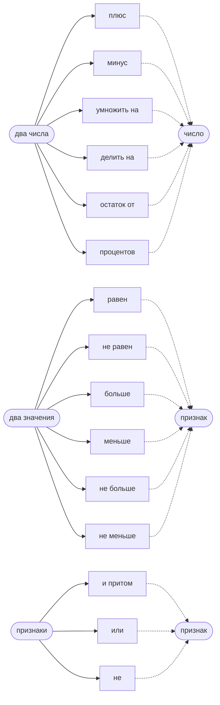
```mermaid Арифметика, сравнения, логика
flowchart LR
  g_two_numbers([два числа])
  c69[плюс]
  c70[минус]
  c71[умножить на]
  c72[делить на]
  c73[остаток от]
  c74[процентов]
  g_number_out([число])
  g_two_values([два значения])
  c75[равен]
  c76[не равен]
  c77[больше]
  c78[меньше]
  c79[не больше]
  c80[не меньше]
  g_flag_out([признак])
  g_flags([признаки])
  c30[и притом]
  c31[или]
  c32[не]
  g_flag_out2([признак])
  g_two_numbers --> c69
  g_two_numbers --> c70
  g_two_numbers --> c71
  g_two_numbers --> c72
  g_two_numbers --> c73
  g_two_numbers --> c74
  c69 -.-> g_number_out
  c70 -.-> g_number_out
  c71 -.-> g_number_out
  c72 -.-> g_number_out
  c73 -.-> g_number_out
  c74 -.-> g_number_out
  g_two_values --> c75
  g_two_values --> c76
  g_two_values --> c77
  g_two_values --> c78
  g_two_values --> c79
  g_two_values --> c80
  c75 -.-> g_flag_out
  c76 -.-> g_flag_out
  c77 -.-> g_flag_out
  c78 -.-> g_flag_out
  c79 -.-> g_flag_out
  c80 -.-> g_flag_out
  g_flags --> c30
  g_flags --> c31
  g_flags --> c32
  c30 -.-> g_flag_out2
  c31 -.-> g_flag_out2
  c32 -.-> g_flag_out2
  class c69,c70,c71,c72,c73,c74,c75,c76,c77,c78,c79,c80,c30,c31,c32 vyvod
```

## 9. Формы над списком

Понятий словаря на схеме: 8. Узлов сверх словаря: 0. Ссылок и подписей: 5.

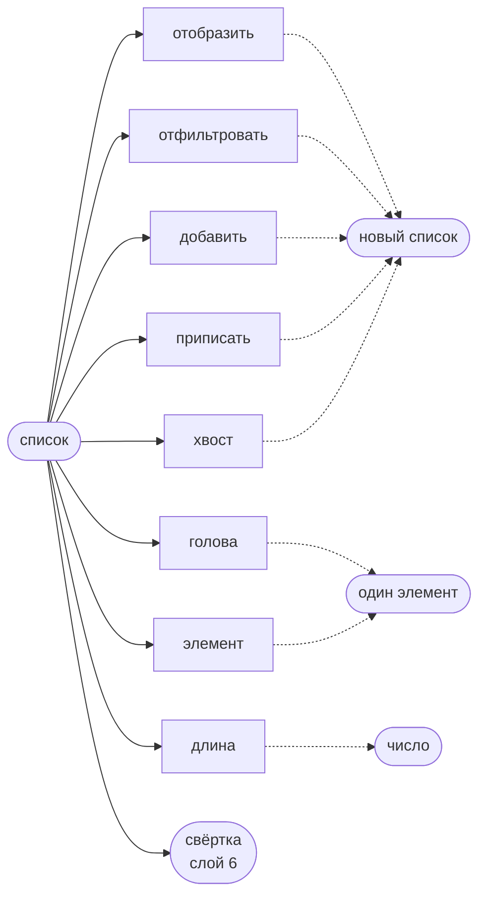
```mermaid Формы над списком
flowchart LR
  g_list_in([список])
  c42[отобразить]
  c43[отфильтровать]
  c66[добавить]
  c67[приписать]
  c59[хвост]
  c58[голова]
  c60[элемент]
  c45[длина]
  p44([свёртка<br>слой 6])
  g_list_out([новый список])
  g_item_out([один элемент])
  g_num_out([число])
  g_list_in --> c42
  g_list_in --> c43
  g_list_in --> c66
  g_list_in --> c67
  g_list_in --> c59
  g_list_in --> c58
  g_list_in --> c60
  g_list_in --> c45
  g_list_in --> p44
  c42 -.-> g_list_out
  c43 -.-> g_list_out
  c66 -.-> g_list_out
  c67 -.-> g_list_out
  c59 -.-> g_list_out
  c58 -.-> g_item_out
  c60 -.-> g_item_out
  c45 -.-> g_num_out
  class c42,c43,c66,c67,c59,c58,c60,c45 vyvod
```

## 10. Формы над строкой

Понятий словаря на схеме: 14. Узлов сверх словаря: 0. Ссылок и подписей: 9.

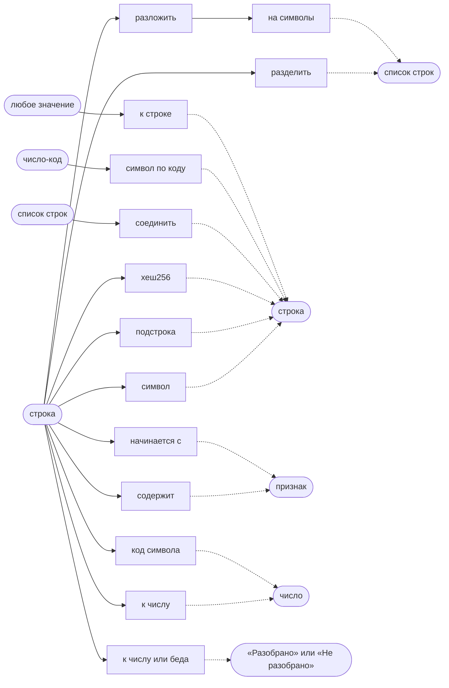
```mermaid Формы над строкой
flowchart LR
  g_text_in([строка])
  c46[символ]
  c49[подстрока]
  c51[разделить]
  c47[разложить]
  c48[на символы]
  c52[содержит]
  c53[начинается с]
  c55[к числу]
  c54[к числу или беда]
  c12[код символа]
  c57[хеш256]
  g_texts_in([список строк])
  c50[соединить]
  g_code_in([число-код])
  c13[символ по коду]
  g_any_in([любое значение])
  c56[к строке]
  g_text_out([строка])
  g_texts_out([список строк])
  g_flag_out3([признак])
  g_num_out2([число])
  g_parsed_out([«Разобрано» или «Не разобрано»])
  g_text_in --> c46
  g_text_in --> c49
  g_text_in --> c51
  g_text_in --> c47
  c47 --> c48
  g_text_in --> c52
  g_text_in --> c53
  g_text_in --> c55
  g_text_in --> c54
  g_text_in --> c12
  g_text_in --> c57
  g_texts_in --> c50
  g_code_in --> c13
  g_any_in --> c56
  c46 -.-> g_text_out
  c49 -.-> g_text_out
  c57 -.-> g_text_out
  c50 -.-> g_text_out
  c13 -.-> g_text_out
  c56 -.-> g_text_out
  c51 -.-> g_texts_out
  c48 -.-> g_texts_out
  c52 -.-> g_flag_out3
  c53 -.-> g_flag_out3
  c55 -.-> g_num_out2
  c12 -.-> g_num_out2
  c54 -.-> g_parsed_out
  class c46,c49,c51,c47,c48,c52,c53,c55,c54,c12,c57,c50,c13,c56 vyvod
```

## 11. Доказательства

Понятий словаря на схеме: 12. Узлов сверх словаря: 0. Ссылок и подписей: 10.

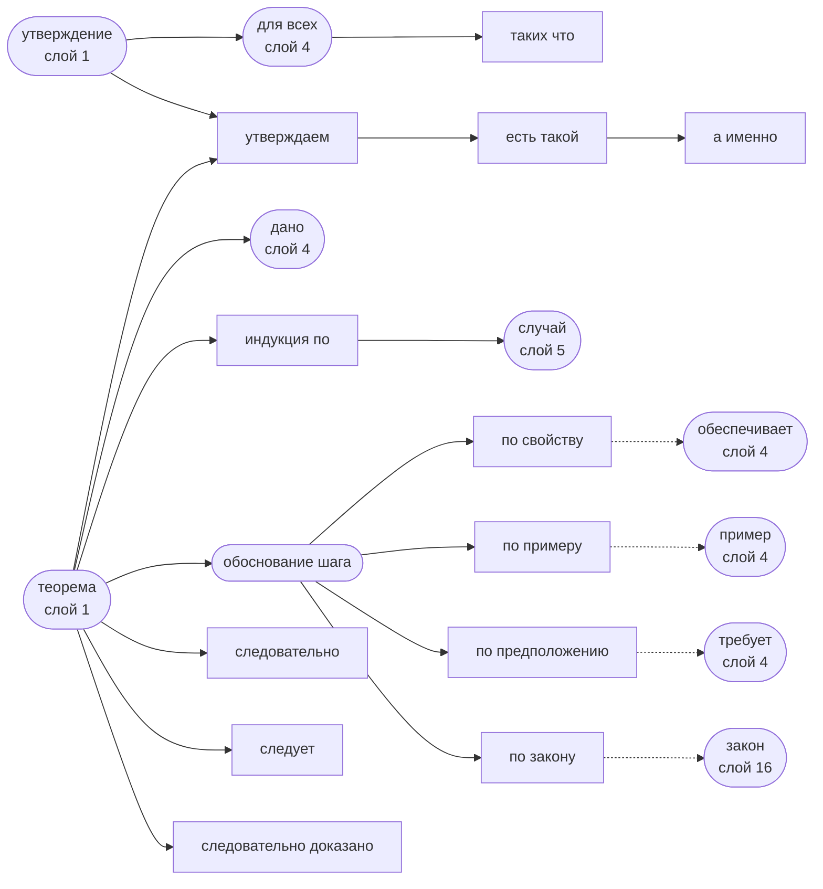
```mermaid Доказательства
flowchart LR
  p124([утверждение<br>слой 1])
  p137([для всех<br>слой 4])
  c138[таких что]
  c141[утверждаем]
  p119([теорема<br>слой 1])
  p20([дано<br>слой 4])
  c139[есть такой]
  c140[а именно]
  c142[индукция по]
  p27([случай<br>слой 5])
  g_step([обоснование шага])
  c143[по свойству]
  c144[по примеру]
  c145[по предположению]
  c131[по закону]
  c129[следовательно]
  c130[следует]
  c146[следовательно доказано]
  p136([обеспечивает<br>слой 4])
  p19([пример<br>слой 4])
  p135([требует<br>слой 4])
  p105([закон<br>слой 16])
  p124 --> p137
  p137 --> c138
  p124 --> c141
  p119 --> p20
  p119 --> c141
  c141 --> c139
  c139 --> c140
  p119 --> c142
  c142 --> p27
  p119 --> g_step
  g_step --> c143
  g_step --> c144
  g_step --> c145
  g_step --> c131
  p119 --> c129
  p119 --> c130
  p119 --> c146
  c143 -.-> p136
  c144 -.-> p19
  c145 -.-> p135
  c131 -.-> p105
  class c138,c141,c139,c140,c142,c143,c144,c145,c131,c129,c130,c146 vyvod
```

## 12. Планы и поручения

Понятий словаря на схеме: 3. Узлов сверх словаря: 12. Ссылок и подписей: 4.

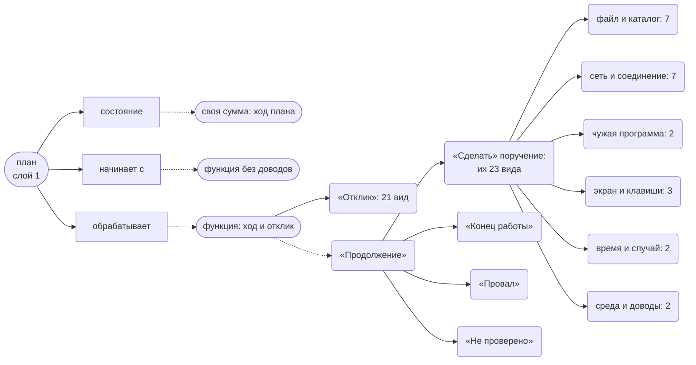
```mermaid Планы и поручения
flowchart LR
  p156([план<br>слой 1])
  c89[состояние]
  c96[начинает с]
  c148[обрабатывает]
  g_own_state([своя сумма: ход плана])
  g_start_fn([функция без доводов])
  g_step_fn([функция: ход и отклик])
  s_reply(«Отклик»: 21 вид)
  s_cont(«Продолжение»)
  s_do(«Сделать» поручение:<br>их 23 вида)
  s_end(«Конец работы»)
  s_fail(«Провал»)
  s_unchecked(«Не проверено»)
  s_ofile(файл и каталог: 7)
  s_onet(сеть и соединение: 7)
  s_oproc(чужая программа: 2)
  s_oscreen(экран и клавиши: 3)
  s_otime(время и случай: 2)
  s_oenv(среда и доводы: 2)
  p156 --> c89
  p156 --> c96
  p156 --> c148
  c89 -.-> g_own_state
  c96 -.-> g_start_fn
  c148 -.-> g_step_fn
  g_step_fn --> s_reply
  g_step_fn -.-> s_cont
  s_cont --> s_do
  s_cont --> s_end
  s_cont --> s_fail
  s_cont --> s_unchecked
  s_do --> s_ofile
  s_do --> s_onet
  s_do --> s_oproc
  s_do --> s_oscreen
  s_do --> s_otime
  s_do --> s_oenv
  class c89,c96,c148 vyvod
```

Имена в ёлочках — словарь ввода-вывода: три суммы, которые компилятор приписывает программе с планом. В словарь языка они не входят. Числа видов взяты из `flang/self/parser.flang`, функции «Варианты поручения», «Варианты отклика», «Варианты продолжения».

## 13. Процессы и надзор

Понятий словаря на схеме: 5. Узлов сверх словаря: 4. Ссылок и подписей: 9.

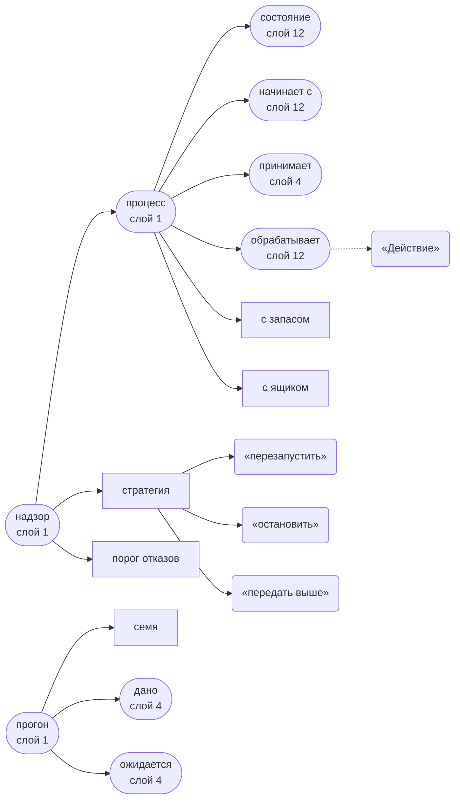
```mermaid Процессы и надзор
flowchart LR
  p147([процесс<br>слой 1])
  p89([состояние<br>слой 12])
  p96([начинает с<br>слой 12])
  p17([принимает<br>слой 4])
  p148([обрабатывает<br>слой 12])
  c149[с запасом]
  c150[с ящиком]
  s_action(«Действие»)
  p151([надзор<br>слой 1])
  c152[стратегия]
  c153[порог отказов]
  s_restart(«перезапустить»)
  s_stop(«остановить»)
  s_escalate(«передать выше»)
  p154([прогон<br>слой 1])
  c155[семя]
  p20([дано<br>слой 4])
  p21([ожидается<br>слой 4])
  p147 --> p89
  p147 --> p96
  p147 --> p17
  p147 --> p148
  p147 --> c149
  p147 --> c150
  p148 -.-> s_action
  p151 --> p147
  p151 --> c152
  p151 --> c153
  c152 --> s_restart
  c152 --> s_stop
  c152 --> s_escalate
  p154 --> c155
  p154 --> p20
  p154 --> p21
  class c149,c150,c152,c153,c155 vyvod
```

`flang check` на программе с процессами отвечает кодом 2: разбор, типы, завершаемость и примеры проходят, а правила самих объявлений двоичный компилятор не судит и говорит об этом словами.

## 14. Категория и морфизмы

Понятий словаря на схеме: 13. Узлов сверх словаря: 0. Ссылок и подписей: 3.

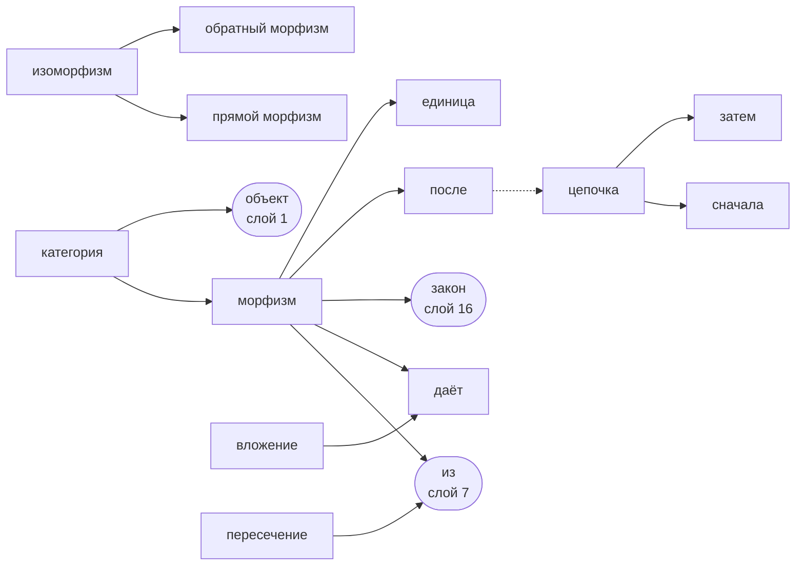
```mermaid Категория и морфизмы
flowchart LR
  c4[категория]
  c98[морфизм]
  p5([объект<br>слой 1])
  p34([из<br>слой 7])
  c104[даёт]
  p105([закон<br>слой 16])
  c99[после]
  c103[единица]
  c100[цепочка]
  c101[сначала]
  c102[затем]
  c106[изоморфизм]
  c107[прямой морфизм]
  c108[обратный морфизм]
  c109[вложение]
  c110[пересечение]
  c4 --> c98
  c4 --> p5
  c98 --> p34
  c98 --> c104
  c98 --> p105
  c98 --> c99
  c98 --> c103
  c100 --> c101
  c100 --> c102
  c106 --> c107
  c106 --> c108
  c109 --> c104
  c110 --> p34
  c99 -.-> c100
  class c4,c98,c104,c99,c103,c100,c101,c102,c106,c107,c108,c109,c110 vyvod
```

Программа с этими объявлениями тоже получает от `flang check` код 2, по той же причине.

## 15. Функторы

Понятий словаря на схеме: 7. Узлов сверх словаря: 0. Ссылок и подписей: 0.

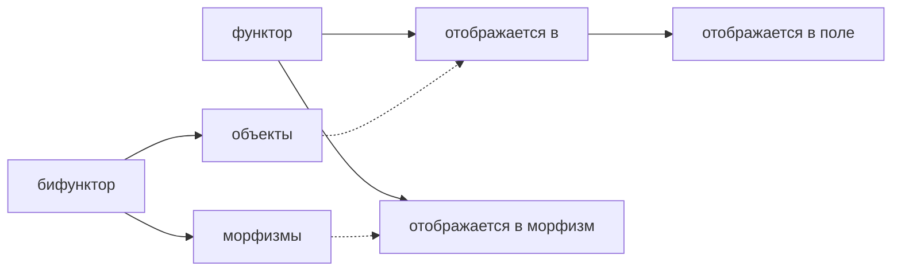
```mermaid Функторы
flowchart LR
  c120[функтор]
  c132[отображается в]
  c133[отображается в поле]
  c134[отображается в морфизм]
  c121[бифунктор]
  c122[объекты]
  c123[морфизмы]
  c120 --> c132
  c132 --> c133
  c120 --> c134
  c121 --> c122
  c121 --> c123
  c122 -.-> c132
  c123 -.-> c134
  class c120,c132,c133,c134,c121,c122,c123 vyvod
```

## 16. Моноид и монада

Понятий словаря на схеме: 10. Узлов сверх словаря: 0. Ссылок и подписей: 2.

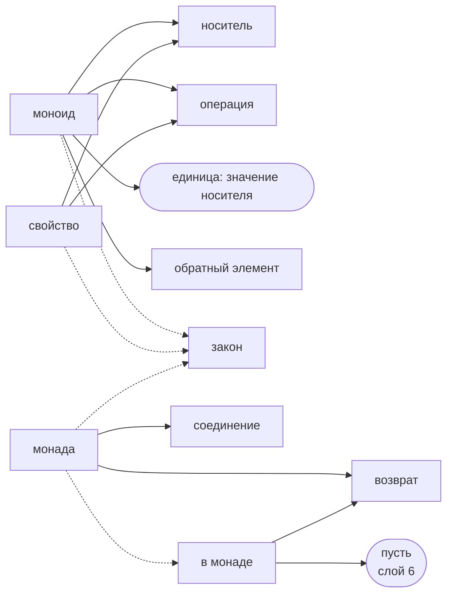
```mermaid Моноид и монада
flowchart LR
  c111[моноид]
  c112[носитель]
  c113[операция]
  g_unit_value([единица: значение носителя])
  c114[обратный элемент]
  c105[закон]
  c94[свойство]
  c115[монада]
  c116[возврат]
  c117[соединение]
  c118[в монаде]
  p22([пусть<br>слой 6])
  c111 --> c112
  c111 --> c113
  c111 --> g_unit_value
  c111 --> c114
  c111 -.-> c105
  c94 --> c112
  c94 --> c113
  c94 -.-> c105
  c115 --> c116
  c115 --> c117
  c115 -.-> c105
  c118 --> p22
  c118 --> c116
  c115 -.-> c118
  class c111,c112,c113,c114,c105,c94,c115,c116,c117,c118 vyvod
```

## 17. Наследие прежней поверхности

Понятий словаря на схеме: 6. Узлов сверх словаря: 0. Ссылок и подписей: 1.

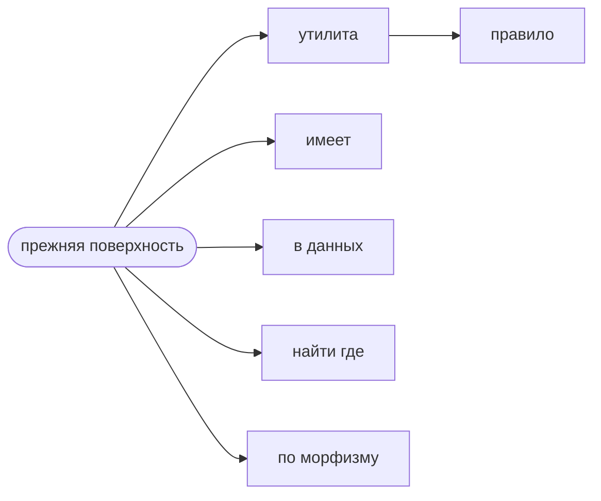
```mermaid Наследие прежней поверхности
flowchart LR
  g_legacy([прежняя поверхность])
  c92[утилита]
  c93[правило]
  c125[имеет]
  c126[в данных]
  c127[найти где]
  c128[по морфизму]
  g_legacy --> c92
  c92 --> c93
  g_legacy --> c125
  g_legacy --> c126
  g_legacy --> c127
  g_legacy --> c128
  class c92,c93,c125,c126,c127,c128 vyvod
```

Эти слова разбираются, но программу из них сегодня не составить. В новом коде их не пишут.

## Дальше

- [Какую конструкцию когда брать](which-construct.html) — выбор по действию и примеры
- [Справочник конструкций](language.html) — форма записи каждой конструкции
- [Словарь языка](glossary.html) — все слова на четырёх поверхностях
