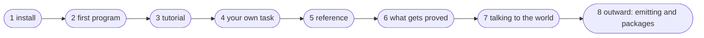

# How to keep learning the language

This is a reading order: eight steps from installing to your first real program.
Each step says what you can do after it, which page to read, and which command
proves the step is taken. The order is not compulsory, but it follows from what
rests on what: step three does not read without step two.



## 1. Install

**After this step:** the `flang` command answers `--version`.

Read [Installation](install.html). There are four roads; the shortest is one
Homebrew command, with no Node and no building from source.

```bash
flang --version
```

## 2. First program

**After this step:** you have written a file, checked it and run a function.

Read [First program](getting-started.html). The same five minutes as on the
front page, but in detail and all the way to emitting the program as C.

```bash
flang check hello.flang
flang run hello.flang --function Удвоить --args '{"н": 21}'
```

The first thing people trip over: examples live **inside** the function and are
run on every check of the file. There is no separate test directory, and there
will not be one.

## 3. The tutorial — six chapters

**After this step:** you understand why there are no loops, how `разбор` differs
from `свёртка`, and what the word `тотальная` actually promises.

Read [Tutorial](tutorial.html). Chapter six goes as far as a claim accepted by
the proof kernel; it is worth stopping there rather than rushing on.

Three habits to put aside here, and that is the main content of the step:

| habit | what replaces it |
| --- | --- |
| a loop | a fold or recursion |
| changing an element in place | building a new value |
| throwing an exception | returning a failure as a value |

## 4. Your own task

**After this step:** you have written a program you did not copy.

Take a task you have already solved in another language — a factorial,
Fibonacci, a palindrome check — and write it again in flang words, with an
example inside every function.

If the check refuses with `FLANG_NOT_TOTAL`, that is not a breakage but a
conversation: the compiler did not see why the recursion ends. What it accepts
as decrease is set out in [What the `тотальная` mark
gives](totality.html).

## 5. The reference — when the guided path ends

**After this step:** you find the form you need without asking anyone.

- [Reference of constructs](language.html) — every form of the language in a row;
- [Operations](operations.html) — "I have a list and need a sum without
  duplicates — with what";
- [Glossary](../glossary.html) — {{словарь.понятий}} concepts, of which
  {{словарь.наЧетырёх}} are open on all four writing surfaces;
- [Four writing surfaces](../surfaces.html) — why the same thing is written in
  Russian words and in English ones.

## 6. What gets proved and what does not

**After this step:** you tell a proof from a run and do not confuse the two.

This is the middle of the language, and it is worth the longest stop.

- [What is proved and what is not](what-is-proved.html) — the border is drawn
  explicitly;
- [Why and how](proofs.html) — the three deciding rules of the kernel, each
  readable in full;
- [The kernel refused: whose mistake is it](proof-refused.html) — every kernel
  refusal by name: which are fixed in the theorem and which hit a limit of the
  language;
- [Case studies](case-studies.html) — what this bought on live code.

The short truth the step stands here for: **termination is proved in bulk,
behaviour rarely.** The rest is checked by running a grid of values, and the
report calls that "сетка" (grid), not "доказано" (proved).

## 7. Talking to the world

**After this step:** you know where files, network and time come from in a pure
language.

A flang program performs no actions — it returns *descriptions* of them, and
whoever ran the program carries them out. Everything else grows from that:

- [Databases](database.html) — PostgreSQL: what is written and where the borders
  are;
- [Processes, supervision, distribution](processes.html) — several processes,
  restarting a failed one, nodes on different machines.

## 8. Outward: emitting, embedding, packages

**After this step:** your program runs inside somebody else's system.

- [Embedding flang in another program](embedding.html) — one program is emitted
  into {{цели.поАнглийски}} languages: {{цели.список}};
- [Writing packages](packages.html) — how to hand what you wrote to others;
- [Known limitations](limits.html) — read before you hit them.

## If you get stuck

The compiler answers not with "error" but with the name of the trouble and an
explanation:

```bash
flang check file.flang         # what did not add up
flang check file.flang --proof # what exactly is proved and what is not
flang --help                   # twelve commands and what each one does
```

A refusal starts with a name: `FLANG_TYPE`, `FLANG_NOT_TOTAL`,
`FLANG_PROOF_INDUCTION_STEP`. The names that start with `FLANG_PROOF_` are
refusals from the proof kernel, and each of them is covered on
[The kernel refused: whose mistake is it](proof-refused.html). The rest are
listed in `man flang`, section ДИАГНОСТИКА.
