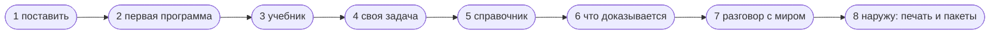

# Как учить язык дальше

Это порядок чтения: восемь шагов от установки до своей первой настоящей
программы. У каждого шага сказано, что вы после него умеете, какую страницу
читать и какой командой проверить, что шаг взят. Порядок не обязателен, но он
выведен из того, чем одно опирается на другое: третий шаг не читается без
второго.



## 1. Поставить

**После шага:** команда `flang` отвечает на `--version`.

Читать — [Установка](install.html). Путей четыре; самый короткий — одна команда
Homebrew, без Node и без сборки исходников.

```bash
flang --version
```

## 2. Первая программа

**После шага:** вы написали файл, проверили его и запустили функцию.

Читать — [Первая программа](getting-started.html). Там та же пятиминутка, что на
главной, но подробно и до печати программы в C.

```bash
flang check hello.flang
flang run hello.flang --function Удвоить --args '{"н": 21}'
```

Первое, обо что здесь спотыкаются: примеры лежат **внутри** функции и
прогоняются при каждой проверке файла. Отдельного каталога тестов нет и не
будет.

## 3. Учебник — шесть глав

**После шага:** вы понимаете, почему нет циклов, чем `разбор` отличается от
`свёртки` и что именно обещает слово `тотальная`.

Читать — [Учебник](tutorial.html). Шестая глава доводит до утверждения,
принятого ядром доказательств; на ней стоит остановиться и не спешить дальше.

Три привычки, которые здесь придётся отложить, и это главное содержание шага:

| привычка | что вместо неё |
| --- | --- |
| цикл | свёртка или рекурсия |
| изменить элемент на месте | построить новое значение |
| бросить исключение | вернуть отказ значением |

## 4. Своя задача

**После шага:** вы написали программу, которую не списали.

Возьмите задачу, которую уже решали на другом языке — факториал, Фибоначчи,
проверку палиндрома, — и напишите её заново словами flang, с примером внутри
каждой функции.

Если проверка отказала словом `FLANG_NOT_TOTAL` — это не поломка, а разговор:
компилятор не увидел, почему рекурсия кончается. Что он принимает за убывание,
разобрано в [Что даёт признак «тотальная»](totality.html).

## 5. Справочник — когда дорожка кончилась

**После шага:** вы находите нужную форму записи, не спрашивая никого.

- [Справочник конструкций](language.html) — все формы языка подряд;
- [Операции языка](operations.html) — «у меня список, нужна сумма без повторов —
  чем»;
- [Словарь языка](glossary.html) — {{словарь.понятий}} понятий, из них
  {{словарь.наЧетырёх}} открыты на всех четырёх поверхностях записи;
- [Четыре поверхности записи](surfaces.html) — почему одно и то же пишется
  русскими словами и английскими.

## 6. Что доказывается, а что нет

**После шага:** вы отличаете доказанное от прогнанного и не путаете одно с
другим.

Это середина языка, и здесь стоит задержаться дольше всего.

- [Что доказано, а что нет](what-is-proved.html) — граница проведена явно;
- [Зачем и как](proofs.html) — три решающих правила ядра, каждое читается
  целиком;
- [Ядро отказало: чья это ошибка](proof-refused.html) — все отказы ядра
  поимённо: какие правятся теоремой, а какие упираются в предел языка;
- [Разборы настоящих случаев](case-studies.html) — что это дало на живом коде.

Короткая правда, ради которой шаг и стоит здесь: **завершаемость доказывается
массово, а поведение — редко.** Остальное проверено прогоном по сетке значений,
и отчёт называет это словом «сетка», а не «доказано».

## 7. Разговор с миром

**После шага:** вы понимаете, откуда в чистом языке берутся файлы, сеть и время.

Программа на flang не делает действий — она возвращает их *описания*, а
исполняет их тот, кто программу запустил. Из этого вырастает всё остальное:

- [Базы данных](database.html) — PostgreSQL: что написано и где границы;
- [Процессы, надзор, распределённость](processes.html) — несколько процессов,
  перезапуск упавшего, узлы на разных машинах.

## 8. Наружу: печать, встраивание, пакеты

**После шага:** ваша программа работает внутри чужой системы.

- [Как встроить flang в чужую программу](embedding.html) — одна программа
  печатается в {{цели.словом}} языков: {{цели.список}};
- [Как писать пакеты](packages.html) — как отдать написанное другим;
- [Известные ограничения](limits.html) — прочитать до того, как упрётесь.

## Если застряли

Компилятор отвечает не «ошибка», а именем беды и разбором:

```bash
flang check файл.flang         # что не сошлось
flang check файл.flang --proof # что именно доказано, а что нет
flang --help                   # двенадцать команд и что каждая делает
```

Отказ начинается с имени: `FLANG_TYPE`, `FLANG_NOT_TOTAL`,
`FLANG_PROOF_INDUCTION_STEP`. Имена, которые начинаются с `FLANG_PROOF_`, —
это отказы ядра доказательств, и они разобраны поимённо на странице
[Ядро отказало: чья это ошибка](proof-refused.html). Остальные названы в
`man flang`, раздел ДИАГНОСТИКА.
