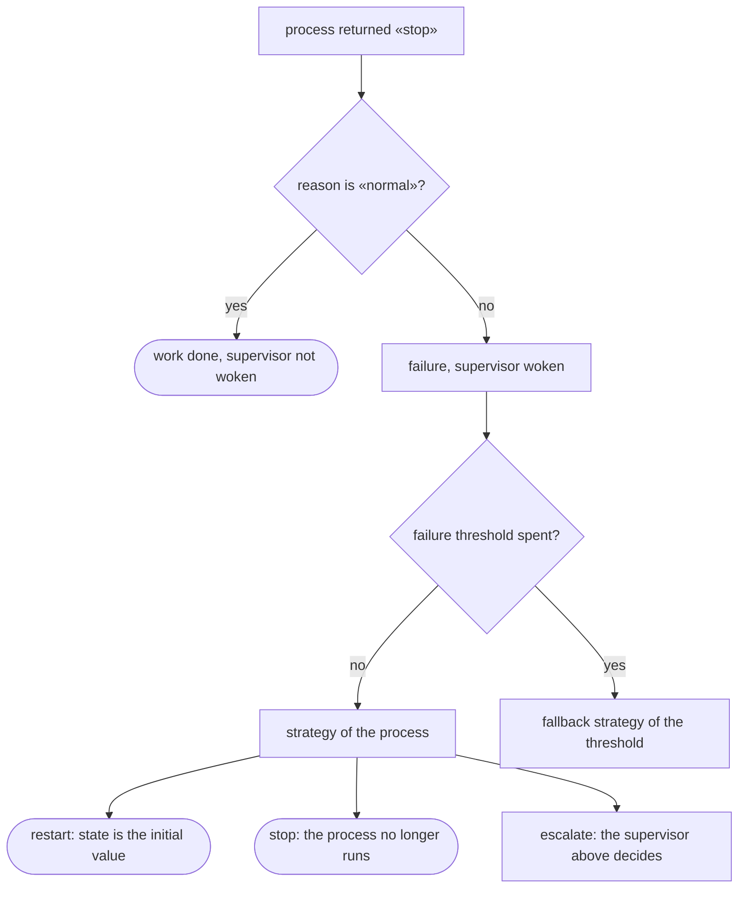
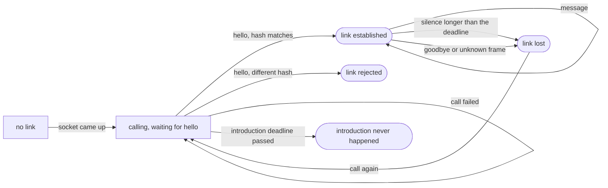

# Processes, supervision, distribution

This page shows how a system of several processes is written in flang, who
restarts a process that failed, and what happens when processes move to
different machines. By the end you can read a working shop of two processes
under supervision, declare one of your own, and know which part of that the
compiler checks today and which part it does not.

## A process is a declaration, not a call

A process is not spawned at run time. It is **declared**, like a function or a
type: it has a state, an initial value, a type of incoming messages and a
handler.

```flang
процесс «Работник»
  состояние «Счёт»
  начинает с «нулевой счёт»
  принимает «Задача»
  обрабатывает «шаг работника»
```

The handler is an ordinary total function. It takes a state and a message and
returns a new state plus a list of actions: whom to write to, whether to stop
and why. There is no in-place change here — as everywhere else in the language.

Because the set of processes is closed by declaration, three things follow at
once:

- **a process name is unique across the whole program**, not just one machine;
- **two processes with the same name are a check error**, not a race at run time;
- **the name has nothing to add to become an address** — it already is one.

The price is named plainly: the recipient of a message must be a name written in
the source. Sending to an address computed at run time is not possible.

## Supervision: who restarts whom

Supervision is declared separately and says what to do with a process that
failed. There are three strategies, written as words — restart, stop, escalate:

```flang
надзор «Цех»
  процесс «Работник» стратегия «перезапустить»
  порог отказов 2 за 5000 миллисекунд иначе «остановить»
```



Restart returns the process state to the same initial *value* it started from.
There is nothing to clean up after a failure: states are immutable, and a
half-applied change cannot exist because in-place change does not exist. In a
system with mutable state, this is where an analysis of "what got written before
the crash" would stand.

Stopping with reason `"норма"` is not a failure: the work is done, and the
supervisor never hears about it.

## Checked on every interleaving, not on one

Alongside processes lives a third kind of declaration — a run. It states what
arrives at the processes and what is expected of them:

```flang
прогон «третий отказ в окне уходит на запасную стратегию»
  семя от 1 до 1000
  дано «Работник» принимает (вариант «подавиться» с «почему» равным "раз")
  дано «Работник» принимает (вариант «подавиться» с «почему» равным "два")
  дано «Работник» принимает (вариант «подавиться» с «почему» равным "три")
  ожидается «Работник» стратегия «перезапустить» 2 раза
  ожидается «Работник» стратегия «остановить» 1 раз
```

`семя от 1 до 1000` — a thousand seeds — is not decoration. The threshold window
is measured in handler passes, and how many of them happen between failures
depends on interleaving: a neighbouring process may cut in between crashes and
move time along. The claim "the threshold fires exactly on the third failure" is
therefore checked on a thousand interleavings, not on the one the first seed
happened to give.

The whole example is `flang/conc/examples/supervision.flang`; the scheduler
underneath it is `flang/conc/planirovshchik.flang`.

## The scheduler is written in the language itself

The scheduler is not a piece of runtime written in someone else's language. It
is {{планировщик.строк}} lines of flang: {{планировщик.функций}} functions, all
total, zero imports. The message queue, quanta, back pressure and supervisor
decisions are computed by the same means as any other program in this language,
and are emitted into all {{цели.поАнглийски}} targets along with it.

You can check that without starting anything:

```bash
flang check flang/conc/planirovshchik.flang
flang test  flang/conc/planirovshchik.flang
```

The answer is "checked: parsing, types, termination, kernel and examples; no
remarks" and {{планировщик.примеров}} passing examples.

## Distribution: a node carries a subset of the processes

A node is a separate running program that holds **part** of the declared
processes. The program itself is the same on every node, to the byte:
distribution added not one word to the language.

Who lives where is stated by a **placement** — data next to the program, not
text inside it:

```json
{
  "программа": "flang/conc/examples/distributed.flang",
  "узлы": {
    "счёт": { "слушать": "127.0.0.1:0", "процессы": ["Счётчик"],
              "звонить": { "учёт": "127.0.0.1:0" } },
    "учёт": { "слушать": "127.0.0.1:0", "процессы": ["Учётчик"] }
  }
}
```

That is where it belongs: placement is an operations decision. The same process
lives next to its neighbour on a test rig and apart from it in production, and
rewriting the source for that would mean rebuilding a program to change a host.

## The life of a link between two nodes

The link between nodes is described in the language as a state machine: in comes
what happened in the world, out goes a new state and a list of commands — what
the world should do. There are {{связь.событий}} events and {{связь.велений}}
commands, and both lists are closed: a forgotten event is a build failure, not a
quiet branch.



The separate fourth state — "introduction never happened" — exists because the
event really is a different one: there was nothing to lose. Otherwise a
neighbour that will never come up would be waited for forever and in silence.

There is no socket and no clock in this machine. The node runner reads the
clock; the language decides: "the link has been silent longer than the deadline"
takes two timestamps and a number and answers yes or no. The file is
`flang/conc/svyaz.flang`, {{связь.строк}} lines, {{связь.примеров}} examples.

## What the compiler checks today, and what it does not

This is the border, and it runs right through the middle of the page.

**Checked by the binary compiler:** parsing, types, termination, the proof
kernel and the examples — including those of the scheduler and of the link
machine. Both pass clean.

**Not checked by it:** the `процесс`, `надзор` and `прогон` declarations
themselves. The binary says so in words and answers with exit code 2 rather than
going green in silence:

```
проверено НЕ ВСЁ: в программе объявлено то, чего бинарник не судит вовсе —
processes, supervisors, runs.
```

Plainly, for the reader: **the process model can be declared, checked and run
against its examples today, and it cannot be brought up as a real node.** The
declarations are read and checked as part of the program; the rules of the
processes themselves — that supervision covers every failure, that an
interleaving loses no message — are judged by nothing today. Everything else on
this page is not a promise but what a run shows.

## Where to go next

- [Databases](database.html) — the other half of talking to the world.
- [What is proved and what is not](what-is-proved.html) — how the border between
  proved and merely run is drawn here.
- [How to keep learning the language](learning.html) — where this page sits on
  the road.
