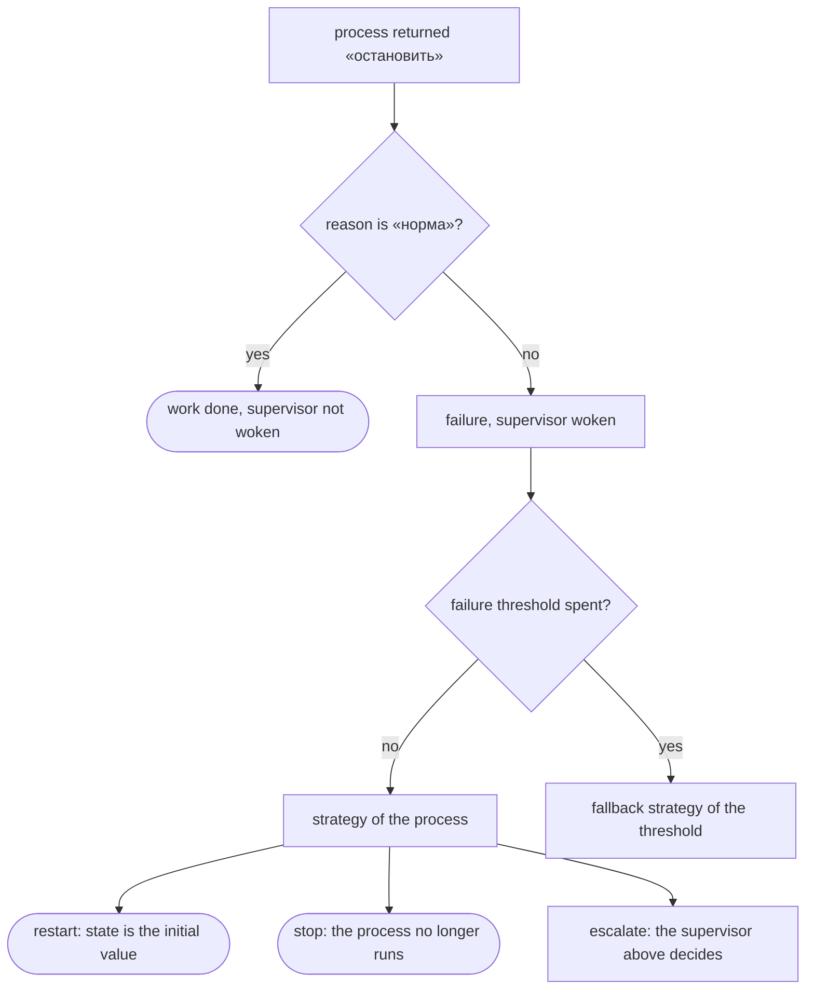

# Processes, supervision, distribution

A process in flang is a declaration: a state, an initial value, a type of
incoming messages and a handler. Copy the pieces below, run `flang check`, and
you have a shop of two processes under a supervisor.

## Declare a process

```flang
процесс «Работник»
  состояние «Счёт»
  начинает с «нулевой счёт»
  принимает «Задача»
  обрабатывает «шаг работника»
```

| line | what it names |
| --- | --- |
| `состояние` | the type of the state |
| `начинает с` | a function with no arguments returning that type |
| `принимает` | the type of incoming messages |
| `обрабатывает` | the handler |

The handler is an ordinary total function. It takes a state and a message and
returns a record with two fields: the new state and a list of actions.

```flang
тотальная функция «шаг работника»
  принимает счёт: «Счёт», сообщение: «Задача»
  возвращает «Отклик работника»
  разбор сообщение
    случай вариант «прибавить» с «сколько» как сколько
      пусть новое равно (запись «Счёт» с «всего» равным (счёт.«всего» плюс сколько))
      запись «Отклик работника» с «состояние» равным новое и «действия» равным []
```

The reply record is declared by you, with exactly these two fields:

```flang
объект «Отклик работника»
  «состояние»: «Счёт»
  «действия»: список «Действие»
```

## Send a message

A message is not sent by a call. It is an action in the returned list:

```flang
пусть отметка равно (вариант «отправить» с «кому» равным "Учётчик"
                     и «что» равным (вариант «записать» с «текст» равным "3"))
запись «Отклик работника» с «состояние» равным новое и «действия» равным [отметка]
```

`«кому»` must be the name of a declared process, written in the source as a
literal string. An address computed at run time is not possible: the set of
processes is closed by declaration, and two processes with the same name are a
check error rather than a race.

## Stop

Stopping is an action too:

```flang
вариант «остановить» с «почему» равным "норма"
```

`"норма"` means the work is done — the supervisor is not woken. Any other
reason is a failure and goes to the supervisor.

## Put a supervisor over it

```flang
надзор «Цех»
  процесс «Работник» стратегия «перезапустить»
  порог отказов 2 за 5000 миллисекунд иначе «остановить»
```

| strategy | what happens to the failed process |
| --- | --- |
| `«перезапустить»` | it starts again, state back to the initial value |
| `«остановить»` | it no longer runs |
| `«передать выше»` | the supervisor above decides |

`порог отказов N за M миллисекунд иначе «стратегия»` — while the failures fit
in the window, the process strategy applies; the N+1-th failure inside it
switches to the fallback strategy. A supervisor may hold another supervisor:

```flang
надзор «Цех»
  процесс «Счётчик» стратегия «перезапустить»
  надзор «Связь» стратегия «передать выше»
  порог отказов 1 за 5000 миллисекунд иначе «передать выше»
```

Restart puts the state back to the same initial value. There is nothing to
clean up: states are immutable, so a half-applied change cannot be left behind.



## Run the check

The whole shop is in the tree — `flang/conc/examples/supervision.flang`:

```bash
$ flang check flang/conc/examples/supervision.flang
модуль «Цех и учёт»: функций 4, из них с доказанным завершением 4; типов 7
проверено НЕ ВСЁ: в программе объявлено то, чего бинарник не судит вовсе —
processes, supervisors, runs. […]
flang/conc/examples/supervision.flang: проверено НЕ ДО КОНЦА — разбор, типы,
завершаемость, ядро и примеры прошли
$ echo $?
2
```

Exit code 2 means "not checked all the way through", not "all good": the
handlers, their types and their examples are checked, the `процесс` and
`надзор` declarations are read but not judged. `flang test <file>` runs the
handler examples and exits 0.

## Nodes: who runs where

A node is a separate running program holding part of the declared processes.
The program text is the same on every node; who lives where is data next to it:

```json
{
  "программа": "flang/conc/examples/distributed.flang",
  "узлы": {
    "счёт": { "слушать": "127.0.0.1:0", "процессы": ["Счётчик"],
              "звонить": { "учёт": "127.0.0.1:0" } },
    "учёт": { "слушать": "127.0.0.1:0", "процессы": ["Учётчик"] }
  }
}
```

Move a process to another host by editing this file, not the program.

## What you get on each target

| | processes and supervision |
| --- | --- |
| `c`, `elixir` | emitted with a scheduler: the processes run |
| the other six targets | the handler is emitted as an ordinary function; you call it yourself |

Two limits to keep in mind: the recipient of a message must be a literal name,
and a live node is not brought up by the binary compiler today — the
declarations are checked as part of the program, the processes themselves are
run by the emitted C or Elixir.

## Where to go next

- [Databases](database.html) — the other half of talking to the world.
- [Embedding flang](embedding.html) — how the emitted C or Elixir gets into
  your program.
