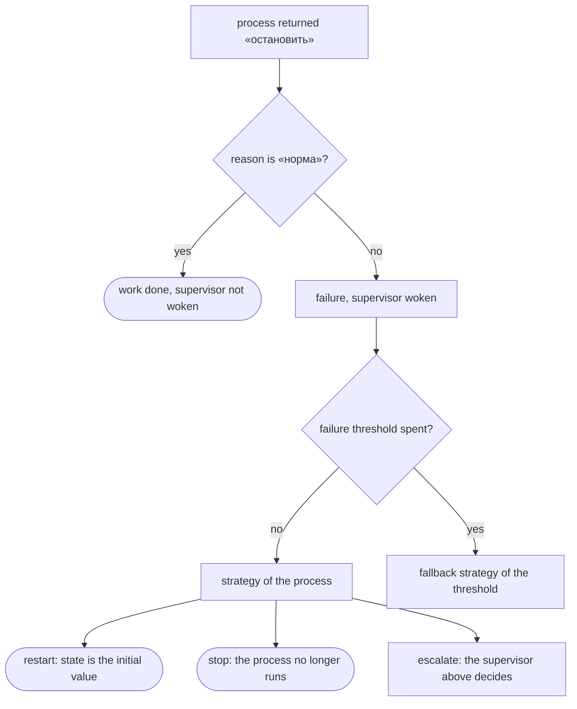

# Processes, supervision, distribution

Processes in flang work like Erlang/OTP processes: each one has its own state
and a mailbox, handles one message at a time, and talks to the others only by
messages. A supervisor restarts a process that failed. The difference from
Erlang: a handler is a pure function. It does not send anything itself; it
returns the new state and a list of actions ("send this message", "stop"), and
the scheduler performs them.

This page builds a small program of two processes under a supervisor. Every
piece comes from `flang/concurrency/examples/supervision.flang`.

| In flang | Erlang/OTP |
| --- | --- |
| `процесс` | a `gen_server` |
| `состояние`, `начинает с` | the state and `init/1` |
| `обрабатывает` | `handle_cast/2` |
| the action `отправить` | `gen_server:cast/2` |
| `надзор` | a supervisor |
| `стратегия «перезапустить»` | a restart strategy |
| `порог отказов N за M миллисекунд` | `intensity` and `period` |

## Declare a process

```flang
процесс «Работник»
  состояние «Счёт»
  начинает с «нулевой счёт»
  принимает «Задача»
  обрабатывает «шаг работника»
```

| Line | What it names |
| --- | --- |
| `состояние` | the type of the state |
| `начинает с` | a function with no arguments that returns the initial state |
| `принимает` | the type of incoming messages, usually an enum |
| `обрабатывает` | the handler |

## Write the handler

The handler is an ordinary total function. It takes the state and a message
and returns a record with two fields: the new state and a list of actions.
Branch on the message with `разбор` (pattern matching):

```flang
тотальная функция «шаг работника»
  принимает счёт: «Счёт», сообщение: «Задача»
  возвращает «Отклик работника»
  разбор сообщение
    случай вариант «прибавить» с «сколько» как сколько
      пусть новое равно (запись «Счёт» с «всего» равным (счёт.«всего» плюс сколько))
      запись «Отклик работника» с «состояние» равным новое и «действия» равным []
```

You declare the return record yourself, with exactly these two fields:

```flang
объект «Отклик работника»
  «состояние»: «Счёт»
  «действия»: список «Действие»
```

The type `«Действие»` (action) is built into the language: it appears as soon
as the file declares a process. Because the handler is a pure function, you
test it like any other function, with `пример` (unit tests), and the prover can
prove `обеспечивает` (postconditions) about it — for example, "the handler
always returns exactly one action".

## Send a message

To send a message, put the action `отправить` (send) into the returned list:

```flang
пусть отметка равно (вариант «отправить» с «кому» равным "Учётчик"
                     и «что» равным (вариант «записать» с «текст» равным "3"))
запись «Отклик работника» с «состояние» равным новое и «действия» равным [отметка]
```

`«кому»` (to) is the name of the recipient process; `«что»` (what) is the
message. Write the name as a string literal. Then the compiler checks it: a
literal name of an undeclared process is the error `FLANG_UNKNOWN_PROCESS`, and
the message must be a value of the type the recipient `принимает`. A name
computed at run time is accepted, but the compiler cannot check it.

Other actions: `породить` (spawn) starts a new process of a declared kind under
a name you choose, with its first message; `отложить` (defer) puts the current
message back at the end of the mailbox; `через N отправить` sends after a
timer.

## Stop

Stopping is an action too:

```flang
вариант «остановить» с «почему» равным "норма"
```

The reason `"норма"` (normal) means the work is done, and the supervisor is not
involved. Any other reason is a failure, and the supervisor decides what to do.

## Put a supervisor over it

```flang
надзор «Цех»
  процесс «Работник» стратегия «перезапустить»
  порог отказов 2 за 5000 миллисекунд иначе «остановить»
```

| Strategy | What happens to the failed process |
| --- | --- |
| `«перезапустить»` (restart) | it starts again with the initial state |
| `«остановить»` (stop) | it no longer runs |
| `«передать выше»` (escalate) | the supervisor above decides |

`порог отказов N за M миллисекунд иначе «стратегия»` is the restart limit:
while there are at most N failures within M milliseconds, the process strategy
applies; failure N+1 inside the window switches to the fallback strategy after
`иначе`. A supervisor may hold another supervisor:

```flang
надзор «Цех»
  процесс «Счётчик» стратегия «перезапустить»
  надзор «Связь» стратегия «передать выше»
  порог отказов 1 за 5000 миллисекунд иначе «передать выше»
```

A restart sets the state back to the initial value. There is nothing to clean
up: states are immutable, so a failed handler cannot leave a half-applied
change behind.


```mermaid What happens when a process fails
flowchart TD
  A[process returned «остановить»] --> B{reason is «норма»?}
  B -->|yes| C([work done, supervisor not woken])
  B -->|no| D[failure, supervisor woken]
  D --> E{failure threshold spent?}
  E -->|no| F[strategy of the process]
  E -->|yes| G[fallback strategy of the threshold]
  F --> H([restart: state is the initial value])
  F --> I([stop: the process no longer runs])
  F --> J[escalate: the supervisor above decides]
  class D otkaz
  class C vyvod
  class H vyvod
```

## Limit the mailbox (back pressure)

By default a mailbox is unbounded. To bound it, give the size after
`принимает`:

```flang
процесс «Сток»
  состояние «Счёт»
  начинает с «нуль»
  принимает «Тик» с ящиком 4 сообщений
  обрабатывает «глотать»
```

When the mailbox is full, the **sender** fails with `FLANG_MAILBOX_FULL`, and
its supervisor decides what to do. So a process that sends to a bounded mailbox
needs a supervisor. The full example is
`flang/concurrency/examples/backpressure.flang`. A bounded mailbox cannot be
generated into Elixir: a BEAM mailbox is unbounded, and `flang emit --target
elixir` refuses such a program with code 1.

## Check the program

```bash
$ flang check flang/concurrency/examples/supervision.flang
модуль «Цех и учёт»: функций 4, из них с доказанным завершением 4; типов 7
объявления эти сверены НЕ ДО КОНЦА — processes, supervisors, runs: сверено, что имена сходятся, что у нетотального обработчика назван запас витков, что у отказа один судья, что начальное состояние помечено тотальным, что вид «породить» назван литералом и что адресату послан вариант объявленного им типа. НЕ сверено одно: достижим ли отказ ВНУТРИ тотальной функции — множество отказов считает отдельный слой, в замыкание бинарника не ввезённый. Адресат «отправить», названный вычислением, не судится и судиться не может: до запуска такого имени не существует
flang/concurrency/examples/supervision.flang: проверено НЕ ДО КОНЦА — разбор, типы, завершаемость, ядро и примеры прошли
$ echo $?
2
```

Exit code 2 means "checked, but not completely". The handlers, their types and
their unit tests are checked; for `процесс` and `надзор` the compiler checks
names and message types. Two things it does not check, and the output says so:
whether a total handler can fail, and a recipient name computed at run time.

`flang test` runs the unit tests of the handlers:

```bash
$ flang test flang/concurrency/examples/supervision.flang
flang/concurrency/examples/supervision.flang: примеров 2, прошло 2, не прошло 0
$ echo $?
0
```

The file also has `прогон` blocks: scenarios that send messages to processes
under a fixed random seed. Neither `flang check` nor `flang test` runs them, and
nothing compares the result with their `ожидается` lines; the program generated
into C runs a scenario on request and prints the final states and the
supervisor's decisions.

## Which targets run processes

| Target | Processes and supervision |
| --- | --- |
| `c`, `elixir`, `js`, `ts` | the code is generated together with a scheduler |
| `cpp`, `csharp`, `go`, `java`, `python`, `rust` | `flang emit` refuses with code 1: the target has no scheduler, and a handler is not generated as a plain function nobody calls |

The binary compiler itself does not run processes: they run in the generated
C, Elixir, JavaScript or TypeScript.

## Nodes

A node is a separate running program that holds some of the declared
processes. The program text is the same on every node; which process lives on
which node is described in a separate file:

```json
{
  "программа": "flang/concurrency/examples/distributed.flang",
  "узлы": {
    "счёт": { "слушать": "127.0.0.1:0", "процессы": ["Счётчик"],
              "звонить": { "учёт": "127.0.0.1:0" } },
    "учёт": { "слушать": "127.0.0.1:0", "процессы": ["Учётчик"] }
  }
}
```

The binary compiler does not read this file yet: `flang check` rejects the key
`--размещение` with exit code 2 as unknown. The format is described in
`docs/flang/concurrency/DISTRIBUTED.md`.

## Next

- [Databases](database.html) — the other way a program talks to the world.
- [Embedding flang](embedding.html) — how to put the generated C or Elixir into
  your program.
