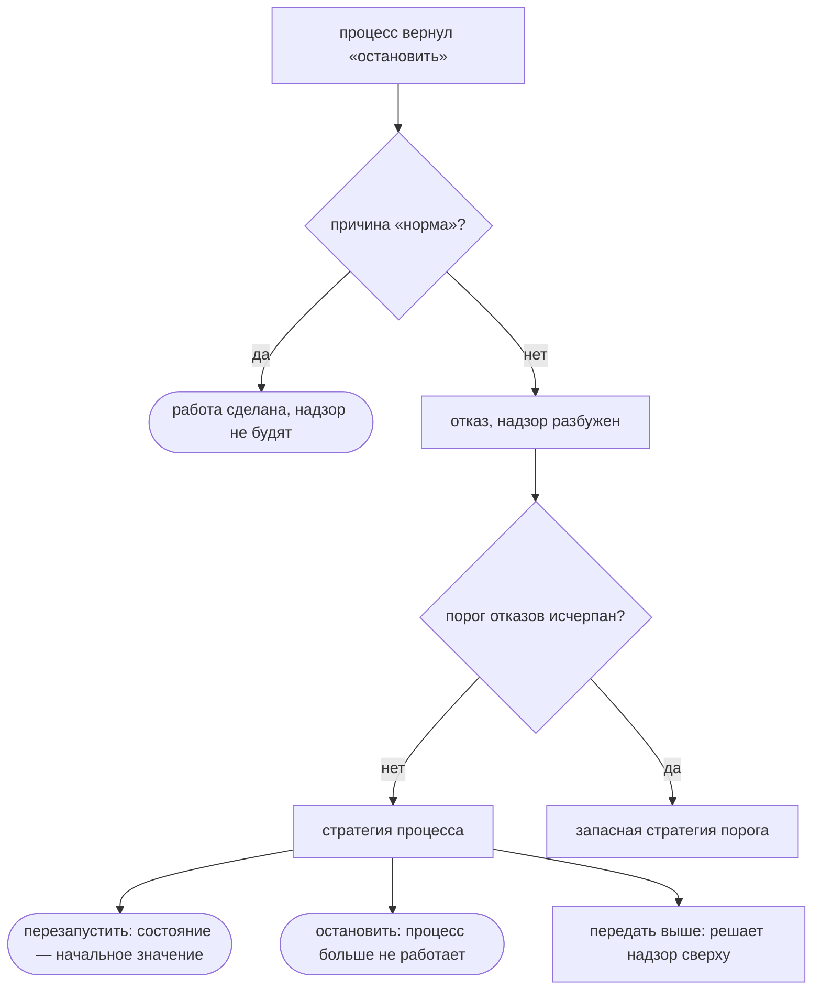

# Процессы, надзор, распределённость

Процесс в flang — это объявление: состояние, начальное значение, тип входящих
сообщений и обработчик. Скопируйте куски ниже, запустите `flang check` — и у
вас цех из двух процессов под надзором.

## Объявите процесс

```flang
процесс «Работник»
  состояние «Счёт»
  начинает с «нулевой счёт»
  принимает «Задача»
  обрабатывает «шаг работника»
```

| строка | что называет |
| --- | --- |
| `состояние` | тип состояния |
| `начинает с` | функцию без аргументов, возвращающую этот тип |
| `принимает` | тип входящих сообщений |
| `обрабатывает` | обработчик |

Обработчик — обычная тотальная функция. Принимает состояние и сообщение,
возвращает запись с двумя полями: новое состояние и список действий.

```flang
тотальная функция «шаг работника»
  принимает счёт: «Счёт», сообщение: «Задача»
  возвращает «Отклик работника»
  разбор сообщение
    случай вариант «прибавить» с «сколько» как сколько
      пусть новое равно (запись «Счёт» с «всего» равным (счёт.«всего» плюс сколько))
      запись «Отклик работника» с «состояние» равным новое и «действия» равным []
```

Запись отклика объявляете вы сами, ровно с этими двумя полями:

```flang
объект «Отклик работника»
  «состояние»: «Счёт»
  «действия»: список «Действие»
```

## Пошлите сообщение

Сообщение посылается не вызовом. Это действие в возвращённом списке:

```flang
пусть отметка равно (вариант «отправить» с «кому» равным "Учётчик"
                     и «что» равным (вариант «записать» с «текст» равным "3"))
запись «Отклик работника» с «состояние» равным новое и «действия» равным [отметка]
```

`«кому»` — имя объявленного процесса, набранное в исходнике строкой-литералом.
Адреса, вычисленного на ходу, не бывает: набор процессов закрыт объявлениями, а
два процесса с одним именем — ошибка проверки, а не гонка на ходу.

## Остановитесь

Остановка — тоже действие:

```flang
вариант «остановить» с «почему» равным "норма"
```

`"норма"` значит «работа сделана» — надзор не будят. Любая другая причина —
отказ, и о нём узнаёт надзор.

## Поставьте надзор

```flang
надзор «Цех»
  процесс «Работник» стратегия «перезапустить»
  порог отказов 2 за 5000 миллисекунд иначе «остановить»
```

| стратегия | что будет с упавшим процессом |
| --- | --- |
| `«перезапустить»` | запустится заново, состояние — начальное значение |
| `«остановить»` | больше не работает |
| `«передать выше»` | решает надзор уровнем выше |

`порог отказов N за M миллисекунд иначе «стратегия»`: пока отказы умещаются в
окно, действует стратегия процесса; N+1-й отказ внутри окна переключает на
запасную. Надзор может держать другой надзор:

```flang
надзор «Цех»
  процесс «Счётчик» стратегия «перезапустить»
  надзор «Связь» стратегия «передать выше»
  порог отказов 1 за 5000 миллисекунд иначе «передать выше»
```

Перезапуск возвращает состояние к тому же начальному значению. Убирать после
отказа нечего: состояния неизменяемы, недоделанной правки не остаётся.



## Запустите проверку

Весь цех лежит в дереве — `flang/conc/examples/supervision.flang`:

```bash
$ flang check flang/conc/examples/supervision.flang
модуль «Цех и учёт»: функций 4, из них с доказанным завершением 4; типов 7
проверено НЕ ВСЁ: в программе объявлено то, чего бинарник не судит вовсе —
processes, supervisors, runs. […]
flang/conc/examples/supervision.flang: проверено НЕ ДО КОНЦА — разбор, типы,
завершаемость, ядро и примеры прошли
$ echo $?
2
```

Код возврата 2 значит «проверено не до конца», а не «всё хорошо»: обработчики,
их типы и их примеры проверены, объявления `процесс` и `надзор` прочитаны, но
не судимы. `flang test <файл>` прогоняет примеры обработчиков и выходит кодом 0.

## Узлы: кто где работает

Узел — отдельная запущенная программа, держащая часть объявленных процессов.
Текст программы на всех узлах один; кто где живёт — данные рядом с ней:

```json
{
  "программа": "flang/conc/examples/distributed.flang",
  "узлы": {
    "счёт": { "слушать": "127.0.0.1:0", "процессы": ["Счётчик"],
              "звонить": { "учёт": "127.0.0.1:0" } },
    "учёт": { "слушать": "127.0.0.1:0", "процессы": ["Учётчик"] }
  }
}
```

Перенести процесс на другой хост — правкой этого файла, а не программы.

## Что получится на каждой цели печати

| | процессы и надзор |
| --- | --- |
| `c`, `elixir` | печатаются вместе с планировщиком: процессы работают |
| остальные шесть целей | обработчик печатается обычной функцией, вызываете её сами |

Два ограничения держите в голове: адресат сообщения обязан быть
именем-литералом, и живой узел двоичный компилятор сегодня не поднимает —
объявления проверяются как часть программы, а сами процессы работают в
напечатанном C или Elixir.

## Куда дальше

- [Базы данных](database.html) — вторая половина разговора с миром.
- [Встраивание flang](embedding.html) — как напечатанный C или Elixir попадает
  в вашу программу.
