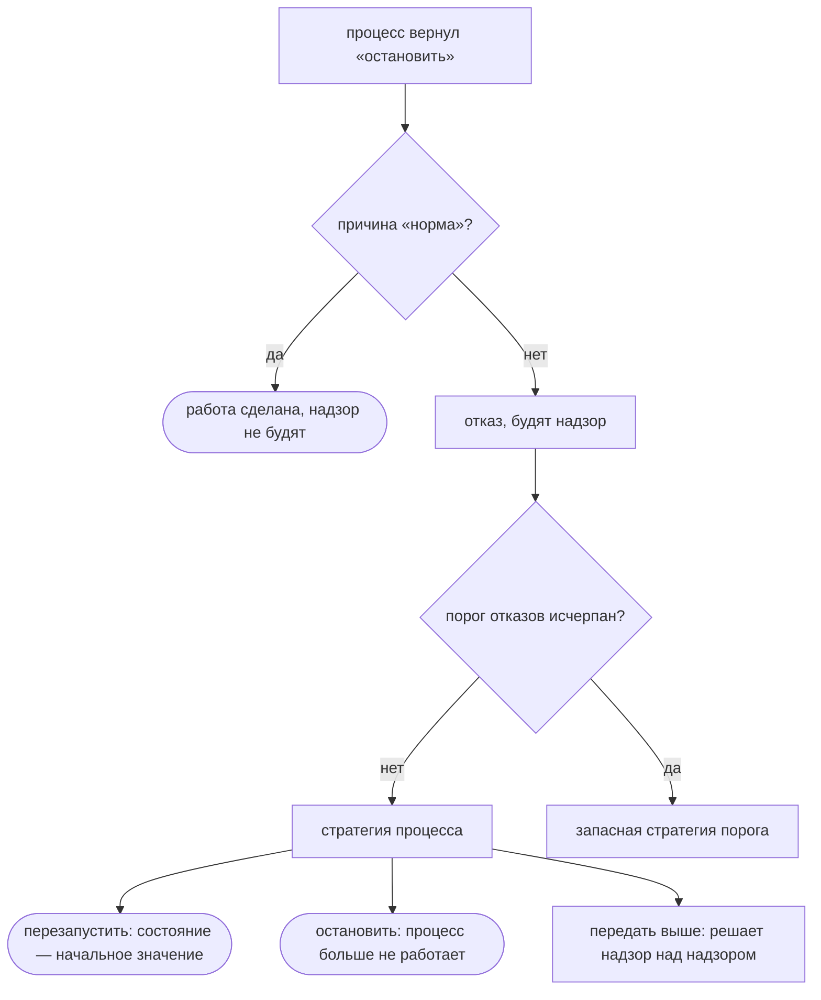
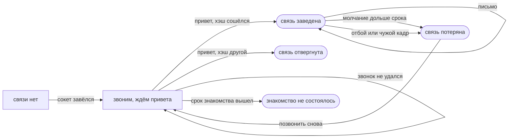

# Процессы, надзор, распределённость

Отсюда вы узнаете, как в flang записывается система из нескольких процессов,
кто поднимает упавший процесс и что происходит, когда процессы разъезжаются по
разным машинам. К концу страницы вы сможете прочитать готовый цех из двух
процессов с надзором, объявить свой и понять, что из этого проверяет
компилятор, а что пока нет.

## Процесс — это объявление, а не вызов

Процесс не порождается во время работы. Он **объявляется**, как функция или тип:
у него есть состояние, начальное значение, тип входящих сообщений и обработчик.

```flang
процесс «Работник»
  состояние «Счёт»
  начинает с «нулевой счёт»
  принимает «Задача»
  обрабатывает «шаг работника»
```

Обработчик — обычная тотальная функция. Она принимает состояние и сообщение, а
возвращает новое состояние и список действий: кому написать, остановиться ли и
почему. Ни одного изменения на месте здесь нет — как и во всём остальном языке.

Из того, что набор процессов закрыт объявлением, следует три вещи сразу:

- **имя процесса уникально во всей программе**, а не в пределах машины;
- **два процесса с одним именем — ошибка проверки**, а не гонка во время работы;
- **имени нечего добавить, чтобы стать адресом** — оно уже адрес.

Цена названа честно: адресат письма обязан быть именем, записанным в исходнике.
Отправить сообщение по адресу, вычисленному во время работы, нельзя.

## Надзор: кто кого поднимает

Надзор объявляется отдельно и называет, что делать с упавшим процессом.
Стратегий три, и пишутся они словами:

```flang
надзор «Цех»
  процесс «Работник» стратегия «перезапустить»
  порог отказов 2 за 5000 миллисекунд иначе «остановить»
```



Перезапуск здесь возвращает состояние процесса к тому же начальному *значению*,
с которого он начинал. Дочищать после отказа нечего: состояния неизменяемы, и
наполовину применённого изменения не бывает, потому что изменений на месте нет
вовсе. В системе с изменяемым состоянием на этом месте стоял бы разбор «что
успело записаться до падения».

Остановка по причине `"норма"` отказом не считается: работа сделана, и надзор о
ней не узнаёт.

## Проверка на всех чередованиях, а не на одном

Рядом с процессами живёт третий вид объявления — `прогон`. Он говорит, что
процессам приходит и чего от них ждут:

```flang
прогон «третий отказ в окне уходит на запасную стратегию»
  семя от 1 до 1000
  дано «Работник» принимает (вариант «подавиться» с «почему» равным "раз")
  дано «Работник» принимает (вариант «подавиться» с «почему» равным "два")
  дано «Работник» принимает (вариант «подавиться» с «почему» равным "три")
  ожидается «Работник» стратегия «перезапустить» 2 раза
  ожидается «Работник» стратегия «остановить» 1 раз
```

`семя от 1 до 1000` — не украшение. Окно порога меряется пробегами обработчика,
а сколько их успеет случиться между отказами, зависит от чередования: соседний
процесс вправе вклиниться между падениями и подвинуть время. Утверждение
«порог срабатывает ровно на третьем отказе» поэтому проверяется на тысяче
чередований, а не на том, которое выпало первому семени.

Весь пример целиком — `flang/conc/examples/supervision.flang`, {{планировщик.строк}}
строк планировщика под ним — `flang/conc/planirovshchik.flang`.

## Планировщик написан на самом языке

Планировщик — не часть исполняющей среды, написанная на чужом языке. Это
{{планировщик.строк}} строк на flang: {{планировщик.функций}} функции, все
тотальные, ввозов ноль. Очередь сообщений, кванты, обратное давление и решения
надзора считаются теми же средствами, что и любая другая программа на этом
языке, и печатаются во все {{цели.словом}} целей вместе с ней.

Проверить это можно, ничего не поднимая:

```bash
flang check flang/conc/planirovshchik.flang
flang test  flang/conc/planirovshchik.flang
```

Ответ — «проверено: разбор, типы, завершаемость, ядро и примеры; замечаний нет»
и {{планировщик.примеров}} прошедших примеров.

## Распределённость: узел несёт подмножество процессов

Узел — это отдельная работающая программа, которая держит **часть** объявленных
процессов. Программа при этом на всех узлах одна и та же, до байта:
распределённость не добавила языку ни одного слова.

Кто где живёт, сказано **размещением** — данными рядом с программой, а не
текстом самой программы:

```json
{
  "программа": "flang/conc/examples/distributed.flang",
  "узлы": {
    "счёт": { "слушать": "127.0.0.1:0", "процессы": ["Счётчик"],
              "звонить": { "учёт": "127.0.0.1:0" } },
    "учёт": { "слушать": "127.0.0.1:0", "процессы": ["Учётчик"] }
  }
}
```

Так и должно быть: размещение — решение эксплуатации. Тот же процесс на стенде
живёт вместе с соседом, а в работе — врозь, и переписывать ради этого исходник
значило бы пересобирать программу ради смены машины.

## Жизнь связи между двумя узлами

Связь между узлами описана в языке как машина состояний: на входе — что
случилось в мире, на выходе — новое состояние и список велений, то есть что
миру сделать. Событий {{связь.событийСловом}}, велений
{{связь.веленийСловом}}, и оба списка закрыты: забытое событие — отказ сборки,
а не тихая ветка.



Отдельное четвёртое состояние — «знакомство не состоялось» — заведено потому,
что событие правда другое: терять было нечего. Сосед, который не поднимется
никогда, иначе ждался бы вечно и молча.

Ни сокета, ни часов в этой машине нет. Часы читает исполнитель узла, а решает —
язык: «связь молчит дольше срока» на входе имеет две отметки времени и число, на
выходе — да или нет. Файл — `flang/conc/svyaz.flang`, {{связь.строк}} строк,
{{связь.примеров}} примеров.

## Что проверяет компилятор сегодня, а что нет

Это граница, и она проходит прямо посреди страницы.

**Проверяется двоичным компилятором:** разбор, типы, завершаемость, ядро
доказательств и примеры — в том числе у планировщика и у машины связи. Обе
проходят чисто.

**Не проверяется им:** сами объявления `процесс`, `надзор` и `прогон`. Двоичный
говорит об этом словами и отвечает кодом 2, а не зеленеет молча:

```
проверено НЕ ВСЁ: в программе объявлено то, чего бинарник не судит вовсе —
processes, supervisors, runs.
```

Что это значит для читателя прямо: **модель процессов сегодня можно объявить,
проверить, прогнать по её примерам — и нельзя поднять настоящим узлом.**
Объявления читаются и проверяются как часть программы; правила самих процессов
(что надзор покрывает каждый отказ, что чередование не теряет сообщения) сегодня
не судит никто. Всё остальное на этой странице — не обещание, а то, что видно на
прогоне.

## Куда дальше

- [Базы данных](database.html) — вторая половина разговора с миром.
- [Что доказано, а что нет](what-is-proved.html) — как здесь устроена граница
  между доказанным и прогнанным.
- [Как учить язык дальше](learning.html) — место этой страницы в общей дороге.
