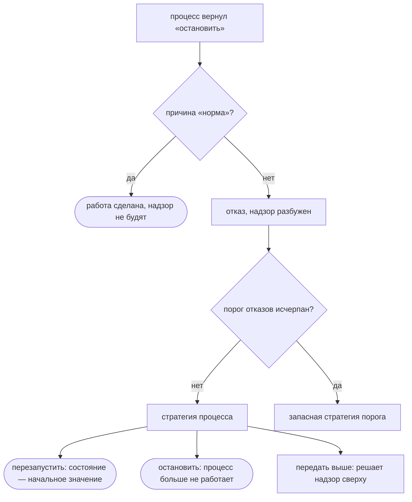

# Процессы, надзор, распределённость

Процессы во flang устроены как процессы Erlang/OTP: у каждого своё состояние и
свой mailbox, сообщения он обрабатывает по одному, а с другими процессами
общается только сообщениями. Supervisor перезапускает упавший процесс. Отличие
от Erlang: обработчик — чистая функция. Сам он ничего не отправляет; он
возвращает новое состояние и список действий («отправь это сообщение»,
«остановись»), а выполняет их планировщик.

На этой странице собирается небольшая программа из двух процессов под
супервизором. Каждый кусок взят из `flang/concurrency/examples/supervision.flang`.

| Во flang | В Erlang/OTP |
| --- | --- |
| `процесс` | `gen_server` |
| `состояние`, `начинает с` | состояние и `init/1` |
| `обрабатывает` | `handle_cast/2` |
| действие `отправить` | `gen_server:cast/2` |
| `надзор` | supervisor |
| `стратегия «перезапустить»` | restart strategy |
| `порог отказов N за M миллисекунд` | `intensity` и `period` |

## Объявите процесс

```flang
процесс «Работник»
  состояние «Счёт»
  начинает с «нулевой счёт»
  принимает «Задача»
  обрабатывает «шаг работника»
```

| Строка | Что называет |
| --- | --- |
| `состояние` | тип состояния |
| `начинает с` | функцию без аргументов, которая возвращает начальное состояние |
| `принимает` | тип входящих сообщений, обычно enum |
| `обрабатывает` | обработчик |

## Напишите обработчик

Обработчик — обычная тотальная функция. Она принимает состояние и сообщение и
возвращает запись с двумя полями: новое состояние и список действий. По
сообщению ветвитесь `разбор` (pattern matching):

```flang
тотальная функция «шаг работника»
  принимает счёт: «Счёт», сообщение: «Задача»
  возвращает «Отклик работника»
  разбор сообщение
    случай вариант «прибавить» с «сколько» как сколько
      пусть новое равно (запись «Счёт» с «всего» равным (счёт.«всего» плюс сколько))
      запись «Отклик работника» с «состояние» равным новое и «действия» равным []
```

Запись для результата объявляете вы сами, ровно с этими двумя полями:

```flang
объект «Отклик работника»
  «состояние»: «Счёт»
  «действия»: список «Действие»
```

Тип `«Действие»` встроен в язык: он появляется, как только в файле объявлен
процесс. Обработчик — чистая функция, поэтому тестируется как любая другая
функция, `пример`ами (unit-тестами), а prover может доказать про него
`обеспечивает` (postcondition) — например, «обработчик всегда возвращает ровно
одно действие».

## Пошлите сообщение

Чтобы послать сообщение, положите действие `отправить` в возвращаемый список:

```flang
пусть отметка равно (вариант «отправить» с «кому» равным "Учётчик"
                     и «что» равным (вариант «записать» с «текст» равным "3"))
запись «Отклик работника» с «состояние» равным новое и «действия» равным [отметка]
```

`«кому»` — имя процесса-получателя, `«что»` — сообщение. Пишите имя строковым
литералом, тогда компилятор его проверит: литеральное имя необъявленного
процесса — ошибка `FLANG_UNKNOWN_PROCESS`, а сообщение обязано быть значением
того типа, который получатель `принимает`. Имя, вычисленное во время работы,
компилятор принимает, но проверить не может.

Другие действия: `породить` (spawn) запускает новый процесс объявленного вида
под выбранным вами именем и с первым сообщением; `отложить` кладёт текущее
сообщение обратно в конец mailbox; `через N отправить` отправляет по таймеру.

## Остановите процесс

Остановка — тоже действие:

```flang
вариант «остановить» с «почему» равным "норма"
```

Причина `"норма"` значит, что работа сделана, и супервизор не вмешивается.
Любая другая причина — отказ, и что делать, решает супервизор.

## Поставьте над ним супервизор

```flang
надзор «Цех»
  процесс «Работник» стратегия «перезапустить»
  порог отказов 2 за 5000 миллисекунд иначе «остановить»
```

| Стратегия | Что происходит с упавшим процессом |
| --- | --- |
| `«перезапустить»` (restart) | запускается заново с начальным состоянием |
| `«остановить»` (stop) | больше не работает |
| `«передать выше»` (escalate) | решает супервизор уровнем выше |

`порог отказов N за M миллисекунд иначе «стратегия»` — лимит перезапусков: пока
отказов не больше N за M миллисекунд, действует стратегия процесса; отказ N+1
внутри окна переключает на запасную стратегию после `иначе`. Супервизор может
держать другой супервизор:

```flang
надзор «Цех»
  процесс «Счётчик» стратегия «перезапустить»
  надзор «Связь» стратегия «передать выше»
  порог отказов 1 за 5000 миллисекунд иначе «передать выше»
```

Перезапуск возвращает состояние к начальному значению. Прибирать нечего:
состояния неизменяемы, поэтому упавший обработчик не может оставить
наполовину применённое изменение.


```mermaid Что происходит при падении процесса
flowchart TD
  A[процесс вернул «остановить»] --> B{причина «норма»?}
  B -->|да| C([работа сделана, надзор не будят])
  B -->|нет| D[отказ, надзор разбужен]
  D --> E{порог отказов исчерпан?}
  E -->|нет| F[стратегия процесса]
  E -->|да| G[запасная стратегия порога]
  F --> H([перезапустить: состояние — начальное значение])
  F --> I([остановить: процесс больше не работает])
  F --> J[передать выше: решает надзор сверху]
  class D otkaz
  class C vyvod
  class H vyvod
```

## Ограничьте mailbox (back pressure)

По умолчанию mailbox не ограничен. Чтобы ограничить, укажите размер после
`принимает`:

```flang
процесс «Сток»
  состояние «Счёт»
  начинает с «нуль»
  принимает «Тик» с ящиком 4 сообщений
  обрабатывает «глотать»
```

Когда mailbox полон, отказывает **отправитель** — с кодом `FLANG_MAILBOX_FULL`,
и что делать, решает его супервизор. Поэтому процессу, который шлёт в
ограниченный mailbox, нужен супервизор. Пример целиком —
`flang/concurrency/examples/backpressure.flang`. Ограниченный mailbox нельзя
сгенерировать в Elixir: mailbox в BEAM не ограничен, и `flang emit --target
elixir` отказывает такой программе с кодом 1.

## Проверьте программу

```bash
$ flang check flang/concurrency/examples/supervision.flang
модуль «Цех и учёт»: функций 4, из них с доказанным завершением 4; типов 7
объявления эти сверены НЕ ДО КОНЦА — processes, supervisors, runs: сверено, что имена сходятся, что у нетотального обработчика назван запас витков, что у отказа один судья, что начальное состояние помечено тотальным, что вид «породить» назван литералом и что адресату послан вариант объявленного им типа. НЕ сверено одно: достижим ли отказ ВНУТРИ тотальной функции — множество отказов считает отдельный слой, в замыкание бинарника не ввезённый. Адресат «отправить», названный вычислением, не судится и судиться не может: до запуска такого имени не существует
flang/concurrency/examples/supervision.flang: проверено НЕ ДО КОНЦА — разбор, типы, завершаемость, ядро и примеры прошли
$ echo $?
2
```

Код возврата 2 значит «проверено, но не полностью». Обработчики, их типы и их
unit-тесты проверены; у `процесс` и `надзор` компилятор проверяет имена и типы
сообщений. Двух вещей он не проверяет и говорит об этом в выводе: может ли
упасть тотальный обработчик и имя получателя, вычисленное во время работы.

`flang test` прогоняет unit-тесты обработчиков:

```bash
$ flang test flang/concurrency/examples/supervision.flang
flang/concurrency/examples/supervision.flang: примеров 2, прошло 2, не прошло 0
$ echo $?
0
```

В файле есть ещё блоки `прогон` — сценарии, которые шлют процессам сообщения
при фиксированном seed. Ни `flang check`, ни `flang test` их не запускают, и
никто не сравнивает результат с их строками `ожидается`; программа,
сгенерированная в C, запускает сценарий по запросу и печатает итоговые
состояния и решения супервизора.

## На каких целях работают процессы

| Цель | Процессы и надзор |
| --- | --- |
| `c`, `elixir`, `js`, `ts` | код генерируется вместе с планировщиком |
| `cpp`, `csharp`, `go`, `java`, `python`, `rust` | `flang emit` отказывает с кодом 1: у цели нет планировщика, а генерировать обработчик обычной функцией, которую никто не вызывает, компилятор не станет |

Сам двоичный компилятор процессы не запускает: они работают в
сгенерированном C, Elixir, JavaScript или TypeScript.

## Узлы

Узел — отдельная запущенная программа, которая держит часть объявленных
процессов. Текст программы на всех узлах один; какой процесс на каком узле
живёт, описывает отдельный файл:

```json
{
  "программа": "flang/concurrency/examples/distributed.flang",
  "узлы": {
    "счёт": { "слушать": "127.0.0.1:0", "процессы": ["Счётчик"],
              "звонить": { "учёт": "127.0.0.1:0" } },
    "учёт": { "слушать": "127.0.0.1:0", "процессы": ["Учётчик"] }
  }
}
```

Двоичный компилятор этот файл пока не читает: ключ `--размещение` команда
`flang check` отвергает кодом 2 как неизвестный. Формат описан в
`docs/flang/concurrency/DISTRIBUTED.md`.

## Дальше

- [Базы данных](database.html) — второй способ, которым программа говорит с
  миром.
- [Встраивание flang](embedding.html) — как встроить сгенерированный C или
  Elixir в свою программу.
