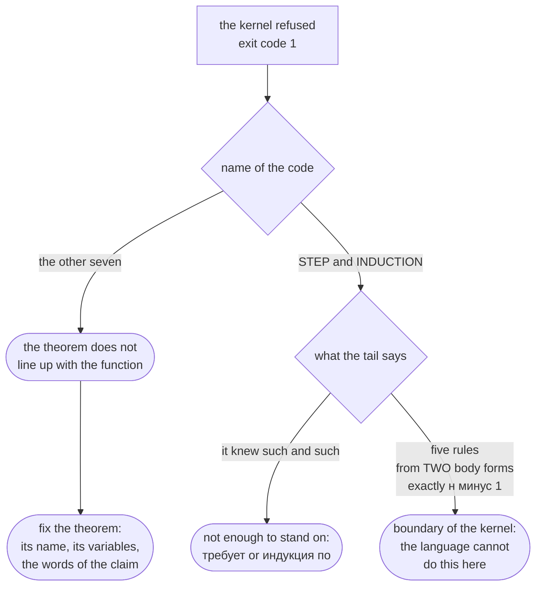

# The kernel refused: whose mistake is it

This page tells you what every refusal from the proof kernel means, so that the
code alone tells you whether the mistake is yours or the boundary of the
language. There are exactly {{отказы.всего}} refusals, and here they all are:
`FLANG_PROOF_NO_GOAL`, `FLANG_PROOF_AMBIGUOUS`, `FLANG_PROOF_DUPLICATE`,
`FLANG_PROOF_CLAIM_MISMATCH`, `FLANG_PROOF_UNFINISHED`,
`FLANG_PROOF_UNKNOWN_VAR`, `FLANG_PROOF_VAR_TYPE`, `FLANG_PROOF_STEP`,
`FLANG_PROOF_INDUCTION_STEP`, `FLANG_PROOF_INDUCTION_TYPE`,
`FLANG_PROOF_INDUCTION_BRANCH`, `FLANG_PROOF_INDUCTION_CASES`,
`FLANG_PROOF_INDUCTION_DESCENT`.

The first {{отказы.обязательств}} say the theorem does not line up with the
function and are fixed inside the theorem; the other {{отказы.вывода}} say the
derivation was not built, and half of those name a limit the language does not
cross today. All thirteen were produced by actual runs on small programs: the
message texts below are the compiler's output, not a retelling.

## A diagnostic has five parts

```
FLANG_PROOF_NO_GOAL в файле проба.flang, строка 23, столбец 1: теорема
«штраф положителен» ничего не закрывает: постусловия «штраф положителен» нет
ни у одной функции модуля. Теорема доказывает названное утверждение, а не
утверждение вообще — назовите её так же, как постусловие, которое она
закрывает
```

Code, file, line, column, text. The exit code is 1, and the file counts as
unchecked as a whole: `flang check` ends with the line
`не проверено — замечаний N`.

Read the tail of the message, and not out of politeness. For three of the six
derivation refusals — `FLANG_PROOF_STEP`, `FLANG_PROOF_INDUCTION_STEP`,
`FLANG_PROOF_INDUCTION_BRANCH` — the tail is exactly where the kernel says what
it knew at that point (`известно: предусловие функции «Сумма»`) and which ways
it tried (`правил пять — …`). That is the answer to "mine or not mine": an empty
`известно:` means nothing to stand on, a list of rules means the wrong goal
shape.

## A refusal is not the worst outcome. Exit code 0 is

A claim with no theorem attached is not rejected. It is simply not proved, and
`flang check` answers with 0:

```flang
модуль «Проба»

тотальная функция «Удвоить»
  принимает х: целое
  возвращает число
  для всех х обеспечивает «результат чётный» (результат остаток от 2) равно 0
  пример «единица»
    дано х равно 1
    ожидается 2
  х умножить на 2
```

```
$ flang check проба.flang
модуль «Проба»: функций 1, из них с доказанным завершением 1; типов 0
проба.flang: проверено — разбор, типы, завершаемость, ядро и примеры; замечаний нет
$ echo $?
0
```

The word "checked" there is about types and termination; about the claim it
says nothing. What actually happened to the claim is shown by `--proof`:

```
$ flang check проба.flang --proof
постусловие «результат чётный» функции «Удвоить» — сетка 1 значение
(примеры функции): нарушений НЕ ИСКАЛИ — прогона примеров не было, посчитано
только их число. Это не доказательство — теоремы при утверждении нет
```

The rule is simple: **a green `flang check` does not mean "proved".** It means
"not rejected". Proved is what `--proof` calls proved; for everything else it
says "grid of N", "declared, not proved", or "on trust". What each of those
words is worth is on [what is proved and what is not](what-is-proved.html).

## Where to look when you are refused



## Seven refusals: the theorem does not line up with the function

All seven are about how a theorem is attached to the function it closes, and
all seven are fixed in the theorem itself. None of them touch the language.

| Code | What happened | What to fix |
| --- | --- | --- |
| `FLANG_PROOF_NO_GOAL` | no function in the module has a postcondition by that name | the theorem's name: it must match the postcondition's name |
| `FLANG_PROOF_AMBIGUOUS` | two postconditions fit the theorem's name | give the postconditions different names |
| `FLANG_PROOF_DUPLICATE` | one postcondition has more than one theorem | keep one |
| `FLANG_PROOF_CLAIM_MISMATCH` | `утверждаем` is not written the way the postcondition is | rewrite it word for word: the kernel does not decide that two spellings mean one thing |
| `FLANG_PROOF_UNFINISHED` | the line `следовательно доказано` is missing | add it; an unclosed proof is a draft |
| `FLANG_PROOF_UNKNOWN_VAR` | `дано` introduces a name the function does not have | use the parameter name the function declares |
| `FLANG_PROOF_VAR_TYPE` | the theorem's variable and the parameter have different types | use the declared type of the parameter |

Here it is in full. A function and a theorem whose names drifted apart:

```flang
модуль «Проба»

тип «Светофор»
  вариант «Красный»
  вариант «Зелёный»

тотальная функция «Штраф»
  принимает свет: «Светофор»
  возвращает число
  для всех свет обеспечивает «штраф неотрицателен» результат не меньше 0
  пример «красный»
    дано свет равно вариант «Красный»
    ожидается 500
  пример «зелёный»
    дано свет равно вариант «Зелёный»
    ожидается 0
  разбор свет
    случай вариант «Красный»
      то 500
    случай вариант «Зелёный»
      то 0

теорема «штраф положителен»
  дано свет: «Светофор»
  утверждаем результат не меньше 0
  индукция по свет
    случай вариант «Красный»
      то по примеру «красный»
    случай вариант «Зелёный»
      то по примеру «зелёный»
  следовательно доказано
```

```
$ flang check проба.flang
модуль «Проба»: функций 1, из них с доказанным завершением 1; типов 1
FLANG_PROOF_NO_GOAL в файле проба.flang, строка 23, столбец 1: теорема
«штраф положителен» ничего не закрывает: постусловия «штраф положителен» нет
ни у одной функции модуля. Теорема доказывает названное утверждение, а не
утверждение вообще — назовите её так же, как постусловие, которое она
закрывает
проба.flang: не проверено — замечаний 1
$ echo $?
1
```

The theorem here is true, and it proves something nobody promised. The kernel
does not match a claim by meaning — only by name.

## Six refusals: the derivation was not built

This is where the real boundary lies. Two of the six are your mistake, three
name something the language does not do at all, and one is read off the tail of
the message: it can be either.

| Code | What happened | Whose mistake |
| --- | --- | --- |
| `FLANG_PROOF_INDUCTION_CASES` | the theorem's cases do not match the type's variants | yours: an extra case speaks of a value the type does not have |
| `FLANG_PROOF_INDUCTION_STEP` | `по предположению` stands where there is nothing to assume | yours: neither an induction hypothesis nor a `требует` |
| `FLANG_PROOF_STEP` | the goal was not reduced by any rule | depends on the tail: a missing fact is yours, a wrong goal shape is the boundary |
| `FLANG_PROOF_INDUCTION_TYPE` | induction runs over a type that carries no principle | boundary: `число` and `целое` do not carry one, and will not |
| `FLANG_PROOF_INDUCTION_BRANCH` | the body is written in a form the conclusion cannot be read from | boundary: only `разбор` and `свёртка` yield it |
| `FLANG_PROOF_INDUCTION_DESCENT` | the descent over `неотрицательное` is not strict | boundary: exactly `н минус 1` is read, and nothing else |

### `FLANG_PROOF_INDUCTION_TYPE`: there is no induction over numbers

A type has to carry an induction principle, and only three things carry one: a
declared sum (from its variants), the built-in list (from the two patterns that
exhaust it), and the `неотрицательное` segment (from the two ends of the range). The kernel
prints the reason together with the refusal:

```
FLANG_PROOF_INDUCTION_TYPE … индукция теоремы «двойная норма неотрицательна»
идёт по «норма», а у этого типа (число) принципа индукции нет … По «число» и
«целое» его брать НЕЛЬЗЯ, и это не осторожность: у «число» в носителе живёт
«+∞», у которого «х минус 1» равно самому «х», и спуска не происходит вовсе;
а вне [0, 2⁵³−1] ложно и само «х минус 1 меньше х» (при х = 2⁵³+4 округление
к ближайшему возвращает то же х)
```

The way around it is to declare the parameter as `неотрицательное` rather than `число`.

### `FLANG_PROOF_INDUCTION_BRANCH`: the body has to be one of two forms

To build the conclusion of a case, the kernel needs to know what `результат`
becomes in that case, and it reads that from the function body:

```
FLANG_PROOF_INDUCTION_BRANCH … тело функции «Штраф» не разбирает «свет» на
верхнем уровне и не сворачивает «свет» свёрткой … Ядро читает «результат»
случая из ДВУХ форм тела и ниоткуда больше: с ветви `разбор` по той же
переменной … и с начала и шага `свёртка` по той же переменной … Тело-вызов,
тело-арифметика и тело-условие заключения посылки не дают
```

The way around it is to rewrite the body as a `разбор` over the variable the
induction runs on.

### `FLANG_PROOF_INDUCTION_DESCENT`: the descent is read as exactly one

For the `неотрицательное` segment the principle holds because the chain `н, н−1, …` cannot
step over the floor, and the kernel verifies that in the body:

```
FLANG_PROOF_INDUCTION_DESCENT … спуск в шаге «Сумма до» не строгий: вычитают
на 2, а не на 1. Ядро читает ровно «н минус 1» и ничего кроме … Всё прочее —
либо не убывание, либо убывание, которого IEEE-754 не обещает
```

There is no way around this one: a step that subtracts two is not proved today.

### `FLANG_PROOF_STEP`: five goal shapes, and a sixth way

`FLANG_PROOF_STEP` is the one refusal that lists everything it tried:

```
FLANG_PROOF_STEP … цель не сведена к 1 предусловию функции: у цели этого
случая нет вида, к которому у ядра есть правило: правил пять — «не меньше 0»,
«не больше конечного литерала», «не больше терма», «равно» и «содержит», и все
пять названы в отказе, чтобы список был виден целиком. Вида цели не спрашивает
только шестое, «цель есть допущение», и оно тоже не прошло: ни одно допущение
не совпало с целью знак в знак. известно: предусловие функции «Сумма»
```

Read it like this: if your goal is not one of those five shapes, the kernel has
nothing to prove it with, and it is the claim that has to be rewritten, not the
proof. If the shape does fit but `известно:` is empty or names the wrong fact,
what is missing is something to stand on — a `требует` on the function or an
`индукция по` in the theorem.

## The compiler's other codes

The proof kernel has no further refusals: the thirteen named at the top of this
page are all of them. The codes about parsing, types, names and termination are
listed in `man flang`, section ДИАГНОСТИКА.

## Where to go next

- [Tutorial](tutorial.html) — from a first function to a claim the kernel accepts
- [What is proved and what is not](what-is-proved.html) — the kernel's three
  answers and what stands behind them
- [Kernel specification](../spec-proof.html) — in Russian; the inference rules
  in full, for anyone who wants to know why there are exactly that many
