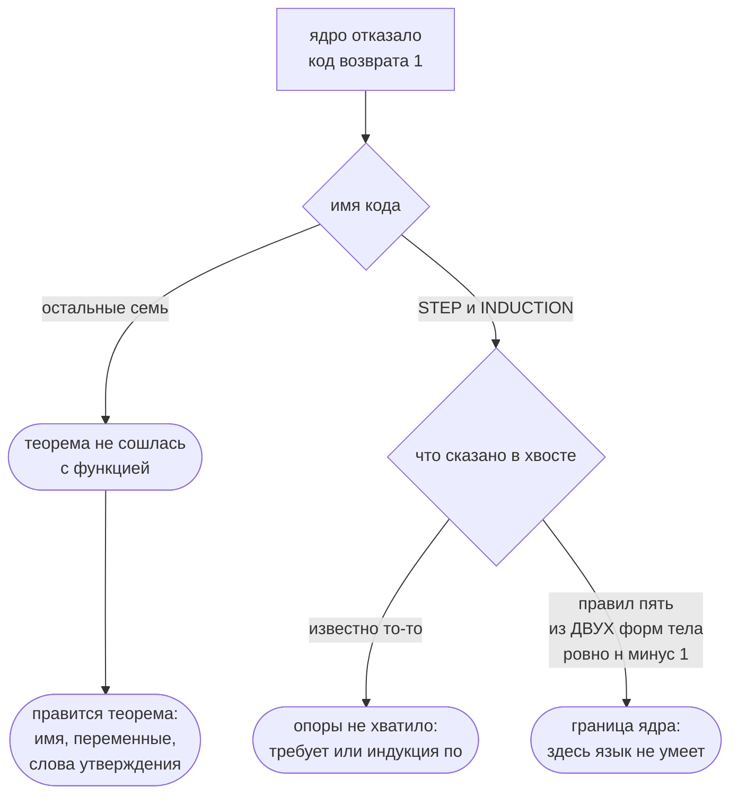

# Ядро отказало: чья это ошибка

Отсюда вы узнаете, что стоит за каждым отказом ядра доказательств, и сможете по
коду замечания отличить свою ошибку от границы языка. Отказов у ядра ровно
{{отказы.всего}}: {{отказы.обязательств}} говорят, что теорема не сошлась с
функцией, и чинятся правкой теоремы; {{отказы.вывода}} говорят, что вывод не
построен, и половина из них — предел, за который язык сегодня не ходит.

Каждый отказ ниже снят прогоном: рядом стоит программа, на которой он
получается, и текст, который на ней печатает компилятор.

## Замечание читается пятью частями

```
FLANG_PROOF_NO_GOAL в файле проба.flang, строка 23, столбец 1: теорема
«штраф положителен» ничего не закрывает: постусловия «штраф положителен» нет
ни у одной функции модуля. Теорема доказывает названное утверждение, а не
утверждение вообще — назовите её так же, как постусловие, которое она
закрывает
```

Код, файл, строка, столбец, текст. Код возврата — 1, и файл считается
непроверенным целиком: `flang check` заканчивает строкой
`не проверено — замечаний N`.

Хвост сообщения читать обязательно, и не ради вежливости: у отказов вывода
именно в хвосте написано, чего ядру было известно в этом месте
(`известно: предусловие функции «Сумма»`) и какие способы оно перебрало
(`правил пять — …`). Это и есть ответ на вопрос «моё или не моё».

## Отказ — не худший исход. Худший — код 0

Утверждение без теоремы при нём не отвергается. Оно просто не доказывается, и
`flang check` отвечает кодом 0:

```flang
модуль «Проба»

тотальная функция «Удвоить»
  принимает х: целое
  возвращает число
  для всех х обеспечивает «результат чётный» (результат остаток от 2) равно 0
  пример «единица»
    дано х равно 1
    ожидается 2
  х умножить на 2
```

```
$ flang check проба.flang
модуль «Проба»: функций 1, из них с доказанным завершением 1; типов 0
проба.flang: проверено — разбор, типы, завершаемость, ядро и примеры; замечаний нет
$ echo $?
0
```

Слово «проверено» тут про типы и завершаемость, а про утверждение — ни слова.
Что с ним на самом деле, показывает ключ `--proof`:

```
$ flang check проба.flang --proof
постусловие «результат чётный» функции «Удвоить» — сетка 1 значение
(примеры функции): нарушений НЕ ИСКАЛИ — прогона примеров не было, посчитано
только их число. Это не доказательство — теоремы при утверждении нет
```

Правило простое: **зелёный `flang check` не значит «доказано».** Значит только
«не отвергнуто». Доказано то, про что `--proof` сказал «доказано»; про
остальное он говорит «сетка N», «объявлено, не доказано» или «на веру».
Что стоит за каждым из этих слов — на странице
[что доказано, а что нет](what-is-proved.html).

## Куда смотреть, получив отказ



## Семь отказов: теорема не сошлась с функцией

Все семь — про связь теоремы с функцией, которую она закрывает, и все семь
правятся в самой теореме. Языка они не касаются.

| Код | Что случилось | Что править |
| --- | --- | --- |
| `FLANG_PROOF_NO_GOAL` | постусловия с таким именем нет ни у одной функции модуля | имя теоремы: оно обязано совпасть с именем постусловия |
| `FLANG_PROOF_AMBIGUOUS` | под имя теоремы подходят сразу два постусловия | дайте постусловиям разные имена |
| `FLANG_PROOF_DUPLICATE` | у одного постусловия больше одной теоремы | оставьте одну |
| `FLANG_PROOF_CLAIM_MISMATCH` | `утверждаем` написано не так, как постусловие | перепишите слово в слово: ядро не решает, что две записи означают одно |
| `FLANG_PROOF_UNFINISHED` | нет строки `следовательно доказано` | допишите её; незакрытое доказательство — набросок |
| `FLANG_PROOF_UNKNOWN_VAR` | `дано` вводит имя, которого у функции нет | назовите параметр так, как он назван в функции |
| `FLANG_PROOF_VAR_TYPE` | у переменной теоремы и у параметра разные типы | поставьте объявленный тип параметра |

Как это выглядит. Функция и теорема, у которых разошлись имена:

```flang
тотальная функция «Штраф»
  принимает свет: «Светофор»
  возвращает число
  для всех свет обеспечивает «штраф неотрицателен» результат не меньше 0
  разбор свет
    случай вариант «Красный»
      то 500
    случай вариант «Зелёный»
      то 0

теорема «штраф положителен»
  дано свет: «Светофор»
  утверждаем результат не меньше 0
  индукция по свет
    случай вариант «Красный»
      то по примеру «красный»
    случай вариант «Зелёный»
      то по примеру «зелёный»
  следовательно доказано
```

```
FLANG_PROOF_NO_GOAL … теорема «штраф положителен» ничего не закрывает:
постусловия «штраф положителен» нет ни у одной функции модуля
```

Теорема здесь верная, а доказывает она то, чего никто не обещал. Ядро не
подбирает утверждение по смыслу — только по имени.

## Шесть отказов: вывод не построен

Здесь и лежит настоящая граница. Два отказа из шести — ваша ошибка, три
называют то, чего язык не делает вовсе, а один читается по хвосту сообщения:
он бывает и тем, и другим.

| Код | Что случилось | Чья это ошибка |
| --- | --- | --- |
| `FLANG_PROOF_INDUCTION_CASES` | случаи теоремы не сошлись с вариантами типа | ваша: лишний случай говорит о том, чего у типа не бывает |
| `FLANG_PROOF_INDUCTION_STEP` | `по предположению` стоит там, где предполагать не о чем | ваша: нет ни посылки индукции, ни `требует` |
| `FLANG_PROOF_STEP` | цель не сведена ни одним из правил | смотря что в хвосте: не хватило факта — ваша; не тот вид цели — граница |
| `FLANG_PROOF_INDUCTION_TYPE` | индукция идёт по типу, у которого принципа нет | граница: по `число` и `целое` его нет и не будет |
| `FLANG_PROOF_INDUCTION_BRANCH` | тело написано формой, из которой заключение не построить | граница: заключение читается только с `разбор` и со `свёртка` |
| `FLANG_PROOF_INDUCTION_DESCENT` | спуск по `нат` не строгий | граница: читается ровно `н минус 1`, и ничего кроме |

### Три границы, названные ядром дословно

**Индукции по числу нет.** Тип обязан нести принцип индукции, и нести его
могут только три вещи: объявленная сумма (из вариантов), встроенный список (из
двух образцов разбора) и отрезок `нат` (из двух границ). Довод ядро печатает
вместе с отказом:

```
FLANG_PROOF_INDUCTION_TYPE … индукция теоремы «двойная норма неотрицательна»
идёт по «норма», а у этого типа (число) принципа индукции нет … По «число» и
«целое» его брать НЕЛЬЗЯ, и это не осторожность: у «число» в носителе живёт
«+∞», у которого «х минус 1» равно самому «х», и спуска не происходит вовсе;
а вне [0, 2⁵³−1] ложно и само «х минус 1 меньше х» (при х = 2⁵³+4 округление
к ближайшему возвращает то же х)
```

Обход — объявить параметр как `нат`, а не как `число`.

**Тело обязано быть одной из двух форм.** Чтобы построить заключение случая,
ядру нужно знать, чем оказывается `результат` в этом случае, и читает оно это
из тела функции:

```
FLANG_PROOF_INDUCTION_BRANCH … тело функции «Штраф» не разбирает «свет» на
верхнем уровне и не сворачивает «свет» свёрткой … Ядро читает «результат»
случая из ДВУХ форм тела и ниоткуда больше: с ветви `разбор` по той же
переменной … и с начала и шага `свёртка` по той же переменной … Тело-вызов,
тело-арифметика и тело-условие заключения посылки не дают
```

Обход — переписать тело разбором по той переменной, по которой идёт индукция.

**Спуск читается ровно на единицу.** У отрезка `нат` принцип держится тем, что
цепочка `н, н−1, …` дна не проскакивает, и ядро сверяет это в теле:

```
FLANG_PROOF_INDUCTION_DESCENT … спуск в шаге «Сумма до» не строгий: вычитают
на 2, а не на 1. Ядро читает ровно «н минус 1» и ничего кроме … Всё прочее —
либо не убывание, либо убывание, которого IEEE-754 не обещает
```

Обхода нет: шаг с вычитанием на два ядро сегодня не доказывает.

### Пять видов цели, и шестой способ

`FLANG_PROOF_STEP` — единственный отказ, который сам перечисляет всё, что
пробовал:

```
FLANG_PROOF_STEP … цель не сведена к 1 предусловию функции: у цели этого
случая нет вида, к которому у ядра есть правило: правил пять — «не меньше 0»,
«не больше конечного литерала», «не больше терма», «равно» и «содержит», и все
пять названы в отказе, чтобы список был виден целиком. Вида цели не спрашивает
только шестое, «цель есть допущение», и оно тоже не прошло: ни одно допущение
не совпало с целью знак в знак. известно: предусловие функции «Сумма»
```

Читается так: если ваша цель не одного из этих пяти видов — доказать её ядру
нечем, и переписывать надо утверждение, а не доказательство. Если вид
подходящий, а `известно:` пусто или называет не тот факт — не хватило опоры,
и лечится она строкой `требует` у функции или строкой `индукция по` в теореме.

## Все тринадцать имён

`FLANG_PROOF_NO_GOAL`, `FLANG_PROOF_AMBIGUOUS`, `FLANG_PROOF_DUPLICATE`,
`FLANG_PROOF_CLAIM_MISMATCH`, `FLANG_PROOF_UNFINISHED`,
`FLANG_PROOF_UNKNOWN_VAR`, `FLANG_PROOF_VAR_TYPE`, `FLANG_PROOF_STEP`,
`FLANG_PROOF_INDUCTION_STEP`, `FLANG_PROOF_INDUCTION_TYPE`,
`FLANG_PROOF_INDUCTION_BRANCH`, `FLANG_PROOF_INDUCTION_CASES`,
`FLANG_PROOF_INDUCTION_DESCENT`.

Других отказов у ядра доказательств нет. Остальные коды компилятора — про
разбор, типы, имена и завершаемость — перечислены в `man flang`, раздел
ДИАГНОСТИКА.

## Что дальше

- [Учебник](tutorial.html) — от первой функции до утверждения, принятого ядром
- [Что доказано, а что нет](what-is-proved.html) — три ответа ядра и что за
  ними стоит
- [Спецификация ядра](spec-proof.html) — правила вывода целиком, для того, кто
  хочет знать, почему правил именно столько
