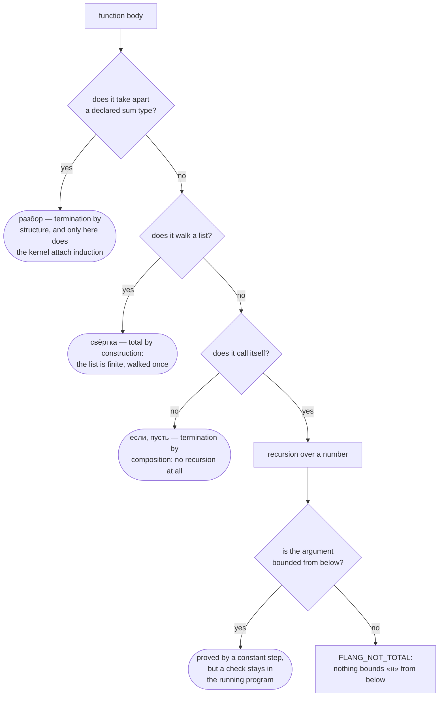

# Tutorial

Six chapters: from your first function to a claim the kernel has proved for
**all** inputs. Every chapter is code, a run, and an exercise with its answer.

You need `flang` installed ([how](install.html)) and the five minutes of the
[first program](getting-started.html), which is not repeated here.

The code below is written in the Russian surface of the language — the same
program can be written in English words, see [Four writing
surfaces](../surfaces.html). Every program below is shown in full: copy it into a file, put `модуль
«Учебник»` on the first line and run `flang check` and `flang test`.
## Chapter 1. A function, its types, an example

```
тотальная функция «Удвоить»
  принимает н: число
  возвращает число
  пример «дважды два»
    дано н равно 2
    ожидается 4
  н умножить на 2
```

A function name is written in guillemets: `«Удвоить»`. A call reads
`«Удвоить» от 21`.

`пример` (example) is not a test on the side but part of the declaration: both
`flang test` and `flang check` run it. An example must be named — and that is
not pedantry: a proof refers to it by name (chapter 6).

Both commands on this chapter's file answer like this:

```bash
flang check ch1.flang
flang test ch1.flang
flang run ch1.flang --function Удвоить --args '{"н": 21}'
```

```
модуль «Учебник»: функций 2, из них с доказанным завершением 2; типов 0
ch1.flang: проверено — разбор, типы, завершаемость, ядро и примеры; замечаний нет
ch1.flang: примеров 2, прошло 2, не прошло 0
42
```

**Exercise 1.** Write `«Утроить»` (triple) with an example.

```
тотальная функция «Утроить»
  принимает н: число
  возвращает число
  пример «трижды два»
    дано н равно 2
    ожидается 6
  н умножить на 3
```

**You can now:** declare a function with types and an example, check it and call
it from the command line.

## Chapter 2. There are no loops — there is a fold

The language has no loop at all. Walking a list is written `свёртка` (fold):

```
тотальная функция «Сумма»
  принимает элементы: список числа
  возвращает число
  пример «три числа»
    дано элементы равно [1, 2, 3]
    ожидается 6
  свёртка элементы начиная с 0 как акк и эл → акк плюс эл
```

Read it as: start from `0`, walk the list, and at every step take the
accumulator (`акк`) and the current item (`эл`) and produce the new accumulator.

The arrow is typed `→`, `->` or `=>` — all the same thing. Here and below it is
written `→`; if your keyboard has no such key, write `->`.

A fold is **total by construction**: the list is finite and it is walked once.
There is nothing for the compiler to prove.

A condition may live inside the fold; no separate "maximum" form is needed:

```
  свёртка элементы начиная с 0 как акк и эл → если эл больше акк то эл иначе акк
```

**A naming trap.** `эл` is an ordinary name, but `элемент` is a word of the
language ("list item by index") and cannot be taken. On that attempt the
compiler answers like this:

```
FLANG_PARSE в файле ch2.flang, строка 9, столбец 68: не разобрана конструкция: неожиданное '
'
```

The message does not name the cause; it points at the end of the line. The taken names are listed in
the [glossary](../glossary.html): {{словарь.понятий}} concepts.

**Exercise 2.** The sum of squares of `[1, 2, 3]` is 14.

```
  свёртка элементы начиная с 0 как акк и эл → акк плюс (эл умножить на эл)
```

The three folds of this chapter in one file give:

```
модуль «Свёртки»: функций 3, из них с доказанным завершением 3; типов 0
ch2.flang: проверено — разбор, типы, завершаемость, ядро и примеры; замечаний нет
ch2.flang: примеров 3, прошло 3, не прошло 0
```

**You can now:** walk a list with a fold — a sum, a maximum, any accumulation —
without a single loop.

## Chapter 3. Four body forms, and the choice matters

A function body is written in one of four forms. The choice is not only about
readability: it decides **what the compiler proves termination by** — and
sometimes whether it can prove it at all.



The three upper outcomes cost nothing at run time. The lower one costs: a check
stays in the emitted program, and with it the function runs **three times
slower** than the same function without it.

| form | when | what it gives the compiler |
| --- | --- | --- |
| `разбор` (case) | the value is a declared sum type | termination by structure; **the only form induction attaches to** |
| `свёртка` (fold) | walking a list | termination by construction |
| `если` (if) | branching | nothing by itself: termination is computed from the calls |
| `пусть` (let) | bind a name once | nothing; it is not a variable and cannot be reassigned |

**You can now:** pick the body form that lets termination be proved, and know
what the choice costs.

## Chapter 4. `тотальная` — a promise that gets checked

`тотальная` (total) means "terminates on every input", and the compiler
**checks** it. Here is a program that does not keep the promise:

```
тотальная функция «Крутить»
  принимает н: число
  возвращает число
  если н равен 0
    то 0
    иначе «Крутить» от (н минус 1)
```

`flang check` refuses and names what is missing:

```
FLANG_NOT_TOTAL в файле krutit.flang, строка 8, столбец 11: тотальная функция
«Крутить»: рекурсивный вызов «Крутить» не убывает — аргумент 1 («н» sub 1)
уменьшает параметр «н», но снизу «н» ничем не ограничен: добавьте проверку вида
«если н не больше 0». Передавайте часть аргумента: хвост списка из образца
«голова и хвост», поле варианта из образца, поле записи или элемент коллекции
```

And it is right: on −1 this function never terminates — negative numbers walk
straight past `равен 0` (equals 0). The fix is exactly the one named: `равен` →
`не больше` (at most).

```
  если н не больше 0
```

After that `flang check` answers "замечаний нет" (no diagnostics), and the
report of `flang check --proof` names what the promise rests on:

```
«Сумма до»  доказано постоянным шагом: аргумент 1 («н») убывает на постоянный
шаг и ограничен снизу; на IEEE-754 шаг не всегда меняет число, поэтому сторож,
1 место
```

"A guard, 1 site" is the check that stays in the running program: the numbers
here are machine numbers, and at very large values subtracting one no longer
changes the number. The compiler does not keep quiet about it.

**Exercise 3.** Declare the input `нат` instead of `число` — the check passes
even without fixing the condition, because that type holds no negative inputs at
all. The boundary is then guarded by the call:

```bash
flang run ch4.flang --function 'Сумма до' --args '{"н": -3}'
```

```
FLANG_TYPE: вызов функции «Сумма до»: аргумент «н»: -3 вне нат
```

Exit code 1.

**You can now:** read a `FLANG_NOT_TOTAL` refusal and fix the recursion exactly
the way it asks.

## Chapter 5. Sum types and `разбор`

You declare your own set of values like this:

```
тип «Оценка»
  вариант «отлично»
  вариант «хорошо»
  вариант «удовлетворительно»
```

And take it apart like this:

```
тотальная функция «Балл оценки»
  принимает оценка: «Оценка»
  возвращает число
  разбор оценка
    случай вариант «отлично»
      то 5
    случай вариант «хорошо»
      то 4
    случай вариант «удовлетворительно»
      то 3
```

A forgotten case is a check-time error, not a run-time surprise:

```
FLANG_MATCH_NOT_EXHAUSTIVE в файле cveta.flang, строка 10, столбец 3:
разбор «Цвет» не покрывает «зелёный»
```

A variant can carry a value: `вариант «балл» содержит «сколько»: число`, and the
case pattern takes it out: `случай вариант «балл» с «сколько» как сколько`.

**Exercise 4.** Add `вариант «неявка»` (a no-show) and extend the case analysis
so that it is worth 0. The check must go green again:

```
модуль «Оценки»: функций 1, из них с доказанным завершением 1; типов 1
ch5.flang: проверено — разбор, типы, завершаемость, ядро и примеры; замечаний нет
```

**You can now:** declare your own type of variants and take it apart so that a
forgotten case never reaches the run.

## Chapter 6. From "grid" to "proved"

A claim about the result is written with `обеспечивает` (ensures):

```
  обеспечивает «сумма до неотрицательна» результат не меньше 0
```

By itself that is not a proof, and the report says what it actually rests on:

```
постусловие «сумма до неотрицательна» функции «Сумма до» — сетка 1 значение
(примеры функции): нарушений НЕ ИСКАЛИ — прогона примеров не было, посчитано
только их число. Это не доказательство — теоремы при
утверждении нет
```

There are two moves from here, and both are shown by a run.

**Move one: induction over a declared sum.** For a type of three constant
variants, each case is closed by pointing at an example:

```
теорема «балл не меньше трёх»
  дано оценка: «Оценка»
  утверждаем результат не меньше 3
  индукция по оценка
    случай вариант «отлично»
      то по примеру «отлично — пять»
    случай вариант «хорошо»
      то по примеру «хорошо — четыре»
    случай вариант «удовлетворительно»
      то по примеру «удовлетворительно — три»
  следовательно доказано
```

```
постусловие «балл не меньше трёх» функции «Балл оценки» — доказано индукцией
по «Оценка»: база 3 случая, шаг при допущении на частях (0 случаев) —
утверждение обо ВСЕХ входах типа «Оценка», а не о
написанных
```

**Move two: a precondition as a fact.** `требует` (requires) is what the caller
must guarantee; to the kernel it is the fact the result is derived from:

```
тотальная функция «Двойная норма»
  принимает норма: число
  возвращает число
  требует «норма неотрицательна» норма не меньше 0
  обеспечивает «двойная норма неотрицательна» результат не меньше 0
  норма умножить на 2

теорема «двойная норма неотрицательна»
  дано норма: число
  утверждаем результат не меньше 0
  по предположению
  следовательно доказано
```

```
постусловие «двойная норма неотрицательна» функции «Двойная норма» —
доказано: терм принят ядром, 1 шаг — утверждение обо ВСЕХ входах
```

**Check that the proof cannot be faked.** Remove the `требует` line — the claim
becomes false (on −1 the result is −2) — and the kernel refuses:

```
FLANG_PROOF_INDUCTION_STEP в файле ch6.flang, строка 15, столбец 3: шаг 1,
теорема «двойная норма неотрицательна»: «по предположению» стоит вне индукции,
а допущений у этой цели нет ни одного: ни посылки индукции (её даёт `индукция
по`), ни предусловия функции (его даёт `требует`). Предполагать не о чем.
к этому месту не известно ничего, кроме гипотез «дано»
```

A theorem with nothing under it is not accepted. That is the difference between
"written" and "proved".

**Exercise 5.** Prove the same about `«Тройная норма»` with the body `норма
умножить на 3`. Answer: the same `требует` line and the same four lines of
theorem; the report answers "доказано: терм принят ядром, 1 шаг".

**You can now:** carry a claim from "grid" to "proved" — by induction over a
declared type, or by a precondition used as a fact.

## What the compiler says when you got it wrong

Every message below was taken from a `flang check` run on a small program. A
diagnostic is a code, a file, a line, a column and a text; the exit code is 1.

| code | when | what to do |
| --- | --- | --- |
| `FLANG_PARSE` | the construct did not parse; often a word of the language taken as a name | check the [glossary](../glossary.html) |
| `FLANG_TYPE` | types do not agree: "declared as string, body gives number" | fix the type or the body |
| `FLANG_UNKNOWN_NAME` | the name is declared nowhere | a typo or a forgotten import |
| `FLANG_NOT_TOTAL` | termination is not proved | the message names the missing condition |
| `FLANG_MATCH_NOT_EXHAUSTIVE` | the case analysis misses a variant | add the case |
| `FLANG_PROOF_INDUCTION_STEP` | the proof step has nothing to stand on | add `требует` or `индукция по` |
| `FLANG_RECURSION_LIMIT` | the computation hit the step limit | the limit is set by `--max-steps` |

Every refusal from the proof kernel — and `FLANG_PROOF_INDUCTION_STEP` is one
of them — is covered by name on
[The kernel refused: whose mistake is it](proof-refused.html), where each one
says whether it is fixed in the theorem or runs into a limit of the language.
The compiler's remaining codes are listed in the manual page (`man flang`),
section ДИАГНОСТИКА.

## Next

- [Operations](operations.html) — lists, strings, sets, numbers
- [Glossary](../glossary.html) (in Russian) — {{словарь.понятий}} concepts, of
  which {{словарь.наЧетырёх}} are open on all four writing surfaces
