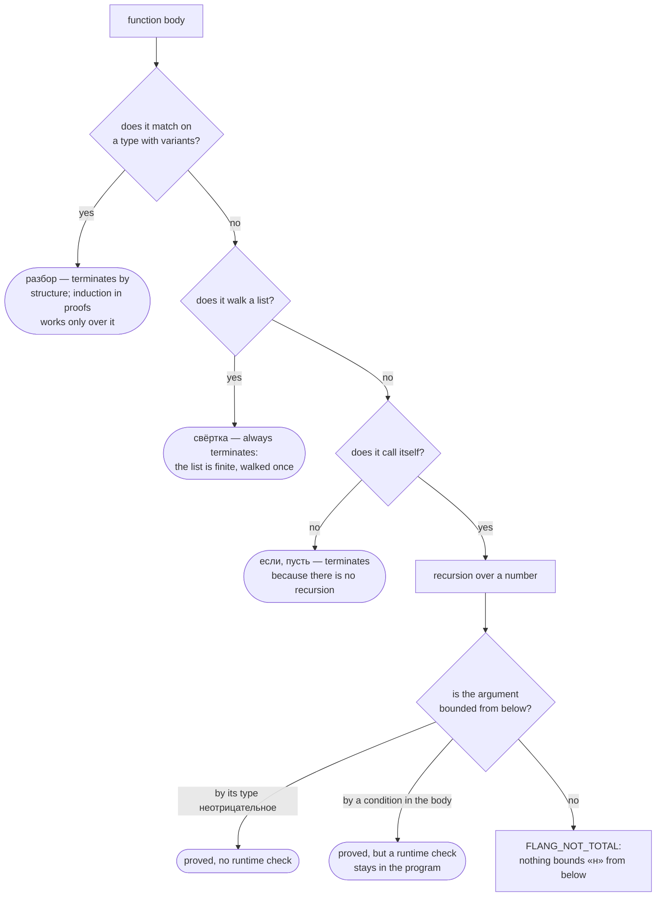

# Tutorial

Six chapters: from your first function to a postcondition the prover has
proved for **all** inputs. Each chapter has code, its real compiler output and
an exercise with the answer.

You need `flang` installed ([how](install.html)) and the
[first program](getting-started.html) behind you; it is not repeated here.

The code uses the Russian keywords; the same program can be written with
English keywords, see [Four writing surfaces](../surfaces.html). Every program
is shown in full: copy it into a file, put `модуль «Учебник»` on the first line
and run `flang check` and `flang test`.

Words used below:

| In flang | Usual name |
| --- | --- |
| `пример` | a unit test inside the function |
| `свёртка` | reduce (fold) |
| `тип` with `вариант`s | enum with data, tagged union |
| `разбор … случай` | pattern matching |
| `тотальная` | the compiler proves the function always terminates |
| `требует` / `обеспечивает` | precondition / postcondition |
| `теорема` | a proof you write yourself |
| «ядро» in the output | the prover |

## Chapter 1. A function, its types, a unit test

```
тотальная функция «Удвоить»
  принимает н: число
  возвращает число
  пример «дважды два»
    дано н равно 2
    ожидается 4
  н умножить на 2
```

A function name is written in guillemets: `«Удвоить»`. A call is written
`«Удвоить» от 21`.

`пример` is a unit test that lives in the function declaration: both
`flang test` and `flang check` run it. Every example needs a name, because a
proof can refer to an example by its name (chapter 6).

On this chapter's file (the function above plus the exercise below):

```bash
flang check ch1.flang
flang test ch1.flang
flang run ch1.flang --function Удвоить --args '{"н": 21}'
```

```
модуль «Учебник»: функций 2, из них с доказанным завершением 2; типов 0
ch1.flang: проверено — разбор, типы, завершаемость, ядро и примеры; замечаний нет
ch1.flang: примеров 2, прошло 2, не прошло 0
доказано: утверждений 0
42
```

**Exercise 1.** Write `«Утроить»` (triple) with a unit test.

```
тотальная функция «Утроить»
  принимает н: число
  возвращает число
  пример «трижды два»
    дано н равно 2
    ожидается 6
  н умножить на 3
```

**You can now:** declare a function with types and a unit test, check it and
call it from the command line.

## Chapter 2. No loops: use `свёртка` (reduce)

The language has no loops. To walk a list, write `свёртка`:

```
тотальная функция «Сумма»
  принимает элементы: список числа
  возвращает число
  пример «три числа»
    дано элементы равно [1, 2, 3]
    ожидается 6
  свёртка элементы начиная с 0 как акк и эл → акк плюс эл
```

It reads: start with `0`, go through the list, and at each step compute the
new accumulator from the old one (`акк`) and the current item (`эл`). It is
`reduce` from JavaScript and Python.

The arrow can be typed `→`, `->` or `=>`; they mean the same.

A `свёртка` always terminates: the list is finite and is walked once, so there
is nothing to prove.

Put a condition inside to get, for example, the maximum:

```
  свёртка элементы начиная с 0 как акк и эл → если эл больше акк то эл иначе акк
```

**A naming pitfall.** `эл` is an ordinary name, but `элемент` is a keyword
("list item by index") and cannot be used as a name. If you write
`как акк и элемент → акк плюс элемент`, the compiler answers:

```
FLANG_PARSE в файле ch2.flang, строка 9, столбец 68: не разобрана конструкция: неожиданное '
'
```

The message does not name the cause and points at the end of the line. If a
parse error points somewhere strange, check whether one of your names is a
keyword: the [glossary](../glossary.html) lists all {{словарь.понятий}}
concepts.

**Exercise 2.** The sum of squares of `[1, 2, 3]` is 14.

```
  свёртка элементы начиная с 0 как акк и эл → акк плюс (эл умножить на эл)
```

The three functions of this chapter (sum, maximum, sum of squares) in one file:

```
модуль «Свёртки»: функций 3, из них с доказанным завершением 3; типов 0
ch2.flang: проверено — разбор, типы, завершаемость, ядро и примеры; замечаний нет
ch2.flang: примеров 3, прошло 3, не прошло 0
```

**You can now:** compute a sum, a maximum or any other total over a list
without a loop.

## Chapter 3. Four forms of a body, and how to choose

A function body is written in one of four forms. The choice decides **how the
compiler proves termination**, and sometimes whether it can.


```mermaid Choosing the body form
flowchart TD
  A[function body] --> B{does it match on<br>a type with variants?}
  B -->|yes| C([разбор — terminates by<br>structure; induction in proofs<br>works only over it])
  B -->|no| D{does it walk a list?}
  D -->|yes| E([свёртка — always terminates:<br>the list is finite, walked once])
  D -->|no| F{does it call itself?}
  F -->|no| G([если, пусть — terminates<br>because there is no recursion])
  F -->|yes| H[recursion over a number]
  H --> I{is the argument<br>bounded from below?}
  I -->|by its type неотрицательное| J1([proved, no runtime check])
  I -->|by a condition in the body| J([proved, but a runtime check<br>stays in the program])
  I -->|no| K[FLANG_NOT_TOTAL:<br>nothing bounds «н» from below]
  class C,E,G,J1 vyvod
  class K otkaz
```

| Form | Usual name | Use it when | What it gives the compiler |
| --- | --- | --- | --- |
| `разбор` | pattern matching | the value is of a type with variants | termination by structure; **the only form induction works over** |
| `свёртка` | reduce | you walk a list | always terminates |
| `если` | if as an expression | you choose between two values | nothing by itself: termination follows from what it calls |
| `пусть` | constant | you name a value once | nothing; it is not a variable and cannot be reassigned |

**You can now:** pick the form of the body so that termination is provable.

## Chapter 4. `тотальная`: termination is checked

`тотальная` means "terminates on every input", and the compiler **checks**
it. This function does not always terminate:

```
тотальная функция «Крутить»
  принимает н: число
  возвращает число
  если н равен 0
    то 0
    иначе «Крутить» от (н минус 1)
```

`flang check` rejects it and says what is missing:

```
FLANG_NOT_TOTAL в файле krutit.flang, строка 8, столбец 11: тотальная функция
«Крутить»: рекурсивный вызов «Крутить» не убывает — аргумент 1 («н» sub 1)
уменьшает параметр «н», но снизу «н» ничем не ограничен: добавьте проверку вида
«если н не больше 0». Передавайте часть аргумента: хвост списка из образца
«голова и хвост», поле варианта из образца, поле записи или элемент коллекции
```

The compiler is right: with −1 the function never stops, because negative
numbers go past `равен 0` (equals 0). Do what the message says: replace
`равен` with `не больше` (at most):

```
  если н не больше 0
```

Here is the fixed function as `«Сумма до»` (sum from 1 to n), which the rest of
the tutorial uses:

```
тотальная функция «Сумма до»
  принимает н: число
  возвращает число
  пример «до трёх»
    дано н равно 3
    ожидается 6
  если н не больше 0
    то 0
    иначе н плюс («Сумма до» от (н минус 1))
```

Now `flang check` answers «замечаний нет» (no remarks), and
`flang check --proof` says how termination was proved:

```
«Сумма до»  доказано постоянным шагом: аргумент 1 («н») убывает на постоянный
шаг и ограничен снизу; на IEEE-754 шаг не всегда меняет число, поэтому сторож,
1 место
```

`сторож, 1 место` means one runtime check stays in the program. `число` is a
floating-point number, and for very large values subtracting 1 does not change
it, so the compiler keeps a check against that.

**Exercise 3.** Declare the parameter `неотрицательное` instead of `число`
(keep the `не больше 0` condition). Termination is then proved without a
runtime check, because the type bounds the value from below and above:

```
«Сумма до»  доказано точным шагом: аргумент 1 («н») объявлен натуральным и убывает на 1; дно и потолок даёт тип, внутри потолка шаг точен — сторожа нет
```

A negative argument is now rejected at the call, exit code 1:

```bash
flang run ch4.flang --function 'Сумма до' --args '{"н": -3}'
```

```
доказано: утверждений 0
FLANG_TYPE: вызов функции «Сумма до»: аргумент «н»: -3 вне неотрицательное
```

Do not go back to `равен 0` with `неотрицательное`: `н минус 1` is then of type
`целое` (integer), which may be negative, and the check fails with
`FLANG_TYPE` and `FLANG_NOT_TOTAL`.

**You can now:** read a `FLANG_NOT_TOTAL` error and fix the recursion the way
it says.

## Chapter 5. Types with variants and `разбор`

A type with a fixed set of values (an enum) is declared like this:

```
тип «Оценка»
  вариант «отлично»
  вариант «хорошо»
  вариант «удовлетворительно»
```

and matched like this:

```
тотальная функция «Балл оценки»
  принимает оценка: «Оценка»
  возвращает число
  разбор оценка
    случай вариант «отлично»
      то 5
    случай вариант «хорошо»
      то 4
    случай вариант «удовлетворительно»
      то 3
```

A forgotten variant is an error at check time, not a surprise at run time:

```
FLANG_MATCH_NOT_EXHAUSTIVE в файле cveta.flang, строка 10, столбец 3:
разбор «Цвет» не покрывает «зелёный»
```

A variant can carry data: `вариант «балл» содержит «сколько»: число`, and the
case takes it out: `случай вариант «балл» с «сколько» как сколько`.

**Exercise 4.** Add `вариант «неявка»` (no-show) and a case for it that gives
0. The check must pass again:

```
модуль «Оценки»: функций 1, из них с доказанным завершением 1; типов 1
ch5.flang: проверено — разбор, типы, завершаемость, ядро и примеры; замечаний нет
```

**You can now:** declare an enum and match on it so that a forgotten case is
caught before the program runs.

## Chapter 6. From "checked on examples" to "proved"

A postcondition is written with `обеспечивает`. Add one to `«Сумма до»`:

```
  обеспечивает «сумма до неотрицательна» результат не меньше 0
```

On its own it is not proved. The proof report says what it rests on:

```
постусловие «сумма до неотрицательна» функции «Сумма до» — сетка 1 значение
(примеры функции): нарушений НЕ ИСКАЛИ — прогона примеров не было, посчитано
только их число. Это не доказательство — теоремы при
утверждении нет
```

`сетка 1 значение` means: checked only on one example, like a unit test; there
is no proof. There are two ways to get a proof.

**Way one: induction over a type with variants.** Write a `теорема` (theorem)
and close each variant by pointing at the example that covers it:

```
теорема «балл не меньше трёх»
  дано оценка: «Оценка»
  утверждаем результат не меньше 3
  индукция по оценка
    случай вариант «отлично»
      то по примеру «отлично — пять»
    случай вариант «хорошо»
      то по примеру «хорошо — четыре»
    случай вариант «удовлетворительно»
      то по примеру «удовлетворительно — три»
  следовательно доказано
```

(The function `«Балл оценки»` here has the postcondition
`обеспечивает «балл не меньше трёх» результат не меньше 3` and three examples
with these names.) The report:

```
постусловие «балл не меньше трёх» функции «Балл оценки» — доказано индукцией
по «Оценка»: база 3 случая, шаг при допущении на частях (0 случаев) —
утверждение обо ВСЕХ входах типа «Оценка», а не о
написанных
```

Proved for every value of the type, not only for the examples.

**Way two: derive it from the precondition.** `требует` is what the caller must
guarantee; the prover may use it as a known fact:

```
тотальная функция «Двойная норма»
  принимает норма: число
  возвращает число
  требует «норма неотрицательна» норма не меньше 0
  обеспечивает «двойная норма неотрицательна» результат не меньше 0
  норма умножить на 2

теорема «двойная норма неотрицательна»
  дано норма: число
  утверждаем результат не меньше 0
  по предположению
  следовательно доказано
```

`по предположению` (by assumption) says: this follows from the precondition.
The report:

```
постусловие «двойная норма неотрицательна» функции «Двойная норма» — доказано: терм принят ядром, 1 шаг, правило «неотрицательность по построению», основания: предусловие функции «Двойная норма» — утверждение обо ВСЕХ входах
```

**A proof cannot be faked.** Delete the `требует` line. The postcondition
becomes false (−1 gives −2), and the check fails with two errors. First, the
compiler names the counterexample: `число` also contains NaN, which is neither
above nor below zero:

```
FLANG_BOUND_ON_NAN в файле ch6.flang, строка 6, столбец 3: постусловие «двойная
норма неотрицательна» функции «Двойная норма» ЛОЖНО, и контрпример назван: …
```

Second, it rejects the theorem, because there is no assumption left to use:

```
FLANG_PROOF_INDUCTION_STEP в файле ch6.flang, строка 12, столбец 3: шаг 1,
теорема «двойная норма неотрицательна»: «по предположению» стоит вне индукции,
а допущений у этой цели нет ни одного: ни посылки индукции (её даёт `индукция
по`), ни предусловия функции (его даёт `требует`). Предполагать не о чем.
к этому месту не известно ничего, кроме гипотез «дано»
```

A theorem that rests on nothing is not accepted.

**Exercise 5.** Prove the same for `«Тройная норма»` with the body
`норма умножить на 3`. Answer: the same `требует` line and the same four lines
of theorem; the report says «доказано: терм принят ядром, 1 шаг».

**You can now:** turn a postcondition checked only on examples into a proved
one, by induction over a type with variants or from a precondition.

## Common errors

Each error is printed as a code, a file, a line, a column and a text; the exit
code is 1.

| Code | When | What to do |
| --- | --- | --- |
| `FLANG_PARSE` | the code did not parse; often a keyword was used as a name | look the word up in the [glossary](../glossary.html) |
| `FLANG_TYPE` | types do not match: «объявлена как строка, а тело даёт число» | fix the type or the body |
| `FLANG_UNKNOWN_NAME` | the name is not declared anywhere | a typo or a missing import |
| `FLANG_NOT_TOTAL` | termination is not proved | the message names the missing condition |
| `FLANG_MATCH_NOT_EXHAUSTIVE` | `разбор` misses a variant | add the case |
| `FLANG_PROOF_INDUCTION_STEP` | a proof step has nothing to rest on | add `требует` or `индукция по` |
| `FLANG_RECURSION_LIMIT` | the computation hit the step limit | `flang run` takes `--max-steps N` |

Every error of the prover, `FLANG_PROOF_INDUCTION_STEP` among them, is
explained on [The prover refused: whose mistake is it](proof-refused.html),
including whether you fix it in your proof or have hit a limit of the
language. All other codes are in the [Error reference](diagnostics.html) and in
`man flang`, section ДИАГНОСТИКА.

## Next

- [Which construct to use when](which-construct.html) — what to write for a
  task: enum, Optional, Result, map, filter, reduce
- [Operations](operations.html) — lists, strings, sets, numbers
- [Glossary](../glossary.html) (in Russian) — {{словарь.понятий}} concepts, of
  which {{словарь.наЧетырёх}} have a spelling on all four writing surfaces
