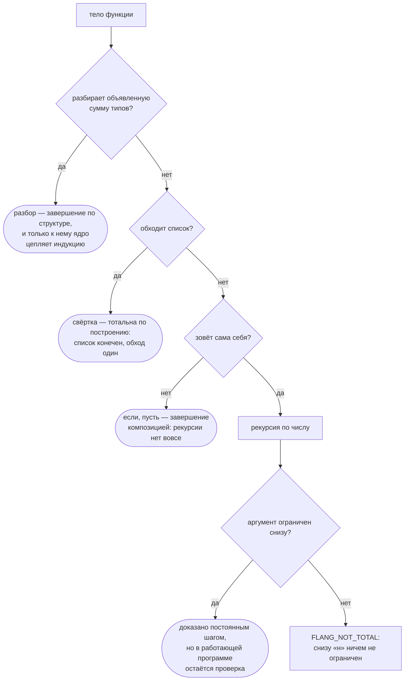

# Учебник

Шесть глав: от первой функции до утверждения, которое ядро доказало обо **всех**
входах. Каждая глава — код, прогон и упражнение с ответом.

Нужен установленный `flang` ([как поставить](install.html)) и пять минут на
[первую программу](getting-started.html) — она здесь не повторяется.

Все программы учебника лежат одним файлом. Прогнать целиком:

```bash
flang test docs/examples/tutorial.flang
```

```
docs/examples/tutorial.flang: примеров 10, прошло 10, не прошло 0
```

## Глава 1. Функция, типы, пример

```
тотальная функция «Удвоить»
  принимает н: число
  возвращает число
  пример «дважды два»
    дано н равно 2
    ожидается 4
  н умножить на 2
```

Имя функции — в ёлочках: `«Удвоить»`. Вызов пишется `«Удвоить» от 21`.

`пример` — не тест сбоку, а часть объявления: его прогоняет и `flang test`, и
`flang check`. Пример без имени написать нельзя, и это не педантизм — по имени
на него ссылается доказательство (глава 6).

**Упражнение 1.** Напишите `«Утроить»` с примером «трижды два».

```
тотальная функция «Утроить»
  принимает н: число
  возвращает число
  пример «трижды два»
    дано н равно 2
    ожидается 6
  н умножить на 3
```

## Глава 2. Циклов нет — есть свёртка

Цикла в языке нет вовсе. Обход списка пишется `свёртка`:

```
тотальная функция «Сумма»
  принимает элементы: список числа
  возвращает число
  пример «три числа»
    дано элементы равно [1, 2, 3]
    ожидается 6
  свёртка элементы начиная с 0 как акк и эл → акк плюс эл
```

Читается так: начать с `0`, идти по списку, на каждом шаге взять накопленное
(`акк`) и очередной элемент (`эл`) и дать новое накопленное.

Стрелка набирается `→`, `->` или `=>` — это одно и то же. Здесь и дальше стоит
`→`; если её нет на клавиатуре, пишите `->`.

Свёртка **тотальна по построению**: список конечен, обход один. Компилятору тут
доказывать нечего.

Условие внутри свёртки писать можно, отдельной формы для «наибольшего» не
нужно:

```
  свёртка элементы начиная с 0 как акк и эл → если эл больше акк то эл иначе акк
```

**Ловушка имён.** `эл` — обычное имя, а `элемент` — слово языка («элемент
списка по номеру»), и занять его нельзя. На такой попытке компилятор отвечает
`FLANG_PARSE: не разобрана конструкция`, показывая на конец строки: причины
сообщение не называет. Занятые имена перечислены в [словаре](glossary.html) —
149 понятий.

**Упражнение 2.** Сумма квадратов списка `[1, 2, 3]` — 14.

```
  свёртка элементы начиная с 0 как акк и эл → акк плюс (эл умножить на эл)
```

## Глава 3. Четыре формы тела, и выбор не безразличен

Тело функции пишется одной из четырёх форм. Выбор решает не только читаемость:
от него зависит, **чем компилятор докажет завершение**, а иногда — сможет ли
доказать вообще.



Три верхние развязки ничего не стоят при работе. Нижняя стоит: у неё в
напечатанной программе остаётся проверка, и с нею функция работает **втрое
дольше** себя же без проверки. Сколько таких функций в дереве — на
[главной](index.html).

| форма | когда | что даёт компилятору |
| --- | --- | --- |
| `разбор` | значение — объявленная сумма типов | завершение по структуре; **единственная форма, к которой цепляется индукция** |
| `свёртка` | обход списка | завершение по построению |
| `если` | ветвление | сама по себе ничего: завершение считается по вызовам |
| `пусть` | связать имя один раз | ничего; это не переменная, переприсвоить нельзя |

## Глава 4. `тотальная` — обещание, которое проверяют

`тотальная` значит «завершается на любом входе», и компилятор это
**проверяет**. Вот программа, которая обещания не держит:

```
тотальная функция «Крутить»
  принимает н: число
  возвращает число
  если н равен 0
    то 0
    иначе «Крутить» от (н минус 1)
```

`flang check` отказывает и называет, чего не хватило:

```
FLANG_NOT_TOTAL в файле krutit.flang, строка 8, столбец 11: тотальная функция
«Крутить»: рекурсивный вызов «Крутить» не убывает — аргумент 1 («н» sub 1)
уменьшает параметр «н», но снизу «н» ничем не ограничен: добавьте проверку вида
«если н не больше 0»
```

И он прав: на входе −1 эта функция не завершится никогда — мимо `равен 0`
отрицательные числа проходят. Правка ровно та, что названа: `равен` → `не
больше`.

```
  если н не больше 0
```

После неё `flang check` отвечает «замечаний нет», а ведомость называет носитель
обещания:

```
«Сумма до»  доказано постоянным шагом: аргумент 1 («н») убывает на постоянный
шаг и ограничен снизу; на IEEE-754 шаг не всегда меняет число, поэтому сторож,
1 место
```

«Сторож, 1 место» — та самая проверка, остающаяся в работающей программе: числа
здесь машинные, и на очень больших значениях вычитание единицы число уже не
меняет. Компилятор об этом не молчит.

**Упражнение 3.** Почему `принимает н: нат` не спасает? `нат` — отрезок
[0, 2⁵³−1], и `н минус 1` из него выходит. Ответ компилятора:
`FLANG_TYPE: аргумент «н» функции «Крутить»: ожидался нат, получен целое`.

## Глава 5. Сумма типов и `разбор`

Своё множество значений объявляется так:

```
тип «Оценка»
  вариант «отлично»
  вариант «хорошо»
  вариант «удовлетворительно»
```

Разбирается — так:

```
тотальная функция «Балл оценки»
  принимает оценка: «Оценка»
  возвращает число
  разбор оценка
    случай вариант «отлично»
      то 5
    случай вариант «хорошо»
      то 4
    случай вариант «удовлетворительно»
      то 3
```

Забытый случай — ошибка проверки, а не сюрприз во время работы:

```
FLANG_MATCH_NOT_EXHAUSTIVE в файле cveta.flang, строка 10, столбец 3:
разбор «Цвет» не покрывает «зелёный»
```

Вариант умеет нести значение: `вариант «балл» содержит «сколько»: число`, а в
разборе оно достаётся образцом `случай вариант «балл» с «сколько» как сколько`.

**Упражнение 4.** Добавьте `вариант «неявка»` и допишите разбор так, чтобы
неявка стоила 0. Проверка обязана снова стать зелёной.

## Глава 6. От «сетки» к «доказано»

Утверждение о результате пишется словом `обеспечивает`:

```
  обеспечивает «сумма до неотрицательна» результат не меньше 0
```

Само по себе оно доказательством не становится, и ведомость говорит, чем оно
несётся на самом деле:

```
постусловие «сумма до неотрицательна» функции «Сумма до» — сетка 1 значение
(примеры функции): нарушений НЕ ИСКАЛИ. Это не доказательство — теоремы при
утверждении нет
```

Дальше два хода, и оба показаны прогоном.

**Ход первый: индукция по объявленной сумме.** У типа из трёх
вариантов-констант каждый случай закрывается ссылкой на пример:

```
теорема «балл не меньше трёх»
  дано оценка: «Оценка»
  утверждаем результат не меньше 3
  индукция по оценка
    случай вариант «отлично»
      то по примеру «отлично — пять»
    случай вариант «хорошо»
      то по примеру «хорошо — четыре»
    случай вариант «удовлетворительно»
      то по примеру «удовлетворительно — три»
  следовательно доказано
```

```
постусловие «балл не меньше трёх» функции «Балл оценки» — доказано индукцией
по «Оценка»: база 3 случая — утверждение обо ВСЕХ входах типа «Оценка», а не о
написанных
```

**Ход второй: предусловие как факт.** `требует` — то, что обязан обеспечить
вызывающий; ядру оно даёт факт, из которого выводится результат:

```
тотальная функция «Двойная норма»
  принимает норма: число
  возвращает число
  требует «норма неотрицательна» норма не меньше 0
  обеспечивает «двойная норма неотрицательна» результат не меньше 0
  норма умножить на 2

теорема «двойная норма неотрицательна»
  дано норма: число
  утверждаем результат не меньше 0
  по предположению
  следовательно доказано
```

```
постусловие «двойная норма неотрицательна» функции «Двойная норма» —
доказано: терм принят ядром, 1 шаг — утверждение обо ВСЕХ входах
```

**Проверьте, что доказательство не подделывается.** Уберите строку `требует` —
утверждение станет ложным (на −1 результат равен −2), и ядро откажет:

```
FLANG_PROOF_INDUCTION_STEP: шаг 1, теорема «двойная норма неотрицательна»:
«по предположению» стоит вне индукции, а допущений у этой цели нет ни одного:
ни посылки индукции (её даёт `индукция по`), ни предусловия функции (его даёт
`требует`). Предполагать не о чем
```

Теорема без опоры не принимается. Это и есть разница между «написал» и
«доказано».

**Упражнение 5.** Докажите то же про `«Тройная норма»` с телом `норма умножить
на 3`. Ответ: та же строка `требует` и те же четыре строки теоремы; ведомость
ответит «доказано: терм принят ядром, 1 шаг».

## Что говорит компилятор, когда вы ошиблись

Все сообщения ниже сняты прогоном `flang check` на маленьких программах.
Замечание — это код, файл, строка, столбец и текст; код возврата 1.

| код | когда | что делать |
| --- | --- | --- |
| `FLANG_PARSE` | конструкция не разобрана; часто — слово языка, занятое под имя | сверьтесь со [словарём](glossary.html) |
| `FLANG_TYPE` | типы не сходятся: «объявлена как строка, а тело даёт число» | поправьте тип или тело |
| `FLANG_UNKNOWN_NAME` | имя не объявлено нигде | опечатка или забытый импорт |
| `FLANG_NOT_TOTAL` | завершение не доказано | сообщение называет недостающее условие |
| `FLANG_MATCH_NOT_EXHAUSTIVE` | разбор покрывает не все варианты | допишите случай |
| `FLANG_PROOF_INDUCTION_STEP` | шагу доказательства не на что опереть | добавьте `требует` или `индукция по` |
| `FLANG_RECURSION_LIMIT` | вычисление упёрлось в предел шагов | предел задаётся ключом `--max-steps` |

Полный список кодов — на странице руководства (`man flang`), раздел
ДИАГНОСТИКА.

## Что дальше

- [Операции языка](operations.html) — списки, строки, множества, числа
- [Доказательства: зачем и как](proofs.html) — три ответа ядра и ноль аксиом
- [Разборы настоящих случаев](case-studies.html) — 82 задачи и живая служба
- [Словарь языка](glossary.html) — все 149 слов на четырёх поверхностях
