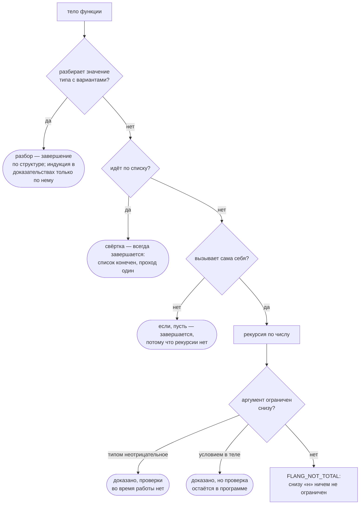

# Учебник

Шесть глав: от первой функции до постусловия, которое prover доказал для
**всех** входов. В каждой главе код, настоящий вывод компилятора и упражнение с
ответом.

Нужен установленный `flang` ([как поставить](install.html)) и пройденная
[первая программа](getting-started.html) — здесь она не повторяется.

Каждая программа ниже показана целиком: скопируйте её в файл, добавьте первой
строкой `модуль «Учебник»` и запустите `flang check` и `flang test`.

Слова, которые встретятся ниже:

| Во flang | Привычное название |
| --- | --- |
| `пример` | unit-тест прямо в функции |
| `свёртка` | reduce (fold) |
| `тип` с `вариант`ами | enum с данными, tagged union |
| `разбор … случай` | pattern matching |
| `тотальная` | компилятор доказывает, что функция всегда завершается |
| `требует` / `обеспечивает` | precondition / postcondition |
| `теорема` | доказательство, которое вы пишете сами |
| «ядро» в выводе | prover |

## Глава 1. Функция, типы, unit-тест

```
тотальная функция «Удвоить»
  принимает н: число
  возвращает число
  пример «дважды два»
    дано н равно 2
    ожидается 4
  н умножить на 2
```

Имя функции пишется в ёлочках: `«Удвоить»`. Вызов пишется `«Удвоить» от 21`.

`пример` — unit-тест, который живёт в объявлении функции: его запускают и
`flang test`, и `flang check`. У каждого примера должно быть имя: по имени на
пример может сослаться доказательство (глава 6).

На файле этой главы (функция выше плюс упражнение ниже):

```bash
flang check ch1.flang
flang test ch1.flang
flang run ch1.flang --function Удвоить --args '{"н": 21}'
```

```
модуль «Учебник»: функций 2, из них с доказанным завершением 2; типов 0
ch1.flang: проверено — разбор, типы, завершаемость, ядро и примеры; замечаний нет
ch1.flang: примеров 2, прошло 2, не прошло 0
доказано: утверждений 0
42
```

**Упражнение 1.** Напишите `«Утроить»` с unit-тестом.

```
тотальная функция «Утроить»
  принимает н: число
  возвращает число
  пример «трижды два»
    дано н равно 2
    ожидается 6
  н умножить на 3
```

**Теперь вы умеете:** объявить функцию с типами и unit-тестом, проверить её и
вызвать из командной строки.

## Глава 2. Циклов нет: пишите `свёртка` (reduce)

Циклов в языке нет. Чтобы пройти по списку, пишут `свёртка`:

```
тотальная функция «Сумма»
  принимает элементы: список числа
  возвращает число
  пример «три числа»
    дано элементы равно [1, 2, 3]
    ожидается 6
  свёртка элементы начиная с 0 как акк и эл → акк плюс эл
```

Читается так: начать с `0`, пройти по списку и на каждом шаге из старого
аккумулятора (`акк`) и текущего элемента (`эл`) получить новый аккумулятор. Это
`reduce` из JavaScript и Python.

Стрелку можно набирать `→`, `->` или `=>` — это одно и то же.

`свёртка` всегда завершается: список конечен и проходится один раз, доказывать
нечего.

Условие внутри даёт, например, максимум:

```
  свёртка элементы начиная с 0 как акк и эл → если эл больше акк то эл иначе акк
```

**Ловушка с именами.** `эл` — обычное имя, а `элемент` — ключевое слово
(«элемент списка по номеру»), именем его взять нельзя. Если написать
`как акк и элемент → акк плюс элемент`, компилятор ответит:

```
FLANG_PARSE в файле ch2.flang, строка 9, столбец 68: не разобрана конструкция: неожиданное '
'
```

Причину сообщение не называет и показывает на конец строки. Если ошибка разбора
указывает в странное место, проверьте, не ключевое ли слово одно из ваших
имён: в [словаре](glossary.html) все {{словарь.понятий}} понятий.

**Упражнение 2.** Сумма квадратов `[1, 2, 3]` равна 14.

```
  свёртка элементы начиная с 0 как акк и эл → акк плюс (эл умножить на эл)
```

Три функции главы (сумма, максимум, сумма квадратов) одним файлом:

```
модуль «Свёртки»: функций 3, из них с доказанным завершением 3; типов 0
ch2.flang: проверено — разбор, типы, завершаемость, ядро и примеры; замечаний нет
ch2.flang: примеров 3, прошло 3, не прошло 0
```

**Теперь вы умеете:** посчитать сумму, максимум или любой другой итог по
списку без цикла.

## Глава 3. Четыре формы тела и как выбирать

Тело функции пишется в одной из четырёх форм. От выбора зависит, **чем
компилятор доказывает завершение** — и сможет ли вообще.


```mermaid Какую форму тела выбрать
flowchart TD
  A[тело функции] --> B{разбирает значение<br>типа с вариантами?}
  B -->|да| C([разбор — завершение<br>по структуре; индукция в<br>доказательствах только по нему])
  B -->|нет| D{идёт по списку?}
  D -->|да| E([свёртка — всегда завершается:<br>список конечен, проход один])
  D -->|нет| F{вызывает сама себя?}
  F -->|нет| G([если, пусть — завершается,<br>потому что рекурсии нет])
  F -->|да| H[рекурсия по числу]
  H --> I{аргумент ограничен<br>снизу?}
  I -->|типом неотрицательное| J1([доказано, проверки<br>во время работы нет])
  I -->|условием в теле| J([доказано, но проверка<br>остаётся в программе])
  I -->|нет| K[FLANG_NOT_TOTAL:<br>снизу «н» ничем не ограничен]
  class C,E,G,J1 vyvod
  class K otkaz
```

| Форма | Привычное название | Когда брать | Что даёт компилятору |
| --- | --- | --- | --- |
| `разбор` | pattern matching | значение типа с вариантами | завершение по структуре; **индукция работает только по этой форме** |
| `свёртка` | reduce | проход по списку | всегда завершается |
| `если` | if как выражение | выбор из двух значений | сама по себе ничего: завершение следует из того, что она вызывает |
| `пусть` | константа | назвать значение один раз | ничего; это не переменная, переприсвоить нельзя |

**Теперь вы умеете:** выбрать форму тела так, чтобы завершение доказывалось.

## Глава 4. `тотальная`: завершение проверяется

`тотальная` значит «завершается на любом входе», и компилятор это
**проверяет**. Эта функция завершается не всегда:

```
тотальная функция «Крутить»
  принимает н: число
  возвращает число
  если н равен 0
    то 0
    иначе «Крутить» от (н минус 1)
```

`flang check` её отвергает и говорит, чего не хватает:

```
FLANG_NOT_TOTAL в файле krutit.flang, строка 8, столбец 11: тотальная функция
«Крутить»: рекурсивный вызов «Крутить» не убывает — аргумент 1 («н» sub 1)
уменьшает параметр «н», но снизу «н» ничем не ограничен: добавьте проверку вида
«если н не больше 0». Передавайте часть аргумента: хвост списка из образца
«голова и хвост», поле варианта из образца, поле записи или элемент коллекции
```

Компилятор прав: на −1 функция не остановится никогда — отрицательные числа
проходят мимо `равен 0`. Сделайте, как сказано в сообщении: замените `равен`
на `не больше`:

```
  если н не больше 0
```

Исправленная функция под именем `«Сумма до»` (сумма от 1 до н) пригодится до
конца учебника:

```
тотальная функция «Сумма до»
  принимает н: число
  возвращает число
  пример «до трёх»
    дано н равно 3
    ожидается 6
  если н не больше 0
    то 0
    иначе н плюс («Сумма до» от (н минус 1))
```

Теперь `flang check` отвечает «замечаний нет», а `flang check --proof`
говорит, чем доказано завершение:

```
«Сумма до»  доказано постоянным шагом: аргумент 1 («н») убывает на постоянный
шаг и ограничен снизу; на IEEE-754 шаг не всегда меняет число, поэтому сторож,
1 место
```

`сторож, 1 место` значит: в программе остаётся одна проверка во время работы.
`число` — число с плавающей точкой, и на очень больших значениях вычитание
единицы его не меняет, поэтому компилятор оставляет проверку на этот случай.

**Упражнение 3.** Объявите параметр `неотрицательное` вместо `число` (условие
`не больше 0` оставьте). Тогда завершение доказывается без проверки во время
работы: тип ограничивает значение и снизу, и сверху:

```
«Сумма до»  доказано точным шагом: аргумент 1 («н») объявлен натуральным и убывает на 1; дно и потолок даёт тип, внутри потолка шаг точен — сторожа нет
```

Отрицательный аргумент теперь отвергается при вызове, код возврата 1:

```bash
flang run ch4.flang --function 'Сумма до' --args '{"н": -3}'
```

```
доказано: утверждений 0
FLANG_TYPE: вызов функции «Сумма до»: аргумент «н»: -3 вне неотрицательное
```

Не возвращайте `равен 0` вместе с `неотрицательное`: тогда `н минус 1` имеет
тип `целое`, который бывает отрицательным, и проверка падает с `FLANG_TYPE` и
`FLANG_NOT_TOTAL`.

**Теперь вы умеете:** прочитать ошибку `FLANG_NOT_TOTAL` и исправить рекурсию
так, как она просит.

## Глава 5. Типы с вариантами и `разбор`

Тип с фиксированным набором значений (enum) объявляется так:

```
тип «Оценка»
  вариант «отлично»
  вариант «хорошо»
  вариант «удовлетворительно»
```

а разбирается так:

```
тотальная функция «Балл оценки»
  принимает оценка: «Оценка»
  возвращает число
  разбор оценка
    случай вариант «отлично»
      то 5
    случай вариант «хорошо»
      то 4
    случай вариант «удовлетворительно»
      то 3
```

Забытый вариант — ошибка при проверке, а не сюрприз во время работы:

```
FLANG_MATCH_NOT_EXHAUSTIVE в файле cveta.flang, строка 10, столбец 3:
разбор «Цвет» не покрывает «зелёный»
```

Вариант может нести данные: `вариант «балл» содержит «сколько»: число`, а
случай их достаёт: `случай вариант «балл» с «сколько» как сколько`.

**Упражнение 4.** Добавьте `вариант «неявка»` и случай для него, который даёт
0. Проверка должна снова пройти:

```
модуль «Оценки»: функций 1, из них с доказанным завершением 1; типов 1
ch5.flang: проверено — разбор, типы, завершаемость, ядро и примеры; замечаний нет
```

**Теперь вы умеете:** объявить enum и разобрать его так, что забытый случай
ловится до запуска программы.

## Глава 6. От «проверено на примерах» к «доказано»

Постусловие пишется через `обеспечивает`. Добавьте его к `«Сумма до»`:

```
  обеспечивает «сумма до неотрицательна» результат не меньше 0
```

Само по себе оно не доказано. Отчёт о доказательствах говорит, на чём оно
держится:

```
постусловие «сумма до неотрицательна» функции «Сумма до» — сетка 1 значение
(примеры функции): нарушений НЕ ИСКАЛИ — прогона примеров не было, посчитано
только их число. Это не доказательство — теоремы при
утверждении нет
```

`сетка 1 значение` значит: проверено только на одном примере, как unit-тестом;
доказательства нет. Получить доказательство можно двумя способами.

**Способ первый: индукция по типу с вариантами.** Напишите `теорема` и закройте
каждый вариант ссылкой на пример, который его покрывает:

```
теорема «балл не меньше трёх»
  дано оценка: «Оценка»
  утверждаем результат не меньше 3
  индукция по оценка
    случай вариант «отлично»
      то по примеру «отлично — пять»
    случай вариант «хорошо»
      то по примеру «хорошо — четыре»
    случай вариант «удовлетворительно»
      то по примеру «удовлетворительно — три»
  следовательно доказано
```

(У функции `«Балл оценки»` здесь есть постусловие
`обеспечивает «балл не меньше трёх» результат не меньше 3` и три примера с
этими именами.) Отчёт:

```
постусловие «балл не меньше трёх» функции «Балл оценки» — доказано индукцией
по «Оценка»: база 3 случая, шаг при допущении на частях (0 случаев) —
утверждение обо ВСЕХ входах типа «Оценка», а не о
написанных
```

Доказано для каждого значения типа, а не только для примеров.

**Способ второй: вывести из предусловия.** `требует` — то, что обязан
обеспечить вызывающий; prover вправе пользоваться им как известным фактом:

```
тотальная функция «Двойная норма»
  принимает норма: число
  возвращает число
  требует «норма неотрицательна» норма не меньше 0
  обеспечивает «двойная норма неотрицательна» результат не меньше 0
  норма умножить на 2

теорема «двойная норма неотрицательна»
  дано норма: число
  утверждаем результат не меньше 0
  по предположению
  следовательно доказано
```

`по предположению` говорит: это следует из предусловия. Отчёт:

```
постусловие «двойная норма неотрицательна» функции «Двойная норма» — доказано: терм принят ядром, 1 шаг, правило «неотрицательность по построению», основания: предусловие функции «Двойная норма» — утверждение обо ВСЕХ входах
```

**Подделать доказательство нельзя.** Удалите строку `требует`. Постусловие
станет ложным (−1 даёт −2), и проверка упадёт с двумя ошибками. Сначала
компилятор называет контрпример: в `число` входит и NaN, а оно не больше и не
меньше нуля:

```
FLANG_BOUND_ON_NAN в файле ch6.flang, строка 6, столбец 3: постусловие «двойная
норма неотрицательна» функции «Двойная норма» ЛОЖНО, и контрпример назван: …
```

Потом отвергает теорему, потому что опереться ей больше не на что:

```
FLANG_PROOF_INDUCTION_STEP в файле ch6.flang, строка 12, столбец 3: шаг 1,
теорема «двойная норма неотрицательна»: «по предположению» стоит вне индукции,
а допущений у этой цели нет ни одного: ни посылки индукции (её даёт `индукция
по`), ни предусловия функции (его даёт `требует`). Предполагать не о чем.
к этому месту не известно ничего, кроме гипотез «дано»
```

Теорема, которая ни на что не опирается, не принимается.

**Упражнение 5.** Докажите то же для `«Тройная норма»` с телом
`норма умножить на 3`. Ответ: та же строка `требует` и те же четыре строки
теоремы; отчёт отвечает «доказано: терм принят ядром, 1 шаг».

**Теперь вы умеете:** превратить постусловие, проверенное только на примерах, в
доказанное — индукцией по типу с вариантами или из предусловия.

## Частые ошибки

Каждая ошибка печатается как код, файл, строка, столбец и текст; код возврата 1.

| Код | Когда | Что делать |
| --- | --- | --- |
| `FLANG_PARSE` | код не разобрался; часто ключевое слово взято именем | найти слово в [словаре](glossary.html) |
| `FLANG_TYPE` | типы не сходятся: «объявлена как строка, а тело даёт число» | поправить тип или тело |
| `FLANG_UNKNOWN_NAME` | имя нигде не объявлено | опечатка или забытый импорт |
| `FLANG_NOT_TOTAL` | завершение не доказано | сообщение называет недостающее условие |
| `FLANG_MATCH_NOT_EXHAUSTIVE` | `разбор` пропускает вариант | добавить случай |
| `FLANG_PROOF_INDUCTION_STEP` | шагу доказательства не на что опереться | добавить `требует` или `индукция по` |
| `FLANG_RECURSION_LIMIT` | вычисление упёрлось в предел шагов | `flang run` принимает `--max-steps N` |

Каждая ошибка prover'а, в том числе `FLANG_PROOF_INDUCTION_STEP`, разобрана на
странице [Ядро отказало: чья это ошибка](proof-refused.html): там же сказано,
чинится она в вашем доказательстве или упирается в предел языка. Остальные
коды — в [Справочнике отказов](diagnostics.html) и в `man flang`, раздел
ДИАГНОСТИКА.

## Дальше

- [Какую конструкцию когда брать](which-construct.html) — что писать под
  задачу: enum, Optional, Result, map, filter, reduce
- [Операции языка](operations.html) — списки, строки, множества, числа
- [Словарь языка](glossary.html) — {{словарь.понятий}} понятий, из них
  {{словарь.наЧетырёх}} пишутся на всех четырёх поверхностях
