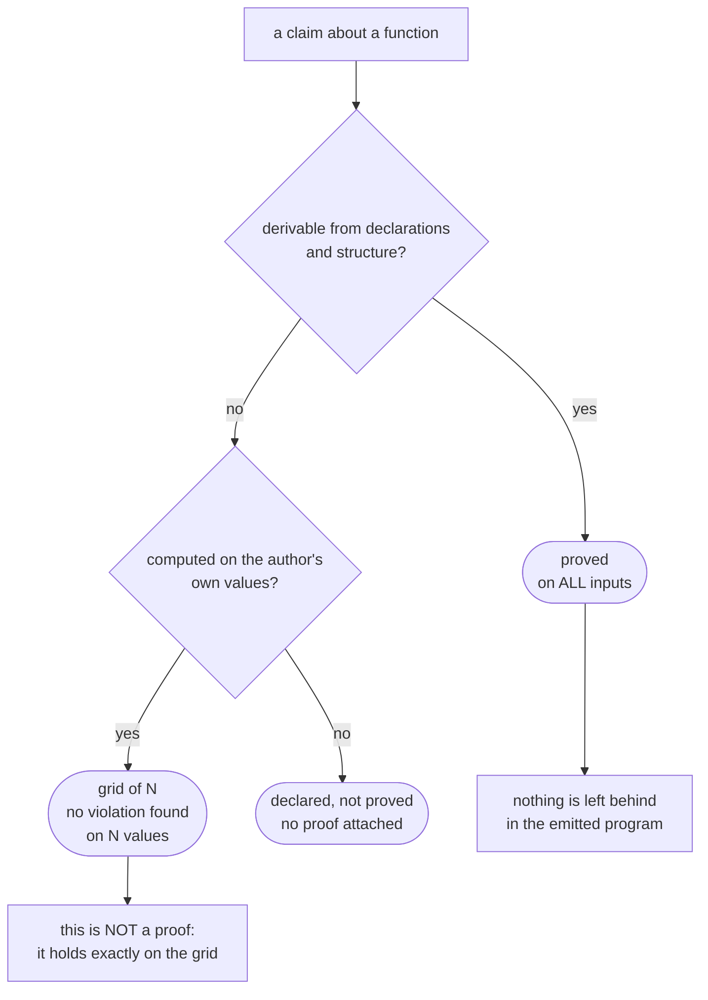

# What is proved and what is not

The language calls itself provable — this page says what stands behind that word
and what does not. Every number here is printed by the compiler itself, and the
command that reproduces it stands next to it.

Counted over {{корпус.файлов}} files in the repository: {{корпус.функций}}
functions, {{корпус.строк|разрядами}} lines.

```
flang check <file> --proof --json
```

For every claim that is stated, the kernel answers with one of three words, and
they are not interchangeable.



There is a fourth word too — "on trust": a claim computed by nothing at all.
Assumptions of that kind in the tree: {{законы.наВеру}}.

---

## Proved

### Termination: {{корпус.тотальных}} functions out of {{корпус.функций}}

The `тотальная` mark is a promise that the function ends on every input. The
compiler checks it and refuses to build the file when it cannot. The promise is
carried in five ways, and the way used shows up per function in the report:

| How it is proved | Functions | Cost at run time |
|---|---:|---|
| By composition — no recursion at all | {{носители.композиция}} | none |
| By structure — walking part of a value | {{носители.структура}} | none |
| By an exact step over a natural number | {{носители.точныйШаг}} | none |
| By a constant step with a lower bound | {{носители.постоянныйШаг}} | a check in the code |
| By a declared measure | {{носители.мера}} | a check in the code |

The gap between the third row and the fourth is wider than it looks, and it has
been measured. The first three prove termination before the program runs and
leave nothing behind in the printed code. The last two rest on a number going
down, and numbers here are floating point: at a large value `х minus 1` equals
`х`, so the proof is complete over the reals and incomplete over machine
numbers. The difference is caught by a check in the printed code —
**{{сторож.мест}} places in {{сторож.функций}} functions**, exactly those in the
last two rows of the table and in no other.

### Claims about behaviour: {{утверждения.доказано}} out of {{утверждения.высказано}}

A claim is an `обеспечивает` or `требует` line next to a function. The kernel
answers each of them in one of three ways, and the three must not be blurred
together:

| Kernel's answer | Count | What it means |
|---|---:|---|
| Proved for all inputs | {{утверждения.доказано}} | true for any input, not for the ones written down |
| On a grid | {{утверждения.сеткой}} | run over a set of values, no violation found |
| Declared, not proved | 6 | checked at run time, on whatever inputs arrive |

Of the {{утверждения.доказано}} proved, **39 are closed by induction** — a base
case and a step, not a substitution of values. Refused:
{{утверждения.отвергнуто}}. Violated: 0.

### Zero axioms

An axiom is something taken without proof. Coq and Lean have them and use them:
excluded middle, the axiom of choice. Each one is something the machine does not
check but accepts.

Here there are **{{законы.наВеру}}**, and that is not a claim but a field of the
report: the list of assumptions is printed together with the other numbers, and
on the day of the measurement it was empty.

"Zero axioms" itself rests not on that field but on a run, and the run is named
here. The kernel has no list of axioms as a device — an axiom can only be written
in words in the source — so a separate program reads the whole of
`flang/self/proof-kernel.flang` and demands that the word "аксиома" appear
nowhere in it except in the named reasons explaining why this or that rule is a
theorem:

```
flang io flang/scripts/kernel-forgeries.flang --plan «Аксиом ноль»
→ zero axioms, 0 violations   (exit 0)
```

What that command does not confirm: that every rule rejects its own forgery. That
is the second end of the same guard, and today it is red — nine rules have been
written into the kernel's source and have not yet reached the built compiler.

For a reader this means one thing: when the report says "proved for all inputs",
there is no invisible side condition behind that line that somebody once found
obvious. Trust is still required — in the kernel's rules, in the compiler under
them, in the hardware — but not in a separate list of exemptions.

---

## Not proved

This half of the page matters more than the first.

### Substantively proved: 10 functions out of 20

Empty statements can be proved, and the figure is easy to inflate. The
postcondition `результат равен (0 минус х)` over the body `0 минус х` closes in
one step: the specification was copied from the implementation and has nothing
left to check. Such a claim is not false — it just says nothing.

Telling a substantive claim from a free one by a list of names does not work: a
list is kept by hand, and a hand errs in its own favour. So the line is drawn by
a run, and the run asks two mechanical questions:

1. **Was the body copied into the postcondition?** Parse trees are compared.
2. **Does the claim survive the body being replaced by a stub?** The body becomes
   `0`, `""`, `нет` or `пустой список` — whichever the declared type allows —
   while the signature and the claim stay. A claim still proved against the stub
   is true of any function with that signature and says nothing about this one:
   "the length of the result is non-negative" is true of the empty string too.

The sample is twenty library functions taken at a fixed stride down the list of
declarations, so that convenient ones could not be picked; since then they are
taken by name, so the ruler does not move with the thing it measures.

| | Claims |
|---|---:|
| Substantive — fall away against the stub | **11** |
| Weakened — proved against the stub as well | 6 |
| Free — body copied into the postcondition | 1 |
| Not checked — no stub exists for that result type | 2 |

Something is proved for 14 of the 20 functions. Something substantive, for 10.

```
./ярлык доказательства:20
```

### Some of the unproved is unprovable because it is untrue

"The kernel did not take it" and "the kernel was too weak" are also different
things, and on the same twenty they came apart twice. Two of the twenty claims are
**false**, and the kernel is right to have refused them:

- `«Противоположное»` — "negate" — with the claim that the result plus the input
  is zero: `(результат плюс х) равен 0`. At an infinite `х` this works out to
  `(0 − ∞) + ∞`, that is, "not a number", and "not a number" does not equal zero.
  The same at minus infinity and at "not a number" itself;
- `«Первый элемент или запасное»` — "first element or fallback" — with the claim
  that the list is empty OR the result equals the fallback. On the list `[7]` with
  fallback `0` the list is not empty and the result is seven, so the claim is
  false. An implication was meant — if empty, then the fallback — and a
  disjunction without the negation was written.

So the denominator is not twenty honest claims but eighteen honest ones and two
wrong ones. Hence a rule worth more than any number on this page: **before fixing
the kernel to satisfy an unproved claim, run the claim itself against a hostile
sample** — `±0`, `±∞`, "not a number", the empty string. Unprovability often turns
out to be a property of the claim rather than of the kernel.

### A bound claim silently means "for finite numbers"

This is a trap the tree has already been caught by, and it is worth its own
section.

The language's numbers are machine IEEE-754, and "not a number" (`NaN`) is
produced from inside the language without breaking a rule. `0 делить на 0` passes
the check with no diagnostic at all:

```
$ flang run граница.flang --function '«Ноль на ноль»'
NaN
$ echo $?
0
```

`NaN` sits **outside the ordering**: both `NaN не меньше 0` and `NaN меньше 0`
are false. So the "obvious" postcondition "the absolute value of the result is
non-negative" is not a cautious wording but a **false claim**. The kernel does
not take it, and it is right not to:

```flang
тотальная функция «Модуль»
  принимает х: число
  возвращает число
  обеспечивает «модуль неотрицателен» результат не меньше 0
  если х не меньше 0
    то х
    иначе 0 минус х
```

```
$ flang check граница.flang --proof
постусловие «модуль неотрицателен» функции «Модуль» — объявлено, не доказано:
ни теоремы, ни примеров. Его считает рантайм после каждого возврата — на тех
входах, которые придут
$ echo $?
0
```

The runtime check catches it on the first "not a number":

```
$ flang run граница.flang --function '«Модуль не числа»'
FLANG_PROPERTY: нарушено свойство «модуль неотрицателен» функции «Модуль»
$ echo $?
1
```

The working rule: **before asking the kernel for a rule, run the claim itself
over a hostile sample** — `0`, `−0`, `±∞`, "not a number", `2⁵³`. Every bound
claim written without a finiteness proviso means "for finite numbers" — and is
false on the rest.

### An unproved postcondition costs run time, and the cost is measured

If the kernel accepted a claim, nothing of it remains in the emitted program. If
the kernel did not, the claim is **computed on every return of the function**,
and whoever runs the program pays for it.

The cost was measured over the whole library. `flang test flang/stdlib/` over 20
files and 1216 examples: 360 150 ms at 454 claims before, 469 284 ms at 620
after — **a factor of 1.30**. Measured by interleaving (the variants run one
after another inside a single repetition), minimum of three pairs; a single run
cannot measure this at all — the spread across the repository’s programs of ±20% is larger than the effect.

What is paid for is not the claims but the **actions inside them**: every
comparison, every field read, every call, about 14 µs per action. So the
expensive claim is not the most complex one but the one attached to a function a
fold calls on every element: in `json.flang`, 19 claims on seven step functions
accounted for 78% of the increase on 40% of the claims.

By module: `json` ×2.90, `base64` ×1.94, `sha256` ×1.76, `http` ×1.73,
`postgres` ×1.20.

### "On a grid" is not a proof

{{утверждения.сеткой}} claims are closed by walking a set of values: the program
was run over a range of inputs and no violation turned up. The report ends such a
line with the words "this is not a proof", and it ends that way on purpose —
walking a finite set proves nothing about an infinite one.

The "on a grid" line and the "proved for all inputs" line look nearly alike side
by side and are worth different things. That field is how the report should be
read.

### Proved does not mean correct

A proof says the code matches the specification. It says nothing about whether
the specification expresses what was wanted. This is not a cautious footnote but
a live case in this very repository.

The library function `«Чётное»` — "even". Its report line:

```
постусловие «чётность есть делимость на два» — доказано сведением цели
с телом функции … утверждение обо ВСЕХ входах, а не о написанных
```

The same function on the same tree:

```
$ flang run flang/stdlib/numbers.flang --function "Чётное" --args '{"число": -4}'
false
```

Minus four is an even number. There is no contradiction between those two
outputs, and that is the whole point: `«Чётное»` is written through
`«Делится на»`, both go wrong on minus zero in the same way, and "proved" here
means exactly "two errors agree on all inputs". The kernel is right. The
specification is wrong.

No kernel undoes this, and no language will. Checking that a specification
expresses the intent is left to a person — and that is the single reason formal
methods have not taken over the industry in fifty years.

### Functions that need not terminate

The language's evaluator is written in the language itself, and its main loop
runs somebody else's program. Promising that somebody else's program ends is not
possible: an ordinary program is allowed to loop forever. So that machine's loop
— three functions, `«Прогон»`, `«Виток»` and `«Дальше после шага»` in
`flang/self/interpret.flang` — is declared ordinary rather than total. The
comment above `«Прогон»` says so outright: this is a property of the task, not
unfinished work. What guards the loop is not a proof but a step limit: on hitting
it the evaluator answers `FLANG_RECURSION_LIMIT` and says so.

Declare it total and the language's promise would become false on the first
looping program. A separate check watches for exactly that, so the mark cannot be
flipped quietly.

Ordinary functions in the repository number {{корпус.обычных}} in total. The loop
just named is the place where ordinariness is a property of the task; the rest is
unfinished work.

### What blocks proving the rest

It is easy to swap the question here. "Which rule closes more functions" and
"which rule is true" are different questions, and on this work they came apart
loudly.

A measurement named two rules and promised that together they close 574
functions. The number reproduced twice; it is real. But one of the two rules —
"every call returns a strict part of its first argument" — is **false**. A
three-line program refutes it:

```flang
тотальная функция «Само»
  принимает значение: список числа
  возвращает список числа
  значение

тотальная функция «Вечно»
  принимает значение: список числа
  возвращает число
  «Вечно» от («Само» от значение)
```

`«Само»` hands back its argument whole, so `«Вечно»` spins forever. Under that
rule every turn of it looks like a strict descent, and the analysis would declare
a non-terminating program terminating. A rule closing five hundred functions at a
stroke would be proving a falsehood — so it was rejected.

Today's compiler does refuse that program, and names what was missing:

```
$ flang check вечность.flang
FLANG_NOT_TOTAL, строка 11: тотальная функция «Вечно»: рекурсивный вызов «Вечно»
не убывает — аргумент 1 («Само» от «значение») не выведен ни из одного параметра
$ echo $?
1
```

There is no check today that keeps that program in the tree and watches it has
not turned green: the fixture directory `flang/test/fixtures/binary-rules/` does
not hold it.

Its honest replacement closes **exactly zero**, and the reason is substantive
rather than a matter of effort: in a tree walker the base branch returns a
constructed value (`пусто`, a literal, a constructor), and a constructed value is
never part of the argument under any reading.

What is actually reachable:

| Rule | Functions closed |
|---|---:|
| Size-change graphs: the descent is spread around the call cycle | 47 |
| The argument grows by a constant step, bounded by an unchanging parameter | 28 |
| The same, but bounded by a numeric literal | 0 |
| Total | **75** |

These figures were taken from a run over the programs in the repository, but
there is no command in the tree to reproduce them today, and no note recording
that run either. The neighbouring note
[[dva-pravila-zavershaemosti-vmeste-dayut-574]] gives **54**
for size-change graphs, not 47 — the number was taken twice and disagreed. Trust
the order of magnitude and the conclusion "not 574 but a few dozen", not the
digits themselves.

Not 574 but 75. The first rule is already written in the language itself and
checked by five programs: two legitimate ones it is meant to cover turned green,
and three forgeries — including the one above — stayed refused. The zero in the
third row is no accident either: the real upward walks compare against a
parameter, not against a number.

The five hundred functions between 574 and 75 are reachable by nothing short of
types on the parse tree — and that is no longer a rule somebody can write down but
work the language does not yet have.

### The compiler does not check its own sources

`flang check` on the compiler's own sources runs into the step limit and stops:
`FLANG_RECURSION_LIMIT`. Parsing and linking do go all the way through — 29 files
including imports, zero import errors — and it is the example run that exhausts
the budget.

**`check` has no flag that raises the limit, and that is by design, not an
omission.** The number is baked into the binary itself and is changed by
reprinting the bootstrap point, not by a command-line option: it takes part in the
self-assembly match, where the binary must come out identical to the one that
printed it, and a binary built with a different limit would stop emitting
itself. The procedure is written at the top of `scripts/raskrutka.sh`.

Of the {{корпус.файлов}} files, the report came out for 244. The rest are
named one by one, and they are three different things:

| Why there is no report | Files |
|---|---:|
| Categorical surface or processes are declared — the compiler does not judge those rules and says so with exit code 2 | 26 |
| Hit the step limit — all seven are sources of the compiler itself | 7 |
| Genuine remarks about the program | 2 |

The second row is precisely where the language's promise is not checked in the
language itself. Printing itself is something the compiler does, and does without
a single divergence; checking what it prints is something it cannot do.

```
./ярлык доказательства:ведомость
```

---

## Checking this yourself

None of the numbers above have to be taken on trust — commands print all of them:

| What | Command |
|---|---|
| Report for one file | `flang check <file> --proof` |
| The same for a machine | `flang check <file> --proof --json` |
| Summary over every program in the repository | `./ярлык доказательства:ведомость` |
| Substantive claims out of the twenty | `./ярлык доказательства:20` |

## Further

- [The kernel refused: whose mistake is it](proof-refused.html) — every kernel refusal by name
- [Proofs: why and how](proofs.html) — how a proof differs from a test
- [Kernel specification](../spec-proof.html) — in Russian; the rules in full
- [Known limitations](limits.html) — what the language cannot do
- [Real cases, taken apart](case-studies.html) — where a proof caught a bug
- [Knowledge base](../knowledge.html) — in Russian; what was measured and what turned out false
