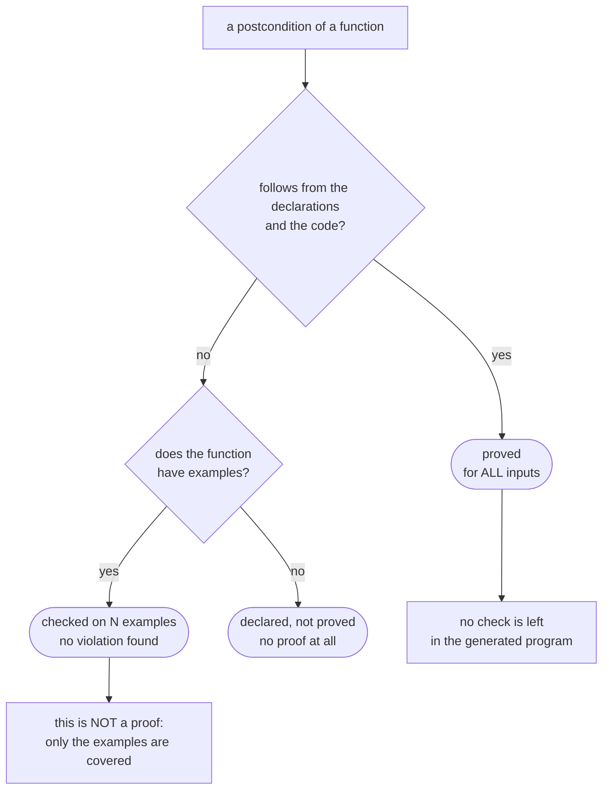

# What is proved and what is not

flang calls itself provable. This page says what that covers and what it does
not, so that you know which results of `flang check --proof` you can rely on and
where you still need tests. Every number here is printed by a command, and the
command is next to it.

Across the repository: {{корпус.файлов}} files, {{корпус.функций}} functions,
{{корпус.строк|разрядами}} lines. Files and lines are recounted from the sources
on every push (`sh scripts/guards/published-vs-tree.sh --числа`). The other
numbers on this page — termination, postconditions, run-time checks — come from
a full run of the compiler over the repository (`bootstrap/flang run-script
numbers:build`, several hours), so they can lag behind the code. For one file
you get the same numbers in seconds:

```
flang check <file> --proof --json
```

## The answers of the prover

For every postcondition (`обеспечивает`) and precondition (`требует`) the
prover — the part of the compiler that proves them, «ядро» in the output —
gives one of three answers:


```mermaid The three answers of the prover and what each is worth
flowchart TD
  A[a postcondition of a function] --> B{follows from the declarations<br>and the code?}
  B -->|yes| C([proved<br>for ALL inputs])
  B -->|no| D{does the function<br>have examples?}
  D -->|yes| E([checked on N examples<br>no violation found])
  D -->|no| F([declared, not proved<br>no proof at all])
  C --> G[no check is left<br>in the generated program]
  E --> H[this is NOT a proof:<br>only the examples are covered]
  class C vyvod
  class E glavnoe
  class F otkaz
```

| The output says | What it means | What happens at run time |
| --- | --- | --- |
| «доказано» | proved for all inputs | nothing: the check is not in the generated code |
| «сетка N» | checked only on N values (your examples); like unit tests | the condition is checked on every return |
| «объявлено, не доказано» | neither a proof nor an example | the condition is checked on every return |
| «на веру» | an assumption nothing checks | — |

Assumptions «на веру» in the repository: {{законы.наВеру}}.

---

## What is proved

### Termination: {{корпус.тотальных}} functions out of {{корпус.функций}}

`тотальная` (total) before a function says it stops on every input. The
compiler proves it or rejects the file. There are five ways it can prove it, and
the proof report names the way for each function:

| How termination is proved | Functions | Cost at run time |
|---|---:|---|
| No recursion at all | {{носители.композиция}} | none |
| Recursion on a part of the input (tail, field) | {{носители.структура}} | none |
| Counting down a `неотрицательное` number | {{носители.точныйШаг}} | none |
| Counting down a plain `число` with a lower bound | {{носители.постоянныйШаг}} | a check in the code |
| A declared measure (`убывает`) | {{носители.мера}} | a check in the code |

The first three are proved before the program runs and leave nothing in the
generated code. The last two rely on a number going down, and `число` is a
binary64 float: for a large `х`, `х минус 1` equals `х`. The proof holds for
real numbers but not for floats, so the compiler adds a check to the generated
code — **{{сторож.мест}} places in {{сторож.функций}} functions**, exactly the
functions in the last two rows. To avoid the check, use `неотрицательное` for a
counter.

### Postconditions: {{утверждения.доказано}} out of {{утверждения.высказано}}

| The prover's answer | Count | What it means |
|---|---:|---|
| Proved for all inputs | {{утверждения.доказано}} | true for every input, not only for the written ones |
| Checked only on examples | {{утверждения.сеткой}} | the examples pass; there is no proof |

The rest are declared without a proof or an example; they are checked at run
time on whatever inputs arrive. Refused as false: {{утверждения.отвергнуто}}.

### No axioms

An axiom is a statement accepted without proof. Coq and Lean have axioms and
use them: the law of excluded middle, the axiom of choice. The machine does not
check them.

The flang prover has none. The proof report prints the list of assumptions with
the other numbers ({{законы.наВеру}} in the repository). The prover has no
mechanism for declaring an axiom, so a separate script reads all of
`flang/self/proof-kernel.flang` and fails if the word «аксиома» appears there
except in the named reasons that explain why a rule is a theorem:

```
flang io flang/scripts/kernel-forgeries.fscript --plan 'Аксиом ноль' --trust
```

It exits with 0 and prints «аксиом ноль, нарушений 0» (zero axioms, zero
violations). `--trust` is needed because the script itself has unproved
postconditions, and `flang io` does not run such a script without consent.

A second plan of the same script checks that each deliberately broken proof in
`flang/test/fixtures/poddelka-*` is rejected:

```
flang io flang/scripts/kernel-forgeries.fscript --plan 'Подделки остаются недоказанными' --trust
```

It also exits with 0: «подделки отвергнуты: 36 файлов каталога» (forgeries
rejected: 36 files).

What this gives you: when the report says "proved for all inputs", there is no
hidden condition behind it. You still trust the prover's rules, the compiler
that runs them and the hardware, but not a list of exceptions.

### The proof is re-checked by an independent program

You do not have to trust the word "proved" in the compiler output.
`flang check <file> --proof --record <record>` writes the proof to a file, and a
separate C program, `flang/proof/checker/checker.c`, which shares no code with
the compiler, reads the source and the record and re-checks every step.

One command runs this check over the compiler's own proofs:

```
bootstrap/flang io scripts/provability.fscript --plan Verdict --timeout 900000
```

It runs for about a minute and answers «ДОКАЗУЕМ» (provable) with four numbers:
650 of 650 proof steps re-checked by the C program (100.00 %), 27 unreachable
places excluded; 36 of 36 forgeries in the forgery set; 575 broken proofs, none
accepted; 274 correct proofs, none rejected.

What the 100 % means: the share of steps **in the compiler's own proof records**
that the independent checker re-checked. It is not "all programs are proved",
and it says nothing about the generated code.

The inference rules of the prover are also stated in Lean 4. `bootstrap/flang
io scripts/four-coverages.fscript --plan Measure --timeout 900000` reports how
far: every rule line in `flang/proof/tables/inference-rules.tsv` (112) has a
Lean lemma, and 76 of the 97 inference rules are in the Lean acceptance file;
21 are not. Lean itself is not run by that command; it is run by
`sh flang/proof/lean/run.sh` with the toolchain from
`flang/proof/lean/lean-toolchain`. The same command lists the known soundness
problems of the checker and says how much of the translation into C is checked.

---

## What is not proved

This half of the page matters more.

### A proved postcondition can say nothing

Empty postconditions are easy to prove. The postcondition
`результат равен (0 минус х)` over the body `0 минус х` is proved in one step:
it repeats the body and checks nothing. It is not false, it is just useless.

To count useful postconditions, a script asks two mechanical questions about
each one:

1. **Is the body copied into the postcondition?** The parse trees are compared.
2. **Does the postcondition still hold if the body is replaced by a stub?** The
   body becomes `0`, `""`, `нет` or `пустой список`, whichever fits the type;
   the signature and the postcondition stay. If the prover still proves it, the
   postcondition is true of any function with that signature and says nothing
   about this one. "The length of the result is non-negative" is true of the
   empty string too.

The sample is twenty library functions, copied into `docs/benchmark2/`:

```
bootstrap/flang run-script proofs:count-20
```

| | Postconditions |
|---|---:|
| Useful — not proved for the stub | **11** |
| Weak — proved for the stub too | 6 |
| Free — the body is copied into the postcondition | 1 |
| Not checked — no stub for that result type | 2 |

Something is proved for 14 of the 20 functions; something useful, for 10.

**What to do:** after the prover accepts a postcondition, ask whether it would
also hold for `0` or an empty list. If yes, it does not describe your function.

### Some postconditions are unprovable because they are false

"The prover could not" and "the claim is false" are different things.
`docs/benchmark2/05-opposite.flang` («Противоположное», negate) has the
postcondition "the result plus the input is zero":
`(результат плюс х) равен 0`. For an infinite `х` this is `(0 − ∞) + ∞`, which
is NaN, and NaN is not equal to zero. The prover is right to refuse it.

**What to do:** before you ask why the prover does not accept a postcondition,
run it against hostile values: `0`, `−0`, `±∞`, NaN, `2⁵³`, the empty string.

### A bound on a number silently means "for finite numbers"

Numbers in flang are IEEE-754 floats, and NaN can be produced inside the
language without an error. `0 делить на 0` passes `flang check` with no remark:

```
$ flang run граница.flang --function '«Ноль на ноль»' --trust
на веру: доказанность не считалась — запуск по ключу --trust
NaN
$ echo $?
0
```

NaN is **outside the order**: both `NaN не меньше 0` and `NaN меньше 0` are
false. So "the absolute value is non-negative" is a **false** postcondition, and
the prover is right not to prove it:

```flang
тотальная функция «Модуль»
  принимает х: число
  возвращает число
  обеспечивает «модуль неотрицателен» результат не меньше 0
  если х не меньше 0
    то х
    иначе 0 минус х
```

```
$ flang check граница.flang --proof
постусловие «модуль неотрицателен» функции «Модуль» — объявлено, не доказано:
ни теоремы, ни примеров. Его считает рантайм после каждого возврата — на тех
входах, которые придут
граница.flang: НЕ ПРОВЕРЕНО — утверждений 1: доказано 0, условно 0, сетка 0,
объявлено, не доказано 1, отвергнуто 0, нарушено 0 … — код возврата 3
$ echo $?
3
```

Without `--proof` the same file passes `flang check` with exit code 0. With
`--proof` an unproved postcondition gives exit code 3.

The run-time check catches the first NaN (`«Модуль не числа»` calls «Модуль» on
`0 делить на 0`):

```
$ flang run граница.flang --function '«Модуль не числа»' --trust
на веру: доказанность не считалась — запуск по ключу --trust
FLANG_PROPERTY: нарушено свойство «модуль неотрицателен» функции «Модуль»
$ echo $?
1
```

**What to do:** a bound on `число` without a finiteness condition is false for
NaN and infinities. Either add the condition to the postcondition, or
declare the argument with a precise type (`неотрицательное`, `сотых`,
`тысячных`).

### An unproved postcondition costs time on every call

A proved postcondition is not in the generated program. An unproved one is
**computed on every return of the function**. The cost is not the condition
itself but the work inside it: every comparison, field read and call. The
expensive case is a postcondition on a small function that `свёртка` (reduce)
calls for every element of a list.

**What to do:** if a hot function has an unproved postcondition, prove it (add a
`требует`, a precise type, or a `теорема`) or move the condition to the caller.

### Checked on examples is not proved

{{утверждения.сеткой}} postconditions are only checked on examples. The report
ends such a line with «Это не доказательство» (this is not a proof). In a
summary, "proved" and "checked on examples" look alike; read which one it is.
`flang check --proof --strict` exits with 3 if anything is only checked on
examples — use it in CI.

### Proved does not mean correct

A proof says the code matches the postcondition. It does not say the
postcondition is what you meant. An example from the standard library:
`«Чётное»` (even) in `flang/stdlib/numbers.flang` is proved:

```
постусловие «чётность есть делимость на два» — доказано сведением цели
с телом функции … утверждение обо ВСЕХ входах, а не о написанных
```

And the same function on −4:

```
$ flang run flang/stdlib/numbers.flang --function "Чётное" --args '{"число": -4}' --trust
на веру: доказанность не считалась — запуск по ключу --trust
false
```

−4 is even. The two outputs do not contradict each other: `«Чётное»` is
`(число остаток от 2) равен 0`, the postcondition says the same through
`«Делится на»`, and for −4 the remainder is −0, which `равен 0` treats as not
equal. The proof says "the function and its postcondition agree for all
inputs", and they do — both are wrong on negative numbers.

No prover fixes this. Whether a specification says what you wanted is for a
person to check.

### Functions that do not have to terminate

The flang interpreter is written in flang, and its main loop runs someone
else's program, which may loop forever. So its three loop functions,
`«Прогон»`, `«Виток»` and `«Дальше после шага»` in
`flang/self/interpret.flang`, are declared without `тотальная`. What stops them
is a step limit: when it is reached, the interpreter stops with
`FLANG_RECURSION_LIMIT`.

The repository has {{корпус.обычных}} functions without `тотальная`. For these
three it is a property of the task; for most of the others termination is not
proved yet.

### A termination rule that proves more is not always right

A tempting rule: "every call returns a strict part of its first argument". It
would prove termination for many functions at once, and it is false. Three lines
refute it:

```flang
тотальная функция «Само»
  принимает значение: список числа
  возвращает список числа
  значение

тотальная функция «Вечно»
  принимает значение: список числа
  возвращает число
  «Вечно» от («Само» от значение)
```

`«Само»` returns its argument unchanged, so `«Вечно»` never stops. With that
rule the compiler would call it terminating. The compiler does not have that
rule and rejects the program:

```
$ flang check вечность.flang
без доказанного завершения: «Вечно»
FLANG_NOT_TOTAL в файле вечность.flang, строка 11, столбец 3: тотальная функция
«Вечно»: рекурсивный вызов «Вечно» не убывает — аргумент 1 («Само» от
«значение») не выведен ни из одного параметра. Передавайте часть аргумента: хвост
списка из образца «голова и хвост», поле варианта из образца, поле записи или
элемент коллекции
вечность.flang: не проверено — замечаний 1
$ echo $?
1
```

**What to do:** when termination is rejected, pass a part of the argument (the
tail from `голова и хвост`, a field of a variant or a record) directly to the
recursive call, not through another function.

### The compiler's own sources are not fully checked

`flang check` stops a run that exceeds the step limit with
`FLANG_RECURSION_LIMIT`. The default limit is built into the binary; raise it
for one run with `--step-limit N` (Cyrillic `--предел-шагов`). A full run over
the repository, `bootstrap/flang run-script proofs:report`, takes hours. Files
it gives no report for fall into three groups:

* the file declares categories or processes: the binary compiler checks these
  declarations only partly, says «проверено НЕ ДО КОНЦА» (not fully checked) and
  exits with 2;
* the run hit the step limit; this happens on the largest sources of the
  compiler itself;
* the file has real errors.

So the compiler compiles itself, but a plain `flang check` over its largest
sources may stop at the step limit before all examples and proofs are checked.
The compiler's proofs are re-checked another way: by the independent C program
(see above).

---

## Check it yourself

| What | Command |
|---|---|
| The proof report for one file | `flang check <file> --proof` |
| The same as JSON | `flang check <file> --proof --json` |
| The report over every program in the repository | `bootstrap/flang run-script proofs:report` |
| Useful postconditions among the twenty | `bootstrap/flang run-script proofs:count-20` |
| The compiler's proofs re-checked by the C program | `bootstrap/flang io scripts/provability.fscript --plan Verdict --timeout 900000` |
| All four measures side by side | `bootstrap/flang io scripts/four-coverages.fscript --plan Measure --timeout 900000` |

## Further

- [The prover refused: whose mistake is it](proof-refused.html) — every refusal by name
- [Proofs: why and how](proofs.html) — how a proof differs from a test
- [Prover specification](../spec-proof.html) — in Russian; the rules in full
- [Known limitations](limits.html) — what the language cannot do
- [Real cases, taken apart](case-studies.html) — where a proof caught a bug
- [Knowledge base](../knowledge.html) — in Russian; what was measured and what turned out false
