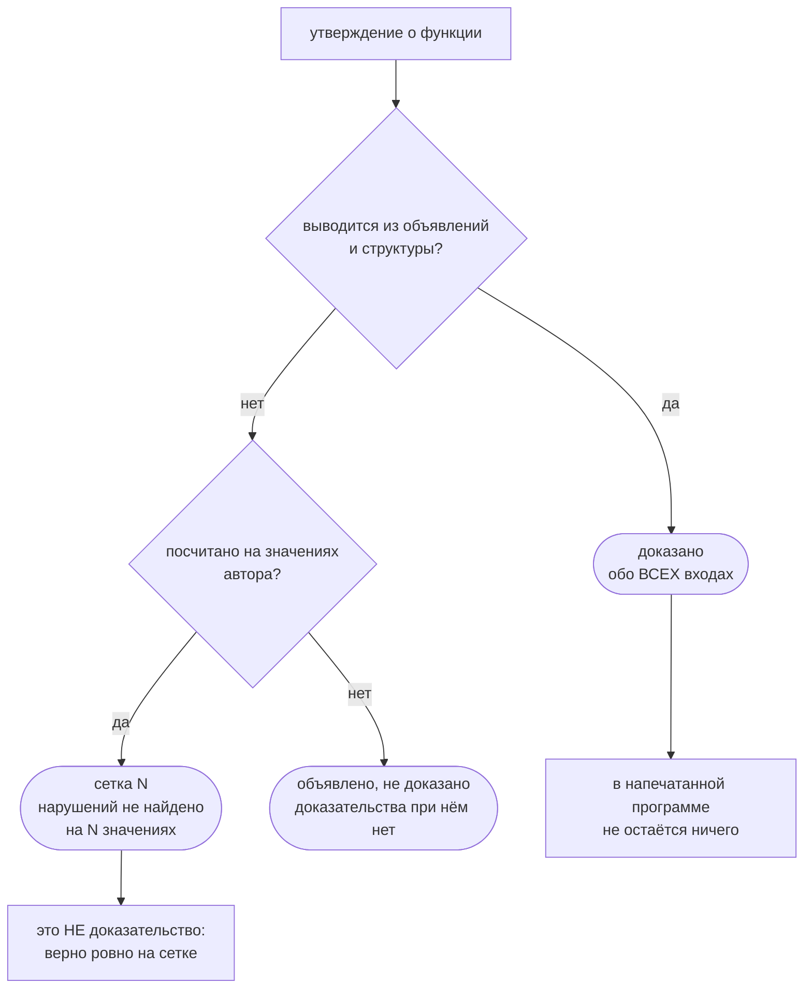

# Что доказано, а что нет

Язык называет себя доказуемым — эта страница говорит, что за этим словом стоит и
чего за ним нет. Каждое число здесь печатает сам компилятор, и рядом стоит
команда, которой его получают заново.

Считано по {{корпус.файлов}} файлам репозитория: {{корпус.функций}} функций,
{{корпус.строк|разрядами}} строк.

```
flang check <файл> --proof --json
```

> **Когда сняты числа этой страницы.** Файлы и строки пересчитываются по
> исходникам за девять секунд и сверяются на каждый пуш. Всё остальное —
> завершение, носители, места проверок в напечатанном коде, утверждения о
> поведении — печатает компилятор, и печатал он это **23 августа 2026**.
>
> С тех пор эти числа не пересняты, и причина названа прямо: компилятор собран
> из семени точки раскрутки, а семя отстало от исходников. `sh
> scripts/seed-freshness.sh` отвечает отказом — **44 файла** разошлись, и среди
> них `proof-kernel`, `proof`, `obligations`, `totality`, `types`, то есть ровно
> те, что решают, что считать доказанным. Пересъёмка сегодня дала бы приговоры о
> правилах, которых в дереве уже нет; она ждёт перепечатки семени
> (`sh scripts/raskrutka.sh`, часы).
>
> Насколько дерево ушло с того замера, тоже не на слово:
> `sh scripts/published-vs-tree.sh --числа` печатает это числом сдвинувшихся
> файлов.

Про каждое высказанное утверждение ядро отвечает одним из трёх слов, и они не
взаимозаменяемы.



Есть и четвёртое слово — «на веру»: утверждение, не посчитанное ничем.
Допущений такого рода в дереве {{законы.наВеру}}.

---

## Доказано

### Завершение: {{корпус.тотальных}} из {{корпус.функций}}

Признак `тотальная` — обещание, что функция кончится на любом входе. Компилятор
его проверяет и отказывается собирать файл, если проверить не может. Обещание
несётся пятью способами, и способ виден в отчёте у каждой функции:

| Чем доказано | Функций | Цена во время работы |
|---|---:|---|
| Композицией — рекурсии нет вовсе | {{носители.композиция}} | нет |
| Структурой — обход части значения | {{носители.структура}} | нет |
| Точным шагом по натуральному числу | {{носители.точныйШаг}} | нет |
| Постоянным шагом с ограничением снизу | {{носители.постоянныйШаг}} | проверка в коде |
| Объявленной мерой | {{носители.мера}} | проверка в коде |

Разница между третьей строкой и четвёртой существеннее, чем кажется, и она
измерена. Первые три способа доказывают завершение до запуска и в напечатанной
программе не оставляют ничего. Последние два опираются на убывание числа, а
числа в языке — с плавающей точкой: при большом значении `х минус 1` равно `х`,
и в вещественных числах доказательство полное, а в машинных нет. Разницу
подхватывает проверка в напечатанном коде — **{{сторож.мест}} мест у
{{сторож.функций}} функций**, ровно у тех, что стоят в двух последних строках
таблицы, и ни у одной другой.

### Утверждения о поведении: {{утверждения.доказано}} из {{утверждения.высказано}}

Утверждение — это `обеспечивает` или `требует` рядом с функцией. Ядро отвечает на
каждое одним из трёх способов, и смешивать их нельзя:

| Ответ ядра | Сколько | Что значит |
|---|---:|---|
| Доказано обо всех входах | {{утверждения.доказано}} | верно для любого входа, а не для написанных |
| На сетке | {{утверждения.сеткой}} | прогнано по значениям, нарушений не нашлось |
| Объявлено, не доказано | 6 | проверяется во время работы, на тех входах, что придут |

Из {{утверждения.доказано}} доказанных **39 закрыты индукцией** — то есть разбором
базы и шага, а не подстановкой значений. Отвергнутых —
{{утверждения.отвергнуто}}, нарушенных — 0.

### Аксиом ноль

Аксиома — то, что принимается без доказательства. В Coq и Lean они есть и ими
пользуются: исключённое третье, аксиома выбора. Каждая — то, что машина не
проверяет, а принимает на веру.

Здесь их **{{законы.наВеру}}**, и это не заявление, а поле отчёта: список
допущений печатается вместе с остальными числами и на день замера пуст.

Само же «аксиом ноль» держится не полем отчёта, а прогоном, и прогон этот
называется. Списка аксиом у ядра нет как устройства — аксиому можно только
написать словами в исходнике, — поэтому отдельная программа читает
`flang/self/proof-kernel.flang` целиком и требует, чтобы слова «аксиома» в нём
не стояло нигде, кроме названных доводов, объясняющих, почему то или иное
правило — теорема:

```
flang io flang/scripts/kernel-forgeries.flang --plan 'Аксиом ноль'
→ аксиом ноль, нарушений 0   (код 0)
```

Чего эта команда не подтверждает: что каждое правило отвергает свою подделку.
Это второй конец того же сторожа, и он сегодня красный — девять правил дописаны
в исходник ядра и ещё не попали в собранный компилятор.

Для читателя это значит вот что: если отчёт сказал «доказано обо всех входах»,
за этой строкой не стоит невидимого условия, которое кто-то когда-то счёл
очевидным. Доверять всё равно приходится — правилам ядра, компилятору под ним,
железу, — но не отдельному списку исключений.

---

## Не доказано

Эта половина страницы важнее первой.

### Содержательно доказано — у 10 функций из 20

Доказать можно пустое место, и цифру легко надуть. Постусловие
`результат равен (0 минус х)` при теле `0 минус х` ядро закрывает за один шаг:
спецификация переписана из реализации, и проверять ей нечего. Такое утверждение
не ложно — оно просто ничего не говорит.

Отличать содержательное от дарового списком имён нельзя: список ведёт рука, а
рука ошибается в свою пользу. Поэтому граница проводится прогоном, и у него два
вопроса, оба механические:

1. **Не переписано ли тело в постусловие.** Сравниваются деревья разбора.
2. **Переживает ли утверждение подмену тела заглушкой.** Тело меняется на `0`,
   `""`, `нет` или `пустой список` — по объявленному типу, — а подпись и
   утверждение остаются. Если утверждение доказывается и с заглушкой, оно верно
   про любую функцию такой подписи и про эту не говорит ничего: «длина
   результата неотрицательна» верно и для пустой строки.

Выборка — двадцать функций библиотеки, отобранных шагом по списку объявлений,
чтобы нельзя было набрать удобных; с тех пор их берут по именам, чтобы линейка
не менялась вместе с предметом.

| | Утверждений |
|---|---:|
| Содержательных — при заглушке отпадают | **11** |
| Ослабленных — доказаны и при заглушке | 6 |
| Даровых — тело переписано в постусловие | 1 |
| Не проверено — заглушки для такого типа нет | 2 |

Хоть что-нибудь доказано у 14 функций из 20. Содержательно — у 10.

```
./ярлык доказательства:20
```

### Часть недоказанного недоказуема потому, что неправда

«Ядро не взяло» и «ядру не хватило сил» — тоже разные вещи, и на той же
двадцатке они разошлись дважды. Два утверждения из двадцати **ложны**, и ядро
право, что их не взяло:

- `«Противоположное»`, утверждение «сумма с исходным — ноль»:
  `(результат плюс х) равен 0`. При `х`, равном бесконечности, выходит
  `(0 − ∞) + ∞`, то есть «не число», а «не число» нулю не равно. То же на минус
  бесконечности и на самом «не число»;
- `«Первый элемент или запасное»`, утверждение «на пустом отдаётся запасное»:
  «список пуст ИЛИ результат равен запасному». На списке `[7]` с запасным `0`
  список не пуст, а результат равен семи — утверждение ложно. Имелась в виду
  импликация «если пуст, то запасное», а написана дизъюнкция без отрицания.

Знаменатель, значит, не двадцать честных утверждений, а восемнадцать честных и
два неверных. Отсюда правило, которое стоит дороже любого числа на этой
странице: **прежде чем чинить ядро под недоказанное утверждение, прогоните само
утверждение на враждебной выборке** — `±0`, `±∞`, «не число», пустая строка.
Недоказуемость нередко оказывается свойством утверждения, а не ядра.

### Утверждение-граница молча значит «для конечных чисел»

Это ловушка, на которой в дереве уже ловились, и она стоит отдельного раздела.

Числа языка — машинные, IEEE-754, и «не число» (`NaN`) получается изнутри языка,
ничего не нарушая. `0 делить на 0` проходит проверку без единого замечания:

```
$ flang run граница.flang --function '«Ноль на ноль»'
NaN
$ echo $?
0
```

`NaN` стоит **вне порядка**: неверно и `NaN не меньше 0`, и `NaN меньше 0`.
Поэтому «очевидное» постусловие «модуль результата неотрицателен» — не
осторожная формулировка, а **ложное утверждение**. Ядро его не берёт, и право:

```flang
тотальная функция «Модуль»
  принимает х: число
  возвращает число
  обеспечивает «модуль неотрицателен» результат не меньше 0
  если х не меньше 0
    то х
    иначе 0 минус х
```

```
$ flang check граница.flang --proof
постусловие «модуль неотрицателен» функции «Модуль» — объявлено, не доказано:
ни теоремы, ни примеров. Его считает рантайм после каждого возврата — на тех
входах, которые придут
$ echo $?
0
```

Проверка при работе ловит это на первом же «не числе»:

```
$ flang run граница.flang --function '«Модуль не числа»'
FLANG_PROPERTY: нарушено свойство «модуль неотрицателен» функции «Модуль»
$ echo $?
1
```

Правило работы отсюда: **прежде чем заказывать правило ядру, прогоните само
утверждение на враждебной выборке** — `0`, `−0`, `±∞`, «не число», `2⁵³`. Каждое
утверждение-граница, написанное без оговорки о конечности, значит «для конечных
чисел» — и на остальных числах ложно.

### Недоказанное постусловие стоит времени работы, и цена измерена

Ядро приняло утверждение — в напечатанной программе от него не остаётся ничего.
Ядро не приняло — утверждение **считается на каждом возврате функции**, и платит
за это тот, кто программу запустил.

Цена измерена на всей библиотеке. `flang test flang/stdlib/` на 20 файлах и
1216 примерах: было 360 150 мс при 454 утверждениях, стало 469 284 мс при 620 —
**рост в 1,30 раза**. Мерено чередованием (варианты гоняются друг за другом
внутри одного повтора), минимум из трёх пар; одиночным прогоном такое мерить
нельзя вовсе — разброс по программам репозитория ±20 % больше самого эффекта.

Платят при этом не утверждения, а **действия внутри них**: каждое сравнение,
каждое чтение поля, каждый вызов, около 14 мкс на действие. Поэтому дорого
обходится не самое сложное утверждение, а то, что стоит при функции, которую
свёртка зовёт на каждый элемент: в `json.flang` 19 утверждений при семи шаговых
функциях дали 78 % прироста на 40 % утверждений.

Разложение по модулям: `json` ×2,90, `base64` ×1,94, `sha256` ×1,76,
`http` ×1,73, `postgres` ×1,20.

### «На сетке» — не доказательство

Перебором значений закрыто {{утверждения.сеткой}} — программу прогнали по
набору входов и нарушений не нашли. Отчёт языка заканчивает такую
строку словами «Это не доказательство», и заканчивает так намеренно — перебор
конечного набора ничего не доказывает про бесконечный.

Строка «на сетке» и строка «доказано обо всех входах» выглядят рядом почти
одинаково, а стоят разного. Читать отчёт нужно по этому полю.

### Доказано — не значит правильно

Доказательство говорит, что код соответствует спецификации. О том, выражает ли
спецификация нужное, оно не говорит ничего. Это не оговорка для осторожности, а
живой случай в этом самом репозитории.

Функция `«Чётное»` в библиотеке. Отчёт про неё:

```
постусловие «чётность есть делимость на два» — доказано сведением цели
с телом функции … утверждение обо ВСЕХ входах, а не о написанных
```

Прогон той же функции на том же дереве:

```
$ flang run flang/stdlib/numbers.flang --function "Чётное" --args '{"число": -4}'
false
```

Минус четыре — чётное число. Противоречия между этими двумя выводами нет, и в
этом вся суть: `«Чётное»` написана через `«Делится на»`, обе ошибаются на минус
нуле одинаково, и «доказано» здесь значит ровно «две ошибки согласованы обо всех
входах». Ядро право. Неверна спецификация.

Никакое ядро этого не отменяет, и ни один язык не отменит. Проверять, что
спецификация выражает намерение, приходится человеку — и это единственная
причина, по которой формальные методы за пятьдесят лет не заняли отрасль.

### Функции, которые завершаться не обязаны

Вычислитель языка написан на самом языке, и его главный цикл выполняет чужую
программу. Обещать, что чужая программа кончится, нельзя: обычная программа
вправе зациклиться. Поэтому цикл этой машины — три функции, `«Прогон»`,
`«Виток»` и `«Дальше после шага»` в `flang/self/interpret.flang`, — объявлен
обычным, а не тотальным. Комментарий над `«Прогон»` говорит об этом прямо: это
не долг, а свойство задачи. Защита у цикла не доказательство, а предел витков:
упёршись в него, вычислитель честно отвечает `FLANG_RECURSION_LIMIT`.

Объяви его тотальным — и обещание языка стало бы неправдой на первой же
зациклившейся программе. На это смотрит отдельная проверка, так что тихо
поменять признак нельзя.

Обычных функций в репозитории — {{корпус.обычных}}. Названный цикл — то место,
где обычность не долг, а свойство задачи; остальное — долг.

### Что мешает доказать остальные

Здесь легко подменить вопрос. «Какое правило закроет больше функций» и «какое
правило верно» — разные вопросы, и на этой работе они разошлись громко.

Замер назвал два правила и обещал, что вместе они закрывают 574 функции. Число
воспроизвелось дважды, оно настоящее. Но одно из двух правил — «всякий вызов
возвращает строгую часть своего первого довода» — **неверно**. Опровергает его
программа в три строки:

```flang
тотальная функция «Само»
  принимает значение: список числа
  возвращает список числа
  значение

тотальная функция «Вечно»
  принимает значение: список числа
  возвращает число
  «Вечно» от («Само» от значение)
```

`«Само»` отдаёт свой довод целиком, поэтому `«Вечно»` крутится вечно. А под тем
правилом каждый её виток выглядит строгим спуском, и анализ объявил бы вечную
программу завершающейся. Правило, закрывающее пятьсот функций разом, доказывало
бы ложь — и оно отвергнуто.

Сегодняшний компилятор эту программу отвергает, и говорит поимённо, чего не
хватило:

```
$ flang check вечность.flang
FLANG_NOT_TOTAL, строка 11: тотальная функция «Вечно»: рекурсивный вызов «Вечно»
не убывает — аргумент 1 («Само» от «значение») не выведен ни из одного параметра
$ echo $?
1
```

Проверки, которая держала бы эту программу в дереве и следила, что она не
позеленела, сегодня нет: каталог подделок `flang/test/fixtures/binary-rules/`
её не содержит.

Честная замена ему даёт **ровно ноль**, и причина содержательная, а не в
усердии: у обходчиков дерева базовая ветвь отдаёт построенное значение
(`пусто`, литерал, конструктор), а построенное частью довода не бывает ни при
каком разборе.

Что достижимо на самом деле:

| Правило | Закроется функций |
|---|---:|
| Размерные графы: убывание размазано по кругу вызовов | 47 |
| Довод растёт постоянным шагом, потолок — неизменный параметр | 28 |
| То же, но потолок — числовой литерал | 0 |
| Итого | **75** |

Числа этой таблицы сняты прогоном по всем программам репозитория, но команды,
которой их воспроизвести сегодня, в дереве нет, и отдельной записи о том прогоне
в базе знаний тоже. Соседняя запись
[[dva-pravila-zavershaemosti-vmeste-dayut-574]] называет для размерных графов
**54**, а не 47 — то есть число снималось дважды и разошлось. Верить стоит
порядку величины и выводу «не 574, а несколько десятков», а не самим цифрам.

Не 574, а 75. Первое правило уже написано на самом языке и проверено пятью
программами: две законные, которых оно и должно касаться, стали зелёными; три
подделки — включая ту, что выше, — остались отвергнутыми. Ноль в третьей строке
тоже не случайность: настоящие проходы вверх сравниваются с параметром, а не с
числом.

Пятьсот функций разницы между 574 и 75 не берутся ничем, кроме типов у дерева
разбора, — и это уже не правило, которое можно дописать, а работа, которой в
языке пока нет.

### Компилятор не проверяет собственные исходники

`flang check` на исходниках компилятора упирается в предел шагов и
останавливается: `FLANG_RECURSION_LIMIT`. Разбор и связывание при этом проходят
целиком — 29 файлов вместе с импортами, ошибок ввоза ноль, — а кончается запас на
прогоне примеров.

**Ключа, поднимающего предел, у `check` нет, и это устройство, а не недоделка.**
Число вшито в сам двоичный, и меняют его перепечаткой точки раскрутки, а не
доводом командной строки: оно участвует в сверке при самосборке — собранный
двоичный обязан совпасть с прежним байт в байт, — и двоичный, собранный с другим
пределом, перестал бы печатать сам себя. Процедура записана в шапке
`scripts/raskrutka.sh`.

Из {{корпус.файлов}} файлов отчёт вышел у 244. Оставшиеся названы поимённо, и
это три разные вещи:

| Почему нет отчёта | Файлов |
|---|---:|
| Объявлены категорная поверхность или процессы — их правила компилятор не считает и говорит об этом кодом 2 | 26 |
| Упёрлись в предел шагов — все семь из исходников самого компилятора | 7 |
| Настоящие замечания к программам | 2 |

Вторая строка — это ровно то место, где обещание языка не проверено на самом
языке. Напечатать себя компилятор умеет и делает это без единого расхождения;
проверить то, что печатает, — не умеет.

```
./ярлык доказательства:ведомость
```

---

## Как проверить это самому

Ни одно число выше не нужно принимать на слово — все они печатаются командами:

| Что | Команда |
|---|---|
| Отчёт по одному файлу | `flang check <файл> --proof` |
| То же машине | `flang check <файл> --proof --json` |
| Сводка по всем программам репозитория | `./ярлык доказательства:ведомость` |
| Содержательные утверждения из двадцати | `./ярлык доказательства:20` |

## Дальше

- [Ядро отказало: чья это ошибка](proof-refused.html) — все отказы ядра поимённо
- [Доказательства: зачем и как](proofs.html) — чем доказательство отличается от теста
- [Спецификация ядра](spec-proof.html) — правила целиком
- [Известные ограничения](limits.html) — что язык не умеет
- [Разборы настоящих случаев](case-studies.html) — где доказательство поймало ошибку
- [База знаний](knowledge.html) — что измерено и что оказалось ложным
