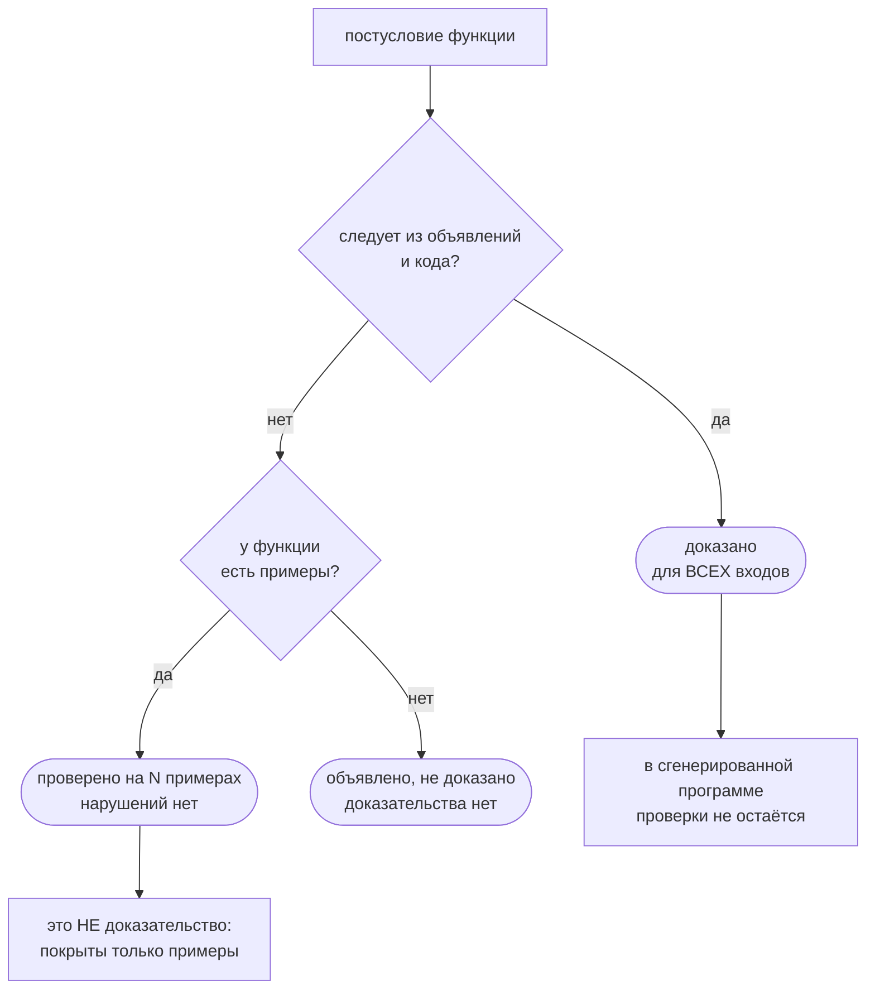

# Что доказано, а что нет

flang называет себя доказуемым. Эта страница говорит, что за этим стоит и чего
не стоит: каким результатам `flang check --proof` можно доверять и где всё ещё
нужны тесты. Каждое число здесь печатает команда, и команда стоит рядом.

По всему репозиторию: {{корпус.файлов}} файлов, {{корпус.функций}} функций,
{{корпус.строк|разрядами}} строк. Файлы и строки пересчитываются по исходникам
на каждый push (`sh scripts/guards/published-vs-tree.sh --числа`). Остальные
числа страницы — завершаемость, постусловия, проверки во время работы — дал
полный прогон компилятора по репозиторию (`bootstrap/flang run-script
numbers:build`, несколько часов), поэтому они могут отставать от кода. Для
одного файла те же числа получаются за секунды:

```
flang check <файл> --proof --json
```

## Ответы prover'а

На каждое постусловие (`обеспечивает`) и предусловие (`требует`) prover — часть
компилятора, которая их доказывает, в выводе «ядро» — отвечает одним из трёх
слов:


```mermaid Три ответа prover'а и чего стоит каждый
flowchart TD
  A[постусловие функции] --> B{следует из объявлений<br>и кода?}
  B -->|да| C([доказано<br>для ВСЕХ входов])
  B -->|нет| D{у функции<br>есть примеры?}
  D -->|да| E([проверено на N примерах<br>нарушений нет])
  D -->|нет| F([объявлено, не доказано<br>доказательства нет])
  C --> G[в сгенерированной программе<br>проверки не остаётся]
  E --> H[это НЕ доказательство:<br>покрыты только примеры]
  class C vyvod
  class E glavnoe
  class F otkaz
```

| В выводе написано | Что это значит | Что во время работы |
| --- | --- | --- |
| «доказано» | доказано для всех входов | ничего: проверки в сгенерированном коде нет |
| «сетка N» | проверено только на N значениях (ваших примерах), как unit-тестами | условие проверяется при каждом возврате |
| «объявлено, не доказано» | нет ни доказательства, ни примеров | условие проверяется при каждом возврате |
| «на веру» | допущение, которое не проверяет ничто | — |

Допущений «на веру» в репозитории: {{законы.наВеру}}.

---

## Что доказано

### Завершаемость: {{корпус.тотальных}} функций из {{корпус.функций}}

`тотальная` перед функцией говорит, что она останавливается на любом входе.
Компилятор это доказывает или отвергает файл. Доказать он может пятью
способами, и отчёт о доказательствах называет способ у каждой функции:

| Чем доказана завершаемость | Функций | Цена во время работы |
|---|---:|---|
| Рекурсии нет вовсе | {{носители.композиция}} | нет |
| Рекурсия по части входа (хвост, поле) | {{носители.структура}} | нет |
| Отсчёт вниз числа типа `неотрицательное` | {{носители.точныйШаг}} | нет |
| Отсчёт вниз обычного `число` с нижней границей | {{носители.постоянныйШаг}} | проверка в коде |
| Объявленная мера (`убывает`) | {{носители.мера}} | проверка в коде |

Первые три доказываются до запуска и ничего не оставляют в сгенерированном
коде. Последние два опираются на убывание числа, а `число` — это float
binary64: при большом `х` выражение `х минус 1` равно `х`. Доказательство верно
для вещественных чисел, но не для float, поэтому компилятор добавляет проверку
в сгенерированный код — **{{сторож.мест}} мест в {{сторож.функций}} функциях**,
ровно в функциях двух последних строк. Чтобы проверки не было, объявляйте
счётчик `неотрицательное`.

### Постусловия: {{утверждения.доказано}} из {{утверждения.высказано}}

| Ответ prover'а | Сколько | Что значит |
|---|---:|---|
| Доказано для всех входов | {{утверждения.доказано}} | верно на любом входе, а не только на написанных |
| Проверено только на примерах | {{утверждения.сеткой}} | примеры проходят; доказательства нет |

Остальные объявлены без доказательства и без примеров; их проверяет рантайм на
тех входах, которые придут. Отвергнуто как ложные: {{утверждения.отвергнуто}}.

### Аксиом нет

Аксиома — утверждение, принятое без доказательства. В Coq и Lean аксиомы есть,
и ими пользуются: закон исключённого третьего, аксиома выбора. Машина их не
проверяет.

У prover'а flang аксиом нет. Отчёт о доказательствах печатает список допущений
вместе с остальными числами ({{законы.наВеру}} по репозиторию). Способа объявить
аксиому у prover'а нет, поэтому отдельный скрипт читает
`flang/self/proof-kernel.flang` целиком и падает, если слово «аксиома» стоит там
где-то кроме названных доводов, объясняющих, почему правило — теорема:

```
flang io flang/scripts/kernel-forgeries.fscript --plan 'Аксиом ноль' --trust
```

Он завершается с кодом 0 и печатает «аксиом ноль, нарушений 0». `--trust`
нужен потому, что у самого скрипта есть недоказанные постусловия, а `flang io`
без согласия такой скрипт не запускает.

Второй план того же скрипта проверяет, что каждое нарочно испорченное
доказательство из `flang/test/fixtures/poddelka-*` отвергается:

```
flang io flang/scripts/kernel-forgeries.fscript --plan 'Подделки остаются недоказанными' --trust
```

Он тоже завершается с кодом 0: «подделки отвергнуты: 36 файлов каталога».

Что это даёт: если отчёт сказал «доказано для всех входов», за этим не стоит
скрытого условия. Доверять всё равно приходится — правилам prover'а,
компилятору, который их исполняет, и железу, — но не списку исключений.

### Доказательство перепроверяет независимая программа

Слову «доказано» в выводе компилятора верить на слово не нужно.
`flang check <файл> --proof --record <запись>` пишет доказательство в файл, а
отдельная программа на C, `flang/proof/checker/checker.c`, у которой нет общего
кода с компилятором, читает исходник и запись и перепроверяет каждый шаг.

Одна команда прогоняет эту проверку по собственным доказательствам компилятора:

```
bootstrap/flang io scripts/provability.fscript --plan Verdict --timeout 900000
```

Она идёт около минуты и отвечает «ДОКАЗУЕМ» с четырьмя числами: программа на C
перепроверила 650 шагов доказательств из 650 (100.00 %), 27 недостижимых мест
исключены; набор подделок 36 из 36; 575 испорченных доказательств, ни одно не
принято; 274 правильных, ни одно не отвергнуто.

Что значат 100 %: долю шагов **в собственных записях доказательств
компилятора**, которые перепроверила независимая программа. Это не «доказаны все
программы», и о сгенерированном коде это не говорит ничего.

Правила вывода prover'а записаны ещё и на Lean 4. Насколько — печатает
`bootstrap/flang io scripts/four-coverages.fscript --plan Measure --timeout 900000`:
у каждой строки правил в `flang/proof/tables/inference-rules.tsv` (112) есть
лемма на Lean, и 76 из 97 правил вывода внесены в файл приёмки Lean; 21 — нет.
Сам Lean эта команда не запускает; его запускает `sh flang/proof/lean/run.sh`
с версией из `flang/proof/lean/lean-toolchain`. Та же команда перечисляет
известные проблемы состоятельности проверяющей программы и говорит, какая часть
перевода в C проверена.

---

## Что не доказано

Эта половина страницы важнее первой.

### Доказанное постусловие может не говорить ничего

Пустые постусловия доказываются легко. Постусловие `результат равен (0 минус х)`
при теле `0 минус х` доказывается за один шаг: оно повторяет тело и не
проверяет ничего. Оно не ложно, оно бесполезно.

Чтобы посчитать полезные постусловия, скрипт задаёт про каждое два механических
вопроса:

1. **Не переписано ли тело в постусловие?** Сравниваются деревья разбора.
2. **Держится ли постусловие, если тело заменить заглушкой?** Тело становится
   `0`, `""`, `нет` или `пустой список`, смотря по типу; сигнатура и
   постусловие остаются. Если prover всё равно его доказывает, постусловие
   верно для любой функции с такой сигнатурой и про эту не говорит ничего.
   «Длина результата неотрицательна» верна и для пустой строки.

Выборка — двадцать функций библиотеки, скопированных в `docs/benchmark2/`:

```
bootstrap/flang run-script proofs:count-20
```

| | Постусловий |
|---|---:|
| Полезные — для заглушки не доказываются | **11** |
| Слабые — доказываются и для заглушки | 6 |
| Даровые — тело переписано в постусловие | 1 |
| Не проверены — для этого типа результата заглушки нет | 2 |

Что-то доказано у 14 функций из 20; что-то полезное — у 10.

**Что делать:** когда prover принял постусловие, спросите себя, держалось бы оно
для `0` или пустого списка. Если да — оно не описывает вашу функцию.

### Часть постусловий недоказуема, потому что ложна

«Prover не смог» и «утверждение ложно» — разные вещи.
`docs/benchmark2/05-opposite.flang` («Противоположное») несёт постусловие
«результат плюс вход равен нулю»: `(результат плюс х) равен 0`. При бесконечном
`х` это `(0 − ∞) + ∞`, то есть NaN, а NaN нулю не равен. Prover прав, что его не
доказывает.

**Что делать:** прежде чем выяснять, почему prover не берёт постусловие,
прогоните его на враждебных значениях: `0`, `−0`, `±∞`, NaN, `2⁵³`, пустая
строка.

### Граница на число молча значит «для конечных чисел»

Числа во flang — float IEEE-754, и NaN получается внутри языка без всякой
ошибки. `0 делить на 0` проходит `flang check` без замечаний:

```
$ flang run граница.flang --function '«Ноль на ноль»' --trust
на веру: доказанность не считалась — запуск по ключу --trust
NaN
$ echo $?
0
```

NaN стоит **вне порядка**: и `NaN не меньше 0`, и `NaN меньше 0` ложны. Поэтому
«модуль неотрицателен» — **ложное** постусловие, и prover прав, что не
доказывает его:

```flang
тотальная функция «Модуль»
  принимает х: число
  возвращает число
  обеспечивает «модуль неотрицателен» результат не меньше 0
  если х не меньше 0
    то х
    иначе 0 минус х
```

```
$ flang check граница.flang --proof
постусловие «модуль неотрицателен» функции «Модуль» — объявлено, не доказано:
ни теоремы, ни примеров. Его считает рантайм после каждого возврата — на тех
входах, которые придут
граница.flang: НЕ ПРОВЕРЕНО — утверждений 1: доказано 0, условно 0, сетка 0,
объявлено, не доказано 1, отвергнуто 0, нарушено 0 … — код возврата 3
$ echo $?
3
```

Без `--proof` тот же файл проходит `flang check` с кодом 0. С `--proof`
недоказанное постусловие даёт код 3.

Проверка во время работы ловит первый же NaN (`«Модуль не числа»` вызывает
«Модуль» от `0 делить на 0`):

```
$ flang run граница.flang --function '«Модуль не числа»' --trust
на веру: доказанность не считалась — запуск по ключу --trust
FLANG_PROPERTY: нарушено свойство «модуль неотрицателен» функции «Модуль»
$ echo $?
1
```

**Что делать:** граница на `число` без условия конечности ложна на NaN и
бесконечностях. Либо допишите это условие в постусловие, либо объявите аргумент
точным типом (`неотрицательное`, `сотых`, `тысячных`).

### Недоказанное постусловие стоит времени на каждом вызове

Доказанного постусловия в сгенерированной программе нет. Недоказанное
**вычисляется при каждом возврате из функции**. Стоит не само условие, а работа
внутри него: каждое сравнение, чтение поля, вызов. Дороже всего постусловие на
маленькой функции, которую `свёртка` (reduce) зовёт на каждом элементе списка.

**Что делать:** если у горячей функции недоказанное постусловие, докажите его
(`требует`, точный тип или `теорема`) или перенесите условие к вызывающему.

### Проверенное на примерах — не доказанное

{{утверждения.сеткой}} постусловий проверены только на примерах. Отчёт кончает
такую строку словами «Это не доказательство». В итоговой строке «доказано» и
«проверено на примерах» выглядят похоже; смотрите, что именно написано.
`flang check --proof --strict` завершается с кодом 3, если что-то проверено
только на примерах, — ставьте его в CI.

### Доказано — не значит правильно

Доказательство говорит, что код соответствует постусловию. Что постусловие
выражает то, что вы имели в виду, оно не говорит. Пример из стандартной
библиотеки: `«Чётное»` в `flang/stdlib/numbers.flang` доказано:

```
постусловие «чётность есть делимость на два» — доказано сведением цели
с телом функции … утверждение обо ВСЕХ входах, а не о написанных
```

И та же функция на −4:

```
$ flang run flang/stdlib/numbers.flang --function "Чётное" --args '{"число": -4}' --trust
на веру: доказанность не считалась — запуск по ключу --trust
false
```

−4 — чётное число. Противоречия между двумя выводами нет: `«Чётное»` — это
`(число остаток от 2) равен 0`, постусловие говорит то же через
`«Делится на»`, а у −4 остаток равен −0, и `равен 0` считает его неравным нулю.
Доказательство говорит «функция и её постусловие согласны на всех входах», и
они согласны — обе ошибаются на отрицательных числах.

Этого не исправит ни один prover. Выражает ли спецификация то, что нужно,
проверяет человек.

### Функции, которые завершаться не обязаны

Интерпретатор flang написан на flang, и его главный цикл исполняет чужую
программу, а она может работать вечно. Поэтому три функции цикла, `«Прогон»`,
`«Виток»` и `«Дальше после шага»` в `flang/self/interpret.flang`, объявлены без
`тотальная`. Останавливает их предел шагов: дойдя до него, интерпретатор
завершается с `FLANG_RECURSION_LIMIT`.

Функций без `тотальная` в репозитории {{корпус.обычных}}. У этих трёх это
свойство задачи; у большинства остальных завершаемость просто ещё не доказана.

### Правило завершаемости, которое доказывает больше, не всегда верно

Соблазнительное правило: «каждый вызов возвращает строгую часть своего первого
аргумента». Оно доказало бы завершаемость многих функций сразу — и оно ложно.
Опровергают его три строки:

```flang
тотальная функция «Само»
  принимает значение: список числа
  возвращает список числа
  значение

тотальная функция «Вечно»
  принимает значение: список числа
  возвращает число
  «Вечно» от («Само» от значение)
```

`«Само»` возвращает аргумент целиком, поэтому `«Вечно»` не останавливается
никогда. С таким правилом компилятор объявил бы её завершающейся. Такого
правила у компилятора нет, и программу он отвергает:

```
$ flang check вечность.flang
без доказанного завершения: «Вечно»
FLANG_NOT_TOTAL в файле вечность.flang, строка 11, столбец 3: тотальная функция
«Вечно»: рекурсивный вызов «Вечно» не убывает — аргумент 1 («Само» от
«значение») не выведен ни из одного параметра. Передавайте часть аргумента: хвост
списка из образца «голова и хвост», поле варианта из образца, поле записи или
элемент коллекции
вечность.flang: не проверено — замечаний 1
$ echo $?
1
```

**Что делать:** когда завершаемость отвергнута, передавайте часть аргумента
(хвост из `голова и хвост`, поле варианта или записи) прямо в рекурсивный
вызов, а не через другую функцию.

### Собственные исходники компилятора проверены не целиком

`flang check` останавливает прогон, превысивший предел шагов, с
`FLANG_RECURSION_LIMIT`. Предел по умолчанию зашит в двоичный файл; поднять его
на один прогон — `--step-limit N` (кириллицей `--предел-шагов`). Полный прогон
по репозиторию, `bootstrap/flang run-script proofs:report`, идёт часы. Файлы,
по которым он не даёт отчёта, делятся на три группы:

* в файле объявлены категории или процессы: двоичный компилятор проверяет эти
  объявления лишь частично, пишет «проверено НЕ ДО КОНЦА» и завершается с
  кодом 2;
* прогон упёрся в предел шагов; так бывает на самых больших исходниках самого
  компилятора;
* в файле настоящие ошибки.

Компилятор собирает сам себя, но обычный `flang check` по его самым большим
исходникам может остановиться на пределе шагов раньше, чем проверит все примеры
и доказательства. Доказательства компилятора перепроверяются другим путём —
независимой программой на C (см. выше).

---

## Как проверить это самому

| Что | Команда |
|---|---|
| Отчёт о доказательствах одного файла | `flang check <файл> --proof` |
| То же в JSON | `flang check <файл> --proof --json` |
| Отчёт по всем программам репозитория | `bootstrap/flang run-script proofs:report` |
| Полезные постусловия среди двадцати | `bootstrap/flang run-script proofs:count-20` |
| Доказательства компилятора, перепроверенные программой на C | `bootstrap/flang io scripts/provability.fscript --plan Verdict --timeout 900000` |
| Все четыре меры рядом | `bootstrap/flang io scripts/four-coverages.fscript --plan Measure --timeout 900000` |

## Дальше

- [Ядро отказало: чья это ошибка](proof-refused.html) — каждый отказ поимённо
- [Зачем и как](proofs.html) — чем доказательство отличается от теста
- [Спецификация ядра доказательств](spec-proof.html) — правила целиком
- [Известные ограничения](limits.html) — чего язык не умеет
- [Разбор настоящих случаев](case-studies.html) — где доказательство поймало ошибку
- [База знаний](knowledge.html) — что измерено и что оказалось ложным
