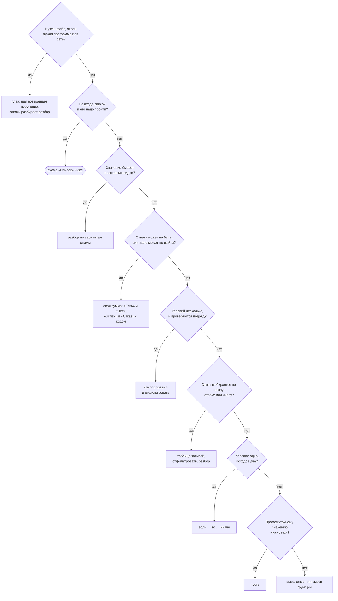
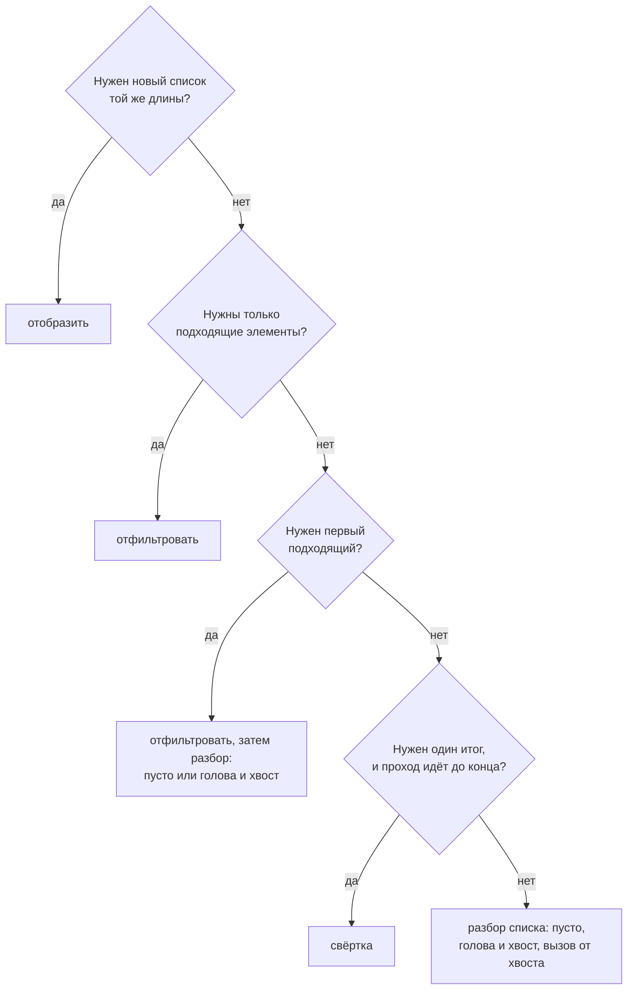
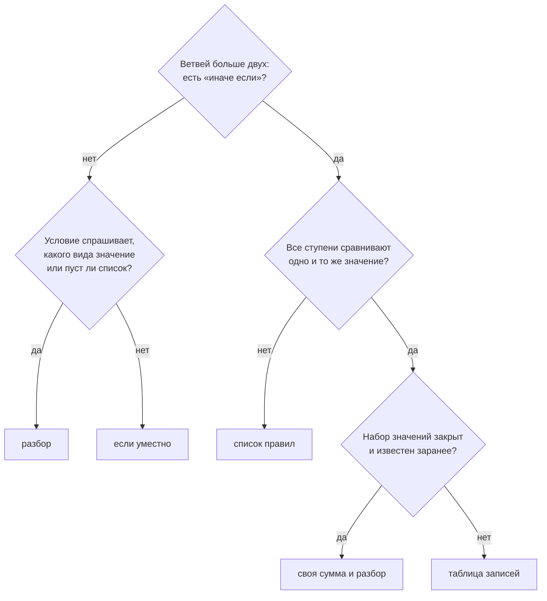
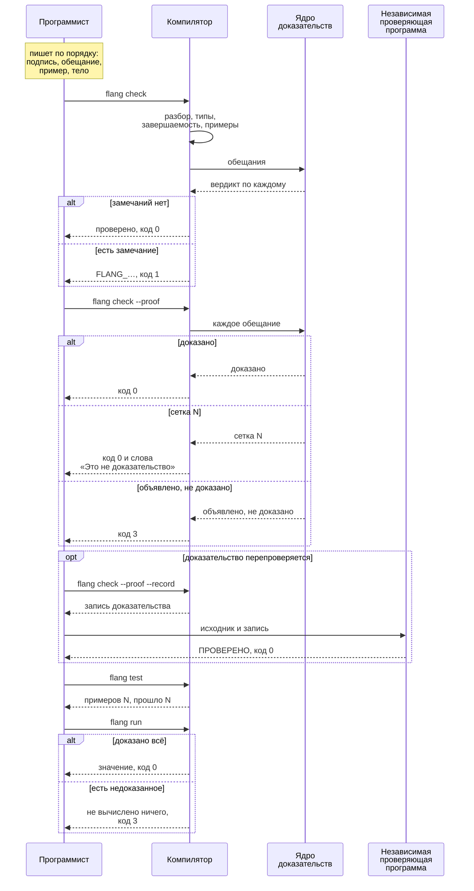

# Какую конструкцию когда брать

Страница отвечает на один вопрос: **я хочу сделать X — что писать**. Вход —
действие, выход — конструкция и программа, которая проходит проверку.

Форму записи каждой конструкции даёт [Справочник конструкций](language.html),
все слова языка графом — [Карта конструкций](language-map.html).

## Почему выбор формы тела важен

Индукция в доказательстве цепляется к `разбор`у. Обещание о функции, чьё тело
написано лестницей `если … иначе если`, ядро доказательств либо не берёт, либо
берёт слабее.

| Что мерили | Число | Чем и когда снято |
| --- | --- | --- |
| тел вида `разбор` по параметру в `flang/stdlib` | 58 из 208 | замер 16 августа 2026, `docs/body-shapes.md` |
| тел, с которых ядро строит посылки индукции, после того как оно научилось `свёртке` | 96 из 208 | тот же замер |
| строк, начинающихся с `если`, в `scripts/guards/*.fscript` | 340 | `grep -c '^ *если'`, 27 сентября 2026 |
| из них ступеней `иначе если` | 190 | `grep -c 'иначе если'`, тот же день |
| строк, начинающихся с `разбор` | 265 | `grep -c '^ *разбор'`, тот же день |
| строк, начинающихся со `свёртка` | 145 | `grep -c '^ *свёртка'`, тот же день |

## Схема выбора

Идите сверху вниз и останавливайтесь на первом «да».



| Ответ схемы | Случаи ниже |
| --- | --- |
| план | 26, 27, 28 |
| схема «Список» | 6, 8, 9, 10, 11, 12 |
| `разбор` по вариантам | 1, 7 |
| своя сумма | 2, 3, 4, 5 |
| список правил | 14 |
| таблица записей | 13 |
| `если` | 15, 16 |
| `пусть` | 17 |

### Список



## Когда `если` уместно, а когда нет



`если` уместно, когда условие одно, исходов два и условие — сравнение, а не
вопрос о виде значения. Ещё одно его место — дно рекурсии по числу: спуск на
единицу ядро читает из `если предел не больше 0` (случай 16).

### Лестница

Так писать не надо. Программа проходит проверку, и в этом беда: опечатка в
названии зоны молча даёт ноль.

Файл: `docs/examples/guide/ladder-before.flang`

```flang
модуль «Ladder before»

тотальная функция «Цена доставки»
  принимает зона: строка
  возвращает число
  обеспечивает «цена доставки не отрицательна» результат не меньше 0
  пример «по городу»
    дано зона равно "город"
    ожидается 300
  пример «опечатка в зоне молча даёт ноль»
    дано зона равно "горд"
    ожидается 0
  если зона равен "город"
    то 300
    иначе если зона равен "область"
      то 500
      иначе если зона равен "страна"
        то 900
        иначе 0
```

```
$ flang check docs/examples/guide/ladder-before.flang
модуль «Ladder before»: функций 1, из них с доказанным завершением 1; типов 0
docs/examples/guide/ladder-before.flang: проверено — разбор, типы, завершаемость, ядро и примеры; замечаний нет
$ echo $?
0
```

### То же разбором

Значений три, и они известны заранее — это сумма типов. Опечатку теперь не
написать: варианта «Горд» нет. Четвёртую зону нельзя забыть разобрать. Обещание
стало сильнее — «цена положительна» вместо «цена не отрицательна», — и ядро
доказало его индукцией по типу.

Файл: `docs/examples/guide/ladder-as-match.flang`

```flang
модуль «Ladder as match»

тип «Зона»
  вариант «Город»
  вариант «Область»
  вариант «Страна»

тотальная функция «Цена доставки»
  принимает зона: «Зона»
  возвращает число
  обеспечивает «цена доставки положительна» результат больше 0
  пример «по городу»
    дано зона равно вариант «Город»
    ожидается 300
  пример «по стране»
    дано зона равно вариант «Страна»
    ожидается 900
  разбор зона
    случай «Город»
      то 300
    случай «Область»
      то 500
    случай «Страна»
      то 900
```

```
$ flang check docs/examples/guide/ladder-as-match.flang
модуль «Ladder as match»: функций 1, из них с доказанным завершением 1; типов 1
docs/examples/guide/ladder-as-match.flang: проверено — разбор, типы, завершаемость, ядро и примеры; замечаний нет
$ echo $?
0
```

```
$ flang check docs/examples/guide/ladder-as-match.flang --proof
…
что высказано и чем это несётся:
  постусловие «цена доставки положительна» функции «Цена доставки» — доказано индукцией по «Зона»: база 3 случая, шаг при допущении на частях (0 случаев), правила сведения: вычисление замкнутой цели — утверждение обо ВСЕХ входах типа «Зона», а не о написанных
…
docs/examples/guide/ladder-as-match.flang: ПРОВЕРЕНО САМОСТОЯТЕЛЬНО — утверждений 1: доказано 1, условно 0, сетка 0, объявлено, не доказано 0, отвергнуто 0, нарушено 0; законов на сетке 0, на веру 0 — код возврата 0
$ echo $?
0
```

То же обещание на лестнице ложно: пример с опечаткой его нарушает, и проверка
отвечает `FLANG_EXAMPLE` с `FLANG_PROPERTY` внутри.

### То же таблицей

Зона приходит снаружи строкой, и набор зон меняется — это таблица. Неизвестная
зона названа своим вариантом.

Файл: `docs/examples/guide/ladder-as-table.flang`

```flang
модуль «Ladder as table»

объект «Тариф»
  «зона»: строка
  «цена»: неотрицательное

тип «Цена доставки»
  вариант «Назначена» содержит цена: число
  вариант «Зоны нет» содержит зона: строка

тотальная функция «Тарифы»
  возвращает список «Тариф»
  обеспечивает «тарифов три» (длина результат) равен 3
  [(запись «Тариф» с «зона» равным "город" и «цена» равным 300), (запись «Тариф» с «зона» равным "область" и «цена» равным 500), (запись «Тариф» с «зона» равным "страна" и «цена» равным 900)]

тотальная функция «Назначить цену»
  принимает зона: строка
  возвращает «Цена доставки»
  пример «по городу»
    дано зона равно "город"
    ожидается вариант «Назначена» с цена равным 300
  пример «опечатка в зоне названа, а не спрятана в ноль»
    дано зона равно "горд"
    ожидается вариант «Зоны нет» с зона равным "горд"
  разбор (отфильтровать («Тарифы») где тариф → тариф.«зона» равен зона)
    случай пусто
      то вариант «Зоны нет» с зона равным зона
    случай голова и хвост
      то вариант «Назначена» с цена равным голова.«цена»
```

```
$ flang check docs/examples/guide/ladder-as-table.flang
модуль «Ladder as table»: функций 2, из них с доказанным завершением 2; типов 2
docs/examples/guide/ladder-as-table.flang: проверено — разбор, типы, завершаемость, ядро и примеры; замечаний нет
$ echo $?
0
```

### Не заменяйте `если` разбором по признаку

`разбор (условие)` со случаями `да` и `нет` проходит проверку, но доказуемость
теряет. Ниже одна функция в двух записях.

Файл: `docs/examples/guide/two-outcomes.flang`

```flang
модуль «Two outcomes»

тотальная функция «Не ниже порога»
  принимает число: неотрицательное, порог: неотрицательное
  возвращает число
  обеспечивает «результат не ниже порога» результат не меньше порог
  пример «ниже порога — порог»
    дано число равно 2
    дано порог равно 5
    ожидается 5
  пример «выше порога — само число»
    дано число равно 9
    дано порог равно 5
    ожидается 9
  если число не меньше порог
    то число
    иначе порог
```

```
$ flang check docs/examples/guide/two-outcomes.flang --proof
…
что высказано и чем это несётся:
  постусловие «результат не ниже порога» функции «Не ниже порога» — доказано по объявленным типам аргументов: цель сведена правилом «разбор цели по условию» — утверждение обо ВСЕХ входах, а не о написанных; теоремы при нём нет и не нужно
…
docs/examples/guide/two-outcomes.flang: ПРОВЕРЕНО САМОСТОЯТЕЛЬНО — утверждений 1: доказано 1, условно 0, сетка 0, объявлено, не доказано 0, отвергнуто 0, нарушено 0; законов на сетке 0, на веру 0 — код возврата 0
$ echo $?
0
```

Файл: `docs/examples/guide/flag-match-unproved.flang`

```flang
модуль «Flag match unproved»

тотальная функция «Не ниже порога»
  принимает число: неотрицательное, порог: неотрицательное
  возвращает число
  обеспечивает «результат не ниже порога» результат не меньше порог
  пример «ниже порога — порог»
    дано число равно 2
    дано порог равно 5
    ожидается 5
  пример «выше порога — само число»
    дано число равно 9
    дано порог равно 5
    ожидается 9
  разбор (число не меньше порог)
    случай да
      то число
    случай нет
      то порог
```

```
$ flang check docs/examples/guide/flag-match-unproved.flang --proof
…
что высказано и чем это несётся:
  постусловие «результат не ниже порога» функции «Не ниже порога» — сетка 2 значения (примеры функции): нарушений НЕ ИСКАЛИ — прогона примеров не было, посчитано только их число. Это не доказательство — теоремы при утверждении нет
…
docs/examples/guide/flag-match-unproved.flang: ПРОВЕРЕНО С ОПОРОЙ, И ОПОРА НЕ СУДИЛАСЬ (спросить: --строго) — утверждений 1: доказано 0, условно 0, сетка 1, объявлено, не доказано 0, отвергнуто 0, нарушено 0; законов на сетке 0, на веру 0 — код возврата 0
$ echo $?
0
```

С `если` обещание доказано, с разбором по признаку — «сетка 2 значения».
Рекурсия по числу с дном в `разбор (предел не больше 0)` не проходит вовсе:
`FLANG_NOT_TOTAL`.

## Последовательность работы над функцией

Пишут в таком порядке: подпись (`принимает`, `возвращает`), обещание (`требует`,
`обеспечивает`), пример, тело. Тело — последним.



| Команда | Когда звать | Что значит ответ |
| --- | --- | --- |
| `flang check файл` | после каждой правки | код 0 — разбор, типы, завершаемость и примеры прошли; код 1 — замечание названо кодом `FLANG_…`, строкой и столбцом |
| `flang check файл --proof` | когда написано обещание | вердикт по каждому обещанию; код 3 — есть «объявлено, не доказано» |
| `flang check файл --proof --strict` | в сборочном сценарии | код 0 только когда доказано всё; «сетка» даёт код 3 |
| `flang check файл --proof --record запись` | когда доказательство проверяют второй раз | доказательство записано в файл; его переигрывает независимая проверяющая программа `flang/proof/checker/checker.c` |
| `flang test файл` | когда нужен счёт примеров | сколько примеров и сколько прошло |
| `flang run файл --function «Имя» --args '{…}'` | когда нужно значение | сначала считается вердикт; на недоказанной программе не вычисляется ничего, код 3 |

### Три вердикта

| Вердикт | Что значит | Код `check --proof` | Код `run` |
| --- | --- | --- | --- |
| доказано | верно на всех входах | 0 | 0 |
| сетка N | посчитано на N значениях автора; доказательством не является | 0, с `--strict` 3 | 3 |
| объявлено, не доказано | нет ни теоремы, ни примеров | 3 | 3 |

Доказано — файл `two-outcomes.flang` выше:

```
$ flang test docs/examples/guide/two-outcomes.flang
docs/examples/guide/two-outcomes.flang: примеров 2, прошло 2, не прошло 0
$ echo $?
0
```

```
$ flang run docs/examples/guide/two-outcomes.flang --function '«Не ниже порога»' --args '{"число":2,"порог":5}'
доказано: утверждений 1
5
$ echo $?
0
```

Сетка — файл `flag-match-unproved.flang` выше. Путь к файлу в последней строке
двоичный печатает полным; здесь он показан от корня репозитория.

```
$ flang check docs/examples/guide/flag-match-unproved.flang --proof --strict
…
docs/examples/guide/flag-match-unproved.flang: НЕ УДАЛОСЬ ДОКАЗАТЬ — ОПОРА НЕ СУДИЛАСЬ — утверждений 1: доказано 0, условно 0, сетка 1, объявлено, не доказано 0, отвергнуто 0, нарушено 0; законов на сетке 0, на веру 0 — код возврата 3
$ echo $?
3
```

```
$ flang run docs/examples/guide/flag-match-unproved.flang --function '«Не ниже порога»' --args '{"число":2,"порог":5}'
не доказано: утверждений 1: доказано 0, сетка 1, на веру 0 — запуск только по явному согласию: --на-веру
недоказанное — поимённо, словами отчёта о доказательствах:
  1. постусловие «результат не ниже порога» функции «Не ниже порога» — сетка 2 значения (примеры функции): нарушений НЕ ИСКАЛИ — прогона примеров не было, посчитано только их число. Это не доказательство — теоремы при утверждении нет
«сетка» закрывается так: написать при утверждении «теорема … утверждаем … следовательно доказано» либо переписать его условие так, чтобы оно совпало с ветвью тела, — тогда цель сводит правило «разбор цели по условию»
отчёт о доказательствах целиком, с правилами и у доказанных тоже: flang check docs/examples/guide/flag-match-unproved.flang --proof
$ echo $?
3
```

Объявлено, не доказано — то же обещание без единого примера.

Файл: `docs/examples/guide/promise-without-examples.flang`

```flang
модуль «Promise without examples»

тотальная функция «Не ниже порога»
  принимает число: неотрицательное, порог: неотрицательное
  возвращает число
  обеспечивает «результат не ниже порога» результат не меньше порог
  разбор (число не меньше порог)
    случай да
      то число
    случай нет
      то порог
```

```
$ flang check docs/examples/guide/promise-without-examples.flang
модуль «Promise without examples»: функций 1, из них с доказанным завершением 1; типов 0
docs/examples/guide/promise-without-examples.flang: проверено — разбор, типы, завершаемость, ядро и примеры; замечаний нет
$ echo $?
0
```

```
$ flang check docs/examples/guide/promise-without-examples.flang --proof
…
что высказано и чем это несётся:
  постусловие «результат не ниже порога» функции «Не ниже порога» — объявлено, не доказано: ни теоремы, ни примеров. Его считает рантайм после каждого возврата — на тех входах, которые придут
…
docs/examples/guide/promise-without-examples.flang: НЕ ПРОВЕРЕНО — утверждений 1: доказано 0, условно 0, сетка 0, объявлено, не доказано 1, отвергнуто 0, нарушено 0; законов на сетке 0, на веру 0 — код возврата 3
$ echo $?
3
```

## Случаи применения

Случаев 28. Каждая программа лежит файлом в `docs/examples/guide/` и
прогнана двоичным 0.7.22 27 сентября 2026 из корня репозитория. Вывод дословный;
многоточием помечены строки отчёта `--proof`, которые здесь опущены.

### 1. Хочу выбрать по виду значения

Беру: `разбор` по своей сумме типов. Забытый вариант — отказ `FLANG_MATCH_NOT_EXHAUSTIVE`, а обещание о функции ядро доказывает индукцией по типу.

Файл: `docs/examples/guide/choose-by-variant.flang`

```flang
модуль «Choose by variant»

тип «Фигура»
  вариант «Круг» содержит радиус: число
  вариант «Прямоугольник» содержит ширина: число, высота: число
  вариант «Треугольник» содержит основание: число, высота: число

тотальная функция «Площадь»
  принимает фигура: «Фигура»
  возвращает число
  пример «прямоугольник два на три»
    дано фигура равно вариант «Прямоугольник» с ширина равным 2 и высота равным 3
    ожидается 6
  пример «треугольник с основанием четыре и высотой три»
    дано фигура равно вариант «Треугольник» с основание равным 4 и высота равным 3
    ожидается 6
  разбор фигура
    случай вариант «Круг» с радиус как радиус
      то 3.14 умножить на радиус умножить на радиус
    случай вариант «Прямоугольник» с ширина как ширина и высота как высота
      то ширина умножить на высота
    случай вариант «Треугольник» с основание как основание и высота как высота
      то основание умножить на высота делить на 2

тотальная функция «Углов»
  принимает фигура: «Фигура»
  возвращает число
  для всех фигура обеспечивает «углов не больше четырёх» результат не больше 4
  пример «у круга углов нет»
    дано фигура равно вариант «Круг» с радиус равным 1
    ожидается 0
  разбор фигура
    случай вариант «Круг» с радиус как радиус
      то 0
    случай вариант «Прямоугольник» с ширина как ширина и высота как высота
      то 4
    случай вариант «Треугольник» с основание как основание и высота как высота
      то 3
```

```
$ flang check docs/examples/guide/choose-by-variant.flang
модуль «Choose by variant»: функций 2, из них с доказанным завершением 2; типов 1
docs/examples/guide/choose-by-variant.flang: проверено — разбор, типы, завершаемость, ядро и примеры; замечаний нет
$ echo $?
0
```

```
$ flang check docs/examples/guide/choose-by-variant.flang --proof
…
что высказано и чем это несётся:
  постусловие «углов не больше четырёх» функции «Углов» — доказано индукцией по «Фигура»: база 3 случая, шаг при допущении на частях (0 случаев), правила сведения: ограниченность точным потолком по построению — утверждение обо ВСЕХ входах типа «Фигура», а не о написанных
…
docs/examples/guide/choose-by-variant.flang: ПРОВЕРЕНО САМОСТОЯТЕЛЬНО — утверждений 1: доказано 1, условно 0, сетка 0, объявлено, не доказано 0, отвергнуто 0, нарушено 0; законов на сетке 0, на веру 0 — код возврата 0
$ echo $?
0
```

### 2. Хочу обработать значение, которого может не быть

Беру: сумма из двух вариантов и `разбор`. `ничто` для этого не берут: вариант «Нет» нельзя забыть разобрать.

Файл: `docs/examples/guide/absent-value.flang`

```flang
модуль «Absent value»

тип «Скидка»
  вариант «Есть» содержит доля: число
  вариант «Нет»

тотальная функция «Цена со скидкой»
  принимает цена: число, скидка: «Скидка»
  возвращает число
  пример «скидка десять процентов»
    дано цена равно 200
    дано скидка равно вариант «Есть» с доля равным 10
    ожидается 180
  пример «скидки нет — цена прежняя»
    дано цена равно 200
    дано скидка равно вариант «Нет»
    ожидается 200
  разбор скидка
    случай вариант «Есть» с доля как доля
      то цена минус (доля процентов от цена)
    случай «Нет»
      то цена
```

```
$ flang check docs/examples/guide/absent-value.flang
модуль «Absent value»: функций 1, из них с доказанным завершением 1; типов 1
docs/examples/guide/absent-value.flang: проверено — разбор, типы, завершаемость, ядро и примеры; замечаний нет
$ echo $?
0
```

### 3. Хочу вернуть отказ

Беру: вариант суммы с кодом и причиной. Исключений нет. Отказ — значение, и вызывающий обязан его разобрать. Условие здесь одно, исходов два — это случай для `если`.

Файл: `docs/examples/guide/refusal.flang`

```flang
модуль «Refusal»

тип «Итог»
  вариант «Успех» содержит частное: число
  вариант «Отказ» содержит код: строка, причина: строка

тотальная функция «Поделить»
  принимает делимое: число, делитель: число
  возвращает «Итог»
  пример «шесть на три»
    дано делимое равно 6
    дано делитель равно 3
    ожидается вариант «Успех» с частное равным 2
  пример «на ноль не делят»
    дано делимое равно 6
    дано делитель равно 0
    ожидается вариант «Отказ» с код равным "ДЕЛИТЕЛЬ_НОЛЬ" и причина равным "делитель равен нулю"
  если делитель равен 0
    то вариант «Отказ» с код равным "ДЕЛИТЕЛЬ_НОЛЬ" и причина равным "делитель равен нулю"
    иначе вариант «Успех» с частное равным (делимое делить на делитель)

тотальная функция «Слово итога»
  принимает итог: «Итог»
  возвращает строка
  пример «отказ называет код и причину»
    дано итог равно вариант «Отказ» с код равным "ДЕЛИТЕЛЬ_НОЛЬ" и причина равным "делитель равен нулю"
    ожидается "ДЕЛИТЕЛЬ_НОЛЬ: делитель равен нулю"
  пример «успех называет частное»
    дано итог равно вариант «Успех» с частное равным 2
    ожидается "2"
  разбор итог
    случай вариант «Успех» с частное как частное
      то к строке частное
    случай вариант «Отказ» с код как код и причина как причина
      то соединить [код, ": ", причина] по ""
```

```
$ flang check docs/examples/guide/refusal.flang
модуль «Refusal»: функций 2, из них с доказанным завершением 2; типов 1
docs/examples/guide/refusal.flang: проверено — разбор, типы, завершаемость, ядро и примеры; замечаний нет
$ echo $?
0
```

### 4. Хочу превратить строку в число и не упасть

Беру: `к числу или беда` и `разбор` её ответа. Встроенная форма отвечает вариантами «Разобрано» и «Не разобрано»; причина доезжает текстом.

Файл: `docs/examples/guide/parse-number.flang`

```flang
модуль «Parse number»

тип «Прочитанное»
  вариант «Число» содержит значение: число
  вариант «Не число» содержит причина: строка

тотальная функция «Прочитать число»
  принимает текст: строка
  возвращает «Прочитанное»
  пример «цифры становятся числом»
    дано текст равно "42"
    ожидается вариант «Число» с значение равным 42
  пример «слово числом не становится, и причина названа»
    дано текст равно "сорок два"
    ожидается вариант «Не число» с причина равным "«к числу»: строка \"сорок два\" не является числом"
  разбор (к числу или беда текст)
    случай вариант «Разобрано» с значение как значение
      то вариант «Число» с значение равным значение
    случай вариант «Не разобрано» с код как код и сообщение как сообщение
      то вариант «Не число» с причина равным сообщение
```

```
$ flang check docs/examples/guide/parse-number.flang
модуль «Parse number»: функций 1, из них с доказанным завершением 1; типов 2
docs/examples/guide/parse-number.flang: проверено — разбор, типы, завершаемость, ядро и примеры; замечаний нет
$ echo $?
0
```

### 5. Хочу сделать несколько шагов, каждый из которых может отказать

Беру: каждый шаг возвращает сумму, следующий её разбирает. Причина первого отказа доезжает до итога без единого `если`.

Файл: `docs/examples/guide/chain-of-steps.flang`

```flang
модуль «Chain of steps»

тип «Шаг»
  вариант «Есть» содержит значение: число
  вариант «Нет» содержит причина: строка

объект «Позиция»
  «номер»: число
  «цена»: число

тотальная функция «Каталог»
  возвращает список «Позиция»
  обеспечивает «позиций две» (длина результат) равен 2
  [(запись «Позиция» с «номер» равным 1 и «цена» равным 500), (запись «Позиция» с «номер» равным 2 и «цена» равным 100)]

тотальная функция «Цена позиции»
  принимает номер: число
  возвращает «Шаг»
  пример «первая позиция стоит пятьсот»
    дано номер равно 1
    ожидается вариант «Есть» с значение равным 500
  пример «третьей позиции нет»
    дано номер равно 3
    ожидается вариант «Нет» с причина равным "позиции нет в каталоге"
  разбор (отфильтровать («Каталог») где позиция → позиция.«номер» равен номер)
    случай пусто
      то вариант «Нет» с причина равным "позиции нет в каталоге"
    случай голова и хвост
      то вариант «Есть» с значение равным голова.«цена»

тотальная функция «Скидка по цене»
  принимает цена: число
  возвращает «Шаг»
  пример «дешёвому товару скидки нет»
    дано цена равно 100
    ожидается вариант «Нет» с причина равным "цена ниже порога скидки"
  если цена не меньше 400
    то вариант «Есть» с значение равным (цена делить на 10)
    иначе вариант «Нет» с причина равным "цена ниже порога скидки"

тотальная функция «Цена за вычетом»
  принимает цена: число, скидка: «Шаг»
  возвращает «Шаг»
  пример «скидка вычтена»
    дано цена равно 500
    дано скидка равно вариант «Есть» с значение равным 50
    ожидается вариант «Есть» с значение равным 450
  разбор скидка
    случай вариант «Есть» с значение как вычет
      то вариант «Есть» с значение равным (цена минус вычет)
    случай вариант «Нет» с причина как причина
      то вариант «Нет» с причина равным причина

тотальная функция «Итог со скидкой»
  принимает номер: число
  возвращает «Шаг»
  пример «по первой позиции скидка есть»
    дано номер равно 1
    ожидается вариант «Есть» с значение равным 450
  пример «у дешёвой позиции причина отказа доехала до итога»
    дано номер равно 2
    ожидается вариант «Нет» с причина равным "цена ниже порога скидки"
  пример «позиции нет, и дальше первого шага дело не пошло»
    дано номер равно 3
    ожидается вариант «Нет» с причина равным "позиции нет в каталоге"
  разбор («Цена позиции» от номер)
    случай вариант «Есть» с значение как цена
      то «Цена за вычетом» от цена и («Скидка по цене» от цена)
    случай вариант «Нет» с причина как причина
      то вариант «Нет» с причина равным причина
```

```
$ flang check docs/examples/guide/chain-of-steps.flang
модуль «Chain of steps»: функций 5, из них с доказанным завершением 5; типов 2
docs/examples/guide/chain-of-steps.flang: проверено — разбор, типы, завершаемость, ядро и примеры; замечаний нет
$ echo $?
0
```

### 6. Хочу пройти список и остановиться раньше конца

Беру: `разбор` списка: `пусто`, `голова и хвост`, вызов от хвоста. Завершаемость доказана структурой, обещание о длине — индукцией по списку.

Файл: `docs/examples/guide/walk-list.flang`

```flang
модуль «Walk list»

тотальная функция «После черты»
  принимает строки: список строки
  возвращает список строки
  для всех строки обеспечивает «остаток не длиннее целого» (длина результат) не больше (длина строки)
  пример «шапка и черта отброшены»
    дано строки равно ["шапка", "---", "тело", "ещё"]
    ожидается ["тело", "ещё"]
  пример «черты нет — не осталось ничего»
    дано строки равно ["шапка", "тело"]
    ожидается пустой список
  разбор строки
    случай пусто
      то пустой список
    случай голова и хвост
      то если голова равен "---"
        то хвост
        иначе «После черты» от хвост
```

```
$ flang check docs/examples/guide/walk-list.flang
модуль «Walk list»: функций 1, из них с доказанным завершением 1; типов 0
docs/examples/guide/walk-list.flang: проверено — разбор, типы, завершаемость, ядро и примеры; замечаний нет
$ echo $?
0
```

```
$ flang check docs/examples/guide/walk-list.flang --proof
…
что высказано и чем это несётся:
  постусловие «остаток не длиннее целого» функции «После черты» — доказано индукцией по «список»: база 1 случай, шаг при допущении на частях (1 случай), правила сведения: ограниченность точным потолком по построению; порядок по построению — утверждение обо ВСЕХ входах типа «список», а не о написанных
…
docs/examples/guide/walk-list.flang: ПРОВЕРЕНО САМОСТОЯТЕЛЬНО — утверждений 1: доказано 1, условно 0, сетка 0, объявлено, не доказано 0, отвергнуто 0, нарушено 0; законов на сетке 0, на веру 0 — код возврата 0
$ echo $?
0
```

### 7. Хочу обойти дерево

Беру: `разбор` по сумме, вызов от частей. Часть значения меньше значения, поэтому меры убывания писать не надо.

Файл: `docs/examples/guide/walk-tree.flang`

```flang
модуль «Walk tree»

тип «Дерево»
  вариант «Лист»
  вариант «Узел» содержит значение: число, левое: «Дерево», правое: «Дерево»

тотальная функция «Узлов»
  принимает дерево: «Дерево»
  возвращает число
  для всех дерево обеспечивает «узлов не меньше нуля» результат не меньше 0
  пример «в листе узлов нет»
    дано дерево равно вариант «Лист»
    ожидается 0
  пример «корень с одним потомком»
    дано дерево равно вариант «Узел» с значение равным 1 и левое равным (вариант «Узел» с значение равным 2 и левое равным (вариант «Лист») и правое равным (вариант «Лист»)) и правое равным (вариант «Лист»)
    ожидается 2
  разбор дерево
    случай «Лист»
      то 0
    случай вариант «Узел» с левое как левое и правое как правое
      то 1 плюс («Узлов» от левое) плюс («Узлов» от правое)
```

```
$ flang check docs/examples/guide/walk-tree.flang
модуль «Walk tree»: функций 1, из них с доказанным завершением 1; типов 1
docs/examples/guide/walk-tree.flang: проверено — разбор, типы, завершаемость, ядро и примеры; замечаний нет
$ echo $?
0
```

```
$ flang check docs/examples/guide/walk-tree.flang --proof
…
что высказано и чем это несётся:
  постусловие «узлов не меньше нуля» функции «Узлов» — доказано индукцией по «Дерево»: база 1 случай, шаг при допущении на частях (1 случай), правила сведения: неотрицательность по построению — утверждение обо ВСЕХ входах типа «Дерево», а не о написанных
…
docs/examples/guide/walk-tree.flang: ПРОВЕРЕНО САМОСТОЯТЕЛЬНО — утверждений 1: доказано 1, условно 0, сетка 0, объявлено, не доказано 0, отвергнуто 0, нарушено 0; законов на сетке 0, на веру 0 — код возврата 0
$ echo $?
0
```

### 8. Хочу накопить итог за один проход

Беру: `свёртка`. Цикла нет. Список конечен, проход один — завершаемость даётся даром.

Файл: `docs/examples/guide/fold-total.flang`

```flang
модуль «Fold total»

тотальная функция «Сумма длин»
  принимает слова: список строки
  возвращает число
  для всех слова обеспечивает «сумма длин не отрицательна» результат не меньше 0
  пример «три слова»
    дано слова равно ["раз", "дважды", "трижды"]
    ожидается 15
  пример «пустой список даёт ноль»
    дано слова равно пустой список
    ожидается 0
  свёртка слова начиная с 0 как итог и слово → итог плюс (длина слово)
```

```
$ flang check docs/examples/guide/fold-total.flang
модуль «Fold total»: функций 1, из них с доказанным завершением 1; типов 0
docs/examples/guide/fold-total.flang: проверено — разбор, типы, завершаемость, ядро и примеры; замечаний нет
$ echo $?
0
```

```
$ flang check docs/examples/guide/fold-total.flang --proof
…
что высказано и чем это несётся:
  постусловие «сумма длин не отрицательна» функции «Сумма длин» — доказано сведением цели с телом функции: правило «неотрицательность по построению», объявленные типы аргументов не понадобились — утверждение обо ВСЕХ входах, а не о написанных; теоремы при нём нет и не нужно
…
docs/examples/guide/fold-total.flang: ПРОВЕРЕНО САМОСТОЯТЕЛЬНО — утверждений 1: доказано 1, условно 0, сетка 0, объявлено, не доказано 0, отвергнуто 0, нарушено 0; законов на сетке 0, на веру 0 — код возврата 0
$ echo $?
0
```

### 9. Хочу накопить два итога сразу

Беру: `свёртка` с записью в накопителе. Шаг вынесен в свою функцию с примером; изменяемой переменной нет.

Файл: `docs/examples/guide/fold-record.flang`

```flang
модуль «Fold record»

объект «Сводка»
  «сумма»: число
  «штук»: число

тотальная функция «Шаг сводки»
  принимает сводка: «Сводка», цена: число
  возвращает «Сводка»
  пример «к пустой сводке прибавлена одна цена»
    дано сводка равно запись «Сводка» с «сумма» равным 0 и «штук» равным 0
    дано цена равно 30
    ожидается запись «Сводка» с «сумма» равным 30 и «штук» равным 1
  запись «Сводка» с «сумма» равным (сводка.«сумма» плюс цена) и «штук» равным (сводка.«штук» плюс 1)

тотальная функция «Сводка цен»
  принимает цены: список числа
  возвращает «Сводка»
  пример «три цены»
    дано цены равно [30, 50, 20]
    ожидается запись «Сводка» с «сумма» равным 100 и «штук» равным 3
  свёртка цены начиная с (запись «Сводка» с «сумма» равным 0 и «штук» равным 0) как сводка и цена → «Шаг сводки» от сводка и цена
```

```
$ flang check docs/examples/guide/fold-record.flang
модуль «Fold record»: функций 2, из них с доказанным завершением 2; типов 1
docs/examples/guide/fold-record.flang: проверено — разбор, типы, завершаемость, ядро и примеры; замечаний нет
$ echo $?
0
```

### 10. Хочу преобразовать каждый элемент

Беру: `отобразить`. Обещание о длине ядро доказывает само.

Файл: `docs/examples/guide/map-each.flang`

```flang
модуль «Map each»

тотальная функция «Длины слов»
  принимает слова: список строки
  возвращает список числа
  обеспечивает «длин столько же, сколько слов» (длина результат) равен (длина слова)
  пример «три слова»
    дано слова равно ["раз", "дважды", "трижды"]
    ожидается [3, 6, 6]
  отобразить слова как слово → длина слово
```

```
$ flang check docs/examples/guide/map-each.flang
модуль «Map each»: функций 1, из них с доказанным завершением 1; типов 0
docs/examples/guide/map-each.flang: проверено — разбор, типы, завершаемость, ядро и примеры; замечаний нет
$ echo $?
0
```

```
$ flang check docs/examples/guide/map-each.flang --proof
…
что высказано и чем это несётся:
  постусловие «длин столько же, сколько слов» функции «Длины слов» — доказано сведением цели с телом функции: правило «тождество после переписки допущением», объявленные типы аргументов не понадобились — утверждение обо ВСЕХ входах, а не о написанных; теоремы при нём нет и не нужно
…
docs/examples/guide/map-each.flang: ПРОВЕРЕНО САМОСТОЯТЕЛЬНО — утверждений 1: доказано 1, условно 0, сетка 0, объявлено, не доказано 0, отвергнуто 0, нарушено 0; законов на сетке 0, на веру 0 — код возврата 0
$ echo $?
0
```

### 11. Хочу оставить подходящие элементы

Беру: `отфильтровать`. 

Файл: `docs/examples/guide/keep-matching.flang`

```flang
модуль «Keep matching»

тотальная функция «Положительные»
  принимает числа: список числа
  возвращает список числа
  обеспечивает «отбор список не удлиняет» (длина результат) не больше (длина числа)
  пример «минусы и ноль выброшены»
    дано числа равно [3, -1, 0, 7]
    ожидается [3, 7]
  отфильтровать числа где число → число больше 0
```

```
$ flang check docs/examples/guide/keep-matching.flang
модуль «Keep matching»: функций 1, из них с доказанным завершением 1; типов 0
docs/examples/guide/keep-matching.flang: проверено — разбор, типы, завершаемость, ядро и примеры; замечаний нет
$ echo $?
0
```

```
$ flang check docs/examples/guide/keep-matching.flang --proof
…
что высказано и чем это несётся:
  постусловие «отбор список не удлиняет» функции «Положительные» — доказано сведением цели с телом функции: правило «порядок по построению», объявленные типы аргументов не понадобились — утверждение обо ВСЕХ входах, а не о написанных; теоремы при нём нет и не нужно
…
docs/examples/guide/keep-matching.flang: ПРОВЕРЕНО САМОСТОЯТЕЛЬНО — утверждений 1: доказано 1, условно 0, сетка 0, объявлено, не доказано 0, отвергнуто 0, нарушено 0; законов на сетке 0, на веру 0 — код возврата 0
$ echo $?
0
```

### 12. Хочу найти первое подходящее

Беру: `отфильтровать`, затем `разбор`: `пусто` или `голова и хвост`. «Не нашлось» — свой вариант, а не особое значение.

Файл: `docs/examples/guide/find-first.flang`

```flang
модуль «Find first»

тип «Находка»
  вариант «Нашлось» содержит слово: строка
  вариант «Не нашлось»

тотальная функция «Первое длинное»
  принимает слова: список строки, порог: неотрицательное
  возвращает «Находка»
  пример «первое слово длиннее трёх букв»
    дано слова равно ["раз", "дважды", "трижды"]
    дано порог равно 3
    ожидается вариант «Нашлось» с слово равным "дважды"
  пример «длинных слов нет»
    дано слова равно ["раз", "два"]
    дано порог равно 3
    ожидается вариант «Не нашлось»
  разбор (отфильтровать слова где слово → (длина слово) больше порог)
    случай пусто
      то вариант «Не нашлось»
    случай голова и хвост
      то вариант «Нашлось» с слово равным голова
```

```
$ flang check docs/examples/guide/find-first.flang
модуль «Find first»: функций 1, из них с доказанным завершением 1; типов 1
docs/examples/guide/find-first.flang: проверено — разбор, типы, завершаемость, ядро и примеры; замечаний нет
$ echo $?
0
```

### 13. Хочу выбрать ответ по ключу

Беру: таблица записей, `отфильтровать`, `разбор`. Новая строка таблицы — правка данных, а не ещё одна ступень `иначе если`.

Файл: `docs/examples/guide/lookup-table.flang`

```flang
модуль «Lookup table»

объект «Строка таблицы»
  «код»: строка
  «слово»: строка

тип «Находка»
  вариант «Нашлось» содержит слово: строка
  вариант «Не нашлось» содержит код: строка

тотальная функция «Таблица кодов»
  возвращает список «Строка таблицы»
  обеспечивает «строк четыре» (длина результат) равен 4
  [(запись «Строка таблицы» с «код» равным "200" и «слово» равным "готово"), (запись «Строка таблицы» с «код» равным "404" и «слово» равным "не найдено"), (запись «Строка таблицы» с «код» равным "409" и «слово» равным "занято"), (запись «Строка таблицы» с «код» равным "500" и «слово» равным "сбой службы")]

тотальная функция «Слово кода»
  принимает код: строка
  возвращает «Находка»
  пример «код из таблицы»
    дано код равно "404"
    ожидается вариант «Нашлось» с слово равным "не найдено"
  пример «кода в таблице нет»
    дано код равно "418"
    ожидается вариант «Не нашлось» с код равным "418"
  разбор (отфильтровать («Таблица кодов») где строчка → строчка.«код» равен код)
    случай пусто
      то вариант «Не нашлось» с код равным код
    случай голова и хвост
      то вариант «Нашлось» с слово равным голова.«слово»
```

```
$ flang check docs/examples/guide/lookup-table.flang
модуль «Lookup table»: функций 2, из них с доказанным завершением 2; типов 2
docs/examples/guide/lookup-table.flang: проверено — разбор, типы, завершаемость, ядро и примеры; замечаний нет
$ echo $?
0
```

### 14. Хочу проверить несколько условий подряд

Беру: список правил: правило — вариант суммы, проверка — `разбор`, обход — `отфильтровать`. Названы все нарушенные правила, а не первое. Все три обещания доказаны.

Файл: `docs/examples/guide/rule-list.flang`

```flang
модуль «Rule list»

тип «Правило»
  вариант «Не короче» содержит знаков: неотрицательное
  вариант «Содержит» содержит кусок: строка
  вариант «Не начинается с» содержит начало: строка

тотальная функция «Правило выполнено»
  принимает требование: «Правило», пароль: строка
  возвращает признак
  пример «короткий пароль не проходит по длине»
    дано требование равно вариант «Не короче» с знаков равным 8
    дано пароль равно "кот"
    ожидается нет
  пример «цифра на месте»
    дано требование равно вариант «Содержит» с кусок равным "7"
    дано пароль равно "кот7"
    ожидается да
  разбор требование
    случай вариант «Не короче» с знаков как знаков
      то (длина пароль) не меньше знаков
    случай вариант «Содержит» с кусок как кусок
      то пароль содержит кусок
    случай вариант «Не начинается с» с начало как начало
      то не (пароль начинается с начало)

тотальная функция «Слово правила»
  принимает требование: «Правило»
  возвращает строка
  пример «правило о длине называет число»
    дано требование равно вариант «Не короче» с знаков равным 8
    ожидается "короче 8 знаков"
  разбор требование
    случай вариант «Не короче» с знаков как знаков
      то соединить ["короче ", (к строке знаков), " знаков"] по ""
    случай вариант «Содержит» с кусок как кусок
      то соединить ["нет «", кусок, "»"] по ""
    случай вариант «Не начинается с» с начало как начало
      то соединить ["начинается с «", начало, "»"] по ""

тотальная функция «Правила пароля»
  возвращает список «Правило»
  обеспечивает «правил три» (длина результат) равен 3
  [(вариант «Не короче» с знаков равным 8), (вариант «Содержит» с кусок равным "7"), (вариант «Не начинается с» с начало равным "пароль")]

тотальная функция «Нарушенные правила»
  принимает правила: список «Правило», пароль: строка
  возвращает список «Правило»
  обеспечивает «нарушенных не больше, чем правил» (длина результат) не больше (длина правила)
  пример «годный пароль не нарушает ничего»
    дано правила равно [(вариант «Не короче» с знаков равным 8), (вариант «Содержит» с кусок равным "7")]
    дано пароль равно "длинный кот 7"
    ожидается пустой список
  отфильтровать правила где требование → не («Правило выполнено» от требование и пароль)

тотальная функция «Замечания к паролю»
  принимает пароль: строка
  возвращает список строки
  обеспечивает «замечаний столько же, сколько нарушенных правил» (длина результат) равен (длина («Нарушенные правила» от («Правила пароля») и пароль))
  пример «годный пароль замечаний не получает»
    дано пароль равно "длинный кот 7"
    ожидается пустой список
  пример «у короткого пароля без цифры два замечания»
    дано пароль равно "кот"
    ожидается ["короче 8 знаков", "нет «7»"]
  отобразить («Нарушенные правила» от («Правила пароля») и пароль) как требование → «Слово правила» от требование
```

```
$ flang check docs/examples/guide/rule-list.flang
модуль «Rule list»: функций 5, из них с доказанным завершением 5; типов 1
docs/examples/guide/rule-list.flang: проверено — разбор, типы, завершаемость, ядро и примеры; замечаний нет
$ echo $?
0
```

```
$ flang check docs/examples/guide/rule-list.flang --proof
…
что высказано и чем это несётся:
  постусловие «правил три» функции «Правила пароля» — доказано сведением цели с телом функции: правило «тождество после переписки допущением», объявленные типы аргументов не понадобились — утверждение обо ВСЕХ входах, а не о написанных; теоремы при нём нет и не нужно
  постусловие «нарушенных не больше, чем правил» функции «Нарушенные правила» — доказано сведением цели с телом функции: правило «порядок по построению», объявленные типы аргументов не понадобились — утверждение обо ВСЕХ входах, а не о написанных; теоремы при нём нет и не нужно
  постусловие «замечаний столько же, сколько нарушенных правил» функции «Замечания к паролю» — доказано сведением цели с телом функции: правило «тождество после переписки допущением», объявленные типы аргументов не понадобились — утверждение обо ВСЕХ входах, а не о написанных; теоремы при нём нет и не нужно
…
docs/examples/guide/rule-list.flang: ПРОВЕРЕНО САМОСТОЯТЕЛЬНО — утверждений 3: доказано 3, условно 0, сетка 0, объявлено, не доказано 0, отвергнуто 0, нарушено 0; законов на сетке 0, на веру 0 — код возврата 0
$ echo $?
0
```

### 15. Хочу выбрать одно из двух по одному условию

Беру: `если … то … иначе`. Здесь `если` на месте. Обещание ядро доказывает правилом «разбор цели по условию».

Файл: `docs/examples/guide/two-outcomes.flang`

```flang
модуль «Two outcomes»

тотальная функция «Не ниже порога»
  принимает число: неотрицательное, порог: неотрицательное
  возвращает число
  обеспечивает «результат не ниже порога» результат не меньше порог
  пример «ниже порога — порог»
    дано число равно 2
    дано порог равно 5
    ожидается 5
  пример «выше порога — само число»
    дано число равно 9
    дано порог равно 5
    ожидается 9
  если число не меньше порог
    то число
    иначе порог
```

```
$ flang check docs/examples/guide/two-outcomes.flang
модуль «Two outcomes»: функций 1, из них с доказанным завершением 1; типов 0
docs/examples/guide/two-outcomes.flang: проверено — разбор, типы, завершаемость, ядро и примеры; замечаний нет
$ echo $?
0
```

```
$ flang check docs/examples/guide/two-outcomes.flang --proof
…
что высказано и чем это несётся:
  постусловие «результат не ниже порога» функции «Не ниже порога» — доказано по объявленным типам аргументов: цель сведена правилом «разбор цели по условию» — утверждение обо ВСЕХ входах, а не о написанных; теоремы при нём нет и не нужно
…
docs/examples/guide/two-outcomes.flang: ПРОВЕРЕНО САМОСТОЯТЕЛЬНО — утверждений 1: доказано 1, условно 0, сетка 0, объявлено, не доказано 0, отвергнуто 0, нарушено 0; законов на сетке 0, на веру 0 — код возврата 0
$ echo $?
0
```

### 16. Хочу повторить N раз

Беру: рекурсия по `неотрицательное` со спуском на 1 и дном в `если`. Завершаемость доказана точным шагом, обещание — индукцией. Спуск ядро читает именно из `если`.

Файл: `docs/examples/guide/count-down.flang`

```flang
модуль «Count down»

тотальная функция «Сумма до»
  принимает предел: неотрицательное
  возвращает число
  для всех предел обеспечивает «сумма до неотрицательна» результат не меньше 0
  пример «до нуля — ноль»
    дано предел равно 0
    ожидается 0
  пример «до трёх — шесть»
    дано предел равно 3
    ожидается 6
  если предел не больше 0
    то 0
    иначе предел плюс («Сумма до» от (предел минус 1))
```

```
$ flang check docs/examples/guide/count-down.flang
модуль «Count down»: функций 1, из них с доказанным завершением 1; типов 0
docs/examples/guide/count-down.flang: проверено — разбор, типы, завершаемость, ядро и примеры; замечаний нет
$ echo $?
0
```

```
$ flang check docs/examples/guide/count-down.flang --proof
…
чем несётся обещание «тотальная»:
  «Сумма до»  доказано точным шагом: аргумент 1 («предел») объявлен натуральным и убывает на 1; дно и потолок даёт тип, внутри потолка шаг точен — сторожа нет
…
```

```
$ flang check docs/examples/guide/count-down.flang --proof
…
что высказано и чем это несётся:
  постусловие «сумма до неотрицательна» функции «Сумма до» — доказано индукцией по «неотрицательное»: база 1 случай, шаг при допущении на убывшем «предел» (1 случай), правила сведения: неотрицательность по построению — утверждение обо ВСЕХ значениях отрезка «неотрицательное» [0, 9007199254740991], а не о написанных: отрезок конечен, спуск строг и дна не проскакивает
…
docs/examples/guide/count-down.flang: ПРОВЕРЕНО САМОСТОЯТЕЛЬНО — утверждений 1: доказано 1, условно 0, сетка 0, объявлено, не доказано 0, отвергнуто 0, нарушено 0; законов на сетке 0, на веру 0 — код возврата 0
$ echo $?
0
```

### 17. Хочу связать промежуточное имя

Беру: `пусть`. Связывает один раз; второго присваивания нет.

Файл: `docs/examples/guide/bind-name.flang`

```flang
модуль «Bind name»

объект «Позиция»
  «цена»: число
  «количество»: число

тотальная функция «Стоимость позиции»
  принимает позиция: «Позиция»
  возвращает число
  пример «две штуки по триста с налогом десять процентов»
    дано позиция равно запись «Позиция» с «цена» равным 300 и «количество» равным 2
    ожидается 660
  пусть чистое равно позиция.«цена» умножить на позиция.«количество»
  пусть налог равно 10 процентов от чистое
  чистое плюс налог
```

```
$ flang check docs/examples/guide/bind-name.flang
модуль «Bind name»: функций 1, из них с доказанным завершением 1; типов 1
docs/examples/guide/bind-name.flang: проверено — разбор, типы, завершаемость, ядро и примеры; замечаний нет
$ echo $?
0
```

### 18. Хочу изменить поле записи

Беру: построить новую запись. Изменения на месте нет. Что прочие поля не тронуты — обещание, и оно доказано.

Файл: `docs/examples/guide/build-record.flang`

```flang
модуль «Build record»

объект «Позиция»
  «название»: строка
  «цена»: число

тотальная функция «С новой ценой»
  принимает позиция: «Позиция», цена: число
  возвращает «Позиция»
  обеспечивает «название не тронуто» результат.«название» равен позиция.«название»
  пример «болт подорожал»
    дано позиция равно запись «Позиция» с «название» равным "болт" и «цена» равным 30
    дано цена равно 35
    ожидается запись «Позиция» с «название» равным "болт" и «цена» равным 35
  запись «Позиция» с «название» равным позиция.«название» и «цена» равным цена
```

```
$ flang check docs/examples/guide/build-record.flang
модуль «Build record»: функций 1, из них с доказанным завершением 1; типов 1
docs/examples/guide/build-record.flang: проверено — разбор, типы, завершаемость, ядро и примеры; замечаний нет
$ echo $?
0
```

```
$ flang check docs/examples/guide/build-record.flang --proof
…
что высказано и чем это несётся:
  постусловие «название не тронуто» функции «С новой ценой» — доказано сведением цели с телом функции: правило «тождество после переписки допущением», объявленные типы аргументов не понадобились — утверждение обо ВСЕХ входах, а не о написанных; теоремы при нём нет и не нужно
…
docs/examples/guide/build-record.flang: ПРОВЕРЕНО САМОСТОЯТЕЛЬНО — утверждений 1: доказано 1, условно 0, сетка 0, объявлено, не доказано 0, отвергнуто 0, нарушено 0; законов на сетке 0, на веру 0 — код возврата 0
$ echo $?
0
```

### 19. Хочу разобрать строку на слова

Беру: `разделить … по …`, затем `отфильтровать`. 

Файл: `docs/examples/guide/split-text.flang`

```flang
модуль «Split text»

тотальная функция «Длинные слова»
  принимает текст: строка
  возвращает список строки
  обеспечивает «слов не больше, чем кусков» (длина результат) не больше (длина (разделить текст по " "))
  пример «короткое слово выброшено»
    дано текст равно "раз дважды трижды"
    ожидается ["дважды", "трижды"]
  отфильтровать (разделить текст по " ") где слово → (длина слово) больше 3
```

```
$ flang check docs/examples/guide/split-text.flang
модуль «Split text»: функций 1, из них с доказанным завершением 1; типов 0
docs/examples/guide/split-text.flang: проверено — разбор, типы, завершаемость, ядро и примеры; замечаний нет
$ echo $?
0
```

```
$ flang check docs/examples/guide/split-text.flang --proof
…
что высказано и чем это несётся:
  постусловие «слов не больше, чем кусков» функции «Длинные слова» — доказано сведением цели с телом функции: правило «порядок по построению», объявленные типы аргументов не понадобились — утверждение обо ВСЕХ входах, а не о написанных; теоремы при нём нет и не нужно
…
docs/examples/guide/split-text.flang: ПРОВЕРЕНО САМОСТОЯТЕЛЬНО — утверждений 1: доказано 1, условно 0, сетка 0, объявлено, не доказано 0, отвергнуто 0, нарушено 0; законов на сетке 0, на веру 0 — код возврата 0
$ echo $?
0
```

### 20. Хочу посчитать деньги без ошибки округления

Беру: тип `сотых` на входе. Сумма хранится целым числом копеек.

Файл: `docs/examples/guide/exact-money.flang`

```flang
модуль «Exact money»

тотальная функция «Копейки заказа»
  принимает цена: сотых, штук: неотрицательное
  возвращает число
  пример «три по 19.99»
    дано цена равно 1999
    дано штук равно 3
    ожидается 5997
  цена умножить на штук
```

```
$ flang check docs/examples/guide/exact-money.flang
модуль «Exact money»: функций 1, из них с доказанным завершением 1; типов 0
docs/examples/guide/exact-money.flang: проверено — разбор, типы, завершаемость, ядро и примеры; замечаний нет
$ echo $?
0
```

### 21. Хочу передать функцию другой функции

Беру: `функция «Имя»` и именованный захват. Безымянной функции-значения нет: значением берётся объявленная функция.

Файл: `docs/examples/guide/function-value.flang`

```flang
модуль «Function value»

тотальная функция «Удвоить»
  принимает число: число
  возвращает число
  число умножить на 2

тотальная функция «Прибавить»
  принимает слагаемое: число, число: число
  возвращает число
  слагаемое плюс число

тотальная функция «Применить дважды»
  принимает действие: функция из числа в число, число: число
  возвращает число
  действие от (действие от число)

тотальная функция «Пятёрка удвоена дважды»
  возвращает число
  пример «пять, десять, двадцать»
    ожидается 20
  «Применить дважды» от функция «Удвоить» и 5

тотальная функция «Десятка прибавлена дважды»
  возвращает число
  пример «пять, пятнадцать, двадцать пять»
    ожидается 25
  «Применить дважды» от (функция «Прибавить» с слагаемое равным 10) и 5
```

```
$ flang check docs/examples/guide/function-value.flang
модуль «Function value»: функций 5, из них с доказанным завершением 5; типов 0
docs/examples/guide/function-value.flang: проверено — разбор, типы, завершаемость, ядро и примеры; замечаний нет
$ echo $?
0
```

### 22. Хочу пообещать свойство каждого элемента результата

Беру: `обеспечивает … для всех … из результат:`. Теорема не нужна: оба обещания ядро закрывает само.

Файл: `docs/examples/guide/promise.flang`

```flang
модуль «Promise»

тотальная функция «Только положительные»
  принимает числа: список числа
  возвращает список числа
  обеспечивает «все положительны» для всех число из результат: число больше 0
  обеспечивает «отбор список не удлиняет» (длина результат) не больше (длина числа)
  пример «ноль и минус выброшены»
    дано числа равно [3, 0, -2, 5]
    ожидается [3, 5]
  отфильтровать числа где число → число больше 0
```

```
$ flang check docs/examples/guide/promise.flang
модуль «Promise»: функций 1, из них с доказанным завершением 1; типов 0
docs/examples/guide/promise.flang: проверено — разбор, типы, завершаемость, ядро и примеры; замечаний нет
$ echo $?
0
```

```
$ flang check docs/examples/guide/promise.flang --proof
…
что высказано и чем это несётся:
  постусловие «все положительны» функции «Только положительные» — доказано сведением цели с телом функции: правило «все элементы по построению», объявленные типы аргументов не понадобились — утверждение обо ВСЕХ входах, а не о написанных; теоремы при нём нет и не нужно
  постусловие «отбор список не удлиняет» функции «Только положительные» — доказано сведением цели с телом функции: правило «порядок по построению», объявленные типы аргументов не понадобились — утверждение обо ВСЕХ входах, а не о написанных; теоремы при нём нет и не нужно
…
docs/examples/guide/promise.flang: ПРОВЕРЕНО САМОСТОЯТЕЛЬНО — утверждений 2: доказано 2, условно 0, сетка 0, объявлено, не доказано 0, отвергнуто 0, нарушено 0; законов на сетке 0, на веру 0 — код возврата 0
$ echo $?
0
```

### 23. Хочу запретить негодные аргументы

Беру: `требует`. Предусловие снимает вызывающий; вторая функция зовёт первую, и ядро это проверило.

Файл: `docs/examples/guide/precondition.flang`

```flang
модуль «Precondition»

тотальная функция «Цена со скидкой»
  принимает цена: неотрицательное, скидка: неотрицательное
  возвращает число
  требует «скидка не больше цены» скидка не больше цена
  обеспечивает «цена не ушла в минус» результат не меньше 0
  пример «сто минус тридцать»
    дано цена равно 100
    дано скидка равно 30
    ожидается 70
  цена минус скидка

тотальная функция «Цена без скидки»
  принимает цена: неотрицательное
  возвращает число
  обеспечивает «цена без скидки не ушла в минус» результат не меньше 0
  пример «скидка ноль цену не меняет»
    дано цена равно 100
    ожидается 100
  «Цена со скидкой» от цена и 0
```

```
$ flang check docs/examples/guide/precondition.flang
модуль «Precondition»: функций 2, из них с доказанным завершением 2; типов 0
docs/examples/guide/precondition.flang: проверено — разбор, типы, завершаемость, ядро и примеры; замечаний нет
$ echo $?
0
```

```
$ flang check docs/examples/guide/precondition.flang --proof
…
что высказано и чем это несётся:
  постусловие «цена не ушла в минус» функции «Цена со скидкой» — доказано по объявленным типам аргументов: цель сведена правилом «неотрицательность по построению» — утверждение обо ВСЕХ входах, а не о написанных; теоремы при нём нет и не нужно
  постусловие «цена без скидки не ушла в минус» функции «Цена без скидки» — доказано сведением цели с телом функции: правило «цель есть допущение», объявленные типы аргументов не понадобились — утверждение обо ВСЕХ входах, а не о написанных; теоремы при нём нет и не нужно
…
docs/examples/guide/precondition.flang: ПРОВЕРЕНО САМОСТОЯТЕЛЬНО — утверждений 2: доказано 2, условно 0, сетка 0, объявлено, не доказано 0, отвергнуто 0, нарушено 0; законов на сетке 0, на веру 0 — код возврата 0
$ echo $?
0
```

### 24. Хочу доказать то, что ядро само не закрыло

Беру: `теорема` с `индукция по`. Индукция идёт по своей сумме типов; `убывает` не нужен.

Файл: `docs/examples/guide/theorem.flang`

```flang
модуль «Theorem»

тип «Счёт»
  вариант «Ноль»
  вариант «Следующий» содержит прежний: «Счёт»

тотальная функция «К числу»
  принимает счёт: «Счёт»
  возвращает число
  пример «ноль есть ноль»
    дано счёт равно вариант «Ноль»
    ожидается 0
  пример «два шага от нуля»
    дано счёт равно вариант «Следующий» с прежний равным (вариант «Следующий» с прежний равным (вариант «Ноль»))
    ожидается 2
  разбор счёт
    случай вариант «Ноль»
      то 0
    случай вариант «Следующий» с прежний как прежний
      то («К числу» от прежний) плюс 1

утверждение «шаг растит счёт на один»
  для всех счёт: «Счёт»
  утверждаем («К числу» от (вариант «Следующий» с прежний равным счёт)) равно ((«К числу» от счёт) плюс 1)

теорема «шаг растит счёт на один»
  дано счёт: «Счёт»
  утверждаем («К числу» от (вариант «Следующий» с прежний равным счёт)) равно ((«К числу» от счёт) плюс 1)
  индукция по счёт
    случай вариант «Следующий» с прежний как прежний
      то по предположению
  следовательно доказано
```

```
$ flang check docs/examples/guide/theorem.flang
модуль «Theorem»: функций 1, из них с доказанным завершением 1; типов 1
docs/examples/guide/theorem.flang: проверено — разбор, типы, завершаемость, ядро и примеры; замечаний нет
$ echo $?
0
```

```
$ flang check docs/examples/guide/theorem.flang --proof
…
что высказано и чем это несётся:
  утверждение «шаг растит счёт на один» — доказано индукцией по «Счёт»: база 1 случай, шаг при допущении на частях (1 случай), правила сведения: тождество после переписки допущением — утверждение обо ВСЕХ входах типа «Счёт», а не о написанных
…
docs/examples/guide/theorem.flang: ПРОВЕРЕНО САМОСТОЯТЕЛЬНО — утверждений 1: доказано 1, условно 0, сетка 0, объявлено, не доказано 0, отвергнуто 0, нарушено 0; законов на сетке 0, на веру 0 — код возврата 0
$ echo $?
0
```

### 25. Хочу записать утверждение без функции

Беру: `утверждение`. 

Файл: `docs/examples/guide/statement.flang`

```flang
модуль «Statement»

утверждение «длина пустого списка нулевая»
  утверждаем (длина пустой список) равен 0

утверждение «ноль нейтрален при сложении»
  для всех число: неотрицательное таких что число больше 0
  утверждаем (число плюс 0) равен число
```

```
$ flang check docs/examples/guide/statement.flang
docs/examples/guide/statement.flang: проверено — разбор, типы, завершаемость, ядро и примеры; замечаний нет
$ echo $?
0
```

```
$ flang check docs/examples/guide/statement.flang --proof
…
что высказано и чем это несётся:
  утверждение «длина пустого списка нулевая» — доказано сведением цели с телом функции: правило «тождество после переписки допущением», объявленные типы аргументов не понадобились — утверждение обо ВСЕХ входах, а не о написанных; теоремы при нём нет и не нужно
  утверждение «ноль нейтрален при сложении» — доказано сведением цели с телом функции: правило «тождество после переписки допущением», объявленные типы аргументов не понадобились — утверждение обо ВСЕХ входах, а не о написанных; теоремы при нём нет и не нужно
…
docs/examples/guide/statement.flang: ПРОВЕРЕНО САМОСТОЯТЕЛЬНО — утверждений 2: доказано 2, условно 0, сетка 0, объявлено, не доказано 0, отвергнуто 0, нарушено 0; законов на сетке 0, на веру 0 — код возврата 0
$ echo $?
0
```

### 26. Хочу прочитать файл

Беру: `план`: шаг возвращает поручение «Прочитать файл», ответ приходит откликом. Функции плана тотальны и проверены примерами без файла. С диском встречается `flang io`.

Файл: `docs/examples/guide/read-file.flang`

```flang
модуль «Read file»

тип «Ход»
  вариант «Читаем»
  вариант «Ждём содержимое»

план «Сосчитать строки»
  состояние «Ход»
  начинает с «Начало»
  обрабатывает «Дальше»

тотальная функция «Начало»
  возвращает «Ход»
  пример «план начинается с чтения»
    ожидается вариант «Читаем»
  вариант «Читаем»

тотальная функция «Число строк»
  принимает текст: строка
  возвращает число
  пример «две строки и хвостовой перевод»
    дано текст равно "раз\nдва\n"
    ожидается 2
  длина (отфильтровать (разделить текст по "\n") где строчка → не (строчка равен ""))

тотальная функция «После чтения»
  принимает отклик: «Отклик»
  возвращает «Продолжение»
  пример «содержимое сосчитано и стало итогом плана»
    дано отклик равно вариант «Прочитано» с содержимое равным "раз\nдва\n"
    ожидается вариант «Конец работы» с значение равным 2
  пример «файла нет — план сдаётся кодом хозяина»
    дано отклик равно вариант «Сбой» с код равным "FLANG_IO_READ" и сообщение равным "No such file or directory"
    ожидается вариант «Провал» с код равным "FLANG_IO_READ" и сообщение равным "No such file or directory"
  разбор отклик
    случай вариант «Прочитано» с содержимое как текст
      то вариант «Конец работы» с значение равным («Число строк» от текст)
    случай вариант «Сбой» с код как код и сообщение как сообщение
      то вариант «Провал» с код равным код и сообщение равным сообщение
    случай любое
      то вариант «Провал» с код равным "FLANG_IO_ORDER" и сообщение равным "ждали содержимое файла"

тотальная функция «Дальше»
  принимает ход: «Ход», отклик: «Отклик»
  возвращает «Продолжение»
  пример «первым делом читается файл»
    дано ход равно вариант «Читаем»
    дано отклик равно вариант «Пока ничего»
    ожидается вариант «Сделать» с поручение равным (вариант «Прочитать файл» с путь равным "words.txt") и потом равным (вариант «Ждём содержимое»)
  разбор ход
    случай вариант «Читаем»
      то вариант «Сделать» с поручение равным (вариант «Прочитать файл» с путь равным "words.txt") и потом равным (вариант «Ждём содержимое»)
    случай вариант «Ждём содержимое»
      то «После чтения» от отклик
```

```
$ flang check docs/examples/guide/read-file.flang
модуль «Read file»: функций 4, из них с доказанным завершением 4; типов 4
docs/examples/guide/read-file.flang: проверено — разбор, типы, завершаемость, ядро и примеры; замечаний нет
$ echo $?
0
```

```
$ flang io docs/examples/guide/read-file.flang --plan 'Сосчитать строки'
доказано: утверждений 0
{"plan":"Сосчитать строки","result":3,"orders":1,"log":[{"поручение":{"variant":"Прочитать файл","fields":{"путь":"words.txt"}},"отклик":{"variant":"Прочитано","fields":{"содержимое":"раз\nдва\nтри\n"}}}]}
$ echo $?
0
```

### 27. Хочу запустить чужую программу

Беру: `план` с поручением «Запустить процесс». Ненулевой код возврата — результат, а не сбой; убитый потомок — свой вариант отклика.

Файл: `docs/examples/guide/run-process.flang`

```flang
модуль «Run process»

тип «Ход»
  вариант «Запускаем»
  вариант «Ждём потомка»

план «Спросить у потомка»
  состояние «Ход»
  начинает с «Начало»
  обрабатывает «Дальше»

тотальная функция «Начало»
  возвращает «Ход»
  пример «план начинается с запуска»
    ожидается вариант «Запускаем»
  вариант «Запускаем»

тотальная функция «Итог потомка»
  принимает отклик: «Отклик»
  возвращает «Продолжение»
  пример «вывод потомка становится итогом плана»
    дано отклик равно вариант «Процесс завершён» с код равным 0 и вывод равным "привет\n" и ошибки равным ""
    ожидается вариант «Конец работы» с значение равным "привет\n"
  пример «убитый потомок отличим от завершившегося»
    дано отклик равно вариант «Процесс убит» с сигнал равным "SIGKILL" и вывод равным "" и ошибки равным ""
    ожидается вариант «Провал» с код равным "ПОТОМОК_УБИТ" и сообщение равным "SIGKILL"
  разбор отклик
    случай вариант «Процесс завершён» с код как код и вывод как вывод и ошибки как ошибки
      то если код равен 0
        то вариант «Конец работы» с значение равным вывод
        иначе вариант «Провал» с код равным "ПОТОМОК_ОТКАЗАЛ" и сообщение равным ошибки
    случай вариант «Процесс убит» с сигнал как сигнал и вывод как вывод и ошибки как ошибки
      то вариант «Провал» с код равным "ПОТОМОК_УБИТ" и сообщение равным сигнал
    случай вариант «Сбой» с код как код и сообщение как сообщение
      то вариант «Провал» с код равным код и сообщение равным сообщение
    случай любое
      то вариант «Провал» с код равным "FLANG_IO_ORDER" и сообщение равным "ждали конца процесса"

тотальная функция «Дальше»
  принимает ход: «Ход», отклик: «Отклик»
  возвращает «Продолжение»
  пример «первым делом запускается потомок»
    дано ход равно вариант «Запускаем»
    дано отклик равно вариант «Пока ничего»
    ожидается вариант «Сделать» с поручение равным (вариант «Запустить процесс» с программа равным "echo" и аргументы равным ["привет"]) и потом равным (вариант «Ждём потомка»)
  разбор ход
    случай вариант «Запускаем»
      то вариант «Сделать» с поручение равным (вариант «Запустить процесс» с программа равным "echo" и аргументы равным ["привет"]) и потом равным (вариант «Ждём потомка»)
    случай вариант «Ждём потомка»
      то «Итог потомка» от отклик
```

```
$ flang check docs/examples/guide/run-process.flang
модуль «Run process»: функций 3, из них с доказанным завершением 3; типов 4
docs/examples/guide/run-process.flang: проверено — разбор, типы, завершаемость, ядро и примеры; замечаний нет
$ echo $?
0
```

```
$ flang io docs/examples/guide/run-process.flang --plan 'Спросить у потомка'
доказано: утверждений 0
{"plan":"Спросить у потомка","result":"привет\n","orders":1,"log":[{"поручение":{"variant":"Запустить процесс","fields":{"программа":"echo","аргументы":["привет"]}},"отклик":{"variant":"Процесс завершён","fields":{"код":0,"вывод":"привет\n","ошибки":""}}}]}
$ echo $?
0
```

### 28. Хочу сходить в сеть

Беру: `план` с поручением «Запросить». Прогон ниже снят на машине, где по этому адресу никто не слушает: отказ сети доехал до плана откликом «Сбой», и план сдался сам, кодом 1.

Файл: `docs/examples/guide/ask-network.flang`

```flang
модуль «Ask network»

тип «Ход»
  вариант «Спрашиваем»
  вариант «Ждём ответа»

план «Спросить службу»
  состояние «Ход»
  начинает с «Начало»
  обрабатывает «Дальше»

тотальная функция «Начало»
  возвращает «Ход»
  пример «план начинается с запроса»
    ожидается вариант «Спрашиваем»
  вариант «Спрашиваем»

тотальная функция «После ответа»
  принимает отклик: «Отклик»
  возвращает «Продолжение»
  пример «тело ответа становится итогом плана»
    дано отклик равно вариант «Ответ сети» с код равным 200 и тело равным "готово"
    ожидается вариант «Конец работы» с значение равным "готово"
  пример «сеть недоступна — план сдаётся кодом хозяина»
    дано отклик равно вариант «Сбой» с код равным "FLANG_IO_NET" и сообщение равным "нет соединения"
    ожидается вариант «Провал» с код равным "FLANG_IO_NET" и сообщение равным "нет соединения"
  разбор отклик
    случай вариант «Ответ сети» с код как код и тело как тело
      то вариант «Конец работы» с значение равным тело
    случай вариант «Сбой» с код как код и сообщение как сообщение
      то вариант «Провал» с код равным код и сообщение равным сообщение
    случай любое
      то вариант «Провал» с код равным "FLANG_IO_ORDER" и сообщение равным "ждали ответ сети"

тотальная функция «Дальше»
  принимает ход: «Ход», отклик: «Отклик»
  возвращает «Продолжение»
  пример «первым делом уходит запрос»
    дано ход равно вариант «Спрашиваем»
    дано отклик равно вариант «Пока ничего»
    ожидается вариант «Сделать» с поручение равным (вариант «Запросить» с способ равным "GET" и адрес равным "http://127.0.0.1:8080/" и тело равным "") и потом равным (вариант «Ждём ответа»)
  разбор ход
    случай вариант «Спрашиваем»
      то вариант «Сделать» с поручение равным (вариант «Запросить» с способ равным "GET" и адрес равным "http://127.0.0.1:8080/" и тело равным "") и потом равным (вариант «Ждём ответа»)
    случай вариант «Ждём ответа»
      то «После ответа» от отклик
```

```
$ flang check docs/examples/guide/ask-network.flang
модуль «Ask network»: функций 3, из них с доказанным завершением 3; типов 4
docs/examples/guide/ask-network.flang: проверено — разбор, типы, завершаемость, ядро и примеры; замечаний нет
$ echo $?
0
```

```
$ flang io docs/examples/guide/ask-network.flang --plan 'Спросить службу'
доказано: утверждений 0
{"error":"связь не установлена: Connection refused","diagnostics":[{"code":"FLANG_IO_NET","message":"связь не установлена: Connection refused","severity":"error","span":{"line":7,"column":1}}]}
$ echo $?
1
```

## Дальше

- [Карта конструкций](language-map.html) — все слова языка графом
- [Справочник конструкций](language.html) — форма записи каждой конструкции
- [Какие обещания ядро берёт](what-the-kernel-accepts.html) — какая запись обещания доказывается
- [Справочник команд](cli.html) — ключи и коды возврата
