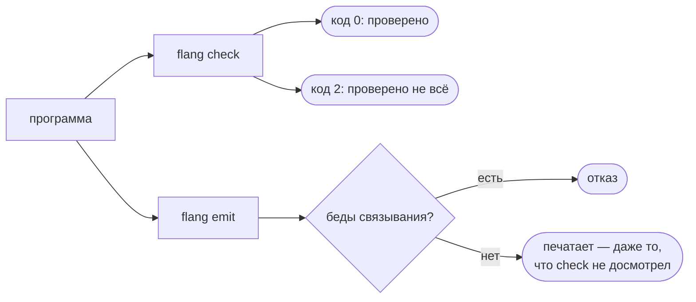

# flang — спецификация

Отсюда берут ТОЧНУЮ формулировку правила языка: какая форма записи допустима,
что обязан отвечать компилятор, какой код диагностики соответствует какой беде и
что обязаны одинаково делать все цели печати. К концу нужного раздела вы сможете
написать проверку на это правило или перенести его в свою реализацию.

**Кому эта страница НЕ нужна.** Она написана для того, кто язык переносит,
проверяет или развивает, и читается как контракт: рядом с формой языка стоят
замеры кадров стека, разбор отвергнутых редакций таблицы и раздел про слои
реализации. Тому, кто пришёл писать на flang, отвечают короче и по делу:

- «Справочник конструкций» — все формы языка подряд;
- «Операции языка» — что чем делается;
- «Учебник» и «Как учить язык дальше» — порядок, в котором это читают.

Само устройство языка в одном абзаце: суммы типов, коллекции, строки как данные,
рекурсия и сопоставление с образцом. Проверяемость держится на трёх обещаниях —
завершение доказывается, обещание о результате проверяется, поведение
напечатанного кода сверяется с вычислителем.

## 1. Два режима — главное архитектурное решение

Полнота по Тьюрингу и гарантия завершения несовместимы. Поэтому язык не
выбирает одно, а разделяет программы на два класса, и класс проверяется
компилятором, а не декларируется в документации.

| | `тотальная` | обычная |
|---|---|---|
| рекурсия | только убывающая: по части значения или по числовой мере с проверкой | любая |
| завершаемость | доказана компилятором | не гарантируется |
| примеры-тесты | гарантированно завершаются | могут зациклиться (тайм-аут) |
| печать на C/Rust/Java/… | да | да, но см. ниже |
| годится для факт-чекинга | да | нет |

Строку о печати надо читать точно. Обычная функция печатается во все
{{цели.словом}} целей — проверено `flang emit --target c` на решении задачи 202,
где из четырёх функций две обычные: печать проходит и отдаёт шесть файлов:

- **печать не ограничена классом** ни в одном бэкенде, и запрещать её было бы
  неверно: обычная функция — законная часть языка, а не полуфабрикат;
- **лимиты воспроизведены во ВСЕХ {{цели.изСловом}} целях.** В C, Go, Rust,
  Python, Java, C#, Elixir и JavaScript незавершающаяся функция упирается в лимит и даёт
  FLANG_RECURSION_LIMIT. Шагом везде считается вход в функцию, оборот цикла
  хвостового самовызова и отскок батута; шаг интерпретатора мельче (замер: в
  19–20 раз на той же работе), поэтому при одинаковом пределе он упирается
  первым, и напечатанный код не объявит исчерпанным то, что интерпретатор
  досчитал. Предел глубины есть везде, включая C, потому что переполнение стека
  в C — падение процесса, а не исключение. В семи целях из восьми совпадают и
  код, и ТЕКСТ отказа;
- **счётчик глубины держит обещание только пока предел НИЖЕ стека хозяина, и стек
  этот теперь отводится под предел, а не достаётся какой есть.** Счётчик считает
  кадры, а несёт их стек, и сколько их влезет, зависит от толщины кадра, то есть
  от программы. Замер холодными процессами (`cc` 15.2, `-O2`, стек 8 МиБ): у
  нехвостовой функции с одним параметром влезает 23 807 кадров (352 байта на
  кадр; `-fstack-usage` объявляет 464 сверху) — запас над объявленными 10 000
  всего двукратный, — а у функции с сорока локальными связываниями только 1 518
  (5 526 байт на кадр, объявлено 5 552). Разница между двумя ПРОГРАММАМИ —
  шестнадцатикратная, и вторая умирала на пределах ПО УМОЛЧАНИЮ: SIGSEGV, без
  кода, без текста, без возможности перехвата, тогда как интерпретатор на том же
  входе отказывает честно. То есть объявленный предел глубины пределом НЕ БЫЛ.

  Закрыто тем же приёмом, которым закрыт Python, и второй половиной сверх него:

  1. **Пробег на потоке с ЯВНО ЗАДАННЫМ стеком, и размер соотнесён с пределом.**
     `fl_stack_wanted(max_depth)` — `max_depth` кадров по 16 КиБ, в границах
     [8 МиБ, 1 ГиБ]. 16 КиБ не с потолка: `cc -fstack-usage` по всем программам
     репозитория (7 896 функций из 157 программ) дал ХУДШИЙ кадр 6 496 байт — у
     самого компилятора flang (`Замены кириллицы` из `self/emit-c.flang`), — и
     16 КиБ несут его с запасом в 2,5 раза. Считать по средней программе было бы
     неверно: предел обещан всем, значит стек обязан нести худшую.

     От компилятора C толщина кадра зависит куда меньше, чем от программы, и это
     тоже замерено: у ОДНОЙ И ТОЙ ЖЕ худшей функции gcc 15.2 даёт 6 496 байт при
     `-O2` и 6 736 при `-O0`, clang 21.1 — 6 424 и 7 480. Разброс между двумя
     компиляторами на шесть мажорных версий врозь и обоими уровнями — 16 %, при
     запасе в 2,1 раза даже по самому толстому из четырёх. Поэтому число здесь
     не подгоняется под свой `cc`, а проверка и вовсе меряет БАЙТЫ настоящего
     кадра в настоящем прогоне: смена компилятора двигает запас, а не обещание.
  2. **Проверка остатка стека в `fl_enter` — там же, где уже сходятся оба предела,
     а не третьим механизмом.** Никакой размер стека не покроет ЛЮБУЮ толщину
     кадра, поэтому вход в функцию сверяет ещё и остаток: запас под последним
     входом считается по самому толстому кадру, который эта программа уже
     показала. Исчерпание переводится в объявленный FLANG_RECURSION_LIMIT с
     текстом про хозяина — дословно тем же, что печатает JavaScript.

  Цена в памяти — адресное пространство, а не расход: при пределе 10 000 поток
  просит 168 МиБ, а резидентно программа берёт ровно столько, сколько кадров
  коснулась (замер: VmSize 224 МиБ, VmRSS 54 МиБ на спуске до 10 000; на мелком
  вызове RSS растёт на 4 КиБ — на управляющий блок потока и только). Цена во
  времени — 0,6 нс на вход в функцию (минимум из семи прогонов по 10 млн входов:
  65,7 нс против 65,1 нс со снятой проверкой), то есть меньше процента самого
  дешёвого входа. Под объявленным пределом адресного пространства стек берёт не
  больше ЧЕТВЕРТИ его — иначе он отнимал бы память у арены, и глубина покупалась
  бы отказом в другом месте (это нашлось замером: под `ulimit -v 16384` восьми
  мегабайт стека хватало, чтобы прогон конкурентности перестал доходить до
  исхода). Где четверти не хватает и на системный минимум, поток не заводится
  вовсе, и обещание держит проверка: отказ объявленный, просто предел ниже.

  Планировщик конкурентности (`emit/c/flang_conc.c`) с этим не спорит, а
  выигрывает: он обнуляет счётчик глубины на каждом пробеге обработчика, а стек
  к тому моменту уже подъеден его собственными кадрами — проверка меряет байты и
  потому прав там, где счётчик кадров был бы слеп.

  **Rust вылечен тем же приёмом.** Поток с заданным стеком там был и раньше, но
  размер стоял константой 512 МиБ и не поднимался вместе с `--max-depth`:
  при 500 000 программа умирала не отказом, а `fatal runtime error: stack
  overflow, aborting`. Теперь стек считается из объявленного предела
  (`rt::stack_wanted`), и в `Ctx::enter` стоит та же проверка. Замер: на той же
  функции с сорока связываниями `--max-depth 500000` теперь ДОСТИГАЕТСЯ, а
  предел, поднятый запросом выше отведённого стеку, даёт объявленный отказ про
  хозяина на глубине около 101 000 вместо аварийного останова.

  **Go этим приёмом не лечится, и это измерено, а не предположено.** У горутины
  нет явного размера стека: он растёт сам, ПЕРЕЕЗЖАЯ на новое место, поэтому
  отметка стека, снятая на входе в расчёт, после первого же переезда не значит
  ничего — проба показала разность то −28 МиБ, то −200 МиБ, то +616 байт на
  монотонно растущей глубине. Проверку по адресам в Go завести нельзя.
  Растущий стек зато снимает вопрос по умолчанию: на той же функции с сорока
  связываниями Go проходит 70 788 кадров (кадр 15,2 КиБ, потолок горутины
  1 ГиБ) и до объявленных 10 000 доходит с семикратным запасом, отказывая
  объявленным текстом. Выше потолка Go остаётся смертельным: `fatal error: stack
  overflow`, и поднять потолок нечем — `debug.SetMaxStack(8 ГиБ)` рантайм
  срезает до 2 ГБ (проверено). Значит про Go честно ровно это: **предел ПО
  УМОЛЧАНИЮ несётся стеком и отказ объявленный; предел, поднятый выше того, что
  несёт горутина, — не несётся, и там Go умирает.**

  Что долг был не про выдуманную программу, видно на самой близкой: **точка
  раскрутки `bootstrap/` — компилятор flang, напечатанный в C, — умирала по
  SIGSEGV на исходнике из вложенных скобок.** `flang_cli check` на файле с 4 000
  уровнями вложенности давал сигнал 11 и код возврата 139, не сказав ни слова;
  та же точка, перепечатанная после починки, отвечает `FLANG_RECURSION_LIMIT:
  функция «Разобрать дизъюнкцию» превысила предел глубины вызовов (20000)` и
  кодом возврата 1. Компилятор, который молча умирает на пользовательском файле,
  — это ровно тот случай, ради которого набор видов отказа и делался закрытым.

  Проверяется всё это сверкой глубины вызовов на худшей форме, а не на средней,
  и с зубами: тот же напечатанный C собирается там ТРЕМЯ способами — как
  печатается (предел 10 000 достигнут), без потока (объявленный отказ про
  хозяина) и без потока со снятой проверкой (SIGSEGV). Последний вариант и есть
  доказательство снятием починки: выломают её — проверка покраснеет, а не
  промолчит;
- **в JavaScript объявленных 10 000 кадров не существовало НИ ДЛЯ ОДНОЙ
  программы, и теперь они есть.** Замер холодными процессами (Node 26.7, стек V8
  по умолчанию): у самой тонкой рекурсивной функции — один параметр, ни одного
  связывания — влезает **7 386 кадров**, у функции с сорока живыми связываниями
  **1 379**, у функции с двумястами **304**. То есть объявленное число не было
  пределом ни при каких условиях: до него не доходила даже тонкая, а отказ
  приходил НЕ ТОТ — текст называл хозяина там, где интерпретатор на том же входе
  называет предел. Это расхождение в НЕбезопасную сторону: напечатанный код
  объявлял исчерпанным то, что интерпретатор досчитывает.

  Рычаг оказался тот же, что в Python и C: **поток с ЯВНО ЗАДАННЫМ стеком** —
  `worker_threads` и `resourceLimits.stackSizeMb`. Замер, сколько кадров несёт
  стек заданного размера, дал 137 Б на кадр у тонкой формы, 733 Б у сорока
  связываний и 3 310 Б у двухсот (линейно, ≈16 Б на живое связывание). Отсюда
  цена кадра в расчёте — **8 КиБ**, вдвое с лишним больше худшего измеренного,
  тем же правилом, каким взяты 16 КиБ у `FL_STACK_PER_FRAME` в C; под
  объявленные 10 000 кадров это 79 МиБ стека. На нём **все три формы доходят до
  предела ЯЗЫКА (10 001) и отказывают объявленным текстом**, включая ту, что до
  починки умещалась в 304 кадра.

  Рычаг работает и на обычном запуске, а не только когда `$callDeep` зовут
  руками: **у цели есть прогонщик** (`src/emit/js/flang_cli.js`, печатается по
  умолчанию, снимается `--no-cli`), и весь прогон идёт в потоке со стеком под
  объявленный предел — ровно как `fl_call_deep` вокруг всего прогонщика в C и
  `rt.call_with_deep_stack` вокруг `serve` в Python. Поток заводится ОДИН на
  процесс, а не один на запрос: он стоит 38 мс, а запросов в трубе сколько
  угодно. Размер стека не считается дважды: он посчитан при печати тем же
  `$stackMb` и приезжает в модуле полем `$PROGRAM.stackMb`.

  Чего у цели по-прежнему нет, и это сказано числом, а не умолчанием:

  - прямой вызов экспортированной функции считает на стеке того, кто позвал:
    рычаг работает через прогонщик либо через `$callDeep`. Ровно так же устроен
    C — библиотека, вызванная мимо `fl_call_deep`, считает на стеке вызывающего;
  - в браузере рычага нет — `worker_threads` там не существует, а стек Worker'а
    не настраивается; прогонщик туда и не едет: он соседний файл, а не часть
    модуля, и модуль без него полон;
  - выше 131 072 объявленных кадров стек упирается в потолок 1 ГиБ (замер: 1 474
    617 кадров у формы с сорока связываниями).

  Везде, где рычага нет, обещание держит проверка: переполнение стека переводится
  в объявленный FLANG_RECURSION_LIMIT — код из закрытого набора, — а текст
  честно называет хозяина, а не предел, до которого не добрались. **Отказ всегда
  объявленный, и он никогда не зависание, не RangeError и не смерть вкладки.**
  Проверяется это той же сверкой глубины вызовов на той же худшей форме, что и
  C, и с теми же зубами: тот же напечатанный модуль зовётся ДВУМЯ способами —
  через `$callDeep` (предел 10 000 достигнут) и прямо (отказ про стек хозяина
  много раньше предела). Второй вариант и есть доказательство снятием починки:
  выломают
  поток — первый сравняется со вторым, и тест покраснеет. То же самое, но уже на
  ОБЫЧНОМ запуске, проверяет сверка прогонщика JavaScript: напечатанный
  каталог запускается настоящим процессом, и рядом стоит тот же вход прямым
  вызовом, который до предела не доходит (замер: 1 354 кадра против 10 001).
  Рассуждение и замеры записаны над самой печатью в JavaScript;
- **для факт-чекинга по-прежнему годится только тотальный класс** — и это
  единственное место, где различие классов обязано соблюдаться, потому что
  система, отвечающая «подтверждено или нет», не имеет права зависнуть.

Ключевое следствие: **декларативная запись правил — объекты, утилиты, правила,
свойства — целиком лежит в тотальном классе по построению.** Ни рекурсии, ни
свободного цикла в ней нет, поэтому доказывать там нечего: завершение следует
из формы.

## 2. Значения

```
Значение := Скаляр | Список | Запись | Вариант
Скаляр   := строка | число | признак | ничто
Список   := [Значение, …]                 однородный
Запись   := { поле: Значение, … }         именованные поля
Вариант  := Имя(Значение?)                конструктор суммы типов
```

Числа — IEEE-754 double: расхождение по арифметике с уже напечатанным кодом
недопустимо, а {{цели.словом}} целей печати умеют именно этот вид числа. Точный
натуральный тип `неотрицательное` (раздел 3) НОВОГО ВИДА ЗНАЧЕНИЯ НЕ ЗАВОДИТ: его значения —
те же double, и восемь исполнителей о нём не знают ничего.

## 3. Типы

```
Тип := строка | число | неотрицательное | целое | признак | ничто
     | список Тип
     | «Имя объекта»          запись
     | «Имя типа»             сумма
     | «Имя типа» от Тип и Тип   применение параметрического типа
     | «Имя параметра»        параметр типа внутри своего объявления
     | ( Тип )                скобки (читаемость; применение и так правоассоциативно)
     | функция из Тип и Тип в Тип   тип функции (она же — значение)
     | Тип → Тип              он же, стрелочной записью
```

### Точное натуральное: `неотрицательное` и `целое`

Три числовых имени, вложенных друг в друга (четвёртое, `вес`, — в следующем
разделе):

```
неотрицательное ≤ целое ≤ число
```

`неотрицательное` — целое из отрезка [0, 2^53−1]; `целое` — целое из
[−(2^53−1), 2^53−1]; `число` — любое конечное double. Это УТОЧНЕНИЯ, а не
новые виды значения: носитель у всех трёх один, и всё, что принимало `число`,
принимает его по-прежнему.

Подтипизация направленная и работает только на втекании значения в объявленную
позицию (аргумент, тело против `возвращает`, элемент списка, поле варианта,
накопитель свёртки). Список ковариантен: `список неотрицательное` годится там, где ждут
`список числа`. Запись, сумма и функция остаются инвариантными.

Границы выводятся интервальным анализом: целый литерал знает себя точно,
сложение и умножение считают отрезок по отрезкам операндов, сравнение имени с
числовым литералом в `если` кладёт границу на ветвь, `длина` и `код символа`
натуральны по построению. **Переполнение расширяет тип, а не отказывает**:
сумма, про которую не видно, что она укладывается в точную сетку double,
перестаёт быть целой и становится `число`. Проверки переполнения в
напечатанном коде нет — её роль играет расширение.

Чего `неотрицательное` НЕ делает: `делить` натурального не даёт (деление в flang —
IEEE-деление); накопитель свёртки не уточняется (его тип обязан быть
тем значением, на котором цикл останавливается, а объявить его негде); границы
читаются только из
сравнений имени с ЛИТЕРАЛОМ, но не имени с именем.

Зачем это нужно — раздел «Тотальность»: объявленный `неотрицательное` даёт убыванию и дно
(0), и потолок (2^53−1), внутри потолка `н минус c` при целом c ≥ 1 точен, и
постоянный шаг доказывается СТАТИЧЕСКИ — проверка в рантайме для этого класса не
печатается вовсе. В отчёте о доказательствах это пятый носитель обещания,
«точным шагом».

### Отрезок с бесконечностью: `вес`

`вес` — неотрицательное число, у которого **`+∞` есть значение, а не край**:
отрезок [0, +∞]. Пишется пятью поверхностями — `вес`, `стоимость`, `weight`,
`pezo`, `权重`. Уточнение, не новый вид значения: носитель тот же IEEE-754
double, и `+∞` в нём уже есть — все {{цели.словом}} целей печати давно умеют её
записывать.

Вкладывается так: `неотрицательное ≤ вес ≤ число`. `число` в `вес` НЕ втекает, и это его
главное свойство: у `число` дна нет вовсе, значит в нём живут и отрицательные,
и «не число».

Зачем: стоимости, расстояния, таймауты, ёмкости — везде, где «бесконечность»
значит «недостижимо» или «без предела». Обычная замена — предельное число
(−1, ноль, 999999) — плоха тем, что участвует в арифметике наравне с
настоящими: −1 побеждает минимум, ноль объявляет недостижимое бесплатным,
999999 однажды складывается с другим таким же. `+∞` ведёт себя правильно сама:
поглощает при сложении, нейтральна для минимума, больше всякого числа.

**Что на весе разрешено, и почему именно это.** Список закрыт и обоснован
вычислением (сверка бесконечности, раздел УЛИКА):

| действие | что с ним |
|---|---|
| `плюс` | замкнуто: сумма двух значений из [0, +∞] снова в [0, +∞], переполнение даёт `+∞`, а не отрицательное |
| `делить` | только при **конечном положительном делимом**: ни `0 / 0`, ни `∞ / ∞` таким делимым не образуются. Это единственная дверь, которой записывается сама бесконечность: `1 делить на 0` |
| порядок, равенство | значений не производят, разрешены |
| `минус` | `FLANG_INFINITY`: `0 − 1 = −1` вне отрезка, `∞ − ∞` — не число |
| `умножить на` | `FLANG_INFINITY`: `0 × ∞` — не число |
| `делить на` (вес на вес) | `FLANG_INFINITY`: `0 / 0` и `∞ / ∞` — не число |
| `остаток от` | `FLANG_INFINITY`: `∞ остаток от 5` — не число |
| `процентов от` | `FLANG_INFINITY`: это умножение, ломается той же парой |

Соглашение теории меры `0 · ∞ = 0` спасло бы замкнутость умножения и **не
взято**: оно потребовало бы перехвата операции в рантайме у {{цели.изСловом}}
целей, то есть носитель перестал бы быть тем же double — ради одной пары
значений.

**Какой моноид на нём есть, а какого нет.** Есть моноид **минимума** (единица
`+∞`) и **максимума** (единица `0`): обе операции ВЫБИРАЮТ операнд и потому не
округляют, ассоциативны точно, и обе единицы лежат внутри типа. Моноида по
СЛОЖЕНИЮ нет, и язык это предъявляет отказом сборки:

```
FLANG_MONOID_ASSOC: моноид «Сумма»: операция не ассоциативна:
  на 0.1, 0.1, 0.6 слева вышло 0.8, справа 0.7999999999999999
```

Тот же отказ дословно приходит и на носителе `число`. Это не совпадение, а
суть дела: ассоциативность ломает ОКРУГЛЕНИЕ, а не «не число», и убрать из
структуры вычитание — значит убрать NaN, а не округление. Сложение остаётся в
типе как замкнутая монотонная операция и как то, над чем минимум дистрибутивен
точно (`a + min(b,c) = min(a+b, a+c)`) — это тропическое полукольцо, то есть
буквально кратчайший путь.

**Как из типа выйти.** Доказать конечность проверкой: `если д не больше 100`
сужением снимает признак вместе с бесконечностью, и внутри такой ветви
вычитание законно. Отказ снимается доказательством, а не приведением типа.

**Цена, которую надо назвать.** Литерала `+∞` в языке нет: записать её можно
только выражением, а `ожидается …` в примере принимает значение. Поэтому
утверждения о недостижимости пишутся косвенно — сравнением, которое верно для
неё и ложно для всякого числа (`examples/paths/shortest-path.flang`).

Ядру доказательства объявленный `вес` даёт факт «не меньше 0» — тот же, что
даёт `неотрицательное`, — и это не аксиома, а вывод из объявленного дна и проверки типов
(правило `сДномПоТипу` при сведении цели). Прирост, который объявленный `вес`
даёт ядру, измерен отдельно и записан там же.

### Точное десятичное: `сотых` и `тысячных`

Деньги, доли и проценты. Значение — ЦЕЛОЕ ЧИСЛО МИНОРНЫХ ЕДИНИЦ: рубль
пятьдесят это `150` типа `сотых`, десятая доля — `10`, две десятых — `20`, и
`10 плюс 20` равно `30` ТОЧНО. Это то же самое уточнение, что `неотрицательное`, плюс одно
число — МАСШТАБ:

```
сотых     = целое из [0, 2^53−1], толкуемое как сотые доли
тысячных  = то же, тысячные
```

Почему не пара «мантисса + масштаб» и не дробь из двух целых: то и другое —
НОВЫЙ ВИД ЗНАЧЕНИЯ, который увидели бы {{цели.словом}} целей печати, протокол
JSON, мост наследия и сверка самоприменения байт в байт. Целое число минорных
единиц не видит никто: `kind` остаётся `"number"`, носитель — тот же double, в
JSON едет то же число. Довод тот же, по которому `неотрицательное` сделан уточнением, и
здесь он сильнее.

Что чинится этим типом — вычисление, а не рассуждение: на `число` `0.1 плюс 0.2`
даёт 0.30000000000000004, `(0.1 плюс 0.2) плюс 0.3` — 0.6000000000000001, а
`0.1 плюс (0.2 плюс 0.3)` — 0.6, то есть одно выражение в разном порядке даёт
два ответа.

Масштаб ведёт себя как ЕДИНИЦА ИЗМЕРЕНИЯ, а не как границы:

| действие | масштаб результата |
|---|---|
| `плюс`, `минус` | общий; разошлись — `FLANG_SCALE` |
| `умножить на` | сумма масштабов (сотые на сотые — десятитысячные) |
| `остаток от` | масштаб левого |
| `делить на` | теряется: рубли, делённые на рубли, безразмерны |

Точно известное значение (литерал) годится в любом масштабе: `цена плюс 50` —
это «плюс пятьдесят копеек». Переполнение ловится тем же расширением, что у
`неотрицательное`: за 2^53−1 теряется целость, а вместе с ней и масштаб.

Надевается масштаб РОВНО В ОДНОМ МЕСТЕ — в подписи: `принимает сумма: сотых` и
`возвращает сотых`. Второе пропускает только целое внутри точной сетки:
полкопейки копейкой не бывает. Аргумент вызова масштаба не надевает — иначе
`«Итог» от количество` перестало бы быть ошибкой.

Ядро доказательства читает с этой подписи ТРИ факта: дно 0, потолок 2^53−1 и
ЦЕЛОСТЬ. Третий — новый, и он несёт вес: правило `а остаток от Л` лежит в
[0, Л−1] верно только для целого `а` (`5.5 остаток от 2` равно 1.5).

#### Деление: решение названо, а не умолчано

Одна треть в десятичной записи не записывается — ни в двух знаках, ни в трёх, ни
в скольких угодно. Значит у деления в точном типе есть ровно три исхода, и
выбран из них ОДИН:

| | что делает | цена |
|---|---|---|
| **выбрано: деление ВЫВОДИТ из точного типа** | результат `делить` перестаёт быть целым, а вместе с целостью теряет масштаб: тип становится `число` | денежная функция с делением возвращает `число`, и сложить её результат с деньгами можно только через функцию с объявленным возвратом. Три функции из девяти в `examples/money/exact-decimal.flang` именно такие |
| запретить деление на точном типе | `делить` на `сотых` — ошибка сборки | ломает существующие программы: `делить` принимает `число`, а `сотых` в него втекает. И запрет ничего не даёт: обойти его тривиально одной обёрткой |
| округлять к сетке масштаба | `делить` на `сотых` округляет результат к целой копейке | меняет СЕМАНТИКУ `делить` — то есть поведение восьми рантаймов, `flang/core`, моста наследия и сверки самоприменения байт в байт. Ровно то, чего уточнение типа избегает по построению |

**Что вместо деления, когда копейки терять нельзя.** Деление С ОСТАТКОМ, где
остаток не выбрасывается, а возвращается второй функцией: «Доля при дележе» и
«Копеек в неделимом остатке». Сто копеек на три части — это 33 каждому и одна
копейка неделимого остатка, и `33 · 3 + 1 = 100` ТОЧНО. Проверено вычислением на
501 сумме и шести делителях (сверка точного десятичного).

Округления в языке нет ни явного, ни молчаливого: то, что нельзя разделить
нацело, остаётся видимым остатком. Это и есть разница между «потерял копейку» и
«знает, где копейка».

Чего точное десятичное НЕ делает сверх этого: знаковых денег (возврат, сальдо)
нет — оба имени неотрицательны, как `неотрицательное`.

### Функции первого класса

**Функция является значением.** Ограничение снято, и снято способом, который
ничего не стоит ни печати, ни доказуемости, — **снятием функций-значений**
(Reynolds, 1972). Значение-функция это ТЕГ: `функция «Удвоить»` не строит
замыкания, а называет объявленную функцию, а применение `ф от 5` — это
`применить(тег, 5)`, один диспетчер с конечным списком случаев.

```flang
тотальная функция «Применить дважды»
  принимает ф: функция из числа в число, х: число
  возвращает число
  ф от (ф от х)

тотальная функция «Проба»
  возвращает число
  «Применить дважды» от функция «Удвоить» и 5
```

Что это сохраняет:

- **печать в {{цели.словом}} целей.** У пяти из них нет замыканий в том виде,
  что есть
  в JS. Тег и `switch` есть у всех восьми;
- **доказуемость завершения.** При настоящем высшем порядке «кто кого зовёт»
  неразрешимо. После снятия функций-значений граф вызовов конечен и известен
  целиком, и структурный анализ работает как прежде (анализ завершаемости).

Цена названа честно и уплачена заранее: снятие функций-значений требует видеть
ВСЮ
программу, а раздельной компиляции у языка нет и не планируется. Отсюда же
правило времени выполнения: применить можно только тот тег, который программа
где-то строит формой `функция «Имя»`. Тег, поданный снаружи через `evaluate` и
нигде не построенный, отвергается кодом `FLANG_APPLY` — у диспетчера нет такого
случая. Напечатанный код отвергает его тоже, но своими словами: случая нет и у
напечатанного `разбор`, и отказ приходит кодом `FLANG_MATCH_NOT_EXHAUSTIVE`.
Это единственное место, где напечатанное и интерпретатор расходятся текстом
отказа, и почему иначе не выходит — в `flang/cat/HOF.md`. Без самого правила
тотальность можно было бы обесценить законным по типам значением (комбинатор Ω
выражается на одних тотальных функциях — там же).

**Что из этого сделано.** Разбор, проверка типов, анализ завершаемости,
вычисление интерпретатором — и печать во все {{цели.словом}} целей:
снятие функций-значений сделано одним проходом перед печатью
(отдельный проход понижения), после которого программа снова первопорядковая, а
бэкенды печатают её теми же узлами, что и всегда. Напечатанное собрано
настоящими тулчейнами и сверено с интерпретатором на сетке входов
(сверка печати функций-значений).

Слои `self/` новой формы по-прежнему не знают, поэтому ни одна программа
репозитория — включая `stdlib` и `examples` — ею не пользуется и пользоваться не
вправе, пока `self/` не научится: набор сверки с flang₁ собирается по маске
каталога. Порядок оставшихся фаз — `flang/cat/HOF.md`.

Встроенные формы `отобразить` / `отфильтровать` / `свёртка`, принимающие
**тело**, а не функцию, никуда не деваются: они короче и не требуют объявлять
функцию ради одного выражения.

### Суммы типов

```flang
тип «Токен»
  вариант Слово содержит текст: строка
  вариант Число содержит значение: число
  вариант Конец
```

### Коллекции

```flang
тип «Строка счёта» это список «Позиция»
```

### Параметрические типы

Объявление вводит параметры словом `от`, применение подставляет их тем же
словом. Новых ключевых слов нет: `от` и `и` уже заняты языком, значит ни одно
имя в существующих исходниках не перестаёт разбираться. Подробности и
обоснование — `flang/cat/POLY.md`.

```flang
тип «Возможно» от «А»
  вариант «Есть» содержит значение: «А»
  вариант «Ничего»

объект «Пара» от «Первый» и «Второй»
  первое: «Первый»
  второе: «Второй»

тотальная функция «Обернуть» от «А»
  принимает значение: «А»
  возвращает «Возможно» от «А»
  вариант «Есть» с значение равным значение
```

Параметры функции объявляются, аргументы при вызове **выводятся** из типов
значений — писать их негде и незачем. Тип при печати в целевые языки
**стирается**: все {{цели.словом}} бэкендов уже печатают одно представление
значения, и `«Возможно» от числа` со `«Возможно» от строки` дают одну фабрику
варианта.

### Монада и форма `в монаде`

Монада объявляется НА параметрическом типе и называет две функции — η и μ.
Отображение эндофунктора не объявляется: у полиномиального функтора оно ровно
одно, и компилятор выводит его из устройства типа.

```flang
монада «Возможно» от «А»
  возврат «Обернуть»
  соединение «Сплющить»

тотальная функция «Итог со скидкой»
  принимает номер: число
  возвращает «Возможно» от числа
  в монаде «Возможно»
    пусть цена равно «Цена позиции» от номер
    пусть скидка равно «Скидка по цене» от цена
    возврат цена минус скидка
```

Каждое `пусть` — связывание, `возврат` — последняя строка блока. Форма
**разворачивается компилятором внутри разбора** в вызовы объявленных `возврат` и
`соединение` поверх `разбор` по вариантам типа, поэтому в AST её нет и все
последующие слои — типы, завершаемость, {{цели.словом}} бэкендов, самоприменение
— о ней не знают. Функций первого класса форме не нужно: тело продолжения
известно синтаксически и печатается на месте, а не заворачивается в значение.

Устройство монады доказывается сличением объявлений, три закона связывания
проверяются на конечной сетке. Подробности, счёт занятых слов и границы —
`flang/cat/MONAD.md`.

## 4. Синтаксис

Отступный, без скобок. Поверхностей четыре — русская, английская,
эсперантская и китайская, — все равноправны и компилируются в один AST. Слова
берутся из одной таблицы (`SURFACE_TABLE` в разборе языка), поэтому парсер не
знает, на каком языке написан исходник; знает это только диагностика, чтобы
цитировать слова той поверхности, на которой файл написан.

Поверхность не обязана быть полной. Из 151 понятия таблицы на всех четырёх
поверхностях открыты 134; у остальных 17 на какой-то из поверхностей слова нет,
и это записано в самой таблице поимённо с причиной: выбор слова в языке —
решение владельца, а не подстановка из словаря. Файл на такой поверхности пишет
недостающее понятие словом другой (`examples/surfaces`).

У китайской поверхности пробелов внутри фразы нет — слово там всегда один
токен, — а полноширинные `：` `，` `（` `）` делят поток наравне с пробелом и
значат ровно то же, что `:` `,` `(` `)`.

### Примечание — причина термом, а не комментарием

Иногда у поведения есть причина, которой из кода не прочесть. Комментарий для
неё не годится: он не разбирается, не проверяется и в дереве его нет вовсе.
Поэтому причина пишется **термом языка**:

```flang
примечание "на минус нуле обе стороны сравнения ложны, поэтому ветвей две"

тотальная функция «Чётное»
  принимает н: число
  возвращает признак
  …
```

Стоит терм **у левого края, между объявлениями**, и в выражения не попадает:
объяснить строку внутри функции им нельзя. Несёт он ровно две вещи — **причину
строкой в кавычках** и **своё место** (строка и столбец). Имени у него нет и не
предполагается: у причины нет имени, есть место, а место — это данные, читаемые
из исходника, а не выдумка. По месту и отвечает вопрос «к чему относится»:
примечание объясняет то, что стоит за ним следом.

Причина пишется строкой в кавычках, а не именем в ёлочках: ёлочки в языке —
имена, а причина именем не является. Строка в кавычках даёт заодно
экранирование — кавычку, обратную косую, перевод строки.

Ни типа, ни значения у терма нет: он ничего не вычисляет и обязательств не
порождает. Ядро доказательств его не видит, и **в напечатанный код он не
едет** — ни в одну из целей.

### Функция

```flang
тотальная функция «Длина»
  принимает элементы: список числа
  возвращает число
  разбор элементов
    случай пусто
      то 0
    случай голова и хвост
      то 1 плюс «Длина» от хвоста
```

`тотальная` требует, чтобы каждый рекурсивный вызов получал структурно меньший
аргумент (хвост списка, поле варианта) либо параметр, уменьшенный на постоянный
шаг и ограниченный снизу. Постоянным шагом годится и число (`н минус 1`), и
другой параметр (`н минус ш`), если он приезжает в вызов неизменным и про него
известно `ш больше 0`. Не доказал — ошибка `FLANG_NOT_TOTAL`.

У доказательства по числовой мере есть одна опора вне формы программы: числа —
IEEE-754 double, и при большом |x| шаг `x минус 1` не меняет x. Поэтому
компилятор доказательством не ограничивается: на каждый доказанный мерой вызов
он вставляет проверку убывания. Не убыло — `FLANG_MEASURE`, одинаковый у
вычислителя и у всех {{цели.изСловом}} целей. Ни на одном входе `тотальная` не
зацикливается: она либо завершается, либо отказывает.

#### Объявленная мера

Постоянный шаг покрывает не всё. У Евклида шаг `а остаток от б` зависит от
значения, у деления пополам — `(низ плюс верх) делить на 2`; убывание там есть,
но оно не в форме вызова, а в арифметике, и вывести его нечем. Такую меру
называет автор:

```flang
тотальная функция «НОД»
  принимает а: число, б: число
  возвращает число
  убывает б
  если б равен 0
    то а
    иначе «НОД» от б и (а остаток от б)
```

`убывает` стоит между `возвращает` и телом, разбирается в области видимости
одних параметров (сослаться на связку из тела мера не может) и обязана быть
числом. В цикле мера объявляется у **каждой** функции: она доказывает цикл
целиком или не доказывает его вовсе.

Пробуется мера последней — после структурного убывания и после постоянного
шага. Объявить её там, где доказывает структура, не значит начать платить за
проверки.

Проверяется мера тем же приёмом, что и мера постоянного шага, и по той же
причине: анализ проверяет форму обещания, а само обещание — проверка на каждом
витке. Условий у него три:

| Условие | Зачем |
|---|---|
| мера строго убыла | равенство цепочку не обрывает |
| мера не ниже нуля | без дна цепочка уходит в минус бесконечность |
| мера целая | строгое убывание с дном цепочку НЕ обрывает: 1, ½, ¼ … больше нуля всегда. Целая мера даёт честную оценку сверху — не длиннее своего первого члена |

Целость — не придирчивость. Именно на ней держится отказ от Евклида над
вещественными числами: остатки пары (φ, 1) — 0.618, 0.382, 0.236 … — убывают
строго, ограничены снизу и не кончаются никогда. `«НОД»` от целых работает
всегда, `«НОД»` от (φ, 1) отказывает с `FLANG_MEASURE` на первом же витке.

Доля обещания, проверенная до запуска, у объявленной меры меньше, чем у
постоянного шага. Договор при этом прежний: `тотальная` значит «завершается
либо честно отказывает».

### Выражения

```
пусть имя равно выражение          локальное связывание
если условие то выражение иначе выражение
разбор выражения / случай …        сопоставление с образцом
«Имя функции» от аргумента         вызов по имени
функция «Имя функции»              функция как значение (тег)
значение от аргумента              применение значения-функции
поле записи                        доступ
Вариант с поле равным выражение    конструктор
```

`от` в двух ролях различается позицией, как и `от` в типе: слева от него либо
имя функции (оно не связано ничем локальным и пишется с прописной) — тогда это
вызов, — либо значение (связанное имя, поле, результат применения) — тогда это
применение. Спутать нельзя: имя функции локальным связыванием не бывает.

#### Запятая закрывает поля конструктора, `и` их продолжает

Поля конструктора продолжает **только `и`**. **Запятая их закрывает всегда** —
она принадлежит списку, и другого смысла у неё нет:

```flang
[вариант «М» с а равным 1 и б равным 2]   один элемент, два поля
[вариант «М» с а равным 1, б равен 2]     два элемента: он и сравнение
```

Правило существует потому, что иначе литерал НЕОДНОЗНАЧЕН. `равным` и `равен` —
одно и то же слово языка; пока запятая разделяла и поля, и элементы, обе строки
выше читались двояко, и выбирать чтение приходилось догадкой. Догадка убрана
разделением знаков, а не улучшением догадки: оба чтения записываются, ни одно
не угадывается.

Разделить пришлось именно запятую, потому что она дешевле. Цена мерялась
разбором всех программ репозитория до и после — 149 на тот день, 91 на flang и
58 на поверхности наследия, которую читает тот же разборщик: запятая продолжала
поля в семи местах двух файлов, и ни одного такого места не было внутри
списочного литерала — значит ни одна программа не сменила смысл молча, обе
отказали вслух, а после переписи семи мест на `и` деревья всех 149 совпали узел
в узел. Дерево с тех пор выросло; замер этот — про тот прогон, а не про
сегодняшний счёт файлов.

Другие пути стоили дороже. Обязательные скобки вокруг конструктора-элемента:
элементами списка стоят 502 конструктора в 21 файле, 440 из них уже в скобках —
переписывать пришлось бы 62 места в 9 файлах. Отдельный знак между полями: 1665
конструкторов в 45 файлах. Разбор по объявленным именам полей не переписал бы
ничего, но и неоднозначности бы не снял: он лишь заменил бы одну догадку
другой, и разбор файла стал бы зависеть от того, что подключено
(`подключить`).

`и` остаётся у полей и у аргументов вызова сразу, и разводится оно
заглядыванием на два токена: поля выигрывают, только если дальше `имя равным`.
Чтобы передать конструктор не последним аргументом, его берут в скобки.

### Имена и падежи — важное правило

Правило одно и держится с самого начала: **компилятор намеренно не угадывает
грамматические падежи имён** (`docs/site/language.ru.md`), поэтому в
`10 процентов от поля сумма` имя стоит без изменения формы.

По-русски конструкции вида `«Длина» от хвоста` и `разбор элементов` просятся в
родительном падеже, и писать `от хвост` было бы насилием над языком, ради
читаемости которого всё и затевалось. Поэтому flang делает **один шаг дальше,
но не превращает это в угадывание**:

- имя ищется в области видимости **точным совпадением**;
- если точного нет — сопоставление по неизменяемой основе среди **уже связанных
  локальных имён** (параметры, `пусть`, привязки образцов);
- совпало ровно одно — связываем; совпало несколько — ошибка
  `FLANG_AMBIGUOUS_NAME` с перечислением кандидатов; не совпало ничего —
  `FLANG_UNKNOWN_NAME`.

Правило действует **только для локальных имён**. Имена функций, типов, вариантов
и полей записей — строго точные: они часть контракта, и их склонение сделало бы
диагностики непредсказуемыми.

Такой разбор остаётся детерминированным: неоднозначность — ошибка, а не выбор
наугад. Остальных трёх поверхностей правило не касается: склонений нет ни в
английском, ни в эсперанто, ни в китайском.

Арифметика: `плюс`, `минус`, `умножить на`, `делить на`, `остаток от`,
`процентов от`. Сравнения: `равен`, `не равен`, `больше`, `меньше`,
`не больше`, `не меньше`.

Логика: `не`, `и притом`, `или`. Приоритеты, от самого слабого к самому
крепкому:

```
или  <  и притом  <  не  <  сравнения  <  плюс минус  <  умножить делить  <  от  .
```

Значит `не а и притом б или ц` читается `((не а) и притом б) или ц`, а `не х
равен 1` — это `не (х равен 1)`.

Конъюнкция названа СОСТАВНЫМ словом, а не голым `и`, и это часть контракта, а не
украшение: `и` разделяет аргументы вызова, а арность вызываемой функции
разборщику неизвестна (объявление законно стоит ниже вызова, импортированное имя
приезжает без арности). Поэтому:

```flang
«Оба верны» от а и б          // ДВА аргумента
«Оба верны» от а и притом б   // ОДИН аргумент, и вся запись — конъюнкция
```

Правил разрешения при этом ноль: `и притом` — один токен, склеенный лексером,
и со списком аргументов он не пересекается вовсе.

Все три записи разворачиваются в `если` (`а и притом б` → `если а то б иначе
нет`), поэтому правый операнд не вычисляется, когда левый всё решил, а операнды
обязаны быть признаками — этого требует уже само `если`.

Эсперантской поверхности у `не` нет: `ne` в таблице занято литералом `нет`.

Цена слова названа прямо: `не`, `или`, `not`, `or`, `aŭ`, `и притом`, `and
also`, `kaj ankaŭ`, `并且`, `或者`, `非` больше не бывают именами. В репозитории
голых вхождений ни у одного из них не было (проверено токенизацией всех файлов
`.flang` и `.fts` дерева, каких было 150 на день замера), но в чужом файле
`принимает или: число` перестанет разбираться. Фраза `к числу или беда` при этом
цела: склейка идёт от длинной к короткой, и четыре слова бьют одно.

### Строки как данные

`длина`, `символ … в …`, `разложить … на символы`, `код символа …`,
`символ по коду …`, `подстрока … с … по …`, `соединить … с …`,
`разделить … по …`, `содержит`, `начинается с`, `к числу`, `к числу или беда`,
`к строке`.

Образцы `пусто` и `голова и хвост` разбирают не только список, но и СТРОКУ:
у неё ровно два случая — пустая либо «первый символ и остаток», третьего нет.
Голова строки — строка из одной кодовой точки, хвост — строка из остальных;
отдельного типа символа в языке нет. Рекурсия по такому хвосту доказывается
структурно, как и по хвосту списка, поэтому посимвольный проход по строке
теперь пишется без смены сигнатуры:

```flang
тотальная функция «Обратно»
  принимает текст: строка
  возвращает строка
  разбор текст
    случай пусто
      то ""
    случай голова и хвост
      то соединить («Обратно» от хвост) с голова
```

`код символа СТРОКА` даёт кодовую точку ПЕРВОГО символа строки числом —
единственный мост из строк в числа. Пустая строка прекращает вычисление отказом
`FLANG_BUILTIN_ARGS`; проверить её заранее стоит одного `случай пусто`.

Форма из двух слов, а не из одного: одинокое «код» — рабочее имя (одно только
`случай вариант «Не разобрано» с код как код` из этой же спецификации), и занять
его значило бы сломать чужой код. Счёт голых вхождений — 226 против нуля у
пары — под тестом разбора слов.

Берётся именно первый символ, а не «ровно один»: `голова` строки, элемент
`разложить … на символы` и `символ N в …` уже дают ровно один символ, а на всём
остальном «первый» — это в точности `символ 1 в …`. Деление по кодовым точкам,
как и везде: эмодзи даёт одно число, а не два суррогата.

`символ по коду ЧИСЛО` — обратная форма, и она ЕСТЬ. Даёт строку ровно из
одного символа: `символ по коду 1052` это `"М"`, `символ по коду 128512` это
`"😀"` — одна кодовая точка, а не пара суррогатов.

Здесь стояло «обратной формы нет; она не нужна ни хешу, ни порядку». Первая
половина довода верна и сегодня: обе эти дороги идут из строк в числа и обратно
не возвращаются. Неверна вторая — что других дорог нет. В СЕТИ кодовая точка
приезжает ЧИСЛОМ СНАРУЖИ: `%D0%9C` в адресе — это байты 208 и 156, из них
складывается 1052, и другого пути к букве не существует. Пока формы не было,
раскодирование адресов в `flang/stdlib/http.flang` доводило до символа 95
кодовых точек из 1 114 112 и называло это пределом языка; браузер не мог
говорить с собственной службой дерева — три кириллических маршрута из трёх
отвечали 404.

**Отказывает форма в четырёх случаях, и все четыре — `FLANG_BUILTIN_ARGS`:**
не число; не целое; вне отрезка [0, 0x10FFFF]; половина суррогатной пары
(0xD800…0xDFFF). Множество отказов языка форма не расширяет — вид отказа тот же,
что у девяти остальных частичных форм (десятая — `соединить` на стыке, где две
половины пары слились бы в один знак: «У строки одна мера — знаки» ниже).

Суррогат отвергается не из строгости. Язык обещает у {{цели.изСловом}} целей
печати ОДИНАКОВЫЕ значения, а строка в C, Go, Rust и Elixir — это UTF-8, где
половина пары не записывается по определению кодировки: `char::from_u32(0xD800)`
в Rust отдаёт `None`, `string(rune(0xD800))` в Go отдаёт U+FFFD. Пропустить её
значило бы: три цели дают значение, четыре — нет. Отказ же одинаков у всех
восьми. И по самому Unicode суррогат символом не является: скалярное значение
(D76) — это любая кодовая точка, кроме половины пары, и таких значений 1 112
064.

Плата за это названа здесь, а не в диагностике: отрезок допустимых кодов
получил дырку посередине, а уточнение числа умеет говорить «целое из
[низ, верх]» и не умеет «из [низ, верх] мимо дырки». Поэтому
`символ по коду (код символа знак)` доказать типом нельзя — тип `код символа`
есть весь отрезок [0, 0x10FFFF] и дырку накрывает. Доказываются литералы,
объявленные отрезки и арифметика над ними.

Возвращается СТРОКА, а не отдельный вид значения: скалярного типа для одного
знака у языка нет, и заводить его ради одной формы значило бы добавить пятый вид
значения во все {{цели.словом}} целей. `разложить … на символы` уже раскладывает
строку в список односимвольных строк, `символ N в …` тоже отдаёт строку.

Что этой формой стало выразимо, и почему она вообще появилась: **порядок на
строках и хеш строки — оба пишутся НА ЯЗЫКЕ и оба доказываются тотальными**.
Сравнения `больше`/`меньше` по-прежнему допустимы только для чисел, и девятой
реализации `compare` в рантайме не завелось: лексикографический порядок это
рекурсия по хвосту строки, и живёт он в библиотеке, где его видно и можно
проверить примерами (`flang/stdlib/tree.flang`, «Строка раньше»). На нём же
стоит первый в языке словарь с логарифмическим доступом — дерево поиска с
приоритетом по хешу ключа, замер — в сверке библиотеки.

`разложить … на символы` раскладывает строку в список односимвольных строк —
по кодовым точкам, как и всё остальное здесь. Форма из двух частей, а не одно
слово «символы»: ключевое слово запрещает имя, а «символы» в роли имени
переменной встречается — резервировать его значило бы сломать существующий код.
Форма заведена не ради краткости: без неё
посимвольный проход идёт по индексу, убывает «размер минус позиция» — а такое
выражение анализ завершаемости мерой не признаёт: постоянного шага у него нет.
С ней тот же проход становится рекурсией по хвосту списка и доказывается.
Пустая строка даёт пустой список.

### У строки одна мера — знаки

**Все формы над строкой считают ЗНАКИ, то есть кодовые точки.** Это относится и
к тем трём, что ищут подстроку: `содержит`, `начинается с` и `разделить … по …`
признают вхождение только там, где оно не разрезает знак пополам. Иначе меры
было бы две, и всякое утверждение, сшитое из форм разных мер, оказалось бы
ложным на первом же входе, где меры расходятся.

Расходиться меры могут на всяком значении, которое хранение показывает, а
Unicode знаком не считает.

У целей с UTF-16 (JavaScript, Java, C#) это ОДИНОКАЯ ПОЛОВИНА СУРРОГАТНОЙ ПАРЫ.
Такая половина кодовой точкой является (`код символа` даёт у неё 55296…57343), а
знаком Unicode — нет, и внутри языка её не построить: `символ по коду` на
суррогате отказывает, а `\uXXXX` в исходнике до него не доходит. Приезжает она
только снаружи.

У целей, где строка — октеты (C, Go, Elixir), это ВСЯКАЯ ПОСЛЕДОВАТЕЛЬНОСТЬ
ОКТЕТОВ, не складывающаяся в UTF-8. Здесь стояло, что такого значения там нет
вовсе; это неверно, и опровергнуто прогоном 22 августа 2026. Строка в этих целях
— произвольные октеты, и негодные приезжают тем же путём, что и половина пары:
доводом командной строки (`--args`), из файла, от процесса, куском TCP. На
стволе `«мама» содержит` октеты `BC D0` отвечало «да», хотя ни один знак «мамы»
им не равен; `«мама» начинается с` октета `D0` — «да», хотя её первый знак «м»;
`разделить «маму»` по тому же октету давало пять кусков по половине знака.

**Где начинается знак — один ответ на все формы.** Первый октет строки начинает
знак всегда, дальше начинают все, кроме октетов продолжения (старшие биты `10`).
По этому делению считает `длина`, режет `разложить … на символы`, адресуют
`подстрока` и `символ … в …`, разбирают образцы `пусто` и `голова и хвост`. Иначе
строка из одних октетов продолжения оказывалась бы «длиной 0» и «пустой»,
оставаясь непустой по содержимому, — и на стволе так и было.

Платы за это нет там, где её ждут: на правильном UTF-8 и на правильном UTF-16
байтовый поиск и поиск по знакам дают одно и то же. У целей с UTF-16 обход границ
включается только у искомого с РАЗОРВАННЫМ краем (начинается низкой половиной
пары или кончается высокой), у прочих поиск остался прежним. У целей с октетами
края найденного вхождения сверяются с границами знака всегда, и стоит это двух
сравнений октета на удачное совпадение: у октетов, в отличие от единиц UTF-16,
знак бывает длиной до четырёх, и «целое искомое» ещё не значит «целое место».

**`соединить` — единственная форма, где представление не может пойти за мерой.**
Если левая строка кончается высокой половиной пары, а правая начинается низкой,
в UTF-16 они слились бы в ОДИН знак: два знака на входе, один на выходе, и
`длина (соединить а с б)` перестала бы равняться сумме длин. Показать разницу
такое хранение не умеет, поэтому форма ОТКАЗЫВАЕТ — `FLANG_BUILTIN_ARGS`, тем же
видом отказа, каким `символ по коду` отвечает на суррогат. То же и у склейки
списка с разделителем: проверяется каждый стык.

У целей с октетами (C, Go, Elixir) стык слипается по своей причине и отказывает
так же: если правая строка начинается октетом продолжения, он прирастает к
последнему знаку левой, и два знака на входе снова дают один на выходе. На
правильном UTF-8 такого стыка не бывает, поэтому отказ этот видит только тот, кто
привёз в язык негодные октеты.

Отказа нет у Python и Rust: там строка — последовательность кодовых точек и
проверенный UTF-8 соответственно, значения, о котором идёт речь, в них не
существует, и две половины пары просто остаются двумя знаками. Это и есть
правильный ответ по мере; UTF-16 его дать не может, поэтому вместо ответа стоит
отказ.

**Чего одна мера НЕ обещает: одинакового числа знаков у восьми целей на строке,
которая знаками не является.** Внутри цели мера одна — все формы считают то же
самое. Между целями на негодной строке счёт разный, и это свойство хранения, а не
формы: `\ud83d` в UTF-16 — один знак, в UTF-8 такого значения нет; октеты
`E0 80 41` в C — два знака (второй начинается на `41`), в Go — три (его декодер
отдаёт по одной руне ошибки на октет), в Python и Rust такой строки не бывает
вовсе. Свести и это к одному ответу можно было бы только одним способом —
запретить негодную строку на входе в язык. Тогда `«Прочитать файл»` перестало бы
читать двоичное, а `«Прочитать из соединения»` отказывало бы на куске TCP,
законно разрезавшем знак пополам. Это цена, которую здесь не платят: граница
названа, а не спрятана.

### Отказ встроенной формы

Отказ встроенной формы прекращает вычисление целиком, и перехватить его нечем:
перехвата в языке нет и не будет. Он был бы прыжком по стеку, а язык печатается
в {{цели.словом}} целей, и у одной из них (C) прыгать нечем — `longjmp` через
напечатанный код означал бы, что арена и счётчик витков остаются в неизвестном
состоянии. Поэтому проверять пригодность аргумента обязан автор — ДО опасного
места.

У одной формы такая проверка стоила дороже всего, и ровно у неё отказ теперь
возвращается ЗНАЧЕНИЕМ — тем же приёмом, каким описывается ввод-вывод:

```flang
разбор (к числу или беда текст)
  случай вариант «Разобрано» с значение как н
    то н
  случай вариант «Не разобрано» с код как код и сообщение как весть
    то 0
```

`к числу или беда` отказать не может вовсе. Она возвращает `«Разобрано»` со
значением либо `«Не разобрано»` с кодом и текстом — ТЕМИ ЖЕ, какими отказала бы
`к числу`: реализация вызывает `к числу` и переводит её отказ в значение, а не
повторяет разбор, поэтому разойтись тексты не могут ни у интерпретатора, ни у
{{цели.изСловом}} целей печати.

Почему именно эта форма и почему набор закрыт. Пригодность строки для `к числу`
проверить заранее можно — но только ПОВТОРИВ саму форму: набор пробельных
кодовых точек JS (их 25, среди них U+00A0, U+3000 и U+FEFF) и границу IEEE-754,
за которой `1e999` перестаёт быть конечным числом. Сверить повторение с
оригиналом в языке нечем: разошлись — узнаешь падением на пользовательских
данных. Чего это стоило, видно в `flang/stdlib/result.flang`: единственный
безопасный разбор строки в число, написанный до этой формы, разбирает РОВНО
ОДНУ цифру. У остальных встроенных форм проверка ничего не повторяет
(`случай пусто` для списка, сравнение с `длина` для строки), поэтому вторая
такая форма стоила бы восьми рантаймов и не давала бы ничего, что нельзя
написать сегодня. Обоснование измерением записано над самими встроенными
формами; программа, которая без формы не писалась, —
`examples/errors/column-total.flang`.

Тип `«Исход числа»` (варианты `«Разобрано»`, `«Не разобрано»`) приписывает
программе сам язык — по тому же правилу и по той же причине, что суммы
ввода-вывода: исход встроенной формы это контракт между языком и программой, а
не объявление автора. Программа, которая формой не пользуется, остаётся
байт в байт прежней. Тотальности форма не ослабляет: значение, вынутое из
построенного ею варианта, частью аргумента не является, и рекурсия по нему
доказанной не считается.

Долг назван: форму знает лексер на flang (`flang/self/lexer.flang`), но не знает
`flang/self/parser.flang`. Поэтому ни `stdlib`, ни `examples/leetcode` ею
пользоваться не вправе — они входят в набор сверки самоприменения целиком.
Улика на запрет — в сверке заявленного.

### Коллекции

`пусто`, `голова`, `хвост`, `элемент … в …`, `добавить … к …`,
`приписать … к …`, `отобразить … как …`, `отфильтровать … где …`,
`свёртка … начиная с … как …`, `длина`.

`элемент N в СПИСОК` берёт элемент по номеру. Индексация с 1 и включительно —
та же, что у `символ N в СТРОКЕ`, и оборот тот же намеренно: понятие одно
(«возьми N-й»), значит и способ сказать один. Номер вне списка прекращает
вычисление отказом `FLANG_BUILTIN_ARGS`; проверить его заранее стоит одного
сравнения с `длина`, и потому формы «элемент или беда» нет.

#### Приписывание в начало

`приписать ЭЛЕМЕНТ к СПИСОК` даёт тот же список с элементом впереди. Предлог и
порядок аргументов те же, что у `добавить … к …`; операции противоположны только
концом списка, поэтому и различаются ровно одним словом — глаголом.

ПОЧЕМУ ЭТО ОТДЕЛЬНАЯ ФОРМА, А НЕ ФУНКЦИЯ БИБЛИОТЕКИ. До неё приписывание в
начало писалось единственным доступным способом — свёрткой, дописывающей КАЖДЫЙ
элемент хвоста в свежий накопитель:

    свёртка элементы начиная с [первый] как акк и эл → добавить эл к акк

Цена этой записи измерена, и она не в разах, а в КЛАССЕ СЛОЖНОСТИ. `добавить`
копирует список в семи целях из восьми, поэтому свёртка стоила длины НА КАЖДОМ
элементе: построение списка спереди назад выходило кубом от длины там, где нужен
один проход. Замер — один и тот же исходник (`Простые до N`,
`examples/rosetta/primes-by-trial-division.flang`), четыре размера,
удвоение N с 2000 до 4000:

| цель | до формы | после |
|---|---|---|
| Go | ×17.2 | ×4.2 |
| Rust | ×7.8 | ×3.7 |
| JS | ×7.1 | ×1.9 |
| Python | ×5.9 | ×2.5 |
| C | ×3.9 | ×2.1 |

До правки один и тот же текст программы считался квадратом у C — там арена
амортизирует `добавить` — и кубом у остальных четырёх измеренных целей. То есть
КЛАСС СЛОЖНОСТИ зависел от цели печати, и ни одна проверка этого не видела.
После — все пять сошлись, и остаток кривой принадлежит уже самому алгоритму:
пробное деление стоит π(N)² сравнений. Память у C перестала быть квадратичной
вместе со временем: 551 МБ на N=4000 превратились в 8.8 МБ. Три цели из восьми
(Java, C#, Elixir) этим замером не покрыты — стенды для них не собраны, и
утверждать за них нечего.

ЧТО ФОРМА ОБЕЩАЕТ. Значение, а не стоимость, — как и `элемент`. Стоимость
называется ниже поимённо: у вычислителя и C постоянная, у Elixir тоже, у
остальных шести — одна копия на вызов. Одна копия вместо N — это и есть снятый
класс сложности.

У ВЫЧИСЛИТЕЛЯ ПОСТОЯННАЯ, И ЭТО ИЗМЕРЕНО. Копия там была бы квадратом, а не
«ценой в разах»: замер на тех же трёх величинах, на каких закрывали квадрат
`добавить`, даёт у честной копии 515 / 2630 / 8780 мс на 12 500 / 25 000 / 50
000 приписываний — показатель роста 5,1 и 3,3, — а у запаса с двух концов 89 /
211 / 336 мс уже на 50 000 / 100 000 / 200 000, показатель 2,4 и 1,6. Поэтому
вычислитель приписывает тем же приёмом, что и дописывает: у общего массива два
водораздела, `добавить` занимает ячейку за концом, `приписать` — перед началом
(«Список с запасом» во встроенных формах вычислителя). Свёртка, которой
приписывание писали до формы, на 2 000 / 4 000 / 8 000 даёт 1287 / 4730 / 19 325
мс — показатель 3,7 и 4,1, то есть квадрат; форма на тех же величинах — 4 / 6 /
11 мс. Проверкой стоит «приписывание в начало линейно» в сверке вычислителя.

Замены элемента по номеру НЕТ: список читается по номеру, но не правится.
Значения flang неизменяемы, а «список с заменённым N-м» пришлось бы собирать
целиком — то есть форма выглядела бы дешёвой, а стоила бы линейно. Пока такой
формы нет, таблицы динамики и кучи по-прежнему не пишутся; это записано
недостачей в `examples/leetcode/index.json`.

#### Квантор по соседним парам: `не убывает`

`СПИСОК не убывает` истинно, когда у каждой пары соседних элементов первый не
больше второго. Пустой список и список из одного элемента ему годятся: пар
соседей у них нет вовсе.

```flang
обеспечивает «вставка перед не большей головой держит порядок»
  если (приписать значение к элементы) не убывает то результат не убывает иначе да
```

Это единственный квантор по ПАРАМ в языке. `отфильтровать … где …` перебирает
элементы по одному и потому говорит «все элементы такие-то»; сказать «каждый
следующий не меньше предыдущего» им нельзя — номера, по которым можно было бы
взять соседа, брать неоткуда.

НОВЫХ СЛОВ В ЯЗЫКЕ НОЛЬ. `не` и `убывает` — ключевые слова с первого дня
(отрицание и объявленная мера); новое здесь только МЕСТО: цепочка этих двух слов
после выражения прежде была ошибкой разбора. Проверено прогоном по 477 файлам
репозитория: голых вхождений 0, цепочек этих двух ключевых слов подряд 0
(`node flang/scripts/word-occupancy.mjs «не убывает»`).

НОВОГО УЗЛА AST ТОЖЕ НЕТ. Разбор собирает форму из уже существующих узлов —
свёртки, выбора, `длина`, `элемент … в …` и сравнения, — поэтому ни типизатор, ни
вычислитель, ни восемь целей печати о новой записи не знают ничего. Накопитель
свёртки — список, длина которого кодирует три состояния: 0 — ещё ничего не
видели, 1 — пока не убывало (и вот последний элемент), 2 — пара уже нарушена.
Из состояния 2 выхода нет, поэтому «длина накопителя не больше 1» в конце и
означает «ни одна пара соседей не пошла вниз».

ТОЛЬКО ДЛЯ СПИСКА ЧИСЕЛ. Сравнения порядка в языке есть только у чисел, поэтому
`список строки не убывает` слой типов отвергает — словами «сравнения порядка
допустимы только для чисел». Отдельного правила для этого писать не пришлось: его
даёт то же сравнение `не больше`, из которого форма собрана.

НА `НЕ ЧИСЛЕ` УТВЕРЖДЕНИЕ ЛОЖНО, и это не недосмотр: `не число не больше 1`
ложно, значит пара с «не числом» нарушена. Отсюда важное следствие для
библиотеки: «результат сортировки не убывает» — утверждение НЕВЕРНОЕ.
`«Сортировать» от [не число, 1]` возвращает `[не число, 1]`, а
`не число не больше 1` ложно. Доказать его нельзя потому, что оно ложно, а не
потому, что ядру не хватает правил.

#### Стоимость встроенных форм — она НЕ одинакова у восьми целей
#### Стоимость встроенных форм — она НЕ одинакова у {{цели.изСловом}} целей

Язык обещает одинаковые ЗНАЧЕНИЯ и одинаковые тексты отказов. Одинаковой
стоимости он не обещает, и делать вид, что обещает, нельзя: у {{цели.изСловом}}
целей разные структуры данных, и одна и та же форма стоит у них разного.

| форма | вычислитель, JS, C, Go, Rust, Python, Java, C# | Elixir |
|---|---|---|
| `элемент N в …` | обращение к массиву | обход N звеньев односвязного списка |
| `длина` списка | поле длины | обход всего списка |
| `хвост` | копия суффикса (срез без копии в C, Go, Rust — там же считает вычислитель) | тот же список без первой ячейки, даром; после `добавить` — разворот накопленного конца один раз на всю цепочку |
| `добавить … к …` | C, Go, Rust, Java, C#, Python и JS — продление за постоянное время | ячейка в голову накопленного конца, постоянное время |
| `приписать … к …` | вычислитель и C — продление за постоянное время (запас берётся спереди); JS, Go, Rust, Python, Java и C# — одна копия на вызов | одно звено, даром |
| `код символа` | одна кодовая точка, у всех восьми одинаково | она же |
| `символ по коду` | одна кодовая точка, у всех восьми одинаково — включая оба текста отказа | она же |

Go в скобках у `хвоста` стоит по той же причине, что C и Rust: в
`flang/src/emit/go/flang_runtime.go` обе дороги хвоста — `BTail` встроенной
формы и `ChainTail` цепочки — возвращают `List(items[1:])`, срез того же
массива, а не новый. Копия остаётся у JS, Python, Java и C#: там
`хвост` это `slice(1)`, `Arrays.copyOfRange` и `Items[1..]`.

У ВЫЧИСЛИТЕЛЯ `хвост` — СРЕЗ, а не копия. Считает его тот двоичный, что собран
из `bootstrap/`; его рантайм — `flang/src/emit/c/flang_runtime.c`, тот же самый,
что уезжает в цель C, и `хвост` там `fl_list_slice(value, 1)`. Стоимость формы у
вычислителя — постоянное время, а не длина списка.

Строка про `добавить` — не про удобство, а про обещание, и вот чем она за него
платит. Шаг напечатанного кода — это вход в функцию, виток хвостового цикла и
отскок батута; если ОДИН такой шаг стоит O(длины), то предел шагов перестаёт
ограничивать работу, и объявленные 5 000 000 шагов кончаются не за секунду.
Измерено на точке `«Строить скобки» от 42 и 0 и 0 и "" и []`
(`examples/leetcode/022-generate-parentheses.flang`) при пределах 5 000
000 шагов и 10 000 кадров: вычислитель упирается в предел за 950 мс, а
напечатанное — за 1,4 с (C), 1,7 с (Java), 3,3 с (Rust), 4,0 с (C#), 4,1 с (Go)
и 25,2 с (Python) на обе точки сразу, 8,3 с (Elixir) на одну и 0,8 с (JS) на
каждую. До продления за постоянное время та же точка брала в Rust больше 1200 с
— от вечного цикла неотличимо, — в C# 273 с, в Java 63,7 с, в JS не отвечала и
за 90 с, в Python снималась по сроку на 60 084 мс, в Elixir — по сроку 90 с, и
вместе с нею не завершалась целиком ни одна из пяти сверок печати — в Rust, Go,
Python, Elixir и JavaScript. **Значит предел шагов стал сроком у всех
{{цели.изСловом}} целей.**

Как это чинится, видно в семи местах сразу: `fl_b_dobavit`
(`flang/src/emit/c/flang_runtime.c`), `Items::grown`
(`flang/src/emit/rust/flang_runtime.rs`), `BAppend`
(`flang/src/emit/go/flang_runtime.go`), `bAppend`
(`flang/src/emit/java/Flang.java`), `BAppend`
(`flang/src/emit/csharp/Flang.cs`), `b_append`
(`flang/src/emit/python/flang_runtime.py`) и `$b_dobavit`
(печать в JavaScript). Приём один: у общего массива есть
отметка «сколько ячеек уже занято», и занять ячейку за концом списка вправе
единственный список — тот, чей конец совпал с этой отметкой. Отсюда
неизменяемость: ячейки внутри списка не пишет никто, а ветвление двух
`добавить` от одного значения даёт две независимых копии. Массив в Java и C#
неизменной длины, поэтому длина списка там хранится отдельно от длины массива
(`Value.count` и `Value.Count`), а обход `свёртки` и `отобразить` идёт по
массиву ровно нужной длины (`Value.elements`, `Value.Elements`) — иначе
`for`-по-элементам прошёл бы по чужим ячейкам за концом. И цена, и
неизменяемость проверяются программой: «накопление списка линейно» и «добавить
за постоянное время не портит исходный список» — в сверках печати в Rust, Go,
Java, C#, Python и JavaScript.

У JS приём тот же, а носитель другой, и разница принципиальна. Список этой цели
— обычный массив JS, и это часть протокола значений: его читают проверки,
прогонщик и всякий, кто модуль импортировал. Два
массива JS с РАЗНОЙ длиной разделить хранилище не могут — длина у массива своя,
среза (вида на чужие ячейки) язык не даёт, — то есть всякое `добавить`, отдающее
обычный массив, обязано скопировать n элементов. Это не недоделка, а
невозможность, и обойдена она без единой правки протокола: значение остаётся
МАССИВОМ по всем наблюдениям, но перестаёт быть массивом по хранению —
`добавить` отдаёт `Proxy` над общим буфером со своей длиной. Что вид неотличим
от массива, проверяет отдельный тест (`Array.isArray`, `length`, чтение за
концом, `JSON.stringify`, `[...x]`, `Object.keys`, `deepStrictEqual`,
`getPrototypeOf` — двадцать наблюдений). Плата названа там же, где приём (над
самой печатью в JavaScript): чтение элемента у списка, выданного `добавить`,
идёт сквозь ловушку прокси — 341 нс против 7 нс у обычного массива, — класс
сложности при этом прежний.

У Python приём тот же, а причина копии была другая, и это стоит знать: `append`
списка Python амортизирован сам по себе, и копия бралась не из-за него, а ради
НЕИЗМЕНЯЕМОСТИ — `[*items, item]` строит новый список ровно затем, чтобы
исходный не изменился. Отметкой занятого служит сама длина общего массива, а
своя длина списка лежит в поле `end` значения. Второе место, которого нет ни у
Go, ни у Rust: `свёртка`, `отобразить` и `отфильтровать` обходят массив циклом
самого Python, а их тело — чужой код и вправе позвать `добавить` к тому же
значению, по которому идёт обход. Поэтому `require_list` отдаёт растущему списку
копию: иначе `for … in` увидел бы дописанное и ушёл за собственный конец. Это
проверяется третьим тестом — «Свёртка по себе».

**Elixir починен ДРУГИМ приёмом, и это не прихоть.** «Массив с запасом» к списку
BEAM не прикладывается вовсе: список односвязный, ячейки не переписывает никто
(машина этого не умеет), запаса за концом не бывает. Обменять список на кортеж
или `:array` значило бы сделать дорогим `хвост`, который сегодня бесплатен, — то
есть переложить стоимость, а не убрать её. Поэтому значение-список здесь — пара
`{:list, начало, конец_наоборот}`, логически равная `начало ++
Enum.reverse(конец)`; `добавить` кладёт одну ячейку в голову конца, а порядок
держится тем, что конец хранится наоборот по определению. Это очередь Окасаки, и
она ложится на flang точно: язык читает список с ГОЛОВЫ (`голова`, `хвост`,
образец «голова и хвост»), а `добавить` пишет в КОНЕЦ — то есть ровно `head` и
`tail` против `snoc`. Разбор и инвариант — в `@moduledoc` файла
`flang/src/emit/elixir/flang_runtime.ex`, раздел 5.

Неизменяемость в Elixir доказывать нечем и не надо: ни одна ячейка не
переписывается, и два `добавить` от одного значения дают две головы поверх
общего неизменяемого конца — ветвление здесь даже не уходит на копию, в отличие
от C, Go и Rust. Отвечать надо за ПОРЯДОК, и за него отвечает
«добавить за постоянное время не портит исходный список: ветвление и хвост» в
сверке печати в Elixir; цену там же держат «накопление списка линейно» (50 000 /
100 000 / 200 000 за 0,9 / 1,2 / 1,8 с против 7,7 / 29,3 / 146,9 с до починки) и
«точка сетки, на которой печать зависала». Итог виден на самом прогоне: сверка
печати в Elixir целиком снималась по сроку 1500 с, а теперь доходит до конца за
406 с — 38 из 38, ноль пропусков, 94 программы и 8 796 сверенных входов в
главной сверке.

Плата за приём названа: `элемент N` при N за границей начала идёт по всему
списку, а не по N звеньям, и `хвост` постоянного времени В СРЕДНЕМ, а не всегда
(каждый элемент переезжает из конца в начало не более одного раза за жизнь
списка). `голова`, `пусто` и сам `добавить` — постоянного времени всегда.

`добавить` выпадает иначе, и это не мелочь, а цена ПРЕДЕЛА ШАГОВ. Один шаг —
вход в функцию, виток хвостового цикла, отскок батута — стоит у семи целей из
восьми столько, сколько длинен список: значит `maxSteps` ограничивает число
шагов, но НЕ ограничивает работу. Измерено на
`examples/leetcode/022-generate-parentheses.flang` («Правильные скобки» от
42, глубина 10 000, программа ПОМЕЧЕННАЯ — та же, что печатает настоящая
команда) — время до отказа `FLANG_RECURSION_LIMIT` при одном и том же бюджете
шагов:

| бюджет шагов | C | вычислитель | Java | C# | JS | Rust | Python | Elixir | Go |
|---|---|---|---|---|---|---|---|---|---|
| 100 000 | 52 | 45 | 265 | 189 | 97 | 214 | 871 | 1 346 | 1 511 |
| 200 000 | 89 | 73 | 451 | 517 | 620 | 917 | 1 971 | 3 083 | 7 599 |
| 400 000 | 183 | 120 | 892 | 2 346 | 3 554 | 3 454 | 4 880 | 9 611 | 28 307 |
| 800 000 | 341 | 242 | 2 868 | 7 815 | 21 520 | 14 028 | 13 294 | 55 408 | 97 543 |
| 1 600 000 | 663 | 450 | 14 255 | 34 136 | 127 172 | 192 308 | 52 784 | 354 389 | 423 436 |

(миллисекунды; отказ во всех клетках — `FLANG_RECURSION_LIMIT`.)

У C и у вычислителя время растёт ЛИНЕЙНО с бюджетом: рост бюджета в 16 раз даёт
рост времени в 12,8 и 10 раз. Там цена шага ограничена — у C потому, что копии
нет вовсе, у вычислителя потому, что его шаг в 130,6 раза мельче и на тот же
бюджет он успевает набрать список в 130,6 раза короче. У остальных семи время
растёт быстрее квадрата: удвоение бюджета стоит от трёх до шести раз времени.
Разница между целями при одном бюджете доходит до 639 раз (C 663 мс против Go
423 436 мс), и это разница НЕ в счётчике — счётчики у всех {{цели.изСловом}}
целей совпадают знак в знак, — а в цене копии одного элемента: у Go значение это
структура в 88 байт с тремя указателями внутри, у Java и C# — ссылка в 8 байт, у
C копии нет.

**ЭТА ТАБЛИЦА — ЗАМЕР НА ДЕРЕВЕ, ГДЕ `добавить` ЕЩЁ КОПИРОВАЛ, и читать её надо
так.** Долг, ради которого её сняли, уже закрыт у семи целей из восьми:
продление за постоянное время сделано в C, Go, Rust, Java, C#, Python и JS
(приём и его доказательство — строкой `добавить … к …` в таблице выше и разделом
«„добавить“: удлинение списка за постоянное время» в
`flang/src/emit/c/flang_runtime.c`), а у Elixir его заменяет очередь Окасаки.
Значит числа выше НЕ описывают сегодняшнее дерево: они описывают, чего стоила
копия, и стоят здесь затем, чтобы цена была названа числом, а не словом
«медленно». Перемерять их на нынешнем дереве никто не перемерял, и выдавать их
за нынешние нельзя.

Что из замера пережило починку: счётчики шагов у всех {{цели.изСловом}} целей
совпадали знак в знак, а точки, на которых бюджет шагов у вычислителя и у цели
расходится больше, чем на `РАЗМАХ_СЧЁТЧИКОВ`, названы поимённо (`УБЕГАЮЩИЕ`) и
сверялись отказом по пределу. Проверки на это в дереве сегодня нет.

Две строки про приписывание и дописывание читаются вместе. Постоянны обе у
вычислителя и у C, и по одной причине: массив списка живёт в буфере с запасом, а
общая на буфер запись считает занятые ячейки С ДВУХ КОНЦОВ — `добавить` берёт
ячейку за концом, `приписать` перед началом, и ни одна ячейка не пишется дважды.
У Elixir постоянно только `приписать`: список BEAM односвязный, приписать звено
даром, а дописать в конец — обойти. У шести остальных целей (JS, Go, Rust,
Python, Java, C#) список напечатанной программы — непрерывный массив, ячейки
ПЕРЕД началом у него нет, и запаса спереди не завести, не меняя представления
списка целиком: сдвиг пришлось бы прибавлять к КАЖДОМУ чтению элемента у всех
списков, включая те, что приписывания не видели. Поэтому там одна копия на
вызов. Одна, а не N: именно этим форма и отличается от свёртки, которой
приписывание писали до её появления.

Обе крайности проверяются программой, а не словами: «стоимость взятия по номеру»
в сверке печати в C (массив — удвоение длины удваивает РАБОТУ прохода, считанную
в шагах, а не во времени) и в сверке печати в Elixir (там же проверено, что
рантайм идёт по
звеньям через `Enum.at`: появится массив — проверка покраснеет, и эту таблицу
придётся переписать). Что до `хвост`, за срез отвечают тесты «хвост списка —
срез, а не копия» в `emit-c`, `emit-go` и `emit-rust`: во всех трёх по
исходнику рантайма проверено, что на дороге хвоста нет ни обхода, ни
копирования, а у C и Rust сверх того замерен аппетит к ПАМЯТИ — наименьший
предел `ulimit -v`, при котором прогонщик ещё отвечает верно, против потолка,
растущего линейно по длине списка. У Go такой меры нет намеренно: копия там не
стоит памяти вовсе (сборщик забирает её сразу), и квадрат виден только во
времени, а время на общей машине шумит вдвое — числа и довод записаны над
самим тестом. Что стоимость сделала с доказательством завершения — раздел
«Индексный доступ» в анализе завершаемости.

Строку про `хвост` стережёт отдельная проверка таблицы стоимостей: у каждой из
семи целей левого столбца и у вычислителя он держит точный кусок рантайма и
класс — срез или копия, — и требует, чтобы скобка называла ровно те цели, что
берут срез. До него скобка называла только C и Rust: таблица занижала цель
молча, а по ней выбирают цель для горячего пути.

### Постоянная шага у Elixir: обвинение со словаря процесса снято

Класс сложности у {{цели.изСловом}} целей один, а ПОСТОЯННАЯ шага разная, и у
Elixir она худшая. Числа сняты в один день на одной машине, чтобы их можно было
сравнивать между собой:

| точка | Elixir | Go | разрыв |
|---|---|---|---|
| `«Строить скобки» от 42`, 5 000 000 шагов | 8,5 с (1,7 мкс/шаг) | 1,93 с (0,39 мкс/шаг) | 4,3× |
| `«Считать» от 5 000 000` — шаг это счётчик да два действия | 135 нс/шаг | 65 нс/шаг | 2,1× |

Виноватым числился словарь процесса: счётчики шагов и глубины живут там, и
`Process.get`/`put` зовутся на каждый вход. Обвинение проверено снятием — тело
`step`, `enter` и `leave` заменено на `:ok` — и снято:

- счётчик стоит **50 нс на шаг** (135 против 85 без него);
- самый дешёвый ЧЕСТНЫЙ счётчик (убывающий запас, сырые `:erlang.get`/`put`,
  шесть обращений к словарю на вызов вместо восьми) даёт 121 нс — снять можно
  14 нс из 50, не больше;
- **даже счётчик, снятый ЦЕЛИКОМ, оставляет 85 нс против 65 у Go**, а на
  документированной точке теряется вовсе: парный опыт (оба варианта считают
  одновременно, 12 пар) дал дешёвому счётчику 2,6% при 7 победах из 12 —
  неотличимо от шума.

Дешевле, чем словарь процесса, на BEAM ничего нет: `:counters` вчетверо дороже
(213 нс/шаг), ETS дороже ещё, а неизменяемое протаскивание контекста (как `*Ctx`
в Go) в Elixir невозможно без монады через каждое выражение. Поэтому счётчики
оставлены как есть, и это результат замера, а не умолчание.

Разрыв 4,3× живёт в другом месте, и оно названо профилем (`:eprof` на той же
точке): трёхуровневая развязка каждого действия над числами —
`add/2` → `arithmetic/3` → `num_add/2`, `lt/2` → `num_order/2` → `ordered/2`,
`eq/2` → `same_number/2` → `equal/2` — 43% профиля против 27% у счётчиков, плюс
упаковка каждого числа в `{:num, float}`. Это отдельный долг, и он записан.

## 5. AST — контракт между слоями

Парсер выдаёт **ровно это**; тайпчекер, интерпретатор и кодогенераторы читают
**только это**. Ни один слой не разбирает текст повторно.

```jsonc
{
  "flang": 1,
  "module": "Компилятор",
  "types": [
    { "kind": "record", "name": "Позиция",
      "fields": [{ "name": "цена", "type": { "kind": "number" } }] },
    { "kind": "sum", "name": "Токен",
      "variants": [{ "name": "Слово", "fields": [{ "name": "текст", "type": { "kind": "string" } }] },
                   { "name": "Конец", "fields": [] }] }
  ],
  "functions": [
    { "name": "Длина", "total": true,
      "params": [{ "name": "элементы", "type": { "kind": "list", "of": { "kind": "number" } } }],
      "returns": { "kind": "number" },
      "body": { /* Expr */ },
      "examples": [{ "name": "…", "args": { "элементы": [1, 2] }, "expected": 2 }] }
  ]
}
```

`Expr` — размеченное объединение:

```jsonc
{ "kind": "literal",  "value": 1 }
{ "kind": "var",      "name": "элементы" }
{ "kind": "field",    "target": Expr, "field": "цена" }
{ "kind": "let",      "name": "x", "value": Expr, "in": Expr }
{ "kind": "if",       "cond": Expr, "then": Expr, "else": Expr }
{ "kind": "call",     "name": "Длина", "args": [Expr] }
{ "kind": "fnref",    "name": "Удвоить" }                  функция как значение (тег)
{ "kind": "apply",    "fn": Expr, "args": [Expr] }         применение значения-функции
{ "kind": "binary",   "op": "add|sub|mul|div|mod|percent|eq|neq|gt|lt|gte|lte|concat", "left": Expr, "right": Expr }
{ "kind": "construct","variant": "Слово", "fields": { "текст": Expr } }
{ "kind": "record",   "type": "Позиция", "fields": { "цена": Expr } }
{ "kind": "list",     "items": [Expr] }
{ "kind": "match",    "target": Expr,
  "cases": [{ "pattern": Pattern, "body": Expr }] }
{ "kind": "fold",     "over": Expr, "init": Expr, "acc": "сумма", "item": "поз", "body": Expr }
{ "kind": "map",      "over": Expr, "item": "поз", "body": Expr }
{ "kind": "filter",   "over": Expr, "item": "поз", "body": Expr }
{ "kind": "builtin",  "name": "длина|символ|символы|элемент|подстрока|соединить|разделить|содержит|к числу или беда|…", "args": [Expr] }
```

```jsonc
Pattern := { "kind": "empty" }                                  пустая цепочка: список или строка
         | { "kind": "cons", "head": "г", "tail": "х" }         голова и хвост
         | { "kind": "variant", "name": "Слово", "bind": { "текст": "т" } }
         | { "kind": "literal", "value": … }
         | { "kind": "any", "bind": "имя" }
```

У каждого узла — необязательное `span` (`{line, column}`) для диагностик.

Параметрический тип добавляет к контракту два **необязательных** поля, и они
появляются только тогда, когда параметры написаны, — у обычного объявления их
нет вовсе, поэтому JSON существующих программ не меняется:

```jsonc
{ "kind": "sum", "name": "Возможно", "typeParams": ["А"], "variants": [ … ] }
{ "kind": "record", "name": "Пара", "typeParams": ["Первый", "Второй"], "fields": [ … ] }
{ "name": "Обернуть", "typeParams": ["А"], "params": [ … ], "returns": { … } }
{ "kind": "named", "name": "Возможно", "args": [{ "kind": "number" }] }
```

Тип функции — обычный узел типа, такой же конструктор с детьми, как `список`.
Записей в AST две, и это временный долг: словесная (`функция из числа в число`)
даёт `params`/`returns`, стрелочная (`число → строка`) — прежние `from`/`to`,
потому что её узел сверяется байт в байт с тем, что строит `self/parser.flang`.
Проверка типов принимает обе и даёт один тип; сводятся они в фазе
самоприменения (`flang/cat/HOF.md`).

```jsonc
{ "kind": "fn", "params": [{ "kind": "number" }], "returns": { "kind": "number" } }
{ "kind": "fn", "from":   { "kind": "number" },   "to":      { "kind": "number" } }
```

Значение-функция в примерах (`дано ф равно функция «Удвоить»`) записывается тем
же JSON, что вариант без полей, — `{ "variant": "Удвоить", "fields": {} }`. Это
не совпадение и не экономия: после снятия функций-значений значение-функция и
ЕСТЬ тег, то есть вариант с захваченными полями, а в первой фазе захватывать
нечего.

### Конкурентность

Контракт модели — `flang/conc/SPEC.md`. В AST она добавляет три необязательных
списка верхнего уровня; появляются они только там, где соответствующие
объявления в файле есть, — как `morphisms` и `legacy`.

```jsonc
"processes":   [{ "kind": "process", "name": "Счётчик", "state": "Счёт",
                  "initial": "пустой счёт", "accepts": "Команда счёта",
                  "handler": "шаг счёта", "budget": 100000 | null }],
"supervisors": [{ "kind": "supervisor", "name": "Учёт",
                  "watch":  [{ "process": "Счётчик", "strategy": "перезапустить" }],
                  "nested": [{ "supervisor": "Смена", "strategy": "перезапустить" }],
                  "threshold": { "failures": 3, "window": 5000,
                                 "otherwise": "передать выше" } | null }],
"runs":        [{ "kind": "run", "name": "…", "seed": 4172,
                  "inbox":    [{ "process": "Счётчик", "message": … }],
                  "expected": [{ "kind": "state",    "process": "Счётчик", "state": … },
                               { "kind": "strategy", "process": "Счётчик",
                                 "strategy": "перезапустить", "times": 1 }] }]
```

Программе с процессами парсер приписывает сумму `«Действие»` — словарь языка, а
не объявление пользователя (словарь конкурентности). Поэтому у такой программы в
`types` есть тип, которого нет в исходнике.

### Ввод-вывод

Контракт — `flang/cat/SPEC.md`, раздел «Эффекты и HTTP». Язык остаётся чистым:
`вариант «Прочитать файл» с путь равным …` строит ОПИСАНИЕ действия — значение,
— а исполняет его хозяин. Поручений 22.
<!-- СНЯТО 2026-08-31 список flang/self/parser.flang:6440 = 22 -->

У файла ДВЕ пары поручений. Текстовая (`«Прочитать файл»`, `«Записать файл»`)
возит `строка`, а строка здесь — UTF-8, и на содержимом, которое текстом не
является, хозяин ОТКАЗЫВАЕТ кодом `FLANG_IO_NOT_TEXT`, а не отдаёт испорченное.
Октетная (`«Прочитать октеты из файла»`, `«Записать октеты в файл»`) возит
`список числа` из [0, 255] — ею и читается двоичное: круг «прочитал — записал»
совпадает байт в байт.

`«Перечислить каталог»` отдаёт откликом `«Перечислено»` со списком имён,
отсортированным по кодовым точкам: порядок здесь часть контракта, а не
подробность хозяина.

`«Удалить файл»` (`путь: строка`) убирает ОДНО имя — файл или ПУСТОЙ каталог, —
и отвечает `«Убрано»` без полей. Рекурсии в нём нет нарочно: `«Перечислить
каталог»` отдаёт имена без признака «это каталог», и обход дерева хозяин строил
бы на догадке. Непустой каталог даёт `«Сбой»` с `FLANG_IO_REMOVE`.

`«Завести временный каталог»` (`образец: строка`) отвечает `«Заведено»` с
`путь: строка`. Имя досочиняет ХОЗЯИН, и это не удобство: имя, выбранное планом,
— это гонка двух прогонов за один каталог. Путь возвращается в тех же
координатах, в каких дан образец, то есть его примут остальные поручения как
есть. Пара с `«Удалить файл»` и есть то, ради чего оба поручения заведены:
план заводит себе каталог под работу и убирает его сам, не зовя оболочку.

`«Запустить процесс»` (`программа: строка`, `аргументы: список строки`) отвечает
ДВУМЯ откликами, и это тоже контракт: `«Процесс завершён»` несёт `код: число`,
`вывод` и `ошибки`, а `«Процесс убит»` — `сигнал: строка` и те же два потока. У
процесса, остановленного сигналом, кода возврата нет вовсе, и один вариант
потребовал бы часового числа в поле `код`; язык на такие вопросы отвечает
вариантом суммы. Ненулевой код — это РЕЗУЛЬТАТ, а не сбой: `«Сбой»` здесь
означает «не запустилось» или «не уложилось в срок», и только это.

В AST это один необязательный список верхнего уровня:

```jsonc
"plans": [{ "kind": "plan", "name": "Сходить по ссылке", "state": "Ход",
            "initial": "Начать", "handler": "Дальше" }]
```

### Монада

Объявление добавляет ещё один необязательный список верхнего уровня; форма
`в монаде` в AST не появляется вовсе — к концу разбора она уже развёрнута в
`call` и `match` (`flang/cat/MONAD.md`).

```jsonc
"monads": [{ "kind": "monad", "name": "Возможно", "param": "А",
             "unit": "Обернуть", "join": "Сплющить" }]
```

Программе, где встретилось имя из словаря ввода-вывода (или объявлен `план`),
парсер приписывает три суммы — `«Поручение»`, `«Отклик»`, `«Продолжение»`
(словарь ввода-вывода), по тому же правилу и по той же причине, что сумму
`«Действие»` выше. Программа, которая ими не пользуется, остаётся байт в байт
прежней.

### Постусловия функции

Свойство утилиты («результат не больше 20 процентов от поля сумма») — это
постусловие, и `обеспечивает` кладёт в AST ровно такой же узел. Поэтому у
функции есть:

```jsonc
"postconditions": [
  { "name": "Скидка ограничена", "expr": Expr, "bind": "результат",
    "code": "FTS_UTILITY_PROPERTY", "message": "нарушено свойство …" }
]
```

`bind` связывает результат функции внутри `expr`. `code` и `message` едут в AST
данными, а не знанием рантайма: код нарушенного постусловия у утилиты наследия
свой (`FTS_UTILITY_PROPERTY`), и восемь рантаймов обязаны выдать именно его, не
зная про него ничего. Без `code` — `FLANG_PROPERTY`, и так у любой функции,
написанной словом `обеспечивает`.

С появлением слоя доказательства постусловие пишет и обычная функция flang —
словом `обеспечивает` (`flang/proof/SPEC.md`). Форма в AST **та же**: ни одного
нового поля, ни одной новой проверки в рантайме, ни строки в {{цели.изСловом}}
целях печати. Единственная добавка — необязательное `forall` с именем параметра,
по которому утверждение потом доказывают индукцией; рантайм его не читает вовсе,
и без него узел байт в байт тот же, что кладёт мост наследия:

```jsonc
"postconditions": [
  { "name": "высота неотрицательна", "expr": Expr, "bind": "результат",
    "code": "FLANG_PROPERTY", "message": "нарушено свойство …",
    "forall": "стопка" }
]
```

### Предусловия функции

Слово `требует` (`flang/proof/SPEC.md`). Поле появляется **только** у функции с
предусловием — программа без него даёт байт в байт прежний AST:

```jsonc
"preconditions": [
  { "name": "дно неотрицательно", "expr": Expr,
    "code": "FLANG_PRECONDITION", "message": "не выполнено требование …" }
]
```

`bind` здесь **нет и быть не может**: предусловие говорит о том, что было ДО
вызова, а результата до вызова не существует. `forall` нет по той же причине,
по которой он есть у постусловия: квантор называет параметр для индукции, а
предусловие индукцией не доказывается — оно снимается у каждого вызова.

**Снимает предусловие вызывающий.** У каждого вызова внутри программы это
обязательство проверки (`FLANG_PRECONDITION_CALL` при отказе); внутри тела
предусловие — допущение обязательства (`assumptions`), на которое опирается
ядро.

**В рантайме оно считается ровно на ГРАНИЦЕ, и в теле функции — ни строкой.**
Граница — это место, куда значение приезжает снаружи и вызывающего у него нет: у
интерпретатора это `callFunction` (`--args`, значения примеров, всё внешнее), а
`applyFunction` предусловий не знает; у напечатанной программы это вызов по
имени (`prefix_call` в C, `Call` в Go, Java и C#, `call` в Python, Rust и
Elixir, таблица `$PROGRAM` у JavaScript), куда внутренние вызовы не заходят. В
**тело** функции проверка не печатается ни в одной из {{цели.изСловом}} целей:
внутри программы требование доказано, и платить за доказанное временем каждого
вызова незачем.

Ту же дверь и в том же месте печатает каждый из {{цели.изСловом}} генераторов
кода, написанных на самом flang (`flang/self/emit-*.flang`). Иначе и быть не
может: напечатанное сравнивается байт в байт с записанным ответом, и программа с
`требует` разошлась бы на первом же байте двери. Пока в программах репозитория
`требует` встречается редко — на сегодня в пятнадцати файлах из девятисот с
лишним, — расхождение дремлет; поэтому у каждой цели стоит отдельная проверка
«предусловия на двери» с собственной программой. Проверки эти сегодня не
запускаются: они звали снятую реализацию.

**Цена названа числом и измерена байт в байт** (сверка предусловий). Программа
без единого `требует` печатается байт в байт как прежде. Программа с
одним `требует` растёт ровно на дверь: 334 байта у Python, 349 у Java, 369 у
Elixir, 387 у C#, 452 у Rust, 462 у Go, 477 у C и 1 654 у JavaScript (там дверь
— отдельная функция модуля, а не ветка диспетчера). Альтернатива — печать
проверки в тело каждой функции — стоит в байтах примерно столько же, а во
времени +13 % на вызов (замер: рекурсия на 540 000 витков, 35,2 мс против
39,8 мс, Node 26.7).

**Предусловие обязано отказывать одинаково в вычислителе и в печати.** Это
сверяется на собранных программах всех {{цели.изСловом}} целей (сверка двери
предусловия): код и текст отказа сравниваются равенством строк. Ответы, с
которыми идёт сравнение, заморожены таблицей, поэтому ловится РЕГРЕСС —
расхождение с записанным ответом, — а не расхождение двух независимых прочтений
правила.

### Теорема

Слово `теорема` несёт **две формы**, и различает их не слово, а содержимое блока
(`flang/proof/SPEC.md`, «Две формы под одним словом»). Старая — из прежней
поверхности (`дано «Объект» имеет …`, `в данных`, `по морфизму`, `следовательно
«вывод»`) — уезжает в `legacy` узлом `ftsLegacy`, как уезжала всегда, и её байты
не изменились. Новая добавляет необязательный список верхнего уровня:

```jsonc
"theorems": [
  { "kind": "theorem", "name": "высота неотрицательна",
    "claim": { "expr": Expr },
    "vars": [{ "name": "стопка", "type": { "kind": "named", "name": "Стопка" } }],
    "given": [{ "expr": Expr }],
    "induction": { "param": "стопка", "measure": Expr,
                   "cases": [{ "pattern": Pattern, "steps": [Step] }] },
    "steps": [Step],
    "qed": true }
]
```

`Step` — шаг доказательства: `{ "by": { "rule": …, "name": … }, "claim": Expr,
"next": true }`. Правило (`rule`) одно из четырёх: `property`, `example`, `law`,
`hypothesis`; у `hypothesis` имени нет. `claim` и `next` необязательны.
Обоснование обязательно всегда — шаг без названного факта отвергается разбором,
потому что ядро ничего не ищет.

`Pattern` — тот же образец, что у `разбор`: исчерпывающность случаев считает
типизатор, и считает он её по этим образцам. Своих образцов у индукции нет.

### Примечание

Необязательный список верхнего уровня, и последний из списков объявлений: у
программы без примечаний его нет вовсе, поэтому AST всех прежних программ не
меняется ни на байт.

```jsonc
"notes": [
  { "kind": "note",
    "text": "на минус нуле обе стороны сравнения ложны",
    "span": { "line": 1, "column": 1 } }
]
```

Читать этот ключ не обязан никто: ни типизатор, ни анализ завершаемости, ни
ядро, ни печать. Место (`span`) остаётся и после того, как порядок объявлений
стал храниться (`declarationOrder` ниже): порядок говорит, между какими
объявлениями примечание стоит, а `span` — на какой оно строке.

### Порядок объявлений

Необязательный список верхнего уровня и **последний** ключ программы: у
программы без единого объявления его нет вовсе, поэтому AST такой программы не
меняется ни на байт.

```jsonc
"declarationOrder": ["legacy", "types", "functions", "types", "notes"]
```

Каждый элемент — имя того ключа программы, в который уехало очередное
объявление, в порядке НАПИСАНИЯ в файле. Порядок внутри одного ключа и так
хранится (списки складываются в порядке разбора), поэтому n-е вхождение имени
`"types"` — это n-й элемент ключа `"types"`, n-е вхождение `"functions"` — n-й
элемент `"functions"`, и так для каждого ключа. Этого достаточно, чтобы
разложить объявления обратно в порядок исходника.

Зачем: без этого ключа порядок МЕЖДУ списками верхнего уровня в дереве не
хранился, и напечатать дерево обратно в текст и сверить с исходником байт в байт
было нельзя — а другой проверки на то, что разбор прочёл программу верно, у
языка нет: ядро доказывает про дерево, а не про текст. Чередуют объявления
разных видов 206 файлов дерева из 701; среди исходников самого компилятора —
50 из 61.

Номера строк (`span`) заменой не были и не станут. Они по контракту
НЕОБЯЗАТЕЛЬНЫ, у встроенных словарей их нет вовсе, и говорят они про СТАРЫЙ
текст — а печать делает новый, и опираться на нумерацию снятого файла ей не на
что. `declarationOrder` не про строки, а про очерёдность, и потому переживает
любое переформатирование.

Встроенные словари (`Действие`, `Исход числа`, типы ввода-вывода) в порядке НЕ
числятся: их не писал автор, они приписываются после разбора и уезжают в хвост
ключа `types`. Поэтому в ключе `types` бывает больше объявлений, чем вхождений
`"types"` в порядке, и лишние — всегда в конце.

Читать этот ключ не обязан никто: ни типизатор, ни анализ завершаемости, ни
ядро, ни печать в восемь целей.

### Семантика, которая обязана совпадать у всех слоёв

Интерпретатор, кодогенераторы и мост совместимости обязаны вести себя
одинаково. Зафиксировано:

| Вопрос | Решение | Почему |
|---|---|---|
| равенство скаляров | `Object.is` | как в ядре: `NaN` равен `NaN`, `0` не равен `−0` |
| равенство списков, записей, вариантов | структурное | в ядре такого случая нет, поведение выбирается здесь |
| проценты | `(percent / 100) * value` | дословно из ядра; изменение порядка меняет последний бит |
| деление на ноль | `Infinity` / `NaN`, не ошибка | печать в JS обязана давать то же значение |
| индексация строк и списков | **с 1, включительно с обоих концов** | язык предметной области: «первый символ» — это первый, а не нулевой; у `элемент … в …` та же база, что у `символ … в …`, иначе одно понятие считалось бы двумя способами |
| длина строки | в кодовых точках | `Array.from`, а не единицы UTF-16: иначе кириллица и эмодзи считаются неверно |
| `к строке` от признака | `да` / `нет` | поверхность языка русская; кодогенераторы обязаны повторять, а не печатать `true` |
| `к строке` от `ничто` | `ничто` | там же |
| двунаправленные управляющие Unicode в напечатанном коде | сырыми не выходят ни из одной цели — ни в литерале, ни в комментарии; форма своя у языка (`\uXXXX`, `\u{X…}`, восьмеричные байты UTF-8 в C), значение то же | «Trojan Source» (CVE-2021-42574): файл читается не так, как исполняется. Русское имя уезжает в комментарий у всех {{цели.изСловом}} целей, а rustc и elixirc такой файл вообще не собирают. Набор знаков объявлен одним списком, фильтр — последний шаг `emit()`, проверка — перебором по реестру целей |
| кодировка протокола прогонщика | **UTF-8 всегда**, при любой локали хозяина | Поверхность языка русская, и имена функций, полей и вариантов едут по проводу кириллицей. Локаль хозяина к этому отношения не имеет: она про его терминал, а не про протокол между двумя программами. У семи целей это даром — они пишут байты; у восьмой, Elixir, ввод-вывод BEAM перекодирующий, и при не-UTF-8 локали (`LC_ALL=C`, или существующая на macOS и отсутствующая в glibc `LC_CTYPE=UTF-8`) устройство `:standard_io` поднимается в `latin1`: знаки свыше U+00FF уезжают текстом `\x{43D}`, входные байты UTF-8 читаются как latin1, и ответ перестаёт быть JSON. Поэтому прогонщик Elixir снимает перекодировку сам (`:io.setopts(…, encoding: :latin1)` плюс `IO.binread`/`IO.binwrite` — «не переводить»), а не просит пользователя про `LC_ALL` или `+fnu`. Проверка — «кодировка прогонщика: ответ байт в байт тот же при любой локали хозяина» в сверке печати в Elixir: четыре окружения, равенство байт в байт и запрет формы `\x{` |
| негодный октет во входе прогонщика | **отказ `FLANG_IO_NOT_TEXT` в поток ошибок и код возврата 1**, разбора нет, текст отказа у целей общий БАЙТ В БАЙТ | Запрос протокола — строка, а строка здесь UTF-8 (раздел 5). До 22 августа 2026 один и тот же негодный октет давал у восьми целей ПЯТЬ разных поведений, и отказом языка не было ни одно: C возил октеты как есть и отвечал `FLANG_UNKNOWN_NAME` на мусор; Go, Java, C# и JS подменяли октет знаком замены U+FFFD и отвечали тем же `FLANG_UNKNOWN_NAME`, то есть врали о содержимом запроса; Elixir звал не-текст «неразборчивым запросом»; Rust МОЛЧА обрывал цикл и выходил кодом 0 — зелёный код при несделанной работе; Python падал трассировкой `UnicodeDecodeError`, а при локали `C` или `C.UTF-8` протаскивал октет суррогатом и тоже отвечал кодом 0, то есть вёл себя ДВУМЯ способами в зависимости от среды. Образец поведения у языка уже был — `FLANG_IO_NOT_TEXT` у текстовой пары ввода-вывода (ADR-0006): номер октета, его значение и что делать вместо. Прогонщики сведены к нему: строки ДО негодной остаются отвеченными, строка с негодным октетом не разбирается вовсе. Проверяет это `scripts/bad-octet-guard.sh` (здоровый вход обязан пройти, негодный — отказать байт в байт одинаково); цель `js` из проверки ВЫЧТЕНА вслух и обратным ожиданием: её прогонщик — рукописный `flang/src/emit/js/flang_cli.js`, править рукописный JavaScript в этом дереве запрещено, и в день, когда он начнёт отказывать как все, проверка потребует снять вычитание. |

## 6. Слои реализации — раздел для тех, кто развивает сам язык

Пишущему НА flang этот раздел не нужен: всё, что делает пользователь, делается
командой `flang` — `flang check`, `flang run`, `flang test`, `flang emit`. Ниже
— устройство реализации, и только здесь названы её файлы.

**Реализация одна, и написана она на самом flang.** Разделы про язык на её файлы
не ссылаются намеренно: расположение файла — про сегодняшнюю реализацию, а не
про flang.

```
flang/
  self/                компилятор, написанный на flang
    lexer.flang        текст → токены (отступы значимы: INDENT/DEDENT)
    parser.flang       токены → AST
    types.flang        проверка типов, вывод типов, исчерпывающность разбора
    totality.flang     анализ завершаемости: часть значения и числовая мера
    defunc.flang       понижение перед печатью: проверка меры и снятие
                       функций-значений
    interpret.flang    вычисление AST
    conc.flang         конкурентность: словарь действий и планировщик
    io.flang           ввод-вывод: словарь поручений и проверка плана
                       (эффектов не делает)
    builtins.flang     строки, списки, числа
    factcheck.flang    встраиваемый режим: утверждения о данных
    emit-c.flang       печать в C; рядом ещё семь по числу целей
    cli.flang          разбор доводов команды
    lsp.flang          языковой сервер
    bootstrap/
      compiler.flang   всё перечисленное, собранное в одну программу
  proof/
    kernel.flang       ядро доказательств
  src/emit/<цель>/     рантайм цели: то, что печать кладёт рядом
                       с напечатанным (C, C#, Elixir, Go, Java,
                       JavaScript, Python, Rust)
  bin/flang-lsp.mjs    запуск языкового сервера
bootstrap/             компилятор, напечатанный в C99 и закоммиченный:
                       семя, из которого собирается двоичный
```

**Реализация языка одна.** Ответы, с которыми она сверяется, заморожены
таблицами (`flang/test/fixtures/`). Разница важна и названа прямо: ловится
регресс — расхождение с записанным ответом, — а не расхождение двух независимых
прочтений одного правила. Второго мнения о языке нет.

### Печать не печатает непроверенного — правило есть, двоичный его не держит

**Двоичный компилятор правило это не держит и говорит об этом сам.** `flang emit
--help` кончается строкой «ПЕЧАТЬ НЕ ПРОВЕРЯЕТ ТИПЫ И ЗАВЕРШАЕМОСТЬ — отменяют
её только беды связывания». Прогон подтверждает: у программы с процессами, но
без блока `надзор`, `check` отвечает кодом 2 («проверено НЕ ВСЁ»), а `emit
--target c` тут же печатает шесть файлов и выходит с нулём. Держала правило
снятая реализация. Само правило и довод к нему — ниже, потому что от того, что
его перестали держать, оно не перестало быть правилом.



`emit` зовёт те же проверки, что `check`, и отказывается печатать программу,
которую `check` отвергает. Это не удобство команды, а условие, при котором
обещания языка вообще что-то значат: `тотальная` обещает завершение, надзор —
разобранный отказ, тип — форму, и все три держатся на том, что программа,
которая обещания не держит, НЕ СОБИРАЕТСЯ. Пока проверки жили только в `check`,
обещание кончалось на границе команды: `flang/conc/examples/supervision.flang`
без блока `надзор «Цех»` давал `check` с кодом 1 и `FLANG_UNCOVERED_FAILURE` — и
он же давал `emit --target go` с кодом 0 и 80 155 байтами Go, которые
собираются и запускаются.

Ключ `--no-check` снимает из этой дороги **ровно ядро доказательств**: разбор,
связывание, типы и завершаемость судятся и с ним, и программа, их не прошедшая,
не печатается. Он есть у `emit` и у `test`; у остальных команд этот ключ —
ошибка вызова: молча проглоченный ключ выглядит верным и не работает.

Напечатанное с ключом **не годится в ствол**: без ядра не снимается ни одно
доказанное постусловие, вывод выходит толще, и отпечаток семени не сойдётся.
Это средство правки, а не замена перепечатке; довод целиком — ADR-0010,
поправка 30 августа 2026.

### Имя модуля и имена, занятые целью

Имя модуля flang доезжает до цели именем в ЕЁ пространстве имён: в Python это
файл `<имя>.py` рядом с прогонщиком, в Java и C# — класс, в Elixir — алиас, в
Rust — `mod` в корне крейта, в C — заголовок и единица трансляции, в Go — файл
пакета, в JavaScript — файл модуля. Часть этого пространства цель занимает
сама, и печать обязана это знать.

Улика: `модуль «JSON»` печатался в `json.py`, ложился рядом с `flang_cli.py`, а
прогонщик делал `import json` — и получал НАШ модуль вместо библиотеки:

```
AttributeError: module 'json' has no attribute 'loads'
```

Ломалось не при печати, а при запуске. Отказа не было, диагностики не было;
Python подсказывал сам («consider renaming … same name as the standard library
module»), но услышать это было уже некому.

**Правило.** Имя, занятое целью, печать ОБХОДИТ суффиксом: `_flang` там, где имя
становится файлом или модулем в змейке, `Flang` там, где оно становится классом
или алиасом. Свободное имя не трогается вовсе — у программы, чьё имя цель не
занимала, не меняется ни байт. Таблица занятого лежит одним списком рядом с
печатью, и отдельная проверка в сборке требует, чтобы наборы {{цели.изСловом}}
целей сходились с ней.

```
модуль «JSON»          → json_flang.py   JSONFlang (Elixir)
модуль «Сетка Windows» → setka_windows_flang.go
модуль «Печать JSON»   → pechat_json.py  (не занято — идёт как есть)
```

**Почему обход, а не отказ.** Имя `«JSON»` автор выбрал законно, а набор
занятого у цели — чужой, открытый и подвижный: `JSON` стал модулем Elixir только
в 1.18, `tomllib` появился в Python 3.11, `zoneinfo` — в 3.9. Отказ означал бы,
что обновление ЦЕЛИ ломает печать программы, которая не менялась. Отказ остаётся
там, где имя принадлежит САМОМУ бэкенду (`flang_runtime`, `flang_cli`): тот
набор закрыт, его раздаёт бэкенд, и «переименуйте модуль» там — его право.

**Почему суффикс, а не приставка.** Приставка `flang_` уже занята: так зовутся
файлы рантайма, и по ней напечатанное отличают от программы. Кроме того, у Go
занят не набор имён, а ХВОСТ имени файла — последний сегмент через `_` там
неявное условие сборки по GOOS/GOARCH, — и приставка его не снимает вовсе.
Суффикс работает у всех {{цели.изСловом}} целей одинаково.

**Наборы у {{цели.изСловом}} целей разной природы.** У Python это
верхнеуровневые модули стандартной библиотеки; у C — заголовки стандарта; у Java
— типы `java.lang`, которые импортированы неявно, и тип безымянного пакета
побеждает импорт по требованию; у C# — типы `System` и
`System.Collections.Generic`; у Elixir — алиасы стандартной библиотеки; у Rust —
крейты внешнего прелюда (`std`, `core`, `alloc`) и файлы крейта (`main`, `lib`);
у Go — хвосты условий сборки. У JavaScript набор ПУСТ, и это измеренный ответ, а
не пропуск: печатается один самодостаточный файл, прогонщик берёт его по
файловому URL, а голый спецификатор Node в относительный файл не резолвится
никогда.

### Граница входа напечатанной программы

У напечатанной программы два входа, и обещания у них разные.

**Библиотечный** — `<префикс>_call`, `program::call`, `Flang.call`, экспорт
модуля — это вычислитель. Он обязан совпадать с интерпретатором значение в
значение и ошибку в ошибку, и никаких проверок сверх интерпретатора не делает.

**Прогонщик** (`flang_cli`, ключ `--cli`) — это вход ИЗВНЕ, и у него стоит та же
граница, что у `flang run --args`: значения приезжают JSON-ом, программой не
являются и сверяются с объявленными типами параметров ДО вычисления. Отказ —
`FLANG_TYPE` (либо `FLANG_UNKNOWN_NAME` у значения-функции) с тем же текстом,
что даёт `flang run`.

Это не удобство сообщения, а условие, при котором обещание `тотальная` вообще
что-то значит в напечатанном коде. Доказательство завершения стоит НА ТИПЕ: у
`неотрицательное` есть дно 0 и потолок 2^53−1, ниже которого `н минус 1` точно меньше `н`, и
проверка убывания в такую функцию не печатается вовсе. Значение вне типа выносит
вместе с типом и доказательство — `1e300 минус 1` равно `1e300`, цепочка вечна,
и поймать её нечем. До этой границы `«Факториал» принимает н: неотрицательное` спокойно
считался при `н` равном −3 и 2.5, а при 1e300 отказывал `FLANG_RECURSION_LIMIT`,
то есть кодом, который отведён ОБЫЧНОЙ функции.

Печатается граница ДАННЫМИ — таблицей объявленных типов рядом с программой, — а
сверяет её один и тот же код рантайма, напечатанный байт в байт для всех
программ. Строит таблицу тот же слой типов, что отвечает на вопрос «подходит ли
значение типу» для `--args`, `facts` и `io`: {{цели.словом}} целей читают один
ответ, а не заводят восемь.

Разделение «данные в программе, обход в рантайме» держится и там, где рантайма
как отдельного файла нет. У JavaScript модуль обязан оставаться самодостаточным
и работать в браузере, поэтому таблица (`$PROGRAM.entry`) уезжает в модуль —
данными, которые браузеру ничего не стоят, — а обход по ней живёт в прогонщике
`flang_cli.js`, соседнем файле, который в браузер не едет вовсе и снимается
ключом `--no-cli` вместе с самой таблицей.

Виды в таблице: число (с отрезком и признаком целости — в них живут `неотрицательное` и
`целое`), строка, признак, ничто, список, запись и сумма. Значение-функция,
параметр полиморфизма и применение типа с аргументами приезжают джокером и не
сверяются — тем же молчанием, каким отвечает на джокер проверка значений
примеров.

## 7. Коды диагностик

Формат: `{ code, message, severity, span }`.

| Код | Когда |
|---|---|
| `FLANG_EXAMPLE` | объявленный `пример` не сошёлся: значение не совпало с `ожидается`, вычисление отказало или прогон конкурентной программы разошёлся с ожидаемым. Пример — часть программы, а не тест сбоку, поэтому он гоняется при КАЖДОЙ проверке (`check`, `test`, `emit`), а не по требованию: непроверенное не печатается. Код отказавшего вычисления назван в тексте сообщения |
| `FLANG_LEX` | недопустимый символ, рваный отступ |
| `FLANG_PARSE` | не разобрана конструкция |
| `FLANG_TYPE` | несовпадение типов |
| `FLANG_INFINITY` | действие, выводящее из отрезка `[0, +∞]`: вычитание, умножение, деление или остаток над `вес` |
| `FLANG_NOT_A_NUMBER` | выражение доказуемо вычисляется в «не число»: `0 делить на 0` |
| `FLANG_SCALE` | сложение или вычитание значений разного масштаба: копейки с тысячными долями, деньги с безразмерным счётчиком |
| `FLANG_TYPE_ARGS` | арность применения параметрического типа не сошлась |
| `FLANG_TYPE_PARAM` | параметр типа объявлен дважды, назван именем типа, не выводится при вызове или полиморфная функция взята значением |
| `FLANG_APPLY` | применяется не функция, число аргументов применения не сошлось или применён тег, которого программа не строит |
| `FLANG_UNKNOWN_NAME` | имя не связано |
| `FLANG_MATCH_NOT_EXHAUSTIVE` | разбор не покрывает все варианты |
| `FLANG_MATCH_UNREACHABLE` | случай недостижим |
| `FLANG_NOT_TOTAL` | `тотальная` без доказуемого убывания |
| `FLANG_MEASURE` | доказанная мерой рекурсия не убыла: постоянный шаг не изменил числа (IEEE-754) либо объявленная мера не убыла, ушла ниже нуля или перестала быть целой |
| `FLANG_RECURSION_LIMIT` | обычная функция исчерпала лимит вызовов |
| `FLANG_BUILTIN_ARGS` | неверные аргументы встроенной формы |
| `FLANG_PROCESS` | объявление процесса, надзора или прогона не той формы |
| `FLANG_UNKNOWN_PROCESS` | адресат `отправить`, поднадзорный или получатель в прогоне не объявлен |
| `FLANG_HANDLER_NOT_TOTAL` | нетотальный обработчик процесса без запаса витков |
| `FLANG_BUDGET_EXHAUSTED` | запас витков обработчика исчерпан во время прогона |
| `FLANG_UNCOVERED_FAILURE` | у процесса есть достижимый отказ, а надзора над ним нет |
| `FLANG_INITIAL_FAILURE` | начальное состояние процесса может отказать; надзор его не покрывает — на заводе процесса ещё нет |
| `FLANG_CONC_UNSUPPORTED` | печать программы с процессами в цель, у которой планировщика конкурентности нет: напечатать их нечем, а напечатать программу без них значило бы собрать не то, что написано |
| `FLANG_PLAN` | объявление `план` не той формы: неизвестное состояние, шаг с чужой сигнатурой |
| `FLANG_UNKNOWN_PLAN` | плана с таким именем нет, либо планов несколько и ни один не назван |
| `FLANG_IO` | хозяин вернул не `«Отклик»`, шаг вернул не `«Продолжение»` |
| `FLANG_IO_LIMIT` | план исчерпал предел поручений |
| `FLANG_IO_DENIED` | хозяину запрещено это поручение — приходит программе откликом `«Сбой»`, а не исключением |
| `FLANG_IO_READ` / `FLANG_IO_WRITE` / `FLANG_IO_NET` / `FLANG_IO_LIST` / `FLANG_IO_REMOVE` / `FLANG_IO_TEMPDIR` | поручение не удалось; тоже отклик `«Сбой»`. `FLANG_IO_REMOVE` — «Удалить файл» (имени нет, каталог не пуст, прав нет), `FLANG_IO_TEMPDIR` — «Завести временный каталог» |
| `FLANG_IO_SPAWN` | процесс не запустился вовсе или напечатал больше, чем хозяин согласен держать; отклик `«Сбой»`. Ненулевой код возврата сюда НЕ попадает — он результат работы, и приезжает откликом `«Процесс завершён»` |
| `FLANG_IO_TIMEOUT` | процесс не уложился в срок хозяина и оборван им; отклик `«Сбой»`, а не `«Процесс убит»`: срок назначил хозяин |
| `FLANG_IO_NO_SCREEN` / `FLANG_IO_NO_FILES` / `FLANG_IO_NO_SPAWN` / `FLANG_IO_NO_SOCKETS` | «поручение знаю, а такого у меня нет»: у хозяина Node нет экрана, у хозяина браузера нет файлов, процессов и сырых сокетов. Отклик `«Сбой»`, и код СВОЙ на каждую нехватку — не то же самое, что `FLANG_IO_UNKNOWN` («хозяин отстал от словаря языка, его надо чинить») |

Коды выхода `flang io` — четыре, и различать надо прежде всего первые два:
**0** — план дошёл до `«Конец работы»`; **1** — план сдался сам
(`«Провал»`), то есть программа нашла беду в предмете; **2** — кривой вызов CLI;
**3** — сломался инструмент (хозяин, предел поручений, не тот тип на входе шага,
неизвестный план). Поле `код` у `«Провал»` — строка, поэтому число берётся не из
значения, а из природы беды: `runPlan` метит ту единственную, которую подняла
сама программа. Программе для нужного кода выхода не нужно знать ни одного
числа — довольно вернуть `«Провал»`.

## 8. Встраиваемый факт-чекинг

Из командной строки это `flang facts`: модель, файл фактов, список утверждений.

```bash
flang facts docs/examples/operations.flang --facts факты.json \
  --claims '["«Сумма без повторов» от «список» равно 6"]'
```

При `факты.json` = `{"список": [3, 1, 3, 2, 1]}` ответ такой (код возврата 0;
опровергнутое утверждение даёт код 1, а JSON всё равно печатается):

```json
{"ok":true,"results":[{"claim":"«Сумма без повторов» от «список» равно 6",
  "holds":true,
  "why":"«Сумма без повторов» от факта «список» = 6; требование «равно 6» выполнено",
  "steps":[…], "status":"verified"}]}
```

`steps` здесь свёрнут для страницы, а в ответе он полон: разбор утверждения,
проверка тотальности, значение факта, вычисление и сравнение. Почему вердикт
именно такой, видно из самого ответа.

Встраивается тот же режим вызовом `checkFacts(program, { facts, claims })`,
и вердикт у него ровно тот же, что печатает команда:
`{ ok, results: [{ claim, holds, why }] }`.

Требования режима: только тотальные функции; лимит шагов; никакого доступа к
файлам, сети и времени. Ответ обязан быть детерминированным и воспроизводимым —
иначе это не факт-чекинг, а угадывание.

Факт, подставляемый в аргумент, сверяется с объявленным типом **до** вычисления,
и сверяется тем же `checkArguments`, каким проверяются `--args` и значения
примеров: одно понимание слов «значение подходит типу» на исходник и на вход.
Это не удобство сообщения, а условие первой гарантии. Доказательство завершения
`тотальной` стоит на типе — у `неотрицательное` есть потолок 2^53−1, ниже которого
`н минус 1` точно меньше `н`, и проверка убывания в такую функцию не печатается
вовсе, — поэтому факт вне типа выносит вместе с типом и доказательство: на
`{"н": 1e300}` доказанная функция упиралась в `FLANG_RECURSION_LIMIT`. Факт, не
подходящий типу, даёт `status: "refused"` с кодом `FLANG_TYPE` в объяснении.

Ввод-вывод этому не мешает и мешать не может: `checkFacts` вычисляет функции, а
функция способна лишь ПОСТРОИТЬ поручение — значение вроде
`«Прочитать файл» с путь равным "…"`. Исполнять поручения умеет только хозяин
(`src/host/*`), а факт-чекингу хозяин не выдаётся вовсе. Именно ради этого
свойства эффекты и описываются, а не выполняются.

## 9. Наследие поверхности

Разборщик читает `категория`, `объект`, `утилита`, `правило`, `свойство` и
раскладывает их в узлы `ftsLegacy` — это часть языка, а не отдельный формат.
Функции из них сегодня не получается: файл, где есть только утилиты, — не
программа, и `flang check` отвечает отказом с указанием, чем пользоваться
сейчас.

Отдельного перевода такого документа в AST flang — объект в запись, утилиту в
тотальную функцию, свойства в постусловия — в дереве нет. Само чтение этих слов
разборщиком есть: его правила описаны выше и проверяются набором образцов в
`flang/test/fixtures/`.

## 10. Известные ограничения

### Имя варианта не должно совпадать с ключевым словом

Лексер решает, что перед ним, до того как становится известен тип, поэтому
вариант, названный ключевым словом языка, в образце не разбирается:

| Имя варианта | Во что превращается | Что видно пользователю |
|---|---|---|
| `Да`, `Нет` | литерал признака | `FLANG_TYPE`: образец-литерал вместо варианта |
| `Плюс`, `Минус` | арифметический оператор | `FLANG_PARSE`: ожидался образец |
| `Больше`, `Меньше` | сравнение | `FLANG_PARSE`: ожидался образец |

Обходится переименованием варианта либо явной формой `случай вариант «Имя»`,
которой пользуется stdlib. Долг здесь оплачен наполовину: сообщение
`FLANG_PARSE` теперь перечисляет разрешённые образцы целиком, и явная форма
`вариант «Имя»` в нём названа — то есть по тексту отказа программу уже можно
починить, не читая этот раздел. Чего сообщение по-прежнему не говорит, так это
настоящей причины: что имя варианта совпало со словом языка. Это остаток долга,
и он не в тексте, а в разборе — чтобы назвать причину, парсеру надо знать, что
слово в позиции образца было ИМЕНЕМ варианта, а на этом месте он этого ещё не
знает.

Ограничение обнаружено при связывании модулей и не связано с ним: тот же код в
одном файле ведёт себя так же.
