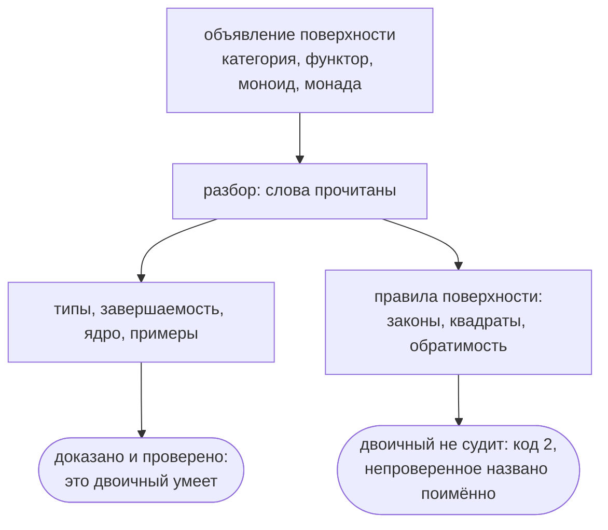

# Категорная поверхность flang — контракт

Отсюда берут точную формулировку каждого правила поверхности: какими словами
объявляют категорию, морфизм, функтор, моноид, монаду, изоморфизм и естественное
преобразование; что компилятор обязан ответить на каждую форму; какой код
диагностики соответствует какой беде; и что из обещанного здесь сегодня не
проверяет ничто. К концу нужного раздела вы сможете написать проверку на это
правило или перенести его в свою реализацию.

**Кому эта страница НЕ нужна.** Тому, кто пришёл поверхностью пользоваться,
отвечают короче и по делу «Категорная поверхность» и «Справочник конструкций»:
там те же слова, но с готовыми примерами и без разбора отвергнутых редакций.
Здесь рядом с правилом языка стоит довод, чего решение стоило, и пометка
«объявлено, не сделано» встречается наравне со «сделано».

## Что двоичный компилятор судит, а чего не судит

Знать это надо до всего остального: оно меняет смысл каждого слова
«проверяется» ниже.

**Категорную поверхность двоичный компилятор не судит вовсе.** Он разбирает
объявления, проверяет типы, завершаемость, ядро доказательств и примеры — а до
правил самой поверхности не доходит и говорит об этом словами, вместо того
чтобы позеленеть молча:

```
$ flang check examples/cat/monoid-and-monad.flang
модуль «Свод и пропуски»: функций 12, из них с доказанным завершением 12; типов 2
проверено НЕ ВСЁ: в программе объявлено то, чего бинарник не судит вовсе —
monoids, monads. …
$ echo $?
2
```

Код 2 и значит «проверено НЕ ДО КОНЦА». Сколько таких программ, посчитано
прогоном по каждой. В наборе, который сводит отчёт о доказательствах (284
файла — без образцов для проверок и без склеенного самоприменением
компилятора), **код 2 двоичный отдаёт на 26**, и на **14** из них непроверенной
остаётся именно категорная поверхность, на остальных 12 — процессы и надзор. По
всему дереву, где программ на flang 908, код 2 выпадает 41 раз.

Список непроверенного компилятор называет сам, поимённо. Вот сколько раз какое
имя встретилось в ответах этих 26 файлов: процессы 12, прогоны 11, надзор 9,
морфизм 6, категория 6, объявленное свойство 4, моноид 4, функтор 2,
преобразование 1, монада 1, изоморфизм 1, вложение 1, общая часть 1. Бифунктор
не встретился ни разу: объявление в дереве одно, и лежит оно в образце для
проверки, а не в программе.



**Судья не потерян — он не подключён, и это разные вещи.** Правила поверхности
переписаны на самом flang и лежат в дереве: `flang/self/monoid.flang`,
`monad.flang`, `iso.flang`, `functor.flang`, `sets.flang`, `setoid.flang`,
`svoystva.flang`, `grid.flang` и четыре слоя, которые их спрашивают, —
двенадцать файлов, 7 895 строк. В сборку двоичного не входит ни один: она
собирается из 29 файлов, и список этот получен обходом по слову `использует` от
`flang/self/bootstrap/compiler.flang`, а не прочитан на глаз.

Одной строкой `использует` дело не кончится, и это тоже измерено: **семь из
двенадцати слоёв сами не проходят `flang check`** (`monad`, `sets`, `grid` и все
четыре спрашивающих слоя — код 1). Подключить их — работа, а не правка одной
строки.

Прежде правила считала вторая реализация языка, написанная на JavaScript, — её
сняли. Проверки, которые её сверяли, — `flang/test/cat-bifunctor`,
`cat-category`, `cat-equality`, `cat-functor`, `cat-link`, `cat-monad`,
`cat-sets` и `cat-transform` — в дереве лежат и не запускается ни одна: каждая
обрывается на ввозе снятого файла.

Отсюда правило чтения. Всё, что ниже сказано словом «проверяется», означает
«проверялось снятой реализацией и сегодня не проверяется». Коды диагностик при
этом не выброшены и выброшены быть не могут: они и есть контракт — обязательство
перед тем, кто напишет следующего судью.

## Зачем поверхность нужна

Требований к ней семь, и каждое ниже разобрано отдельно: полнота по Тьюрингу,
поверхность теорката, монады и моноиды, эффекты и HTTP, встраиваемость в чужую
программу, неизменяемые структуры, проверяемость в двух местах — при компиляции
и при выполнении.

## Что уже есть и как ложится

Разрыв, который поверхность закрывает, выглядит так: **семантика языка уже
категорная, а слова об этом молчат.**

| Категорное понятие | Что это в flang сегодня |
|---|---|
| объект | тип: `число`, `строка`, `«Заказ»`, `список «Позиция»` |
| морфизм | функция: `принимает` … `возвращает` … |
| композиция | вложенный вызов: `«Б» от («А» от значение)` |
| единица | тождественная функция; отдельного имени нет |
| произведение | запись — `объект «Пара» …` |
| копроизведение | сумма типов — `тип «Токен» вариант … вариант …` |
| терминальный объект | `ничто` |
| экспоненциал | тип `функция из «А» в «Б»` есть; каррирования нет |
| подобъект | `вложение «В» из «А» в «Б»` — стрелка, которая ничего не склеивает |
| расслоенное произведение | `пересечение «П» из «А» и «Б» в «У»` — общая часть над общим объектом |

Строка про экспоненциал стоит в таблице потому, что функции в языке — значения
первого класса (`flang/cat/HOF.md`): объект `«Б»^«А»` пишут `функция из «А» в
«Б»`, а вычисление `eval : «Б»^«А» × «А» → «Б»` пишут `ф от х`.

Декартово замкнутой категорией flang от этого не стал, и утверждать обратное
нельзя. Не хватает второй половины сопряжения — каррирования: нет ни частичного
применения (`функция «Сложить» от 1`), ни способа превратить функцию двух
аргументов в функцию одного, возвращающую функцию. Арность в flang — свойство
функции, а не сахар над цепочкой одноместных, и это решение (`HOF.md`, «Чего
решено не делать никогда»). Частичное применение стоит в плане фазой 4; до неё
экспоненциал есть как объект, но не как сопряжение.

Часть слов поверхность не изобретает, а наследует: `категория`, `функтор`,
`объект`, `утилита`, `правило`, `свойство` пришли из прежней поверхности, и
разборщик читает их до сих пор — словами, без единого символа:

```
функтор «Запрос страницы в условие выборки» из «Запрос списка» в «Хранилище»
  объект «Запрос страницы» отображается в «Условие выборки»
    поле «номер страницы» отображается в поле «номер страницы»
```

Задача была не изобрести вторую поверхность, а распространить эту на flang.

## Принятые решения

Пять вопросов, которые оставались открытыми, решены так.

**1. Естественные преобразования объявляются, а не вычисляются.** Экспоненциалы
для этого **не введены** — преобразование
объявляется, а не вычисляется как значение, и коммутативность квадрата
проверяется на сетке. Прямая печать в C сохраняется: узел преобразования не
доходит ни до одного бэкенда, потому что печатать в нём нечего.

Довод «без них нельзя монаду» оказался неверным, и это стоит записать: монада
сделана раньше и БЕЗ них — η и μ названы обычными функциями, как `операция` у
моноида (`flang/cat/MONAD.md`). Предусловием преобразования оказалось не то,
что здесь предполагалось, а равенство морфизмов: квадрат коммутирует — это
равенство двух композиций.

**2. Категории как значения времени выполнения — нет.** Категория, функтор,
преобразование — объявления времени компиляции. Категория, вычисляемая в
рантайме, — другой язык, и он не печатается в C без интерпретатора внутри.

**3. `функция` остаётся; морфизм — надстройка.** Объявить функцию частным
случаем морфизма красивее, но это переписывает 1711 объявлений в репозитории и
ломает всё, что уже доказано сверкой байт в байт. Вместо этого: морфизм —
отдельное объявление, которое **может** быть реализовано функцией.

**4. Законы проверяются и при компиляции, и при выполнении.** Это прямое
требование «как в compile, так и в runtime». Разделение такое: при компиляции
закон проверяется на объявленных примерах и на выведенной сетке входов; в
напечатанном коде остаётся проверка — по умолчанию включённая, отключаемая
ключом печати `--без-законов` для горячего пути. Отключение обязано быть
видимым решением, а не молчаливым умолчанием.

Первая половина была сделана снятой реализацией и сегодня не делается ничем;
вторая —
**объявлено, не сделано**: ни проверки закона в напечатанном коде, ни ключа
`--без-законов` нет ни в одной из {{цели.изСловом}} целей. Это шаг 5 «Порядка
работ», и он не начат.

**5. Законы у нетотальных морфизмов — разрешены, с лимитом шагов. Сделано в
`flang test`.** Запрещать неправильно: HTTP-обработчик редко тотален, а закон
при нём нужен именно там. Проверка идёт под НАЗВАННЫМ пределом шагов
(`LAW_MAX_STEPS`), и упор в предел — отдельная
диагностика `FLANG_LAW_LIMIT`, а не молчаливый успех: `passed` остаётся ложью и
`flang test` кончается кодом 1.

Отдельный код заведён не ради полноты таблицы. Исходов у проверки закона три, а
не два: сошлось, не сошлось — и **не досчиталось**. Третий не значит «закон
нарушен»: про закон в этом случае не известно ничего, и назвать его нарушенным
значило бы утверждать больше, чем видели.

*Здесь стояло то же самое в настоящем времени, и это было неправдой.* Кода
`FLANG_LAW_LIMIT` не существовало нигде, кроме этой строки: упор в предел уезжал
в отчёт общим `FLANG_RECURSION_LIMIT` — тем же, каким падает зациклившийся
пример обычной функции, — и по отчёту нельзя было отличить опровергнутый закон
от непроверенного. Улика и обе половины проверки (краснеет на нетотальной
реализации без конца; НЕ краснеет на нетотальной, которая досчиталась) —
проверка «закон у нетотальной стрелки», снятая вместе с реализацией.

*Объявлено, не сделано* и здесь: тот же код в НАПЕЧАТАННОМ коде — вместе с шагом
5 «Порядка работ»; предел один на все законы и доводом не меняется.

Видом отказа процесса `FLANG_LAW_LIMIT` при этом НЕ становится, и это не
упущение. Замкнутое множество видов (`flang/conc/SPEC.md`, сегодня их десять) —
про то, чем падает процесс НА ПРОГОНЕ; этот же код рождается в инструменте,
когда тот считает примеры автора, и никакого процесса рядом нет. Вопрос
откроется заново вместе с шагом 5: закон, проверяемый внутри обработчика в
напечатанном коде, будет отказывать уже процессом — и тогда виду быть.

## Поверхность

Только слова. Никаких `→`, `≅`, `∘`, `∀`, `>>=` — всё, что нельзя набрать на
обычной клавиатуре, запрещено. Правило это старше самой поверхности: им
записана и прежняя, наследие которой язык читает до сих пор.

### Категория и морфизм

**Сделано.** Форма вышла короче задуманной на одну строку и на одно понятие.

```flang
объект «Заказ»
  сумма является числом

объект «Отгрузка»
  номер является числом

тотальная функция «Отгрузить заказ»
  принимает заказ: «Заказ»
  возвращает «Отгрузка»
  запись «Отгрузка» с номер равным заказ.сумма

морфизм «отгрузить» из «Заказ» в «Отгрузка»
  даёт «Отгрузить заказ»
  закон «номер берётся из суммы»
    пример «обычный»
      дано заказ равно запись «Заказ» с сумма равным 5
      ожидается запись «Отгрузка» с номер равным 5
```

`даёт` — вычисление, `закон` — проверяемое обещание. Блок необязателен: морфизм
без `даёт` остаётся чистым утверждением, как в прежней поверхности, и обратная
совместимость сохраняется. Поля `gives` и `laws` появляются в узле AST только
когда написаны — иначе AST каждой существующей стрелки поменялся бы на два
поля, а его сверяет байт в байт круг самоприменения: компилятор печатает сам
себя без изменений.

**`даёт` называет функцию, а не несёт выражение**, и это расхождение с первой
редакцией записи, где после `даёт` стояло само выражение
(`даёт запись «Отгрузка» с номер равным …`). Тело прямо в
стрелке — это второй разбор выражений, второй вывод типов, второй анализ
завершаемости и восьмая печать в {{цели.изСловом}} целях; названная функция не
стоит ничего из этого и говорит ровно то же. Так уже сделано у моноида
(`операция «Соединить»`) и у монады (`возврат «Обернуть»`), и решение 3 выше —
«морфизм может быть реализован функцией» — это же и говорит.

**`требует` не заведено.** Предусловие — отдельное понятие, у него своя цена
(проверка при выполнении во всех {{цели.изСловом}} целях) и свой смысл; на закон
оно не влияет, а поверхность занимает. Оно остаётся в этом контракте как
задуманное, не как сделанное.

Граница здесь проходит внутри одной конструкции. **Доказывается** сличением
объявлений: функция объявлена; она принимает ровно один вход (стрелка ведёт из
одного объекта в один, а произведение объектов пишется записью-доменом); тип
входа — домен, тип результата — кодомен. Несовпадение даёт свой код
`FLANG_MORPHISM_SHAPE`, а не общий `FLANG_TYPE`.

**Проверяется на примерах** сам закон, и проверяет его `flang test`, а не
`flang check`: закон говорит о равенстве вычислений, а примеры функции проверяет
ровно эта команда. Класть закон в `check` значило бы, что часть примеров языка
проверяет одна команда, а часть — другая, и автор обязан помнить, какая именно.
Нарушенный закон называет себя целиком — `морфизм «отгрузить», закон «номер
берётся из суммы»`, — потому что по одной строке отчёта обязано быть видно,
чьё обещание не выполнилось.

Закон без `даёт` и закон без единого примера отвергаются разбором. Первый
проверять не на чем; второй обещает и не проверяет ничего, а такое объявление
хуже отсутствующего — оно читается как гарантия.

### Категория называет свои стрелки

**Категория объявляется, и это новее самой поверхности.** Прежде
`категория «Х»` была заголовком документа прежней поверхности, именем и ничем
больше. Имена на
концах функтора (`из «Продажи» в «Биллинг»`) оставались пометкой для читателя, и
утверждать, что стрелка принадлежит именно этой категории, было не на чем.

Дороже стоила вторая половина той же дыры. Раздел «Граница честности» ниже
обещал «полноту отображений функтора — каждому объекту и морфизму ДОМЕНА
сопоставлено что-то в кодомене», а проверить это было нечем: функтор,
отобразивший две стрелки из пяти, проходил `flang check` молча, потому что
«пять» было неизвестным числом.

```flang
категория «Продажи»
  морфизм «отгрузить»
  морфизм «выставить»
  морфизм «оформить»
```

Ни одного нового слова. Таблицу лексера сверяет байт в байт `self/lexer.flang`,
и новое слово стоило бы правки в обоих; `морфизм «имя»` без `из` и без блока
разбор прежде ОТВЕРГАЛ («требует строки 'если' и 'то'»), значит эта запись
занимает то, что было ошибкой, и не отнимает ничего у написанного. Членство
отличается от объявления тем, что за именем НЕТ ничего, включая отступной блок,
— заголовок документа прежней поверхности читается ровно как читался, и ключа
`categories` у него не появляется.

Единицы в списке не пишутся: `единица «Заказ»` входит в категорию тогда и только
тогда, когда «Заказ» — объект одной из её стрелок. Иначе автор писал бы её
дважды — объявлением и членством, — и второе место могло бы разойтись с первым
молча.

**Доказываются** сличением объявлений, без единого вычисления, две аксиомы
категории: замкнутость под композицией (`FLANG_CATEGORY_NOT_CLOSED` — композиция
в категории обязана быть собрана из стрелок этой же категории) и наличие единицы
у каждого объекта (`FLANG_CATEGORY_NO_IDENTITY`). Сюда же членство:
`FLANG_CATEGORY_UNKNOWN_ARROW` и `FLANG_CATEGORY_ARROW_TWICE`. Повтор не
безобиден — полнота функтора считается по числу членов, и дважды посчитанная
стрелка сделала бы «пять из пяти» неправдой.

*Здесь стояло «не проверяется ассоциативность композиции», и довод был верный:*
`«в» после («б» после «а»)` и `(«в» после «б») после «а»` — в языке ДВА РАЗНЫХ
ИМЕНИ, а равенства морфизмов в языке не было вовсе, и проверка, сравнивающая
имена, продавала бы сличение строк за аксиому. Равенство объявляется —
следующим разделом, — и ассоциативность вместе с ним стала выразимой и
проверяемой на сетке (`FLANG_CATEGORY_NOT_ASSOC`). Про силу этой проверки там же
сказано прямо: она подтверждает, а не устанавливает.

**Категория, о которой не сказано ничего, остаётся допущением автора.** Полнота
функтора проверяется там и только там, где написано, из чего категория состоит:
`FLANG_FUNCTOR_NOT_TOTAL` — стрелка домена без образа,
`FLANG_FUNCTOR_IMAGE_OUTSIDE` — образ, уехавший мимо категории кодомена. Это та
же граница, по которой изоморфизм без `даёт` уходит в `assumed`, а не в
диагностику: объявлять то, чего ещё нет, законно и полезно.

### Равенство морфизмов: категория объявляет своё равенство

**Форма эта в языке есть.** Без неё не проверялась ассоциативность композиции и
не были выразимы естественные преобразования: коммутирующий квадрат — это
равенство двух композиций.

```flang
категория «Отгрузки»
  морфизм «отгрузить»
  морфизм «выписать»
  объект «Заказ» даёт «Заказы равны»
  объект «Отгрузка» даёт «Отгрузки равны»
```

Категория **обогащена сетоидами**: она объявляет СВОЁ отношение равенства на
значениях каждого своего объекта — функцией из двух значений в признак, — а
равенство СТРЕЛОК выводится из него **поточечно**: `ф` и `ф'` из «А» в «Б»
равны, когда на каждом значении «А» их образы равны по равенству «Б». Это
стандартный ответ теории категорий, записанной в языке с типами: так устроены
`agda-categories` и категорные библиотеки Coq вне UniMath.

Два других пути отвергнуты, и оба по существу. Равенство через **типы
тождества** требует зависимых типов, которых у flang нет и не будет (см. «Чего
нет и не будет без отдельной большой работы»). Равенство **по нормализации**
работает только для очень конкретных категорий и про остальные молчаливо лжёт.

**Ни одного нового слова.** `объект` и `даёт` ключевые с первого дня, значит
таблица лексера, четыре её поверхности и парсер на flang новых продукций не
получили — форма разобралась готовыми. `объект «Х»` с ключевым словом в той же
строке разбор ПРЕЖДЕ отвергал (за именем записи идёт блок полей), значит запись
занимает то, что было ошибкой, и не отнимает ничего у написанного. Довод тот же,
каким членство категории заняло `морфизм «имя»` без `из`. `даёт` здесь означает
ровно то же, что у стрелки и у моноида: вот функция, которая это считает.

**Доказывается** сличением объявлений, без единого вычисления: объект стоит на
конце хотя бы одной стрелки ЭТОЙ категории (`FLANG_CATEGORY_EQUALITY_OUTSIDE`);
равенство у объекта одно (`FLANG_CATEGORY_EQUALITY_TWICE`); названная функция
объявлена, принимает ровно два входа этого объекта и возвращает признак
(`FLANG_CATEGORY_EQUALITY_SHAPE`). Отношение — это функция в «да/нет»; функция,
возвращающая число, отношением не является ни при каком прочтении.

**Проверяется на сетке** — три закона, и все три говорят о равенстве вычислений
на всех значениях объекта, то есть неразрешимы:

1. **объявленное равенство есть ЭКВИВАЛЕНТНОСТЬ** — рефлексивно, симметрично,
   транзитивно (`FLANG_EQUALITY_NOT_REFLEXIVE`, `FLANG_EQUALITY_NOT_SYMMETRIC`,
   `FLANG_EQUALITY_NOT_TRANSITIVE`). Не проверив этого, «доказать» можно что
   угодно: «не больше» рефлексивно и транзитивно, а равными на нём вышли бы
   стрелки, из которых одна меньше другой;
2. **композиция его УВАЖАЕТ** — «если `ф` равно `ф'`, то `г после ф` равно
   `г после ф'`». При поточечном равенстве стрелок это ровно требование к каждой
   стрелке категории: равные значения обязаны переходить в равные
   (`FLANG_EQUALITY_NOT_CONGRUENT`). Проверяется и корень — каждая стрелка, — и
   само утверждение о композиции на тех парах стрелок, которые на сетке вышли
   равными;
3. **композиция АССОЦИАТИВНА** (`FLANG_CATEGORY_NOT_ASSOC`): обе скобки
   собираются порознь, как два разных морфизма, и сравниваются ОБЪЯВЛЕННЫМ
   равенством кодомена.

Сломанное равенство **останавливает** остальные два закона, а не считается
заодно: их вердикт был бы утверждением о том, что равенством не является. Отчёт
говорит об этом словами (`aborted`), а не выдаёт непосчитанное за чистую сетку.

**Сила третьей проверки названа честно, и это важнее самой проверки.**
Композиция в flang не пишется автором: `после` разворачивается в применение, а
применение ассоциативно по построению вычислителя. Значит у категории, где все
три стрелки реализованы, обе скобки дают ОДНО значение, и вся проверка сводится
к вопросу «рефлексивно ли объявленное равенство в той точке, куда композиция
пришла». Вопрос не пустой — точка эта в сетку кодомена, вообще говоря, не
входит, и рефлексивность там никем не считана (на этом и построен тест
«ассоциативность умеет краснеть»), — но выдавать его за проверку аксиомы нельзя.
Что изменилось по существу: раньше две скобки были ДВУМЯ ИМЕНАМИ и сравнить их
было нечем; теперь сравниваются ВЫЧИСЛЕНИЯ через объявленное автором равенство.

**Чтобы ассоциативность могла краснеть и на честной программе, композиции нужен
собственный `даёт`** — тогда две скобки пойдут через две написанные руками
функции и разойдутся, если хоть одна из них неверна. Слова для этого есть все,
работа отдельная, и здесь она записана как задуманная, а не как сделанная.

**Категория без объявленного равенства** остаётся допущением автора: сравнивать
нечем, диагностики нет, а в отчёте о доказательствах стоит строка «на веру» с
причиной. Это та
же граница, по которой туда уходит изоморфизм без `даёт`, и тот же довод:
объявление, о котором отчёт молчит, читается как проверенное.

Судил это снятый инструментарий: сетку — его слой равенств, устройство — его
проверка типов. Настоящая программа, на которой это писалось, —
`examples/cat/order-shipment.flang`; проверка
`flang/test/cat-equality.test.mjs` в дереве лежит и не запускается.

### Композиция, единица, цепочка

```flang
морфизм «выставить счёт по отгрузке» это «выставить счёт» после «отгрузить»
единица «Заказ»

цепочка «оформить заказ»
  сначала «проверить остаток»
  затем «отгрузить»
  затем «выставить счёт»
```

`после` — композиция в математическом порядке (правая применяется первой).
`цепочка` — та же композиция в порядке чтения, для длинных конвейеров: без неё
`«в» после («б» после «а»)` читается наизнанку. Компилятор проверяет стыковку
доменов и кодоменов в обоих случаях.

### Функтор и бифунктор

**Сделано.** Поверхность вышла короче задуманной: строк `сохраняет композицию`
и `сохраняет единицы` нет. Отображение, не сохраняющее композицию, функтором не
является, и разрешение на проверку закона продавало бы имя вместо содержания.
Образ морфизма пишется через `отображается в морфизм`, чтобы отличаться от
образа объекта.

```flang
функтор «Заказ в счёт» из «Продажи» в «Биллинг»
  объект «Заказ» отображается в «Счёт»
  морфизм «отгрузить» отображается в морфизм «выставить»

бифунктор «Пара» из «Продажи» и «Продажи» в «Пары»
  объекты «Заказ» и «Заказ» отображаются в «Пара заказов»
  объекты «Отгрузка» и «Отгрузка» отображаются в «Пара отгрузок»
  морфизмы «отгрузить» и «отгрузить» отображаются в морфизм «отгрузить обе»
```

Бифунктор лёг на устройство функтора целиком: вся проверка построена на
сличении объявленных имён, а ключ отображения — деталь, там имя объекта, здесь
пара имён. Все законы переписались заменой ключа и ничем больше.

Не лёг **общий вид из этого контракта** — `из «Значения» и «Значения» в
«Значения»` с образом `«Пара А Б»`. Здесь «А» и «Б» переменные типа. Раньше
причина была в языке — параметрических типов не было вовсе; теперь они есть
(`объект «Пара» от «Первый» и «Второй»` разбирается и проверяется, а
`flang/stdlib/optional.flang` на них написан), и причина сместилась в проверку:
`checkFunctors` ищет объект по ИМЕНИ (`ctx.records.has(имя)`) и применения не
знает. Поэтому пары объектов и морфизмов конкретные — ровно так же, как
конкретны объекты у функтора, где «Заказ отображается в Счёт» пишется для двух
записей, а не для семейства. Ограничение общее для обеих конструкций, снимется
фазой 3 в `flang/cat/POLY.md` и законов не касается.

Множественное число (`объекты`, `морфизмы`, `отображаются в`) заведено
отдельными поверхностями — как `равен`, `равна` и `равное` дают один `cmpEq`.
Множественное «объекты» не приписано к `объект` намеренно: иначе `объекты «Х»`
наверху файла разбиралось бы как объявление записи.

### Изоморфизм

**Сделано.** Пара стрелок туда и обратно; концы называются теми же `из … в …`,
какими их называют морфизм и функтор.

```flang
изоморфизм «Заказ и накладная» из «Заказ» в «Накладная»
  прямой морфизм «выписать»
  обратный морфизм «по накладной»
```

`прямой морфизм` и `обратный морфизм` — фразы из двух слов, а не «туда» и
«обратно». Оба наречия сегодня свободны, но свободны случайно: это обычные
слова, и завтра кто-нибудь напишет `пусть обратно равно …`. Фраза из двух слов
именем быть не может никогда — тот же довод, по которому в языке стоят
`обратный элемент` и `разложить … на символы`.

Граница здесь проходит внутри одной конструкции, и она не та, что была
намечена ниже в разделе о честности. **Доказывается** сличением объявлений:
объекты объявлены; обе стрелки объявлены; концы сходятся крест-накрест —
прямая из «А» в «Б», обратная из «Б» в «А», отчего обе композиции и замыкаются
на себя; единицы обоих объектов объявлены, потому что закон говорит именно о
них.

**Проверяется на сетке** — само равенство «обратный после прямого = единица», и
ровно там, где обе стрелки реализованы (`даёт «Ф»`). Здесь стояло «не
проверяется вовсе», и причина была честная: у стрелки не было тела, вычислять
на сетке было нечего. Там же было названо условие, при котором это меняется, —
«сетка появится здесь тогда же, когда у морфизма появится `даёт`». `даёт`
появился, и сетка появилась — у снятой реализации, код
`FLANG_ISO_NOT_INVERSE`.
Значения берутся оттуда же, откуда у моноида, — из написанных автором: входы
примеров прямой стрелки суть значения первого объекта, ожидаемые значения
примеров обратной — тоже; для второго объекта наоборот. Сообщение предъявляет
контрпример: без значения «не обратимо» заставляет искать его руками, а именно
значение и есть вся находка.

**Остаётся допущением автора** — пара, где хотя бы одна стрелка без `даёт`.
Проверять нечем, и проверка молчит: объявление стрелки без реализации законно и
полезно (так написаны все стрелки наследия прежней поверхности), а требовать
реализацию
ради проверки значило бы запретить объявлять то, чего ещё нет. Изоморфизм с
пустой сеткой в список проверенных не попадает вовсе — сказать «проверено» о
нуле значений значило бы подменить «доказано» на «посмотрели».

Из допущения компилятор не выводит следствий, и это тоже решение, а не
недоделка. Зная «обратный после прямого = единица А», можно было бы считать
единицей объявленную композицию с такими сомножителями — и тогда у функтора
столкнулись бы два его собственных закона: сохранение композиции требует, чтобы
образом была «композиция образов», сохранение единиц — чтобы образом была
«единица …», а выполнить оба сразу нельзя ни при каком объявлении.

*Здесь стояло «языку с равенствами морфизмов нужна отдельная работа».* Работа
сделана — «Равенство морфизмов» выше, — но вывод следствий из допущения она НЕ
открывает и открыть не может: равенство там поточечное, то есть проверяемое на
сетке, а следствие компилятор выводил бы обо всех входах. Столкновение двух
законов функтора от появления равенства никуда не делось.

### Связь модулей: интерфейс объектом, связь морфизмом

**Форма эта в языке есть, и ни одного нового слова в ней нет.**

Разговор начался с мысли, которая верна: программа на flang — это и есть
спецификация, а значит категорную запись можно использовать, чтобы **сверять
деловые требования с уже построенной цепочкой модулей**. Модуль заказов, модуль
платежей, модуль отгрузки — у каждого своё представление о заказе; перевод между
ними обязан сохранять устройство; если новое требование его ломает, модули
рассогласованы, и **ни одна система типов этого не поймает**.

**Интерфейс модуля — это его категория.** Читать её проще всего как рисунок из
коробочек и стрелок: коробочка — вид вещи (`объект «Заказ»`), стрелка обязана
быть функцией, то есть на каждую вещь давать ровно один ответ (`морфизм
«отменить заказ»`), а строка `категория «Заказы»` со списком стрелок и есть
объявление «вот что я умею». Ничего нового здесь нет — так категория пишется с
14 августа.

**Связь между модулями — это функтор** между такими категориями. В категории
категорий функтор и есть морфизм, поэтому «связь морфизмом» — не метафора, а то,
чем эта запись является. Нового и здесь нет: `функтор «Ф» из «А» в «Б»` достался
языку от прежней поверхности.

Новое одно — **перевод данных**:

```flang
функтор «Заказ в платёж» из «Заказы» в «Платежи»
  объект «Заказ» отображается в «Платёж» даёт «Платёж по заказу»
  морфизм «отменить заказ» отображается в морфизм «вернуть платёж»
```

`даёт «Ф»` называет функцию, которая переводит значения одного объекта в
значения другого. Без неё связь была **сличением имён**: сказать «заказу
соответствует платёж» можно было, а сказать, ЧЕМ именно, — нечем, и проверять
было нечего.

**Ни одного нового слова, и это не экономия.** Слово в таблице лексера — это ещё
и четыре поверхности (ru/en/eo/zh), и правка `self/lexer.flang`, которую сверяет
байт в байт проверка самораскрутки. `даёт` уже ключевое и значит здесь ровно то
же, что у стрелки, у моноида и у вложения. Сама запись занимает то, что **было
ошибкой**: `объект «А» отображается в «Б» даёт «Ф»` разбор прежде отвергал («не
разобрана конструкция: непонятная строка функтора»), потому что за именем образа
шёл либо конец строки, либо отступной блок полей. Тот же приём, каким категория
получила список своих стрелок. Занятость слов, которые понадобились бы иначе,
измерена прогоном по всем программам репозитория, какие были на тот день:
`связь` — 19 голых вхождений (сломалось бы 19 мест), `через` — 7; `интерфейс`,
`перевод`, `согласование`, `сохраняет` свободны, но даром ни одно из них не
досталось бы.

Ключ `gives` встаёт в AST **после** `fields` и появляется только там, где
написан: AST моделей `.fts` репозитория не меняется ни на байт.

#### Замкнутый контур — это проверяемое утверждение

```
     ┌─────────┐  отменить заказ   ┌─────────┐
     │  Заказ  │ ────────────────▶ │  Заказ  │
     └────┬────┘                   └────┬────┘
          │ Платёж по заказу            │ Платёж по заказу
          ▼                             ▼
     ┌─────────┐  вернуть платёж   ┌─────────┐
     │ Платёж  │ ────────────────▶ │ Платёж  │
     └─────────┘                   └─────────┘
```

Два пути из левого верхнего угла в правый нижний обязаны давать одно и то же:

> **перевести и сделать = сделать и перевести**

По-деловому это значит «отменённый заказ отменён везде». Формально `t` есть
естественное преобразование из вложения категории домена в композицию «функтор,
потом вложение категории кодомена»; обе категории вложены в одну большую
категорию типов и тотальных функций flang, поэтому вертикальные стрелки квадрата
законны, хотя ни одной из двух категорий не принадлежат.

**Доказывается** сличением объявлений, без единого вычисления: перевод объявлен,
принимает ровно один вход, вход этот — объект-источник, результат — его образ.
Не сошлось — свой код `FLANG_FUNCTOR_TRANSLATION`, а не общий `FLANG_TYPE`.

**Проверялся на сетке** сам квадрат — снятой реализацией, код
`FLANG_FUNCTOR_SQUARE`. Значения берутся оттуда же, откуда у изоморфизма: из
примеров, написанных автором. Сообщение предъявляет контрпример — значение и оба
исхода, — потому что именно значение и есть вся находка:

```
FLANG_FUNCTOR_SQUARE  функтор «Заказ в платёж»: квадрат не сходится на стрелке
                      «отменить заказ»: на {"сумма":500,"отменён":0} путь «Платёж
                      по заказу» после «отменить заказ» дал {"копейки":50000,
                      "возвращён":0}, а «вернуть платёж» после «Платёж по заказу»
                      — {"копейки":50000,"возвращён":1}
```

**Замыкание по композиции достаётся даром**, и это не случайность: вычисление и
есть композиция. Если квадраты образующих стрелок сошлись на сетке, квадрат
любой их композиции на той же сетке сходится сам. Проверка тем не менее умеет
взять и композицию — иначе категория, собранная из стрелок, была бы наполовину
непроверяемой.

**Связь без переводов остаётся допущением автора.** Диагностики ей не нужно —
объявление без реализации законно и полезно, так написаны все функторы наследия
прежней поверхности, — но и в `checked` ей не место: сказать «проверено» о нуле
сравнений значило бы подменить «доказано» на «посмотрели». Такие связи уезжают в
`assumed` и стоят в отчёте о доказательствах строкой «на веру».

#### Связывание переносит категории — иначе всё это мертво

Отдельная правка, без которой у главы не было бы смысла. `linkProgram` не
переносил `categories` в слитую программу, и **полнота связи между модулями не
проверялась вовсе**. Улика снималась тремя файлами: модуль с категорией из одной
стрелки, второй со своей, третий с функтором, который эту стрелку не отображает.
Одним файлом — `FLANG_FUNCTOR_NOT_TOTAL`; теми же строками, разложенными по трём
модулям, — `valid: true` и ноль диагностик. Заодно молчали и две аксиомы самой
категории: замкнутость и наличие единиц переставали проверяться, стоило файлу
обзавестись хоть одной строкой `использует`.

#### Что этот слой НЕ проверяет — и не будет

Раздел обязательный, потому что соблазн продать больше велик.

- **Он не говорит, что требование хорошее.** Он говорит, что новое требование
  противоречит существующему переводу. Деловая правильность самих требований
  вне его досягаемости целиком и навсегда.
- **Сетка конечна.** Квадрат, сошедшийся на значениях автора, не доказан ни для
  каких других. Отчёт о доказательствах печатает про него строку, оканчивающуюся
  словами «Это
  не доказательство», и это не скромность: на сетке ловится **опровержение**, а
  подтверждения там нет.
- **Вырожденная сетка проверяет саму себя.** Если оба пути на всех значениях
  сетки дают одно и то же значение, квадрат сходится при любой реализации.
  Запретить это нечем, поэтому оно **называется числом**: `checked` несёт
  `distinct` — сколько РАЗЛИЧНЫХ исходов дала сетка, — и отчёт о доказательствах
  его печатает.
- **Полей перевода компилятор не видит.** Строки `поле … отображается в поле …`
  внутри объекта функтора — пометка наследия прежней поверхности; согласованность
  перевода с
  ними не проверяется ничем. Проверяется только то, что перевод вычисляет.
- **Двух переводов одного объекта не бывает.** Отображение объектов однозначно
  (`FLANG_FUNCTOR_OBJECT_TWICE`), значит и перевод у объекта один. Связь, где
  один заказ переводится в платёж двумя способами и способы обязаны совпасть, в
  этой записи не выражается.
- **Обратной связи не выводится.** Из того, что квадрат сошёлся, компилятор не
  заключает ничего о существовании перевода назад: это утверждение об обратимости,
  и для него есть своё слово — `изоморфизм`.
- **Ничего не проверяется у связи, ведущей в модуль, которого нет в сборке.**
  Слой видит ровно те объявления, которые приехали через `использует`; связь с
  модулем, лежащим за границей программы, объявить нельзя.

### Вложение и общая часть

**Сделано.** Два слова, и каждое отвечает на вопрос, на который стрелка сама по
себе не отвечает. Подробный контракт — `flang/cat/SETS.md`; здесь только место
в этой картине.

```flang
вложение «Срочные среди заказов» из «Срочный» в «Заказ» даёт «Срочный заказ»
пересечение «Срочные оплаченные» из «Срочный» и «Оплаченный» в «Заказ»
```

`вложение` — **подобъект**: мономорфизм, обещающий, что «Срочный» есть ЧАСТЬ
«Заказа», а не его фактор. Обычный `морфизм` этого не обещает: у него сказано
только, что стрелка есть. Разница проверяема — склеивающая стрелка ловится
контрпримером (`FLANG_EMBED_NOT_INJECTIVE`), и в этом весь смысл отдельного
слова: печатать вложение обычной стрелкой значило бы записать «стрелку» там, где
автор сказал «подмножество».

`пересечение` — **предел**: расслоенное произведение над объемлющим объектом.
Объемлющее обязательно, и это не украшение записи: без него квадрата, который
общая часть замыкает, попросту нет, а в языке — нечем сличать общий элемент,
потому что значения разных типов несравнимы.

Объединения среди слов нет намеренно: ко-произведение в языке уже есть и
называется `тип … вариант …` вместе с исчерпывающим `разбор`ом. Довод и два
других, почему третьего слова не завелось, — в `flang/cat/SETS.md`.

### Форма в AST

Обе конструкции добавляют по необязательному списку верхнего уровня —
появляются они только там, где объявления есть, как `morphisms` и `monoids`:

```jsonc
"isomorphisms": [{ "kind": "isomorphism", "name": "Заказ и накладная",
                   "from": "Заказ", "to": "Накладная",
                   "forward": "выписать", "backward": "по накладной" }],
"bifunctors":   [{ "kind": "bifunctor", "name": "Пара",
                   "from": ["Продажи", "Продажи"], "to": "Пары",
                   "objects":   [{ "from": ["Заказ", "Заказ"], "to": "Пара заказов" }],
                   "morphisms": [{ "from": ["отгрузить", "отгрузить"],
                                   "to": "отгрузить обе" }] }]
```

Функтор, в отличие от них, до сих пор живёт в `legacy` узлом `functorFile` —
он достался языку от прежней поверхности и разбирается тем же кодом. Переносить
его сюда сейчас значило бы менять форму разбора ради одной только стройности.

Стрелка с реализацией добавляет к своему узлу два необязательных ключа — и
только когда они написаны:

```jsonc
"morphisms": [{ "kind": "morphism", "name": "отгрузить",
                "domain": "Заказ", "codomain": "Отгрузка",
                "gives": "Отгрузить заказ",
                "laws": [{ "name": "номер берётся из суммы",
                           "examples": [{ "name": "обычный",
                                          "args": { "заказ": { "сумма": 5 } },
                                          "expected": { "номер": 5 } }] }] }]
```

Пример закона — той же формы, что пример функции, и разбирается тем же кодом:
второй разбор примеров означал бы второе понимание слов «дано» и «ожидается».

Категория со списком стрелок добавляет свой список — и тоже только там, где
членство написано; ключ стоит последним, поэтому AST моделей `.fts`, где
`категория «Х»` служит заголовком документа, не меняется ни на байт:

```jsonc
"categories": [{ "kind": "category", "name": "Продажи",
                 "morphisms": ["отгрузить", "выставить", "оформить"] }]
```

Своё равенство добавляет к этому узлу ещё один необязательный ключ — и тоже
только когда написано; стоит он между `morphisms` и `span`, потому что порядок
ключей есть часть сверки байт в байт:

```jsonc
"categories": [{ "kind": "category", "name": "Отгрузки",
                 "morphisms": ["отгрузить", "выписать"],
                 "equalities": [{ "object": "Заказ", "gives": "Заказы равны" }] }]
```

Естественное преобразование добавляет свой список верхнего уровня — последним,
после `categories`, и по тому же правилу «только когда написано»:

```jsonc
"transformations": [{ "kind": "transformation", "name": "в копейки",
                      "from": "В рублях", "to": "В копейках",
                      "components": [{ "object": "Заявка",
                                       "morphism": "заявку в копейки" }] }]
```

Свои коды диагностик: `FLANG_CATEGORY_UNKNOWN_ARROW`,
`FLANG_CATEGORY_ARROW_TWICE`, `FLANG_CATEGORY_NOT_CLOSED`,
`FLANG_CATEGORY_NO_IDENTITY`, `FLANG_CATEGORY_EQUALITY_SHAPE`,
`FLANG_CATEGORY_EQUALITY_TWICE`, `FLANG_CATEGORY_EQUALITY_OUTSIDE`,
`FLANG_CATEGORY_NOT_ASSOC`, `FLANG_EQUALITY_NOT_REFLEXIVE`,
`FLANG_EQUALITY_NOT_SYMMETRIC`, `FLANG_EQUALITY_NOT_TRANSITIVE`,
`FLANG_EQUALITY_NOT_CONGRUENT`, `FLANG_TRANSFORM_SHAPE`,
`FLANG_TRANSFORM_COMPONENT`, `FLANG_TRANSFORM_NOT_TOTAL`,
`FLANG_TRANSFORM_NOT_NATURAL`, `FLANG_FUNCTOR_NOT_TOTAL`,
`FLANG_FUNCTOR_IMAGE_OUTSIDE`, `FLANG_MORPHISM_SHAPE`, `FLANG_ISO_MISMATCH`,
`FLANG_ISO_IDENTITY_MISSING`, `FLANG_ISO_NOT_INVERSE`,
`FLANG_BIFUNCTOR_OBJECT_TWICE`, `FLANG_BIFUNCTOR_OBJECT_MISSING`,
`FLANG_BIFUNCTOR_ARROW_MISMATCH`, `FLANG_BIFUNCTOR_COMPOSITION`,
`FLANG_BIFUNCTOR_IDENTITY`, `FLANG_FUNCTOR_TRANSLATION`, `FLANG_FUNCTOR_SQUARE`.
Общего `FLANG_TYPE` здесь нет намеренно: по коду машина понимает, что чинить, и
это записано ниже отдельным требованием.

### Естественное преобразование

**Форма эта в языке есть.** Поверхность вышла не той, что была задумана здесь, и
правка вынужденная — зато вынужденная в дешёвую сторону.

```flang
морфизм «в копейки» из функтора «В рублях» в функтор «В копейках»
  объект «Заявка» отображается в морфизм «заявку в копейки»
  объект «Счёт» отображается в морфизм «счёт в копейки»
```

Задуманного здесь `преобразование … на объекте … действует морфизмом … квадрат
коммутирует` **нет**, и слов этих в языке не заведено. Занятость всех четырёх
измерена `flang/scripts/word-occupancy.mjs` — голым именем у каждого ноль, — то
есть дело не в том, что слова заняты. Дело в цене: свободное слово стоит правки
в таблице лексера (`self/lexer.flang`), в ЧЕТЫРЁХ поверхностях и продукции в
разборщике. Пока реализаций было две, цена была вдвое выше: таблиц и разборщиков
было по две, и они сверялись байт в байт.

**Естественное преобразование ЕСТЬ морфизм в категории функторов**, и других
прочтений у записи нет: `из функтора «Ф» в функтор «Г»` называет концы тем же
`из … в …`, каким их называют стрелка, функтор и изоморфизм. Слово `морфизм`
открывает теперь четыре конструкции, и решает не оно, а следующий токен:
`из «А» в «Б»` — стрелка, `из функтора «Ф» в функтор «Г»` — преобразование,
`это «б» после «а»` — композиция, всё остальное — утверждение наследия прежней
поверхности.
Ключевым словом имя быть не может никогда, значит взгляда на один токен хватает.

Из таблицы лексера прибавилась ровно ОДНА форма — родительный падеж `функтора`
рядом с `функтор`, как `поля` рядом с `поле` и `числа` рядом с `число`. Это не
новое слово, а второй падеж того же, и нужен он одной этой фразе: без него она
была бы не по-русски. Трём другим поверхностям падеж не нужен — `from functor …
to functor …`, `de funktoro … al funktoro …` и `从函子…到函子…` стоят в исходной
форме. `отображается в морфизм` взято у функтора вместе с его смыслом: там
объект переходит в объект (`отображается в`), здесь объекту сопоставлена
СТРЕЛКА.

**Доказывается** сличением объявлений: оба функтора объявлены; они параллельны —
ведут из одной категории в одну (`FLANG_TRANSFORM_SHAPE`); у объекта не больше
одной компоненты и концы компоненты — ровно `Ф(Х)` и `Г(Х)`
(`FLANG_TRANSFORM_COMPONENT`); компонента есть у каждого отображённого объекта
(`FLANG_TRANSFORM_NOT_TOTAL`). Преобразование без единой компоненты отвергается
разбором — тем же доводом, каким отвергается закон без примеров.

**Проверяется на сетке** закон естественности (`FLANG_TRANSFORM_NOT_NATURAL`):
для каждой стрелки `ф: Х → У` категории домена пути `Г(ф) после альфа_Х` и
`альфа_У после Ф(ф)` дают значения, равные по объявленному равенству категории
кодомена. Категория кодомена без своего равенства и нереализованная стрелка
квадрата уводят преобразование в «на веру», а не в отказ.

**И вот чем этот закон отличается от ассоциативности — это главное.**
Ассоциативность на реализованных стрелках сходится всегда: обе скобки — одна и
та же цепочка применений. Квадрат же собран из ЧЕТЫРЁХ написанных автором
функций, и равенство путей есть настоящее утверждение о его коде. В
`examples/cat/natural-square.flang` это видно на настоящей задаче: два
функтора — «то же самое в рублях» и «то же самое в копейках», преобразование —
перевод единиц, и закон говорит, что перевести и посчитать наценку есть то же,
что посчитать наценку и перевести. Поставьте в наценку копейками 100 вместо
1000 — забудьте про единицы ровно один раз — и файл не соберётся, назвав
значение, на котором пути разошлись. Ни один другой закон дерева этой правки не
видит: функция остаётся тотальной, типы сходятся, свой пример подгоняется.

Чего здесь по-прежнему НЕТ: задуманного `из функтора «Список» в функтор
«Возможно»` — преобразования между функторами над ПРИМЕНЕНИЯМИ параметрических
типов. `checkFunctors` знает имя типа, но не применение; это фаза 3 в
`flang/cat/POLY.md`, и она не сделана. Сделанное работает над функторами,
объявленными по именам, — то есть над теми, какие в языке есть.

### Моноид, группа, монада

**Сделано.** Поверхность вышла не той, что была задумана здесь, и обе правки
вынужденные.

Слово `на` в объявлении заменено на `носитель` отдельной строкой: `на` входит в
существующие фразы (`умножить на`, `делить на`, `на символы`), а бесстрочная
форма мешала бы их разбору. Слово `группа` не заведено вовсе — оно занято как
имя в 57 местах репозитория, `обратный` в четырёх, — и вместо отдельной
конструкции обращение объявляется фразой `обратный элемент` внутри моноида.

Это оказалось не потерей, а находкой: **группа и есть моноид с обращением**.
Второе слово развело бы две проверки, обязанные совпадать во всём, кроме одного
закона.

```flang
моноид «Склейка строк»
  носитель строка
  операция «Склеить»
  единица ""

моноид «Сложение чисел»
  носитель число
  операция «Сложить»
  единица 0
  обратный элемент «Противоположное»
```

Что здесь **доказано**, а что **проверено**, — граница проходит внутри одной
конструкции, и это стоит запомнить.

Доказывается устройство: операция обязана быть функцией двух аргументов
носителя, возвращающей носитель; единица — значением носителя; обращение —
функцией носителя в носитель. Утверждения обо всех входах, берутся из
объявлений, живут в `checkTypes` рядом с законами функтора.

Проверяются на конечной сетке сами законы — ассоциативность, нейтральность,
обратимость. Это равенства вычислений на всех значениях носителя, и решить их
нельзя: можно только предъявить контрпример. Сетка берётся из примеров самой
операции плюс единица — оттуда, где автор уже написал краевые случаи, — и её
размер печатается в отчёте. Сообщение называет значения, а не выносит вердикт:

```
FLANG_MONOID_ASSOC  моноид «Вычитание»: операция не ассоциативна:
                    на 0, 0, 5 слева вышло -5, справа 5
```

**Монада — сделана.** Поверхность вышла короче задуманной на две строки, и обе
правки вынужденные; подробности, счёт занятых слов и границы — в
`flang/cat/MONAD.md`.

```flang
монада «Возможно» от «А»
  возврат «Обернуть»
  соединение «Сплющить»
```

Строки `эндофунктор «Возможно»` нет: она повторяла бы имя, стоящее строкой
выше, и не проверяла ничего — монада объявляется НА типе, как моноид на
носителе. Слова `преобразованием` нет тоже: естественных преобразований в языке
ещё нет, а `возврат «Обернуть»` называет обычную функцию — ровно как `операция
«Склеить»` у моноида. Зато появилось `от «А»`, и оно обязательно: `«Результат»
от «Значение» и «Беда»` — монада по первому параметру, а соглашение «по
последнему» было бы неверным ровно в половине случаев.

Законы объявлены самим видом конструкции — писать их отдельно не нужно,
компилятор знает, что проверять: ассоциативность и нейтральность у моноида,
обратимость у группы, левую и правую единицу и ассоциативность связывания у
монады.

### Свойства, объявляемые отдельно от конструкции

**Форма эта в языке есть.** У моноида коммутативности не было, и в таблице
персистентных структур выше это стояло записанным честно: множество названо
«моноидом, коммутативным», а сказать этого языком было нечем. Строкой в моноид
такое не ложится — моноид объявляет ТРИ вещи разом и получает три закона, а
коммутативность есть свойство ОДНОЙ операции, и объявлять её надо там же, где
объявляют саму операцию.

Отсюда пятое объявление — `свойство`, — и пять законов при нём:
дистрибутивность, идемпотентность, частичный порядок, монотонность,
коммутативность. Каждое заводится ради своего разрешения, а не ради полноты
списка: повторить, разложить свёртку, переписать выражение, сравнить состояния,
кешировать. Поверхность, границы честности, недостачи и настоящие примеры — в
`flang/cat/ZAKONY.md`.

```flang
свойство «коммутативность»
  носитель «Частичный итог»
  операция «Слить итоги»
```

Ноль новых слов: `свойство` было ключевым и раньше (предел утилиты внутри
`утилита`), а верхнеуровневого `свойство` в дереве не было ни одного — эта
запись занимает то, что было ошибкой разбора.

Для монады добавляется форма связывания, потому что без неё она бесполезна:

```flang
в монаде «Возможно»
  пусть заказ равно «Найти заказ» от номер
  пусть остаток равно «Проверить остаток» от заказ
  возврат «Отгрузить» от заказ и остаток
```

Это `do`-нотация словами: каждое `пусть` — связывание, `возврат` — возврат
монады. Слово здесь то же, что и в объявлении, и это не экономия: `возврат
«Обернуть»` называет η, `возврат выражение` её применяет. Задуманное `вернуть`
отвергнуто измерением — оно стоит голым именем переменной в
`examples/rosetta/towers-of-hanoi.flang`, и ключевое слово сломало бы этот
файл; тот же счёт, по которому уже потеряны «символы», «группа», «обратный»,
«на», «начальное» и «порог».

Разворачивается компилятором в вызовы объявленных `возврат` и `соединение`,
внутри разбора; никаких функций первого класса не требуется, потому что тело
известно синтаксически и печатается прямо в ветвь `разбор`. Обещание проверено:
узла формы в AST нет, печать во все {{цели.словом}} целей получает её даром, а
`self/parser.flang` и `self/types.flang` не потребовали ни одной правки.

Отображение эндофунктора не объявляется и не проверяется: у полиномиального
функтора оно ровно одно, и компилятор выводит его из устройства типа. Цена —
параметр обязан стоять в поле целиком, поэтому список и всё рекурсивное монадой
сегодня не объявить.

## Эффекты и HTTP

Требование «мочь http на нём писать» — самое дорогое, и решается оно одним
словом: **язык остаётся чистым**.

`вариант «Прочитать файл» с путь равным "адрес.txt"` не читает файл. Оно строит
**описание** действия — обычное значение обычной суммы типов. Читает файл
хозяин: среда, в которую напечатан модуль.

**Сделано.** Поверхность вышла не той, что задумывалась здесь, и расхождение
одно, зато крупное: **это не монада**. Почему — ниже, в отдельном разделе, и это
самая важная часть главы. Словарь поручений и исполнитель у двоичного свои:
команда `flang io` работает и знает все ключи полномочий. Настоящая программа,
которая читает файл, ходит в сеть и пишет отчёт, —
`examples/io/link-report.flang`.

### Словарь поручений — 22 действия, и набор закрыт
<!-- СНЯТО 2026-08-31 список flang/self/parser.flang:6440 = 22 -->

Три суммы вводит сам язык, как сумму `«Действие»` для конкурентности и по той же
причине: поручение — это КОНТРАКТ между языком и хозяином, а не выбор автора
программы. Объявляй его каждая программа заново — две программы назвали бы
чтение файла по-разному, и хозяину пришлось бы угадывать.

```flang
тип «Поручение»            // что программа просит сделать
  вариант «Прочитать файл» содержит путь: строка
  вариант «Записать файл» содержит путь: строка, содержимое: строка
  вариант «Прочитать октеты из файла» содержит путь: строка
  вариант «Записать октеты в файл» содержит путь: строка, октеты: список числа
  вариант «Запросить» содержит способ: строка, адрес: строка, тело: строка
  вариант «Текущее время»
  вариант «Случайное число»
  вариант «Показать» содержит место: строка, текст: строка
  вариант «Ждать событие» содержит срок: число
  вариант «Перечислить каталог» содержит путь: строка
  вариант «Запустить процесс» содержит программа: строка, аргументы: список строки
  вариант «Запустить процесс с вводом» содержит программа: строка, аргументы: список строки, ввод: строка
  вариант «Открыть соединение» содержит адрес: строка, порт: число
  вариант «Принять соединение» содержит порт: число
  вариант «Прочитать из соединения» содержит соединение: число
  вариант «Ответить в соединение» содержит соединение: число, содержимое: строка
  вариант «Прочитать октеты из соединения» содержит соединение: число
  вариант «Ответить октетами в соединение» содержит соединение: число, октеты: список числа
  вариант «Удалить файл» содержит путь: строка
  вариант «Завести временный каталог» содержит образец: строка
  вариант «Прочитать переменную среды» содержит имя: строка
  вариант «Прочитать доводы»

тип «Отклик»               // что хозяин принёс обратно
  вариант «Пока ничего»                                    // первый шаг
  вариант «Прочитано» содержит содержимое: строка
  вариант «Записано» содержит сколько: число
  вариант «Ответ сети» содержит код: число, тело: строка
  вариант «Отметка времени» содержит миллисекунды: число
  вариант «Выпало» содержит значение: число
  вариант «Показано»
  вариант «Случилось» содержит откуда: строка, значение: строка
  вариант «Срок вышел»
  вариант «Перечислено» содержит имена: список строки
  вариант «Процесс завершён» содержит код: число, вывод: строка, ошибки: строка
  вариант «Процесс убит» содержит сигнал: строка, вывод: строка, ошибки: строка
  вариант «Соединение открыто» содержит соединение: число
  вариант «Октеты» содержит октеты: список числа
  вариант «Сбой» содержит код: строка, сообщение: строка
  вариант «Убрано»
  вариант «Заведено» содержит путь: строка
  вариант «Значение среды» содержит значение: строка
  вариант «Переменной среды нет»
  вариант «Доводы» содержит доводы: список строки

тип «Продолжение»          // что программа решила делать дальше
  вариант «Сделать» содержит поручение: «Поручение», потом: любое
  вариант «Конец работы» содержит значение: любое
  вариант «Провал» содержит код: строка, сообщение: строка
```

**Поручений 22, откликов 20, продолжений 4, и все три набора закрыты** — это
<!-- СНЯТО 2026-08-31 список flang/self/parser.flang:6440 = 22 --><!-- СНЯТО 2026-08-31 список flang/self/parser.flang:6449 = 20 --><!-- СНЯТО 2026-08-31 список flang/self/parser.flang:6458 = 4 -->
утверждение, а не текущее
состояние. Полнота здесь дороже, чем кажется: на каждое поручение обязан
ОТВЕТИТЬ КАЖДЫЙ хозяин, включая напечатанного в C. Растёт набор правкой
правкой самого языка, а не объявлением в программе автора.

**Октетных пар ДВЕ — у файла и у соединения,** и вторая появилась 22 августа
2026, потому что без неё двоичный файл проходил сквозь текстовую пару МОЛЧА:
4096 октетов `bootstrap/flang` на входе — 7 байт на выходе (`strlen` обрывал
содержимое на первом нулевом октете), 13 886 504 октета читались как «знаков
11 776 136». Теперь длина записи берётся у значения, текстовая пара на
неправильном UTF-8 ОТКАЗЫВАЕТ кодом `FLANG_IO_NOT_TEXT`, а октетная возит файл
байт в байт — проверено `cmp`ом на всём `bootstrap/flang`. Отказ лучше
испорченного файла — тем же правилом отвечает `https` у двоичного хозяина
(`FLANG_IO_NO_TLS`). Разбор — [ADR-0006](../../docs/adr/0006-octets-for-files.md).

**Октеты — список чисел, а не строка,** и довод не вкусовой. Строкой октеты в
этом языке невыразимы: `код символа` (строка → число) есть, обратной формы
«символ по коду» нет (`flang/SPEC.md`, раздел 5), — значит программа не может
ПОСТРОИТЬ строку с наперёд заданным октетом, и двоичный запрос был бы
неотправляем при любом хозяине. Список чисел из [0, 255] — уже принятая в дереве
мера байта: так говорят `stdlib/utf8.flang` и `stdlib/base64.flang`.

Текстовая пара при этом остаётся текстовой и остаётся нужной: хозяин держит
незавершённую многобайтовую последовательность до следующего пакета, и
кириллица, разрезанная границей TCP, доезжает целой. Октетная пара такого хвоста
не держит — у октета не бывает половинки. Смешивать их на одном соединении
можно, и смысл у смеси определён: придержанное живёт в раскодировщике, октетное
чтение заберёт его первым.

**«Запустить процесс с вводом» — второе поручение, а не поле у первого.**
Вариант в языке строится всеми полями, и новое поле сделало бы нерабочей всякую
программу дерева, уже назвавшую программу и аргументы. Отдельный вариант не
отнимает ничего — тот же довод, по которому «Процесс завершён» и «Процесс убит»
два, а не одно поле-часовой.

Слово выбрано точно: **ответить, а не исполнить**. Пока набор был про файлы,
часы и сеть, разницы не было — всякий хозяин умел всё. Экран её создал: у
хозяина Node экрана нет, и на `«Показать»` он отвечает `«Сбой»` с кодом
`FLANG_IO_NO_SCREEN`; у хозяина браузера нет файлов, и на `«Прочитать файл»` он
отвечает `FLANG_IO_NO_FILES`, а сырых сокетов у вкладки нет вовсе, и на
`«Открыть соединение»` он отвечает `FLANG_IO_NO_SOCKETS`. Все ответили. Что
осталось невозможным — это `FLANG_IO_UNKNOWN`: «хозяин не знает такого
поручения» означает, что хозяин отстал от словаря языка, и вот этого быть не
должно ни у кого.

Отказ браузера здесь не формальность, а решение: у вкладки есть `fetch` и есть
`WebSocket`, и на любом из них можно было бы ИЗОБРАЗИТЬ открытое соединение.
Изобразить — значит соврать в самом контракте: поручение просит сырые байты,
`fetch` — это HTTP, а `WebSocket` — своё рукопожатие, на которое сервер базы
данных не ответит.

**Ни `DOM`, ни `window`, ни одного имени браузерного api в словаре нет.**
Поручение называет `место` — строку, которую придумала сама программа, — а
сопоставляет её с окном хозяин, по разметке страницы. Граница ровно та же, что
между `путь` и файловым дескриптором, и держится она тем же: словарь пережил бы
смену браузера на терминал, не поменяв ни строки.

**Почему поручений экрана два, а не четыре.** Считали `«Показать»`, `«Ждать
событие»`, `«Прочитать поле»` и `«Отложить»`. Осталось два, и оба сокращения —
следствие того, что здесь машина продолжений, а не поток. Читать поле незачем:
программа просыпается один раз на одно событие, и значение поля в миг события
приносит сам отклик; отдельное чтение спрашивало бы про другой миг. Откладывать
незачем: `«Продолжение»` несёт ОДНО поручение, значит ждать можно ровно одного,
и срок сложен внутрь ожидания — `«Ждать событие» с срок равным 400` значит
«разбуди на действии человека или через 400 мс, что раньше», 0 — «без предела».

**Толкающий цикл лёг на этот уклад без единой правки исполнителя.** `runPlan`
тянущий — он сам просит следующее поручение, — а браузер толкающий. Переворот
уже сделан строкой `await исполнить(поручение)`: хозяин возвращает обещание,
которое разрешает событие страницы, и пока план ждёт, стек пуст. Приложение и
прогон — `web/app/`. **Почему каталог и процесс стали поручениями.** Поручений
было пять, и довод к пятёрке был такой: шестое пришлось бы писать восемь раз, по
числу целей печати. **Довод снят замером.** Хозяин у снятой реализации был ровно
один, для Node; семи остальным целям не хватало не шестого поручения, а цикла
хозяина и всех пяти прежних. Каждое из двух новых стоило одного исполнителя, а
не восьми (`fspec/README.md`, столбец «вышло»).

`«Перечислить каталог»` и `«Запустить процесс»` заведены не «для полноты», а под
названную работу: проверка спек обязана НАЙТИ спеки в каталоге и позвать на
каждой
компилятор.

`«Перечислить каталог»` отдаёт `«Перечислено»` со списком имён — первое
поле-список в словаре. Порядок имён в нём **часть контракта**: хозяин обязан
отсортировать по кодовым точкам, иначе журнал поручений настоящего хозяина
перестанет сравниваться с журналом поддельного, а на этой сравнимости стоит вся
проверка эффектов без эффектов.

`«Запустить процесс»` — единственное поручение с ДВУМЯ откликами, и это не
расточительность, а отказ от выдуманного числа. Процесс кончается двумя разными
способами: сам — и тогда у него есть код возврата; от сигнала — и тогда кода нет
вовсе. Свести оба случая в один вариант можно было бы только часовым значением в
поле `код` (−1; 128 плюс номер сигнала, как считают оболочки), то есть числом,
которое что-то значит по договорённости и ничего — по типу; тогда «убит» и
«вернул 0» различались бы внимательностью автора, а не `разбор`ом. Язык на такие
вопросы отвечает вариантом суммы — тем же решением, по которому неудача
поручения есть отклик, а не исключение.

Ненулевой код возврата — это **результат работы, а не сбой**: `«Сбой»` на этом
поручении означает «не запустилось вовсе» (`FLANG_IO_SPAWN`) или «не уложилось в
срок хозяина» (`FLANG_IO_TIMEOUT`), и ничего больше. Аргументы едут списком
строк, а не одной строкой с пробелами: строка потребовала бы разбора по правилам
оболочки, а они у каждой оболочки свои — контракт, который у восьми хозяев
читается по-разному, не контракт. По той же причине хозяин обязан звать
программу без оболочки.

Право у запуска **своё** (`--no-spawn`), а не общее с чтением: запущенная
программа читает, пишет и ходит в сеть сама, и ни один ключ хозяина ей не указ.
Ограничение каталога (`--in-dir`) на неё поэтому тоже не распространяется — оно
про пути поручений, а не про песочницу, которой здесь нет.

**Почему в наборе есть соединение.** Долго поручений было пять, и цена шестого
называлась так: «либо писать восемь раз, либо объявлять „в некоторых целях не
работает“, а это уже не контракт». Поручения соединения заплатили эту цену
ОТКЛИКОМ, а не оговоркой: хозяин, который не умеет ждать соединение, отвечает
`«Сбой»` — тем же путём, каким он отвечает «сеть выключили». Синхронный хозяин
(`nodeHostSync`, планировщик процессов) именно так и отвечает СЕГОДНЯ, на все
пять сетевых поручений разом.

Зачем они понадобились, и почему их две волны, а не одна:

- **служба не умела ЖДАТЬ.** `«Запросить»` — клиентское, а сервер по адресу не
  ходит, он сидит на порту. Служба на flang (`examples/web/shortener`)
  из-за этого работала через файлы; теперь она работает через сокет, и в самой
  службе не изменилось ни строки — изменился только план, то есть то, ОТКУДА
  берутся байты. Это дали `«Принять соединение»`, `«Прочитать из соединения»`,
  `«Ответить в соединение»`;
- **служба не умела ПОЙТИ.** Единственный выход наружу, `«Запросить»`, — это
  HTTP целиком, а значит клиента к службе с двоичным протоколом (PostgreSQL,
  Redis, SMTP) написать было НЕЧЕМ: сокет наружу не открывался ни одним словом
  языка. Это дало `«Открыть соединение»`, и разбор решения целиком —
  [`docs/adr/0002-outbound-connection.md`](../../docs/adr/0002-outbound-connection.md).

Разница между двумя сетевыми поручениями — не оттенок, а слой: `«Запросить»`
отдаёт хозяину ПРОТОКОЛ (он соберёт запрос и разберёт ответ, программа получит
код и тело), `«Открыть соединение»` отдаёт программе ТРУБУ (сырые байты в обе
стороны, протокол пишет она сама). HTTP поверх сырого сокета программа написать
может (`flang/stdlib/http.flang`), а PostgreSQL поверх `«Запросить»` — никак.

Откликов на все четыре поручения соединения ровно ОДИН — `«Соединение открыто»`:
и открытию, и приёму ответить нечем, кроме номера. Чтение из соединения отвечает
`«Прочитано»`, ответ в соединение — `«Записано»`, теми же вариантами, что файл:
программе всё равно, кто принёс байты, и проверяется это тем, что оба плана
службы разбирают отклик одними и теми же ветками.

Кто закрывает соединение — правило идёт за тем, кто его завёл. ПРИНЯТОЕ живёт
один обмен: `«Ответить в соединение»` пишет ответ и закрывает сокет, keep-alive
не поддержан. ОТКРЫТОЕ программой ответом не закрывается — иначе клиент не смог
бы прочитать то, что просил. Отдельного поручения «Закрыть соединение» поэтому
нет ни для того, ни для другого: закрывает пустое содержимое в `«Ответить в
соединение»` — оно пишет ноль байт и кладёт трубку.

Накопление байтов из нескольких пакетов оказалось не долгом хозяина, как
ожидалось, а обычным витком плана: неполный запрос — это ответ ПРОГРАММЫ, после
которого она просит прочитать ещё раз.

Ловушка имени, которую надо знать заранее: `соединение` — ключевое слово языка
(`join` монады), поэтому связать поле локальным именем `соединение` и прочитать
его значением нельзя — `FLANG_PARSE: 'соединение' не начинает выражение`. Имя
поля при этом работает везде: `с соединение равным 7`, `с соединение как номер`.
Связывай под другим именем либо пиши в ёлочках — `«соединение»`.

`«Сбой»` — не исключение, а обычный вариант: «файла нет», «сеть не ответила» и
«хозяин запретил» приходят программе одним и тем же путём, и она обязана уметь
его встретить. Один путь на все неудачи — один и проверенный.

### План: три строки и ни одного нового слова, кроме `план`

```flang
план «Сходить по ссылке»
  состояние «Ход»
  начинает с «Начать»
  обрабатывает «Дальше»
```

`состояние`, `начинает с` и `обрабатывает` уже ключевые — теми же тремя словами
объявляется процесс, и это не экономия, а утверждение: план и процесс устроены
одинаково. И там и здесь чистая функция получает «где мы были» и «что
случилось», а возвращает «что делать»:

| | процесс | план |
|---|---|---|
| состояние | своё, объявленное | своё, объявленное |
| вход | сообщение объявленного типа | `«Отклик»` — один на все поручения |
| выход | отклик: состояние + список `«Действие»` | `«Продолжение»` |
| исполняет | планировщик (`self/conc.flang`) | хозяин: цикл поручений среды |

Одно новое слово `план` (`plan`). Проверено `grep`-ом по всем `.flang` и `.fts`
репозитория на голое, не закавыченное вхождение: `план` — 0, `plan` — 0. Слово
`шаг` отвергнуто: оно встречается голым семь раз (поле записи и переменная в
`flang/core/lexer.flang`, накопитель свёртки в
`examples/rosetta/fibonacci.flang`) — ключевое слово запретило бы их и
сломало бы два файла, к вводу-выводу отношения не имеющих. Это тот же счёт, по
которому уже потеряны «символы», «группа», «обратный», «на», «начальное» и
«порог».

Имена вариантов ключевыми словами не становятся вовсе — они пишутся в
ёлочках, — но занятость проверялась и у них: `«Готово»` занято в
`flang/core/evaluate.flang`, `«Начало»` — в `flang/self/lexer.flang`, поэтому в
словаре стоят `«Конец работы»` и `«Пока ничего»`.

### Печать плана: цель либо печатает его целиком, либо отказывает

Напечатать программу с планом и «забыть» само объявление — худший из возможных
исходов, потому что он выглядит успехом: модуль собирается, код возврата ноль,
диагностик ноль, а работать он не умеет. Замерено на приложении из 32 тотальных
функций: `emit --target js` печатал 67 экспортов, включая обе функции плана, и
0 байт самого объявления.

Поэтому у печати плана ровно два законных исхода, и третьего нет: цель либо
печатает объявление целиком, либо отказывает, назвав план по имени.

**Что было, замерено прогоном 22 августа 2026 на
`examples/wal/append-plan.flang` по всем восьми целям, по одной цели за
раз (`flang emit … --target <цель> --out <каталог>`, ствол `3dcbed14`):**

| цель | код | что вышло | план в напечатанном |
|---|---:|---|---|
| `c` | 0 | файлов 6, байт 409 700 | нет |
| `go` | 0 | файлов 5, байт 169 517 | нет |
| `rust` | 0 | файлов 7, байт 210 046 | нет |
| `java` | 0 | файлов 8, байт 210 596 | нет |
| `elixir` | 0 | файлов 4, байт 207 363 | нет |
| `python` | 0 | файлов 4, байт 160 604 | нет |
| `csharp` | 0 | файлов 9, байт 247 827 | нет |
| `js` | 0 | файлов 2, байт 131 484 | **есть** — `ioPlan`, `ioRun`, `const $io` |

Замер 21 августа давал у `js` код 1 и `FLANG_UNKNOWN_NAME: запись не содержит
поле «исходник исполнителя»`; на стволе `3dcbed14` этой беды больше нет и `js`
печатает план целиком. Числа байт у остальных семи тоже подросли — дерево с тех
пор двигалось; поэтому замер снят заново, а не переписан из чужого отчёта.

Семь целей из восьми попадали ровно в тот исход, который назван выше худшим: в
их выводе не было ни описателя плана, ни исполнителя.

**Что стало.** Семь целей без исполнителя плана теперь ОТКАЗЫВАЮТ, назвав план
по имени, — код возврата 1, ни файла не записано:

```
flang emit: печать отказала — FLANG_PLAN_UNSUPPORTED: цель «c» не умеет
печатать объявление «план». В программе оно есть: «Дописать в журнал».
```

Решение стоит в `flang/self/bootstrap/compiler.flang` («Отказ по плану»), по
одному вызову на каждую из семи точек входа печати. Восьмая, `js`, печатает
объявление целиком и отвечает кодом 0. Законных исхода два, и теперь каждая из
восьми целей попадает ровно в один из них.

**Сверка списка целей с поведением — `scripts/plan-across-targets.flang`.** Различает
исходы не поиском текста по восьми языкам, а снятием самого объявления:
программа печатается дважды, с объявлением `план` и без него, выводы
сравниваются. Совпали — значит объявление не дало ничего. Прогон 22 августа
2026:

```
bootstrap/flang io scripts/plan-across-targets.flang
код 0 — план в целях: таблица «цель → исход» сошлась с прогоном.
        целей 8: печатают 1, отказывают честно 7, молчат 0,
        отказывают не про план 0
```

Подделка проверена: если в таблице у `python` написать «печатает» вместо
«отказывает», прогон отвечает кодом 1 и называет ровно эту строку —
«цель «python»: обещано «печатает», на деле «отказывает»».

Что обязано печататься у цели, которая умеет:

- **описатель** — имя плана, имя типа состояния и две ссылки на функции модуля.
  Не имена функций, а сами функции: искать функцию по имени в напечатанном
  модуле было бы вторым словарём рядом с уже существующим;
- **исполнитель** — цикл поручений, тот же, что крутила снятая реализация, но на
  представлении значений напечатанного модуля. Печатается ВНУТРЬ модуля, а не
  соседним файлом: во вкладку он едет, и модуль обязан остаться
  самодостаточным. Соседним файлом печатается только то, что во вкладку НЕ едет
  (прогонщик `flang_cli.js`);
- **две двери наружу**: `ioPlan()` отдаёт описатель тому, кто крутит цикл сам,
  `ioRun(имя, хозяин, настройки)` крутит готовый. Хозяин вправе отвечать
  обещанием — тогда тянущий цикл становится толкающим, и стек на время ожидания
  пуст. Это и есть то, чем живёт приложение в браузере.

Списка целей с исполнителем плана в выводе `flang emit` по-прежнему нет (поля
`возможности.план` нет), но сверять обещание с поведением теперь есть чем:
таблица «цель → исход» объявлена данными в `scripts/plan-across-targets.flang` и
гоняется против настоящей печати.

### Чем это не монада — и что изменится, когда появится полиморфизм

Монада ввода-вывода требует типа `Действие А`, параметрического по результату:
без параметра не выразить `соединение`, которому нужен `Действие (Действие А)`.
Параметрических типов в языке пока нет (`flang/PLAN.md`, пункт 1), а ждать их
здесь было нельзя: без ввода-вывода язык не читает файл СЕГОДНЯ.

Поэтому здесь **машина продолжений**, и разница называется прямо:

> монада прячет продолжение в замыкании — «что делать с ответом»;
> здесь продолжение — ЗНАЧЕНИЕ объявленного автором типа.

Это снятие монады до обычных значений, сделанное руками: ровно тот приём,
которым `PLAN.md` собирается печатать функции первого класса. Что из-за этого
потеряно — четыре пункта, и все четыре видны в коде:

1. **Связывание не является выражением.** `пусть ответ равно «запросить» от
   адрес` внутри тела функции написать нельзя. Каждая точка ожидания — это
   отдельный вариант состояния, объявленный автором. В примере
   `link-report.flang` их четыре, и они видны глазами.
2. **Тип результата поручения не отслеживается.** `«Отклик»` — одна закрытая
   сумма на все поручения, поэтому шаг обязан разбирать и заведомо
   невозможные случаи («Записано» после чтения). Монада сделала бы их
   невыразимыми; здесь их приходится отвергать явным `случай любое`.
3. **Продолжение хранится в джокере.** Поле `потом` имеет тип `любое` — тот же
   компромисс, что у поля `что` в действии `отправить`. Тип состояния известен
   (он назван строкой `состояние «Ход»`), но выразить «здесь лежит значение
   именно этого типа» нечем. Проверка ловит расхождение в двух местах: в
   исходнике — сверяя ВЫРАЖЕНИЕ в поле `потом` с объявленным состоянием, и на
   витке цикла — сверяя ЗНАЧЕНИЕ, пришедшее на вход шага, тем же
   `checkArguments`, каким проверяются `--args`, факты и значения примеров.
   Вторая сверка нужна и второму входу шага — отклику: его приносит ХОЗЯИН,
   которого компилятор не видел. До неё хозяину верили на слово наполовину
   («это вообще «Отклик»?» — и точка на имени варианта), и хозяин, вернувший
   `«Отметка времени» с миллисекунды равным "вчера"`, доводил план до конца с
   результатом `"мс: вчера"`. Правильно устроенный, но не тот вариант отклика
   границей не задет: его обязана встретить ветка `случай любое` программы.
4. **Законов монады нет, потому что нет монады.** Левая единица, правая единица
   и ассоциативность не проверяются: проверять нечего, `соединение` не
   объявлено. Проверять их было чем у снятой реализации, — но здесь
   объявлять нечего до частичного применения (см. ниже).

**Что изменится — и чего для этого не хватает, теперь измерено.** Пункт 4 здесь
говорил, что всё упирается в параметрический полиморфизм. Он появился, форма
`в монаде` сделана (`flang/cat/MONAD.md`) — а машина продолжений на неё **не
переехала**, и причина другая.

Монада ввода-вывода — это `«Дело» от «А»`, где продолжение стоит полем типа
`функция из «Отклик» в («Дело» от «А»)`. Форма разворачивает отображение
эндофунктора НА МЕСТЕ, `разбор`ом, поэтому требует, чтобы параметр стоял в поле
целиком, и такой тип отвергает поимённо:

```
FLANG_MONAD  монада «Дело»: в варианте «Дальше» параметр «А» стоит внутри поля
             «потом», а не целиком; отображение внутрь применения на месте
             не разворачивается
```

Значит недостающее — не полиморфизм, а **частичное применение** (фаза 4 в
`flang/cat/HOF.md`): без захвата продолжение не становится значением, а без
значения отображение внутрь функции не написать. Обещание не отменяется, а
получает верный срок. **Машина останется — сменится тот, кто её пишет.**
Программы, написанные сегодня, продолжат работать: они пишут то, во что
компилятор станет разворачивать `в монаде`.

### Проверяемость без единого эффекта — главное свойство

Описание действия сравнивается с ожидаемым описанием, значит функция с
вводом-выводом проверяется обычным примером:

```flang
тотальная функция «После чтения»
  принимает отклик: «Отклик»
  возвращает «Продолжение»
  пример «Содержимое файла становится адресом запроса»
    дано отклик равно вариант «Прочитано» с содержимое равным "http://пример\n"
    ожидается вариант «Сделать» с поручение равным (вариант «Запросить» с способ равным "GET" и адрес равным "http://пример" и тело равным "") и потом равным (вариант «Пишем отчёт»)
  пример «Отказ хозяина становится отказом плана, а не молчанием»
    дано отклик равно вариант «Сбой» с код равным "FLANG_IO_READ" и сообщение равным "нет такого файла"
    ожидается вариант «Провал» с код равным "FLANG_IO_READ" и сообщение равным "нет такого файла"
```

Ни файла, ни сокета при этом нет. Отсюда два свойства, которые обычно теряются
вместе с чистотой:

- **программа, ходящая в сеть, остаётся ТОТАЛЬНОЙ.** Все семь функций
  `link-report.flang` доказаны тотальными: завершается описание, а ждёт ответа
  хозяин. Сеть не входит в язык, поэтому доказательство не портится;
- **путь отказа проверяется тем же примером, что и путь успеха** — «что делать,
  если файла нет» пишется и проверяется рядом с «что делать, если файл есть».

Целый план тоже прогоняется без эффектов: `runPlan` принимает функцию «выполнить
поручение», и подставленный список заготовленных откликов даёт журнал выданных
поручений — сверять есть что, выполнять нечего.

### Полномочия принадлежат хозяину

`flang io <файл>` исполняет план, и ключи `--no-read`, `--no-write`, `--no-net`,
`--no-clock`, `--no-random`, `--no-spawn`, `--in-dir` сужают полномочия хозяина.
Запрещённое поручение возвращается откликом `«Сбой»` с кодом `FLANG_IO_DENIED`.

Двух вещей у двоичного хозяина нет, и он называет их сам: экрана (`«Показать»` и
`«Ждать событие»` отвечают `FLANG_IO_NO_SCREEN`) и шифрования (`https` отвечает
`FLANG_IO_NO_TLS`).

Третьего он не умеет и тоже говорит об этом: возить НЕТЕКСТ текстовой парой.
`«Прочитать файл»` на содержимом, которое правильным UTF-8 не является, и
`«Записать файл»` с таким же содержимым отвечают `FLANG_IO_NOT_TEXT`, называя
номер октета, его значение и то поручение, которым это возится без потерь, —
`«Прочитать октеты из файла»` и `«Записать октеты в файл»`. До 22 августа 2026
отказа не было и не было предупреждения: 4096 октетов `bootstrap/flang` через
текстовую пару давали файл в 7 байт, и прогон заканчивался кодом 0.

Нулевой октет текстом ОСТАЁТСЯ: U+0000 — обычная кодовая точка, и в дереве есть
исходник, который её содержит (`flang/self/link.flang` разделяет нулём имена).
Опасен ноль был там, где длину записи брали `strlen`ом; длину берут у значения,
и файл с нулём проходит текстовую пару байт в байт.

Это не украшение, а то, ради чего чистота и нужна: описание действия можно
прочитать ДО того, как оно случилось, и решить, случится ли оно вообще.
Программа, пропущенная через факт-чекинг, не могла тайком сходить в сеть — в
сеть ходит только хозяин.

Случайность приходит семенем (`--seed N`, генератор тот же mulberry32, что у
планировщика конкурентности): прогон, который нельзя повторить, нельзя и
проверить.

### Граница честности

**Сам HTTP пишется не на flang.** На flang пишется то, что запрос описывает и
что с ответом делать, — то есть логика, которую и надо проверять. Обещать, что
на языке без эффектов появится сокет, было бы обманом.

### Слой исполнения по целям: сделан один из восьми

Печать программы с планом **уже работает во всех {{цели.изСловом}} целях** — и
это не обещание, а проверенный факт: `flang emit --target c` на
`link-report.flang` даёт код, который собирается `cc -std=c99 -Wall -Wextra
-Werror -pedantic` и на вход `{"fn":"Дальше","args":[{"v":"Читаем
адрес","f":[]},{"v":"Пока ничего","f":[]}]}` отвечает тем же описанием
поручения, что интерпретатор. Причина проста: план — это две обычные функции и
три обычные суммы, а бэкенды печатают их как всё остальное.

Чего в семи целях нет — **цикла хозяина** (сорок строк: позвать начальное
состояние, звать шаг, разбирать `«Продолжение»`) и **пяти исполнителей
поручений**. Что для этого нужно каждой цели:

| цель | чтение и запись | сеть | часы | случайность | чего не хватает в стандарте |
|---|---|---|---|---|---|
| **JS (Node)** | `node:fs/promises` | `fetch` | `Date.now` | mulberry32 от семени | ничего — **сделано** |
| **Go** | `os.ReadFile` / `os.WriteFile` | `net/http` | `time.Now` | своя mulberry32 | ничего |
| **Python** | `open()` | `urllib.request` | `time.time` | своя mulberry32 | ничего |
| **Java** | `java.nio.file.Files` | `java.net.http.HttpClient` (11+) | `System.currentTimeMillis` | своя mulberry32 | ничего |
| **C#** | `File.ReadAllText` | `HttpClient` | `DateTimeOffset.UtcNow` | своя mulberry32 | ничего |
| **Elixir** | `File.read/2`, `File.write/2` | `:httpc` из OTP | `System.system_time` | своя mulberry32 | `:inets` и `:ssl` надо поднять явно |
| **Rust** | `std::fs` | **нет в std** | `SystemTime` | своя mulberry32 | HTTP: либо крейт (`ureq`), либо `TcpStream` руками |
| **C** | `fopen`/`fread`/`fwrite` (C99) | **нет ни в C99, ни в POSIX-без-сокетов** | `time()` | своя mulberry32 | HTTP: только хозяин снаружи |

Отсюда решение для двух последних, и оно то же, что было записано в первой
редакции этой главы: **в C хозяин передаётся снаружи** — указателем на функцию
`fl_io_perform(поручение) → отклик`, а по умолчанию все поручения отвергаются
кодом `FLANG_IO_DENIED`. Это не полумера, а признание устройства: библиотека на
C, которая сама лезет в сеть, — не библиотека. То же годится и для Rust, если
зависимость от крейта нежелательна.

Собственная mulberry32 в каждой цели — не прихоть: `rand()`, `math/rand` и
`Random` дают разные последовательности, и обещание «одно семя — один прогон»
перестало бы выполняться при переносе. Генератор укладывается в шесть строк
целочисленной арифметики ровно поэтому (см. `self/conc.flang`).

**Чего нет и в сделанной цели:** дифференциальной сверки самого хозяина. Шаг
плана — чистая функция, и он сверяется наравне со всем остальным; а вот
«прочитать файл в Go и прочитать файл в Node дают один и тот же `«Отклик»`»
сегодня не проверяется ничем, кроме этой таблицы. Это долг, и он записан здесь,
а не забыт.

## Неизменяемые структуры данных

Значения flang неизменяемы уже сейчас — это свойство языка, а не библиотеки.
Не хватает **эффективных** структур: `добавить` копирует список целиком у целей
печати, и на длинных списках это квадратично по времени (в C было ещё и по
памяти — уже исправлено продлением последней выдачи в арене).

В стандартную библиотеку добавляются персистентные структуры, у каждой —
объявленный моноид или группа там, где он есть:

| структура | зачем | что доказывается |
|---|---|---|
| вектор с разделением (`Вектор`) | добавление и доступ за логарифм вместо линии | моноид по склейке |
| ассоциативный список (`Словарь`) | ключ-значение без копирования всего | моноид по объединению |
| очередь из двух списков (`Очередь`) | амортизированная константа на конец | моноид по склейке |
| множество (`Множество`) | членство и объединение | моноид, коммутативный — **слово «коммутативный» здесь не обещание, а объявление**: `свойство «коммутативность»` рядом с моноидом, и его строка законов называет третий (`flang/cat/ZAKONY.md`) |

Все они — обычные модули на flang, а не встроенные типы: значит печатаются во
все восемь языков и проверяются той же сверкой.

## Граница честности: доказано против проверено

Это главный раздел. Смешивать эти две вещи нельзя, а соблазн велик, потому что
слово «доказуемый» звучит одинаково в обоих случаях.

**Из двух списков ниже двоичный компилятор делает ровно две первые строки.**
Завершение и типы он доказывает сегодня и на каждом прогоне — это видно в его
ответе («функций 12, из них с доказанным завершением 12»). Всё остальное в обоих
списках считала вторая реализация языка, та, что на JavaScript, и её сняли;
правила переписаны на flang и лежат в `flang/self/`, но в сборку двоичного не
подключены. Значит про эти строки читать надо в прошедшем времени: проверялось,
а сегодня не проверяется ничем.

Списки при этом не выброшены и выброшены быть не могут: это и есть контракт.
Названный здесь код диагностики — обязательство перед тем, кто подключит судью
обратно, а разделение «доказано / проверено на сетке / принято на веру» — то,
чем он обязан отвечать. Разница между документом и деревом здесь названа, а не
спрятана.

**Доказывается сличением объявлений** — утверждение обо **всех** входах:

- **завершение** — анализ убывания: по части значения или по числовой мере;
  функция, помеченная `тотальная`, завершается на любом входе. Это настоящее
  доказательство;
- **типы** — совпадение доменов и кодоменов, исчерпывающность разбора,
  корректность композиции: `«Б» после «А»` не соберётся, если кодомен `«А»` не
  равен домену `«Б»`; цепочка не соберётся, если рвётся в середине;
- **согласованность отображений функтора и бифунктора** — у каждого написанного
  образа (у бифунктора — у каждой пары) типы сходятся, композиции и единицы
  сохраняются;
- **две аксиомы категории** — замкнутость под композицией и наличие единицы у
  каждого объекта, там, где категория назвала свои стрелки;
- **устройство своего равенства категории** — объект стоит на конце её стрелки,
  равенство у него одно, названная функция берёт два входа этого объекта и
  возвращает признак. Не сошлось — `FLANG_CATEGORY_EQUALITY_SHAPE`,
  `FLANG_CATEGORY_EQUALITY_TWICE`, `FLANG_CATEGORY_EQUALITY_OUTSIDE`;
- **устройство естественного преобразования** — оба функтора объявлены и
  параллельны, у каждого отображённого объекта ровно одна компонента, и её
  концы — образы этого объекта у первого и второго функтора. Не сошлось —
  `FLANG_TRANSFORM_SHAPE`, `FLANG_TRANSFORM_COMPONENT`,
  `FLANG_TRANSFORM_NOT_TOTAL`;
- **полнота отображений функтора** — каждой стрелке категории домена сопоставлен
  образ, и образ лежит в категории кодомена. Строка эта долго стояла здесь
  ОБЕЩАНИЕМ БЕЗ СОДЕРЖАНИЯ: пока категория не объявлялась, «каждой» было словом
  без числа, и функтор, отобразивший две стрелки из пяти, проходил проверку
  молча. Считается там и только там, где домен объявлен категорией; не объявлен
  — остаётся допущением автора;
- **устройство изоморфизма** — концы обеих стрелок сходятся крест-накрест, а
  единицы обоих объектов объявлены;
- **устройство отношений множеств** (`flang/cat/SETS.md`) — у вложения оба
  множества объявлены, а написанное `даёт «Ф»` принимает ровно один вход нужного
  вида; у общей части объемлющее множество объявлено, обе стороны в него
  вложены объявленным `вложение`, имя свободно, стороны различны, и общая часть
  у пары одна. Не сошлось — свои коды `FLANG_EMBED_SHAPE`,
  `FLANG_MEET_NO_UNIVERSE`, `FLANG_MEET_NAME_TAKEN`, `FLANG_MEET_SAME_SIDE`,
  `FLANG_MEET_TWICE`;
- **устройство реализации стрелки** — `даёт «Ф»` принимается тогда и только
  тогда, когда «Ф» объявлена, принимает ровно один вход, и вход этот — домен, а
  результат — кодомен. Не сошлось — `FLANG_MORPHISM_SHAPE`;
- **устройство перевода данных у связи модулей** — то же самое и по тем же
  доводам, только концы другие: вход перевода — объект-источник, результат — его
  образ у функтора. Не сошлось — `FLANG_FUNCTOR_TRANSLATION`;
- **исчерпанность монадического блока** — `в монаде` без `возврат` не
  соберётся; **устройство монады** — тип параметричен, `возврат` ведёт из «А» в
  M«А», `соединение` из M(M«А») в M«А», а параметр стоит в полях целиком, значит
  отображение эндофунктора выводится однозначно и функториально;
- **форма плана ввода-вывода** — `начинает с` называет функцию без аргументов,
  возвращающую объявленное состояние; `обрабатывает` — функцию
  `(состояние, «Отклик») → «Продолжение»`. Не сошлось — `FLANG_PLAN`, а не
  общий `FLANG_TYPE`: по коду машина понимает, что чинить.

**Проверялось на примерах и сетке входов** — утверждение о **конечном**
множестве. Ни одну строку этого списка двоичный не считает:

- естественность преобразования (коммутативность квадрата) — **сделано**
  (`FLANG_TRANSFORM_NOT_NATURAL`) там, где категория
  кодомена объявила своё равенство, а все четыре стрелки квадрата реализованы;
  иначе преобразование уходит в `assumed`;
- **пять объявляемых свойств** — дистрибутивность, идемпотентность, частичный
  порядок, монотонность, коммутативность — **сделано** (`flang/cat/ZAKONY.md`).
  Устройство каждого доказано сличением объявлений (`FLANG_PROPERTY_SHAPE`,
  `FLANG_PROPERTY_UNKNOWN`, `FLANG_PROPERTY_TWICE`), сам закон посчитан на сетке
  значений автора, а из посчитанного выдано ИМЕНОВАННОЕ разрешение — отдельным
  разделом отчёта о доказательствах. Нарушение разрешения не даёт, и строка
  закона говорит
  «НАРУШЕНО», а не «нарушений не найдено». Сломанный частичный порядок
  ОСТАНАВЛИВАЕТ монотонность: она уходит «на веру», а не краснеет;
- законы монады: левая единица, правая единица, ассоциативность связывания —
  **сделано**, сетка берётся из примеров автора, а сообщение называет
  контрпример;
- законы моноида и группы;
- любой `закон` при морфизме — **сделано**, и проверяет его `flang test`, а не
  `flang check`: примеры автора проверяет ровно эта команда. Отчёт называет и
  стрелку, и закон. У НЕТОТАЛЬНОЙ стрелки проверка идёт
  под названным пределом шагов, и упор в предел — свой код `FLANG_LAW_LIMIT`:
  «не досчитано» — это не «нарушено», и путать их отчёт не вправе;
- обратимость изоморфизма — **сделано** там, где обе стрелки реализованы
  (`FLANG_ISO_NOT_INVERSE`); пара без `даёт` остаётся
  допущением автора, и проверка о ней молчит;
- **три закона категории со своим равенством** — **сделано**
  так: что объявленное равенство есть эквивалентность, что
  композиция его уважает и что композиция ассоциативна. Категория без равенства
  уходит в `assumed`. Сила проверки ассоциативности названа в разделе «Равенство
  морфизмов» прямо: композиция вычисляется применением, значит на реализованных
  стрелках она подтверждает, а не устанавливает;
- **квадрат связи модулей** — «перевести и сделать» = «сделать и перевести»;
  проверялся там, где у объектов написан `даёт` (`FLANG_FUNCTOR_SQUARE`). Связь без переводов уходит в `assumed`. Сообщение
  предъявляет контрпример, а отчёт называет ещё и число РАЗЛИЧНЫХ исходов сетки:
  на постоянной сетке параллельные пути равны при любой реализации, и такую
  проверку нельзя выдавать за проверку молча;
- инъективность вложения и непустота общей части — **проверялись**
  (`FLANG_EMBED_NOT_INJECTIVE`). Граница внутри этих двух
  проверок разная, и это записано в `flang/cat/SETS.md`: склейка у вложения —
  предъявленный контрпример и потому ОШИБКА, а не найденное подтверждающее
  значение у общей части — не ошибка вовсе, потому что «не нашли» на конечной
  сетке не значит «нет». Такие отношения уходят в отдельный список `assumed`, и `flang check` о
  них молчит. Универсальность общей части (что она самая большая) не
  проверяется ничем и остаётся допущением автора — как и обратимость без `даёт`;
- свойства утилиты — форма наследия прежней поверхности: разборщик их читает,
  а проверяет их сегодня ничто.

Одна строка из этого списка ушла вверх, в доказанное: **законы функториальности
и бифункториальности** проверять на сетке не пришлось — они решаются сличением
объявлений, потому что морфизм это объявление, а не значение. **Обратимость
изоморфизма** уходила отсюда в сторону, в «не проверяется вовсе», и вернулась:
условие возврата было названо тогда же — «сетка появится, когда у морфизма
появится `даёт`». `даёт` появился.

Сетка строилась тем же способом, каким снятая реализация сверяла себя с целями
печати:
значения примеров, границы условий, порча каждого аргумента чужими значениями.
Этот приём за одну сессию нашёл четыре настоящих дефекта — но **не доказывает**
закон.

**Проверка при выполнении — объявлена и не сделана**, и здесь она долго стояла
в настоящем времени. Задумано так: напечатанный код по умолчанию проверяет
`требует`, `закон` и законы структур на фактических значениях и отвечает
диагностикой с кодом при нарушении; отключается это ключом печати
`--без-законов` — явным решением, а не умолчанием. Смысл задуманного не в
доказательстве, а в страховке на настоящих данных: она ловит то, чего не было в
сетке.

Сегодня ни проверки закона в напечатанном коде, ни ключа `--без-законов` нет ни
в одной из {{цели.изСловом}} целей; `flang emit --help` их не называет. Это шаг
5 «Порядка работ», и он не начат.

**Чего нет и не будет без отдельной большой работы:** доказательств свойств для
всех входов. Для этого нужен либо SMT-решатель (тогда доказуемы линейная
арифметика и равенства, но не всё), либо зависимые типы (тогда доказательство
пишет автор, и язык перестаёт быть простым). Пока ни того ни другого нет,
документация обязана говорить «проверено на N входах», а не «доказано».

Формулировка, которую можно повторять снаружи, сегодня короче обещанной:
**завершение доказывается, типы доказываются, законы поверхности не проверяет
ничто.**

## Встраиваемость

Требование «вкорячить модуль в другой язык» наполовину выполнено.

**Что есть.** Бэкенд C печатает готовую библиотеку — `<модуль>.c`, `<модуль>.h`,
рантайм, `Makefile` — и точку динамического вызова:

```c
fl_status spiski_call(fl_ctx *ctx, const char *name, const fl_value *args,
                      size_t count, fl_value *result, fl_error *error);
```

Плюс прогонщик по JSON через трубу — работает из любого языка с подпроцессами.
Остальные семь целей печатают пакет, крейт, модуль или сборку.

**Чего не хватает:**

1. **Упаковки** — `package.json`, `go.mod`, `Cargo.toml`, `pyproject.toml`,
   `pom.xml`, `mix.exs`. Сейчас напечатанное кладут в проект руками.
2. **Обёртки под хозяина** — вызывающий работает с `fl_value` вручную. Нужен
   слой, где функция flang видна как обычная функция языка-хозяина с его
   типами.
3. **Границы ошибок** — `fl_error` обязан становиться исключением в Java и
   Python, `Result` в Rust, вторым значением в Go, `{:error, …}` в Elixir.
4. **Владения памятью** — в C результат живёт в арене до `fl_arena_reset`; это
   обязано быть либо скрыто обёрткой, либо явно описано в её документации.

**Отдельно про TypeScript.** Цели с таким именем среди восьми нет, и это надо
называть прямо: печать в TypeScript не сделана. Ближайшее, что есть, — цель
`js`; типов она не печатает. Что понадобится для морфизмов и монад, известно:
морфизм становится функцией, `в монаде` — цепочкой вызовов, а объявленные концы
стрелок — объявлениями типов.

## Что это даёт связке «разработчик и ИИ»

Заявленная цель — чтобы проверяемый код мог писать не только человек. Отсюда
требование к поверхности: **диагностика обязана быть пригодна для машины**. Это
уже так — ошибки идут как `{ code, message, severity, span }` в JSON — и должно
сохраниться для новых конструкций. Несовпадение композиции, нарушенный закон
функтора, необратимый изоморфизм, разорванная цепочка обязаны давать свой код,
а не общий `FLANG_TYPE`: по коду машина понимает, что чинить.

## Порядок работ

Разбито так, чтобы каждый шаг проверялся сверкой и ничего не ломал.

**Что означает галочка.** Форма записи есть в языке, разборщик её принимает, и
правило к ней написано. Считает ли это правило что-нибудь сегодня — отдельный
вопрос, и ответ на него один на весь список: нет, не считает (см. «Что двоичный
компилятор судит, а чего не судит» в начале).

1. ✅ **Категория, объект, морфизм, композиция, единица, цепочка** — и **закон
   при стрелке**: `даёт «Ф»` называет функцию, которая стрелку считает, `закон`
   несёт примеры, на которых обещание проверяется. Устройство реализации
   доказывается (`FLANG_MORPHISM_SHAPE`), сам закон проверяется `flang test` и
   при падении называет и стрелку, и закон. Обратная совместимость: существующие
   `функция` работают без изменений, а стрелка без блока — прежняя стрелка, с
   тем же AST байт в байт.
   ✅ **Категория называет свои стрелки** — две её аксиомы,
   замкнутость под композицией и наличие единиц, ДОКАЗЫВАЮТСЯ сличением
   объявлений.
   ✅ **Равенство морфизмов** — категория объявляет своё отношение
   равенства на значениях объекта (`объект «Х» даёт «Ф»`, ни одного нового
   слова), равенство стрелок выводится поточечно. Устройство доказывается;
   эквивалентность, согласованность с композицией и АССОЦИАТИВНОСТЬ проверяются
   на сетке. Категория без равенства уходит в «на веру». Остаток назван:
   композиции нужен собственный `даёт`, чтобы ассоциативность могла краснеть и
   на честной программе.
2. ✅ **Функтор и бифунктор** — три закона у каждого, и все ДОКАЗЫВАЮТСЯ, а не
   проверяются на примерах, как здесь предполагалось. Четвёртый — полнота на
   категории домена — появился вместе с категорией и до неё был обещанием без
   содержания. Общий вид бифунктора с переменными типа ждёт параметрического
   полиморфизма.
3. ✅ **Моноид и группа** — устройство доказывается, законы проверяются на
   сетке. Объявлений для существующих операций stdlib пока нет.
   ✅ **Изоморфизм** — устройство доказывается; обратимость проверяется на
   сетке там, где обе стрелки реализованы через `даёт`, и остаётся допущением
   автора там, где хотя бы одна — нет.
4. 🟡 **Монада и форма `в монаде` — СДЕЛАНЫ**; естественное преобразование —
   нет. Порядок вышел обратным задуманному, и это не небрежность: монаде
   преобразования не понадобились вовсе — η и μ названы обычными функциями,
   как `операция` у моноида. Предусловием оказался **параметрический
   полиморфизм**, и это не хотелка: имена вариантов уникальны на модуль,
   поэтому `M(M)` — отдельный тип с другими конструкторами, а законы монады
   трогают `M³`. Он сделан, и монада на нём выражается. Устройство монады
   доказывается, три закона связывания проверяются на сетке, форма
   разворачивается внутри разбора и печатается во все {{цели.словом}} целей
   даром:
   `flang/cat/MONAD.md`. Осталось преобразование — «из функтора «Список» в
   функтор «Возможно»» говорит про одну и ту же «А» в двух местах, и это фаза 3
   в `flang/cat/POLY.md`.
   ✅ **Естественное преобразование есть**, и порядок опять
   вышел обратным: предусловием оказалась не фаза 3, а равенство морфизмов —
   квадрат коммутирует есть равенство двух композиций. Объявляется тем же
   словом `морфизм` (преобразование ЕСТЬ морфизм в категории функторов), новых
   слов в таблице лексера ноль, прибавился один падеж. Устройство
   доказывается, закон естественности проверяется на сетке и КРАСНЕЕТ НА
   ЧЕСТНОЙ ПРОГРАММЕ — в отличие от ассоциативности. Осталась от шага 4 ровно
   фаза 3: преобразование между функторами над ПРИМЕНЕНИЯМИ параметрических
   типов («из функтора «Список» в функтор «Возможно»»).
5. **Проверка законов в напечатанном коде** — во всех {{цели.изСловом}} целях.
6. 🟡 **Ввод-вывод** — сделан, но НЕ монадой: машина продолжений, потому что
   монада упирается в шаг 1 (см. «Чем это не монада»). Слой исполнения сделан
   для одной цели из восьми — Node; печать программы с планом работает во всех
   восьми, чего не хватает семи — расписано в таблице выше.
7. **Персистентные структуры** в stdlib.
8. **Упаковка и обёртки** для восьми языков.
9. ✅ **Связь модулей** — интерфейс модуля объявляется его
   категорией, связь между модулями остаётся функтором, а нового в записи одно:
   `даёт «Ф»` у объекта функтора называет перевод данных. Устройство перевода
   доказывается, квадрат проверяется на сетке и предъявляет контрпример.
   Отдельной правкой закрыта дыра, без которой глава была бы пустой:
   связывание модулей не переносило категорий, и полнота связи МЕЖДУ МОДУЛЯМИ —
   то есть там, где она и нужна, — не проверялась вовсе.
   Что этот слой не проверяет и не будет — записано в его главе отдельным
   разделом, поимённо.
10. ✅ **Отношения множеств — подобъект и предел** (`flang/cat/SETS.md`).
   `вложение` даёт мономорфизм, `пересечение` — расслоенное произведение над
   объемлющим объектом. Устройство обоих доказывается сличением объявлений,
   инъективность и непустота проверяются на сетке автора, а универсальность
   общей части остаётся допущением и следствий из неё компилятор не выводит.
   Объединения среди слов нет: ко-произведение в языке уже есть.

Шаги 1–4 не трогают печать, поэтому идут параллельно с текущей работой. Шаг 5
затрагивает все {{цели.словом}} бэкендов и делается после того, как они
устоятся.
