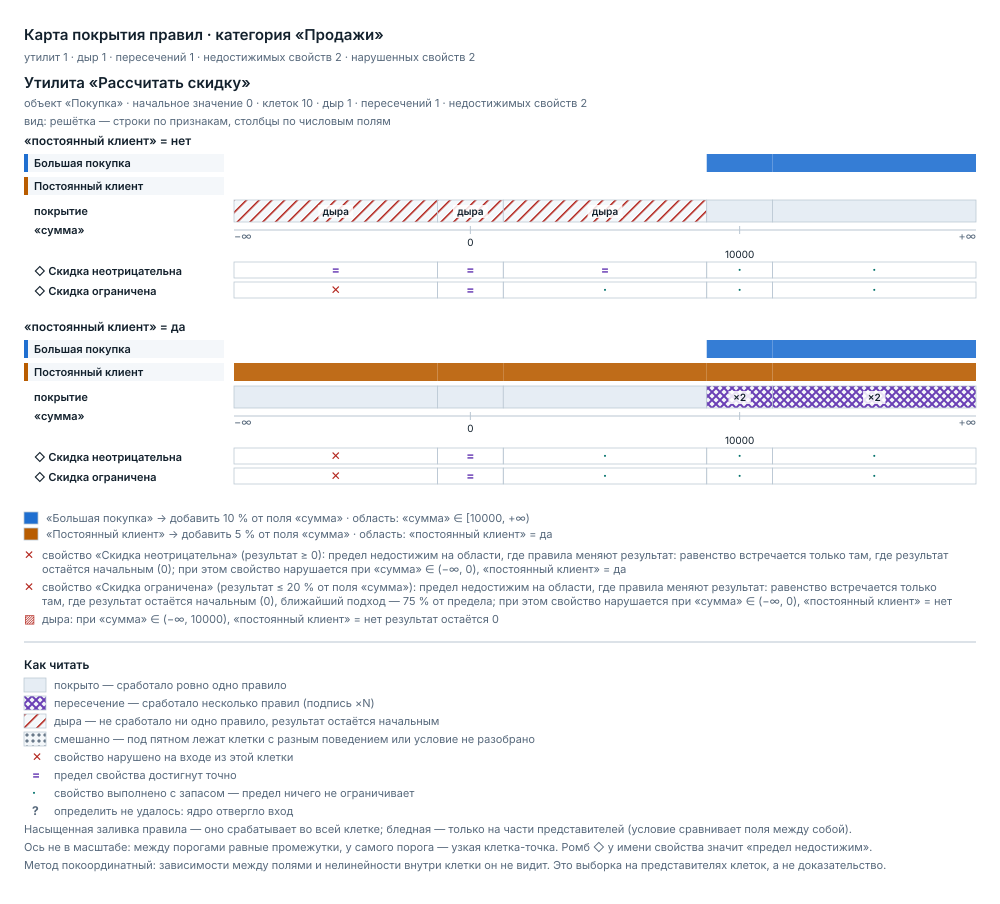

# ftsmap — карта покрытия правил

Все инструменты для правил идут **от правил**: покрыто ли правило примером,
не конфликтует ли оно с соседним. `ftsmap` идёт **от входов**: он раскрашивает
пространство входов утилиты по тому, какие правила там применимы, и показывает
то, чего в правилах нет вовсе.

```
модель .fts
      ↓
области правил · пересечения · ДЫРЫ · достижимость свойств
      ↓
SVG · JSON · текст
```

Собственного разбора `.fts` здесь нет: компиляция — ядро FTS
(`dist/src/index.js`, собирается `npm run build`), заголовок модуля снимает
`tools/ftsvm/src/load-fts.mjs`, интервальный анализ условий — готовый
`tools/ftspec/src/intervals.mjs`. Зависимостей ноль, Node ≥ 20.

## Зачем: реальный случай

У `examples/utilities/discount.fts` есть свойство «Скидка ограничена» —
результат не больше 20 % от суммы. Правила дают максимум 15 % (10 % за большую
покупку плюс 5 % постоянному клиенту). Значит:

```
сумма 10000,  постоянный клиент да → 1500 = 15,0 %
сумма 999999, постоянный клиент да → 149999.85 = 15,0 %
сумма −100                          → ОТКАЗ: нарушено свойство «Скидка ограничена»
```

На всех положительных суммах предел **недостижим**: свойство ничего не
проверяет, его можно ужесточить вдвое — и ни один пример не изменится. Зато на
отрицательной сумме процент меняет знак, правила молчат, и то же свойство
ломается. Ни примеры, ни проверка конфликтов, ни генератор кода этого не
показывают. Карта показывает одной картинкой:



Файл: [`examples/discount.map.svg`](examples/discount.map.svg) — он получен
командой ниже и лежит в репозитории как есть.

## Запуск

```sh
node tools/ftsmap/bin/ftsmap.mjs examples/utilities/discount.fts \
  --utility «Рассчитать скидку» --out map.svg

node tools/ftsmap/bin/ftsmap.mjs examples/utilities/discount.fts --json
node tools/ftsmap/bin/ftsmap.mjs examples/utilities/discount.fts --text
```

| ключ | что делает |
| --- | --- |
| `--utility «имя»` | разобрать одну утилиту (по умолчанию — все) |
| `--out <файл>` | записать SVG; `-` — вывести SVG в stdout |
| `--json` | машинный отчёт в stdout (поведение по умолчанию) |
| `--text` | текстовый отчёт для терминала и CI |
| `--width <px>` | ширина диаграммы, по умолчанию 1000 |

Контракт вывода тот же, что у ядра, `ftsc` и `ftspec`: результат — в stdout,
диагностики — в stderr, код возврата `0` без ошибок, `1` при диагностике уровня
`error` (нарушенное свойство, правило без единого истинного входа), `2` при
неверном вызове. Поэтому `ftsmap --json | jq` и `ftsmap --text` в шаге CI
работают без обвязки.

## Что находит

| код | уровень | смысл |
| --- | --- | --- |
| `FTSMAP_HOLE` | warning | область входов, где не срабатывает ни одно правило: результат остаётся начальным |
| `FTSMAP_OVERLAP` | info | два правила применимы одновременно, но их действия складываются |
| `FTSMAP_OVERLAP_ORDER` | warning | то же, но итог зависит от порядка объявления правил |
| `FTSMAP_DEAD_RULE` | error | условие правила не выполнимо ни на каком входе |
| `FTSMAP_PROPERTY_VIOLATED` | error | найден вход, на котором свойство нарушено (ядро на нём откажет) |
| `FTSMAP_PROPERTY_UNATTAINABLE` | warning | предел свойства не берётся нигде, где правила меняют результат |
| `FTSMAP_UNANALYZED` | warning | условие сравнивает поля между собой — область получена исполнением, не доказана |
| `FTSMAP_TRUNCATED` | warning | разбиение усечено по бюджету клеток |
| `FTSMAP_NO_UTILITIES` | warning | в модели нет утилит |

## Как это устроено

### Разбиение на клетки

Условие правила в ядре — конъюнкция сравнений поля с операндом. Когда операнд
константа, истинность каждого сравнения `поле op константа` меняется только в
самой константе. Собрав по каждому числовому полю все константы его условий,
получаем разбиение оси на чередующиеся куски:

```
(−∞, t₁)   [t₁]   (t₁, t₂)   [t₂]   …   [tₖ]   (tₖ, +∞)
```

Внутри клетки произведения таких кусков поведение любого анализируемого условия
постоянно. Клеток конечное число — на них считается всё сразу: области правил,
пересечения, дыры, достижимость свойств.

**Ноль всегда добавляется в пороги.** Операнд «процент от поля» меняет знак
вместе с полем, поэтому граница `поле < 0 / поле > 0` отделяет качественно
разные режимы, даже если в условиях нуля нет. Без этого порога дыра на
отрицательных суммах слилась бы с обычной областью — ровно тот случай, ради
которого карта и делается.

### Что считается анализом, а что исполнением

Область правила берётся из `tools/ftspec/src/intervals.mjs` — это единственный
источник истины о том, разрешимо ли условие вообще, пуста ли область и какой у
неё свидетель. Второго интервального анализа здесь нет.

Срабатывание в клетке и значение результата берутся **исполнением** через ядро
(`evaluateUtility`), потому что только так корректно учитываются условия, до
которых интервальный метод не дотягивается: операнд-поле, процент, накопленный
результат. Если правило внутри одной клетки ведёт себя по-разному на разных
представителях, клетка помечается «смешанной» — карта не выдаёт её за
проверенную.

### Достижимость свойств

Вопрос ставится не «выполняется ли свойство» (оно почти всегда выполняется,
иначе модель не работала бы), а «бывает ли вход, на котором свойство хоть
что-то ограничивает». Для каждой точки выборки:

* результат — `evaluateUtility` без свойств;
* предел — та же утилита плюс правило без условий, кладущее операнд свойства
  (ядро само разрешает «процент от поля» и «результат», второй реализации нет);
* выполняется ли свойство — по отказу ядра: оно бросает ровно тогда, когда
  свойство нарушено.

Свойство помечается **недостижимым**, если равенство результата пределу не
встретилось нигде, кроме вырожденных точек, где результат остался начальным.
Для «Скидки ограниченной» это даёт `maxRatio = 0.75`: правила дотягивают ровно
до трёх четвертей предела и ни разу дальше.

## Три вида диаграмм

Вид выбирается по составу полей входа.

### 1. Ось — одно числовое поле

```
Средний вес   ▁▁▁▁▁▁▁▁▁████████▁▁▁▁▁▁▁▁
Большой вес   ▁▁▁▁▁▁▁▁▁▁▁▁▁▁▁▁████████▁
покрытие      ░дыра░░░░ покрыто  ░дыра░
«вес»         −∞    0    10   50   100  +∞
```

* **дорожки** сверху — по одной на правило, залиты в цвет правила там, где оно
  срабатывает;
* **полоса покрытия** под ними — сколько правил сработало: пусто, одно,
  несколько;
* **ось** с делениями ровно в порогах условий, подписанными числами;
* **полосы свойств** внизу — по одной на свойство, знак на клетку.

Читать сверху вниз: «какие правила работают → сколько их → на каком интервале →
что при этом со свойствами».

### 2. Плоскость — два числовых поля

Сетка прямоугольников из того же разбиения: строки — клетки одного поля,
столбцы — другого. Область правила видна как связный блок его цвета, наложение
— крестовой штриховкой с подписью `×N`, дыра — косой штриховкой с подписью
«дыра». Знак свойства (`✕` нарушено, `=` предел достигнут) ставится прямо в
клетке, потому что отдельной полосы под осью не хватило бы: по вертикали тоже
есть измерение.

### 3. Решётка — больше двух полей или признаки в наборе

По строкам — сочетания значений признаков и строковых полей, по столбцам — пары
числовых полей (при единственном числовом поле столбец один, и в нём рисуется
ось). Рисовать N измерений одной картинкой честно нельзя: любая проекция
что-то склеивает. Поэтому склейка объявлена явно — если под одним пятном
диаграммы лежат клетки с разным поведением, оно помечается «смешанно», а не
усредняется в один цвет.

### Оформление

* **Тема.** Цвета заданы дважды: базовые и внутри
  `@media (prefers-color-scheme: dark)`. Тёмная палитра — фирменные тона
  (`#00e5e5`, `#ff8a2a`, `#b65cff`, `#3ca9ff`, `#ffc247`), светлая — их
  затемнённые аналоги. Пользовательские свойства CSS (`var(--x)`) не
  используются: их не понимает librsvg, и файл превращается в чёрный
  прямоугольник.
* **Дальтонизм.** Красно-зелёной оппозиции в палитре нет вовсе, а каждый статус
  кодируется дважды — цветом и рисунком: дыра — косая штриховка плюс слово
  «дыра», наложение — крестовая штриховка плюс `×N`, «смешанно» — точки.
* **Читаемость без интерактива.** Имена правил, значения порогов, свидетели и
  легенда напечатаны в самом SVG; наведение мышью ничего не добавляет.
* **Детерминированность.** Ни дат, ни случайных идентификаторов, ни хешей: один
  и тот же вход даёт байт-в-байт один и тот же файл, и диаграмму можно держать
  в репозитории под контролем версий.

## Фактический пример

```sh
node tools/ftsmap/bin/ftsmap.mjs examples/utilities/discount.fts --text
```

```
Карта покрытия правил · категория «Продажи»
утилит 1, дыр 1, пересечений 1, недостижимых свойств 2, нарушенных свойств 2

── Утилита «Рассчитать скидку» ──
объект «Покупка», начальное значение 0, клеток разбиения 10 (покрыто 7, дыр 3, с пересечением 2)

Поля входа
  • «сумма» (Деньги, число) — пороги: 0, 10000
  • «постоянный клиент» (Признак, признак) — порогов нет

Области правил
  • «Большая покупка» → добавить 10 % от поля «сумма»
      область: «сумма» ∈ [10000, +∞)
      не ограничивает: «постоянный клиент»
  • «Постоянный клиент» → добавить 5 % от поля «сумма»
      область: «постоянный клиент» = да
      не ограничивает: «сумма»

Пересечения
  • «Большая покупка» + «Постоянный клиент» при «сумма» ∈ [10000, +∞), «постоянный клиент» = да
      действия: добавить 10 % от поля «сумма» / добавить 5 % от поля «сумма» — оба добавляют — вклады складываются, порядок не важен
      свидетель: «сумма» = 10000, «постоянный клиент» = да

Дыры (не срабатывает ни одно правило)
  • «сумма» ∈ (−∞, 10000), «постоянный клиент» = нет → результат остаётся 0
      свидетель: «сумма» = -1000000, «постоянный клиент» = нет

Достижимость свойств
  • «Скидка неотрицательна» (результат ≥ 0) — НАРУШЕНО
      предел недостижим на области, где правила меняют результат: равенство встречается только там, где результат остаётся начальным (0); при этом свойство нарушается при «сумма» ∈ (−∞, 0), «постоянный клиент» = да
      свидетель нарушения: «сумма» = -1000000, «постоянный клиент» = да → результат -50000, предел 0
      с запасом (предел ничего не ограничивает): «сумма» ∈ (0, +∞), «постоянный клиент» = да; «сумма» ∈ [10000, +∞), «постоянный клиент» = нет
  • «Скидка ограничена» (результат ≤ 20 % от поля «сумма») — НАРУШЕНО
      предел недостижим на области, где правила меняют результат: равенство встречается только там, где результат остаётся начальным (0), ближайший подход — 75 % от предела; при этом свойство нарушается при «сумма» ∈ (−∞, 0), «постоянный клиент» = нет
      свидетель нарушения: «сумма» = -1000000, «постоянный клиент» = нет → результат 0, предел -200000
      с запасом (предел ничего не ограничивает): «сумма» ∈ (0, +∞)

Диагностики
  • [warning] FTSMAP_HOLE: при «сумма» ∈ (−∞, 10000), «постоянный клиент» = нет не срабатывает ни одно правило — результат остаётся начальным (0)
  • [info] FTSMAP_OVERLAP: правила «Большая покупка» и «Постоянный клиент» применимы одновременно при «сумма» ∈ [10000, +∞), «постоянный клиент» = да: оба добавляют — вклады складываются, порядок не важен
  • [error] FTSMAP_PROPERTY_VIOLATED: свойство «Скидка неотрицательна» нарушается при «сумма» ∈ (−∞, 0), «постоянный клиент» = да: результат -50000 против предела 0
  • [warning] FTSMAP_PROPERTY_UNATTAINABLE: свойство «Скидка неотрицательна» недостижимо: …
  • [error] FTSMAP_PROPERTY_VIOLATED: свойство «Скидка ограничена» нарушается при «сумма» ∈ (−∞, 0), «постоянный клиент» = нет: результат 0 против предела -200000
  • [warning] FTSMAP_PROPERTY_UNATTAINABLE: свойство «Скидка ограничена» недостижимо: …
```

Три вывода за один запуск:

1. **Дыра.** На суммах меньше 10000 без постоянного клиента не срабатывает
   ничего. Так и задумано — но теперь это видно, а не подразумевается.
2. **Недостижимое свойство.** «Скидка ограничена» нигде не берёт свой предел:
   ближайший подход — 75 %. Свойство есть, а проверять ему нечего.
3. **Нарушение на отрицательной сумме.** Оба свойства ломаются при `сумма < 0`,
   причём «Скидка неотрицательна» — прямо в правиле «Постоянный клиент»,
   которое на отрицательной сумме добавляет отрицательные 5 %.

## Чего анализ не видит

Границы наследуются от интервального метода и от того, что клетка проверяется
выборкой представителей, а не целиком.

* **Зависимости между полями.** Условие `платёж больше поле доход` связывает
  два поля, и разбиение по каждому полю отдельно перестаёт быть точным.
  Такие правила помечаются `FTSMAP_UNANALYZED`, а клетки, где правило ведёт
  себя по-разному, — «смешанно». Область такого правила показана, но не
  доказана.
* **Нелинейности внутри клетки.** Внутри клетки берутся до трёх представителей
  на числовую ось (четверти интервала, а у полубесконечных — точки с растущим
  удалением). Свойство, которое ломается только в узком окне между
  представителями, будет пропущено.
* **Составные объекты.** Разбор идёт по плоским полям входной структуры;
  вложенные объекты и коллекции карта не раскрывает.
* **Свойства с внешним контекстом.** Предел вычисляется тем же входом, что и
  результат; ничего, кроме полей входа и накопленного результата, в него не
  попадает.
* **Порядок как проектное решение.** Пересечение с зависимостью от порядка
  помечается, но карта не берётся судить, правильный порядок или нет: внутри
  одной утилиты он определён объявлением сверху вниз.

Короче: **карта — это выборка, а не доказательство.** Дыра, которую она нашла,
— настоящая (у неё есть свидетель, и его можно скормить ядру). Отсутствие дыр в
отчёте не означает, что их нет.

## Бюджеты

| предел | значение | что делает при превышении |
| --- | --- | --- |
| клеток разбиения | 4096 | детерминированно отрезает хвосты самых широких осей, пишет `FTSMAP_TRUNCATED` |
| представителей на клетку | 27 | так же режет по осям |
| значений на ось | 12 | лишние пороги в разбиение не попадают |
| склеиваемых клеток | 256 | выше порога области печатаются по одной, без склейки |
| строк решётки | 8 | остальные не рисуются, число показано под диаграммой |

## Устройство каталога

```
tools/ftsmap/
  bin/ftsmap.mjs        CLI
  src/load.mjs          загрузка .fts (обёртка над ядром и ftsvm)
  src/coverage.mjs      разбиение на клетки, области, дыры, достижимость свойств
  src/svg.mjs           три вида диаграмм, темы, штриховки
  src/text.mjs          текстовый отчёт
  examples/             модели для тестов и готовая карта discount.map.svg
  test/                 node:test
```

Тесты: `node --test tools/ftsmap/test/*.test.mjs` (нужен собранный `dist/`:
`npm ci && npm run build`).
